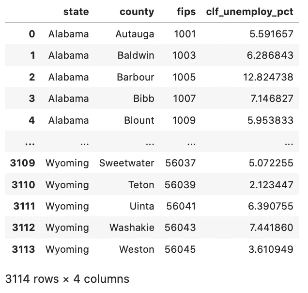
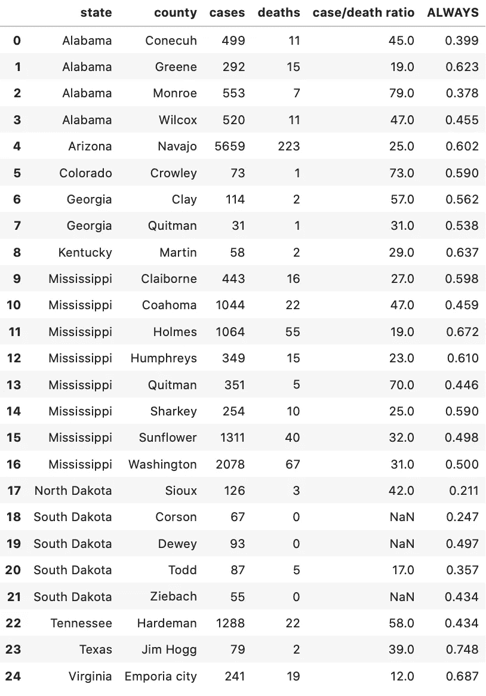
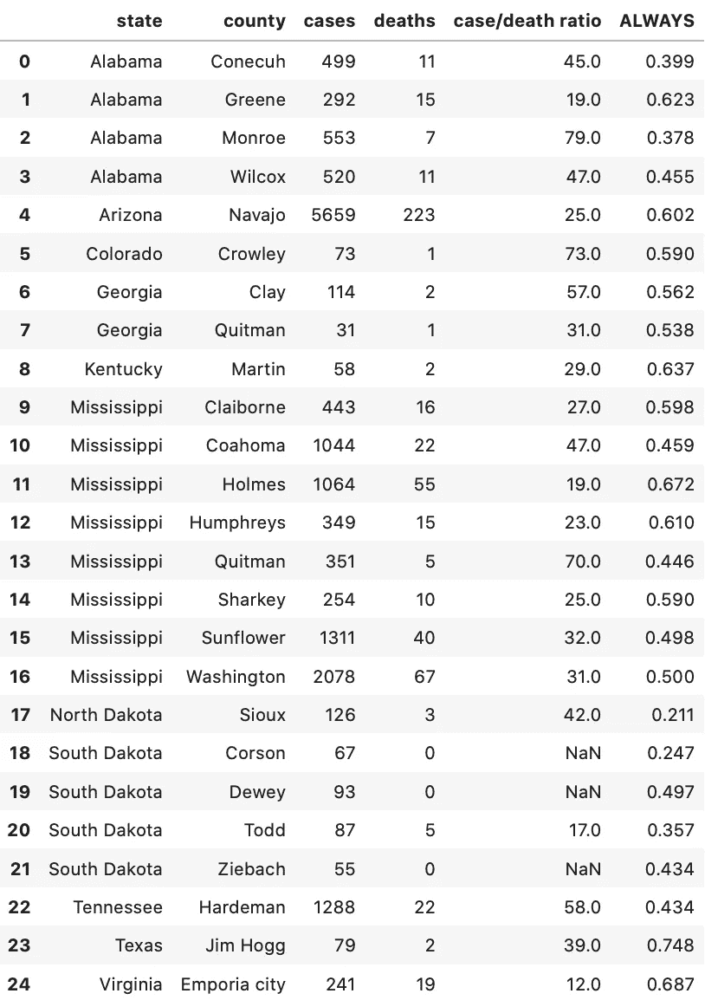
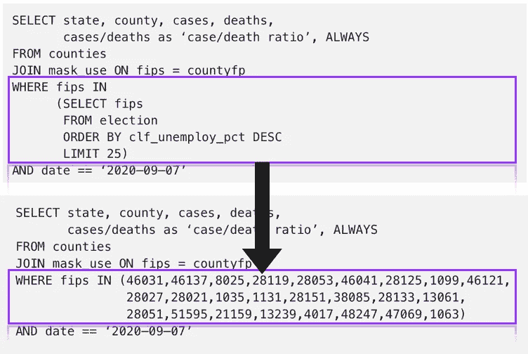
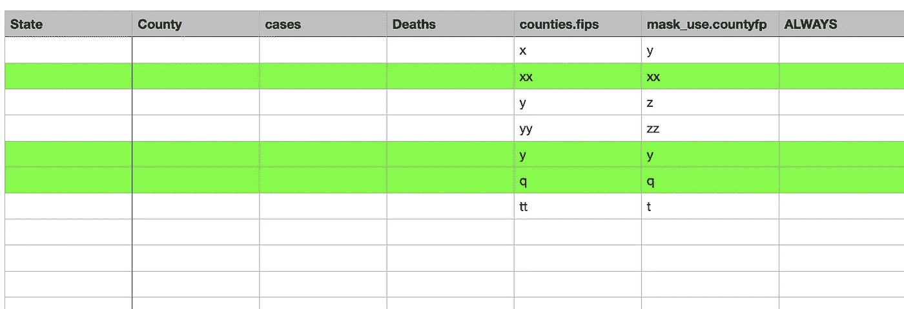

# 让我们来谈谈 SQL —第 4 部分

> 原文：<https://medium.com/analytics-vidhya/lets-talk-about-sql-part-4-3a5215de90c4?source=collection_archive---------9----------------------->

基本子查询和操作顺序


这是 SQL 系列文章的第四篇。

我关于 SQL 的第三篇文章是对基本聚合函数的概述。你可以在这里阅读。

概括地说，在上一篇文章中，我带您构建了一个简单的查询，该查询聚合了两个表中选定列的数据，并根据条件进行了筛选。

用 SQL 编写:

```
SELECT state, COUNT (county), MIN (deaths), MAX (deaths), 
       AVG (deaths),SUM (cases)/SUM (deaths) as ‘case/death ratio’,
       AVG (ALWAYS)
FROM counties
JOIN mask_use ON fips = countyfp
WHERE deaths <= ‘500’
AND date = ‘2020–09–07’
GROUP BY state
HAVING COUNT (county) >= 5
```

上面的查询有一个使用 fips 代码匹配的连接条件，只返回我们感兴趣的县。这也可以重写为子查询。许多人发现子查询更容易阅读，但是子查询执行起来通常较慢。我们今天要走的这个例子非常简单，您不太可能注意到任何性能差异。

请注意，您可能还会看到一个称为嵌套查询的子查询，这是因为在最基本的级别上，子查询只是查询中的一个查询。别担心，我们会把它分解成一些非常简单、容易理解的部分。

在本文中，我们将再次使用从《纽约时报》获得的数据来探索子查询。此外，我们将添加一个来自麻省理工学院选举数据和科学实验室的新表格，原始代码可以在这里查看[。](https://github.com/aspotter99/SQL_talk)那么，我们开始吧！

首先，让我们快速查看一下添加到数据库中的新表——选举表。请记住，在我们的第一课中，我们可以使用星号(*)返回所有字段。

```
SELECT *
FROM election
```


选举表—大量新数据可供使用

这里有几项需要注意——我们有一个 fips 代码，就像我们的 counties 表一样。这些数据看起来是原始的投票总数，我们有一些数据是人口的百分比——基本的选民人口统计数据。我们只关心其中的几列:州、县、fips 和 clf_unemploy_pct。

```
SELECT state, county, fips, elf_unemploy_pct
FROM election
```

返回



现在，让我们看看失业率最高的县。为此，我们可以按降序返回数据，并使用 ORDER BY 和 LIMIT 关键字限制返回的行数。

**ORDER BY—**ORDER BY 关键字通过指明要排序的列来定义所选行的返回顺序。默认情况下，除非指定了 DESC，否则 ORDER BY 将返回升序。

**LIMIT—**LIMIT 关键字表示要返回的最大行数。

组合 ORDER BY 和 LIMIT 只是返回有序列表的一种方式，比如前 10 名或后 10 名列表。出于我们的目的，我们对失业率最高的 25 个县感兴趣。

我们的查询被写成:

```
SELECT state, county, fips, elf_unemploy_pct
FROM election
ORDER BY elf_unemploy_pct DESC
LIMIT 25
```

注意，ORDER BY 关键字表示 DESC —我们希望我们的数据以降序(从最高到最低)返回。因为我们想要前 25 名，所以我们也使用了 LIMIT 关键字。

我们的查询返回:


行是零索引的，所以前 25 行是第 0-24 行

酷，但是我说过我们要讨论子查询。我想使用上述查询来确定上述县的新冠肺炎病例和死亡人数。我可以运行上面的查询，然后使用 WHERE 子句中返回的 fips 代码。以前，我们使用 WHERE 对一列中的单个值进行过滤，但是我希望一列中有多个值——有没有办法做到这一点？是啊！SQL 在中有一个可以在 WHERE 子句中使用的运算符。

**IN—**IN 运算符允许您在同一列中使用多个值，以使用 WHERE 子句进行筛选。

因此，让我们看看，如果我们只是将感兴趣的 fips 代码添加到 WHERE 子句中，我们的查询会是什么样子:

```
SELECT state, county, cases, deaths, 
       cases/deaths as ‘case/death ratio’, ALWAYS
FROM counties
JOIN mask_use ON fips = countyfp
WHERE fips IN (46031,46137,8025,28119,28053,46041,28125,1099,46121,
               28027,28021,1035,1131,28151,38085,28133,13061,
               28051,51595,21159,13239,4017,48247,47069,1063)
AND date == ‘2020–09–07’
```

退货:



该查询使用从选举表中获得的 fips 代码作为过滤条件。

这是获取我们感兴趣的数据的一种非常复杂的方式。在一个表上运行一个查询，然后将我们想要的代码转移到一个 WHERE 子句中，以过滤我们的最终查询。这是一个非常简单的查询，当然，你可以这样做，但是有很多原因让你不想这样做——有一个更好的方法。如果我可以让 SQL 运行我的第一个查询，并在 WHERE 中使用结果，会怎么样？**那是一个子查询！**

我们怎么写这个？嗯，我们已经有了(某种程度上)——我们有了所有的部分。我将简单地用选举表的查询替换 WHERE 子句中的 fips 代码！

```
SELECT state, county, cases, deaths, 
       cases/deaths as ‘case/death ratio’, ALWAYS
FROM counties
JOIN mask_use ON fips = countyfp
WHERE fips IN 
      (SELECT fips
       FROM election
       ORDER BY clf_unemploy_pct DESC
       LIMIT 25)
AND date == ‘2020–09–07’
```

退货:



同样的数据，少打字！胜利

相当甜蜜(至少在我看来)。但是，这里究竟发生了什么？我认为对 SQL 操作顺序的简要概述将有助于我们理解。

值得注意的是，SQL 本质上是声明性的。一个查询指出了我们想要检索的信息，但是没有告诉*SQL 应该如何检索它。SQL 将*优化*查询，以确定执行命令的最有效方式。*

一般来说，SQL 执行的第一件事是子查询—因此我们在 WHERE 子句中的查询将首先执行。请记住，我们的子查询指示 SQL 返回失业率最高的 25 个县的 fips 代码。一旦执行完毕，我们的 WHERE 子句现在就是 fips 代码列表。



我们的子查询一旦执行，就成为我们要过滤的代码列表

接下来，将执行 FROM 和 JOIN，然后是 WHERE，最后是 SELECT。因为你先写最后一部分，所以这并不那么直观。让我们像处理上面的子查询一样直观地描绘一下。

一旦执行了子查询，SQL 将执行 FROM 子句。记住 FROM 标识我们要从中检索数据的表。在示例查询中，我们从 counties 表中检索数据。因此，SQL 将在数据库中定位该表。我认为最简单的可视化方法是作为一个 Excel 工作簿——整个数据库就是工作簿，表格就是一个个的工作表。


您可以将数据库想象成一个 excel 工作簿，每个选项卡代表一个表

JOIN 实际上只是一个 FROM 子句的扩展，它告诉 SQL 我们将使用多个表。在我们的示例中，我们通过匹配共享 fips 代码的行来连接 mask_use 表。SQL 现在拥有了 counties 和 mask_use 表中的所有列，但是只进一步评估 fips 代码匹配的行。



表被合并，但是只有匹配的行被进一步评估

下一步是评估 WHERE 子句。请记住，我们的 WHERE 子句包含一个子查询，它首先被执行以充当过滤器。SQL 现在将评估所有的行，只有那些在 WHERE 语句中带有 fips 代码的行将被进一步评估。

最后，SQL 将执行 SELECT 子句，结果中将只返回指定的列。

本系列的下一篇文章将采用相同的查询，我将带您了解如何使用连接来代替子查询。