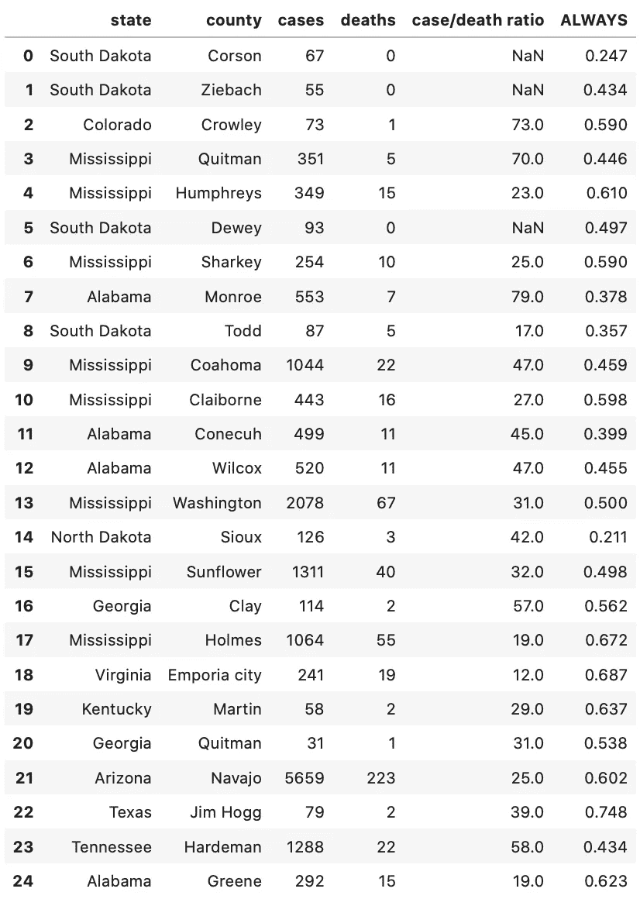

# 让我们谈谈 SQL——第 5 部分

> 原文：<https://medium.com/analytics-vidhya/lets-talk-about-sql-part-5-afd04a49adbf?source=collection_archive---------16----------------------->

连接并构建查询。


我关于 SQL 的第四篇文章是关于子查询的介绍。您可以在这里看到[。](/analytics-vidhya/lets-talk-about-sql-part-4-3a5215de90c4)

概括地说，在上一篇文章中，我引导您构建了一个简单的子查询，作为我们数据的过滤器。

用 SQL 编写:

```
SELECT state, county, cases, deaths, 
       cases/deaths as ‘case/death ratio’, ALWAYS
FROM counties
JOIN mask_use ON fips = countyfp
WHERE fips IN
      (SELECT fips
       FROM election
       ORDER BY clf_unemploy_pct DESC
       LIMIT 25)
AND date = ‘2020–09–07’
```

如果您还记得，在最后一篇文章中，运行了对就业表的查询，然后我们获取了该查询的结果，并在 WHERE 子句中使用它们作为过滤器。这样我们就可以看到子查询是如何工作的。


SQL 将首先运行子查询，这些结果将成为您的 WHERE 子句

我们还讨论了 SQL 中的操作顺序，注意子查询将首先运行，然后是 FROM 和 JOIN 子句。理解这一点很重要，它为您创建更复杂的查询提供了蓝图。那么，我们如何构建一个产生与上面相同结果但不使用子查询的查询呢？

让我们把它分解一下——当我开始写任何查询时，这些都是相同的基本步骤。

**1 .定义问题**，你被要求做什么？

很少有人会告诉您，他们需要 3 个表中的 4 个特定列，如果您能通过组合这 2 个字段来创建一个额外的列。因为，说实话，如果他们知道那么多，他们可以自己编写查询。您更可能遇到以下情况:

“嘿，我们有没有任何数据可以告诉我，在高失业率的县中，新冠肺炎的死亡率是多少？”

你对此想了一会儿，然后回答说，“我想是的，但是当你说‘高失业率’时，你是在寻找一个特定的阈值(例如，高于 15%)还是在寻找失业率最高的 X 个县？”再思考一会儿，您就会意识到，您还需要定义死亡率的含义——有很多种方法可以测量死亡率(病例/死亡、死亡/总人口等)。).一旦这些问题得到澄清，您就可以开始构建您的查询了。

**2 .** **确定表格需要**来查找信息。

这个真的很直截了当。在问了几个澄清性问题后，我们知道我们被要求找到该县的名称、新冠肺炎病例数、新冠肺炎死亡数、病例/死亡比率，以及在失业率最高的 25 个县中回答说一直戴着口罩的人的百分比。我们还将把这个时间限制在一个特定的日期，因为我们知道死亡和病例数是累积的，并且因为我们知道每个州的县名都是唯一的，所以我们也将把该州包括在内。

如果我们查看可用的表格，会发现郡县表包含日期、郡县、州、FIP、病例和死亡列。


我们的郡县表示例

接下来，我们看一下 mask_use 表，它包含 countyfp、never、less、times、frequently 和 always 列。


我们的 mask_use 表示例

最后，我们看一下我们的选举表，它有 state、county、fips、total_population 和 clf_unemploy_pct。


我们的选举表样本

太好了！现在我们知道了完成查询需要哪些表 counties、mask_use 和 election 表。请注意，这些表之间有一些重复的字段，并且有一些相同的数据元素，尽管列的标签不同。

我们要寻找的大部分数据将来自 counties 表——我们将从该表中提取州、县、病例和死亡。此外，我们需要 mask_use 表来查找报告说他们总是戴口罩的人的百分比。我们没有被要求报告失业人数，但我们将使用它来排序和限制我们的结果。

**3。确定表之间的关系。**

有时候这真的很容易。您可能实际上有一个图表，显示哪些列应该用于连接表—但是，我们这里没有。那么，我如何知道如何连接这些表呢？这就是你需要理解你的数据，或者查阅数据字典的地方。

当我们查看表时，似乎没有一个列是三者共享的。counties 和 election 表都有 state、county 和 fips 列，但是 mask_use 表没有这些列。是吗？有一个标记为“countyfp”的列，当查阅数据字典时，我们看到在所有三个表中都有一个带有唯一标识一个县的代码的列，它只是在 mask_use 表中标记为 countyfp。这看起来像是连接桌子的最直接的方式。

恭喜你！您已经准备好编写 FROM 和 JOIN 子句(它们将在我们的查询中首先运行)！我喜欢先写数据最多的表，但是任何顺序都可以，因为我们使用的是内部连接。对于其他类型的连接，表的顺序很重要，我们将在后面讨论。

**内部连接** —这是一个连接，其中两个表在给定字段中必须具有相同的值，以便进一步评估。在大多数情况下，SQL 默认使用内部连接。

```
**FROM counties as c
JOIN mask_use as m on c.fips = m.countyfp
JOIN election as e on c.fips = e.fips**
```

这一部分首先由 SQL 执行—我们现在将拥有所有三个表中的所有列，这些列在所有三个表中的 fips 代码上都有匹配项。


要进一步评估的行的样本

此时，SQL 已经拉入了 496，085 行和 17 列。这表示三个表中具有相同 fips 代码的所有行。

**4。过滤器。**

SQL 的下一步是评估 WHERE 子句所需的过滤器。在上周的例子中，我们使用子查询和日期来过滤结果。因为我们使用一个连接重写了那个查询，所以我们只需要添加日期。

```
FROM counties as c
JOIN mask_use as m on c.fips = m.countyfp
JOIN election as e on c.fips = e.fips
**WHERE c.date == ‘2020–09–07’**
```

日期只显示在 counties 表中。然而，为了保持一致，我将使用表别名。此时，SQL 将进行过滤以找到我们感兴趣的日期，并且只有满足该条件的行将被进一步评估。


要进一步评估的已筛选行的示例

按日期筛选后，SQL 有 3，093 行和 17 列与所有三个表中的 fips 列匹配，但现在我们只筛选了 counties 表中日期为 2020 年 9 月 7 日的那些行。

**5。排序和限制您的结果**

现在，我们开始取得一些进展，并大大减少了我们的行，但请记住，我们正在寻找失业率最高的县，我们只想要前 25 名。请注意，我们没有被要求返回实际失业率，我们只是使用它来排序我们的结果。我们使用 ORDER BY 子句来做到这一点，我们可以按三个表中的任何列进行排序——它不一定是我们在结果中返回的列。

因此，排序将是我们的失业率从高到低。

```
FROM counties as c
JOIN mask_use as m on c.fips = m.countyfp
JOIN election as e on c.fips = e.fips
WHERE date == ‘2020–09–07’
**ORDER BY e.clf_unemploy_pct DESC**
```


同样的数据，只是按失业率排序

我们仍然有 3，093 行和 17 列，但顺序现在不同了，失业率最高的在顶部(科尔森县，SD 为 29.93%)

因为我们只想要前 25 名，所以我们将添加一个限制条款。

```
FROM counties as c
JOIN mask_use as m on c.fips = m.countyfp
JOIN election as e on c.fips = e.fips
WHERE date == ‘2020–09–07’
ORDER BY e.clf_unemploy_pct DESC
**LIMIT 25**
```

退货:


要进一步评估的最终行集

现在，我们的成绩只有前 25！

**6。选择要返回的列。**

最后，我们准备编写 SELECT 子句。我们已经知道，我们需要州、县、病例、死亡，一个新的列向我们显示每个死亡病例的数量，以及报告他们总是戴口罩的人的百分比。所以，这很简单。从 counties 表中，我们需要州、县、病例和死亡。我们在 from 和 join 子句中使用了表别名“c ”,所以我们在这里也将使用它。请记住，别名是表名的简写，可以节省您的输入时间。这给了我们 c .州，c .县，c .病例，c .死亡，到目前为止。让我们把它们放进我们的精选里。

```
**SELECT c.state, c.county, c.cases, c.deaths** FROM counties as c
JOIN mask_use as m on c.fips = m.countyfp
JOIN election as e on c.fips = e.fips
ORDER BY e.clf_unemploy_pct DESC
LIMIT 25
```

接下来，我们有一个计算字段，将病例数除以死亡数。SQL 使用普通的数学运算符，所以这个新列可以写成 c.cases/c.deaths 的‘病例/死亡比率’——我们在结果中使用‘as’给这个列命名。所以，我们现在有:

```
SELECT c.state, c.county, c.cases, c.deaths, 
       **c.cases/c.deaths as ‘case/death ratio’** FROM counties as c
JOIN mask_use as m on c.fips = m.countyfp
JOIN election as e on c.fips = e.fips
ORDER BY e.clf_unemploy_pct DESC
LIMIT 25
```

最后，我们将添加来自 mask_use 表的 ALWAYS 列，从而得到一个最终完成的查询:

```
SELECT c.state, c.county, c.cases, c.deaths, 
       c.cases/c.deaths as ‘case/death ratio’, 
       **m.ALWAYS** FROM counties as c
JOIN mask_use as m on c.fips = m.countyfp
JOIN election as e on c.fips = e.fips
ORDER BY e.clf_unemploy_pct DESC
LIMIT 25
```



最终查询结果

我们在第 4 部分的查询将给出相同的结果，但是它们不会按失业率排序。这是因为我们在子查询中使用了 ORDER BY 和 LIMIT。此外，因为失业率在子查询中，而不是在连接表中，所以我们不能使用该列对结果进行排序。如果将 ORDER BY 语句添加到查询中，将会得到一个错误消息，指出不存在这样的列。


第 4 部分的结果—相同的数据，不同的顺序。

我承诺了更多关于连接的内容，所以让我们继续当前的例子。我们假设选举表没有 fips 代码列。有没有一种方法可以将它加入到 counties 表中以获得我们想要的结果？

首先，我们需要知道 fips 代码代表什么。它似乎是每个县的唯一标识符。

> **联邦信息处理标准出版物 6–4(FIPS 6–4)是一个五位数的** [**联邦信息处理标准**](https://en.wikipedia.org/wiki/Federal_Information_Processing_Standards) **代码，它唯一地标识了** [**县**](https://en.wikipedia.org/wiki/County_(United_States)) **和美国**[](https://en.wikipedia.org/wiki/United_States)****中的县对等物、某些美国属地和某些自由联合州****

**如果我们的表没有 fips 代码，这对我们有什么帮助呢？两个表都有州和县。我们可以使用这些信息来连接这些表。实际上，我们通过识别两个必须匹配的列来为我们的表创建一个复合键。让我们试一试。**

```
SELECT c.state, c.county, c.fips, e.state, 
       e.county,e.total_polulation, e.clf_unemploy_pct
FROM counties as c
**JOIN election as e ON c.state = e.state AND c.county = e.county** WHERE date == ‘2020–09–07’
ORDER BY clf_unemploy_pct DESC
LIMIT 25
```

**请注意，该连接现在有一个 AND 关键字。这就是我们如何创建一个复合键，我们指示 SQL 只返回两个表中州和县的组合匹配的行。**

****

**使用州/县作为连接条件的结果**

**因此，这看起来几乎是一样的，但你会注意到，弗吉尼亚州的恩波里亚市县从我们的结果中消失了，我们现在有了伊利诺伊州的哈丁县。发生了什么事？让我们分别看看这些表，看看是怎么回事。**

```
SELECT state, county, fips
FROM counties
WHERE state = ‘Virginia’ and county = ‘Emporia city’
AND date = ‘2020–09–07’
```

****

**在 counties 表中，我们使用 Emporia city 作为县名**

```
SELECT state, county, fips
FROM election
WHERE fips = ‘51595.0’
```

****

**选举表中的县名是 Emporia**

**现在这就说得通了——我们的表来自不同的来源，counties 表来自 NYT covid 数据，而 election 表来自麻省理工学院选举数据，看起来这两个表中输入的 county 名称不同。如果这是一个真实的场景，我们实际上没有 fips 代码，我们不会知道数据是不同的。**

**我想这是提及主键和外键的最佳时机。**

****主键** —表中记录的唯一标识符。一个表只有一个主键，并且不能重复。你可以把你的社会安全号码或驾照号码想象成主键——它们识别你，而且只能识别你。**

****外键** —引用另一个表中主键的列。**

**在我们用作示例的表中，mask_use 和 election 表使用 fips 代码作为主键，counties 表在 countyfp 列中引用该代码，在 county FP 列中它是外键。**

**这里需要注意的重要一点是，SQL 可以连接任何列上的表，您不必使用主键/外键关系。**

**现在，如果我想获取 counties 表中所有的州县组合，并查看 elections 表中的匹配项，会怎么样呢？这是我们使用左连接的地方。**

****左连接** —左连接将获取左表中的每一行，并包括右表中的匹配记录，同时将不匹配的单元格留空。**

**这里需要注意的一点是，左连接要求表以正确的顺序书写。必须首先写入您想要从中获取所有记录的表。在 SQL 的某些实例中也有右连接，但实际上您只需要左连接，因为您只需颠倒表的顺序就可以得到右连接。写出来不是很直观，所以这里有一个有趣的图表。**

****

**左连接-包括表 A 中的所有行**

**是时候看看左派的行动了！我们将再次使用州/县组合作为我们的连接条件。**

```
SELECT c.state as ‘c.state’, c.county as ‘c.county’, 
       e.state as ‘e.state’, e.county as ‘e.county’
FROM counties as c
**LEFT JOIN election as e on c.state = e.state AND c.county = e.county** WHERE c.state = ‘Virginia’
AND date = ‘2020–09–07’
```

**我将我们的查询限制在弗吉尼亚州，这样我们就可以看到发生了什么。**

****

**“县”表中的县名与“选举”表中的有点不同**

**由此可见，弗吉尼亚州有以 X 市命名的县。请注意,“None”出现在选举表的条目中，这是因为在我们的选举表中没有匹配的州/县组合。您在这里看到的结果呈现在一个 Jupyter 笔记本中，在 SQL server 中，它们会显示为 NULL。**

**通常，如果您看到一个表中有许多空结果，这很好地表明查询使用了左连接或右连接。如果结果看起来具有来自错误表的 NULL，则可能是您以错误的顺序编写了与表的连接。**

**我希望这让您对连接以及如何编写基本查询有了更好的理解。下一篇文章将深入窗口函数，我们将做一些跨日期的计算，以获得滚动平均值和其他有趣的东西。**