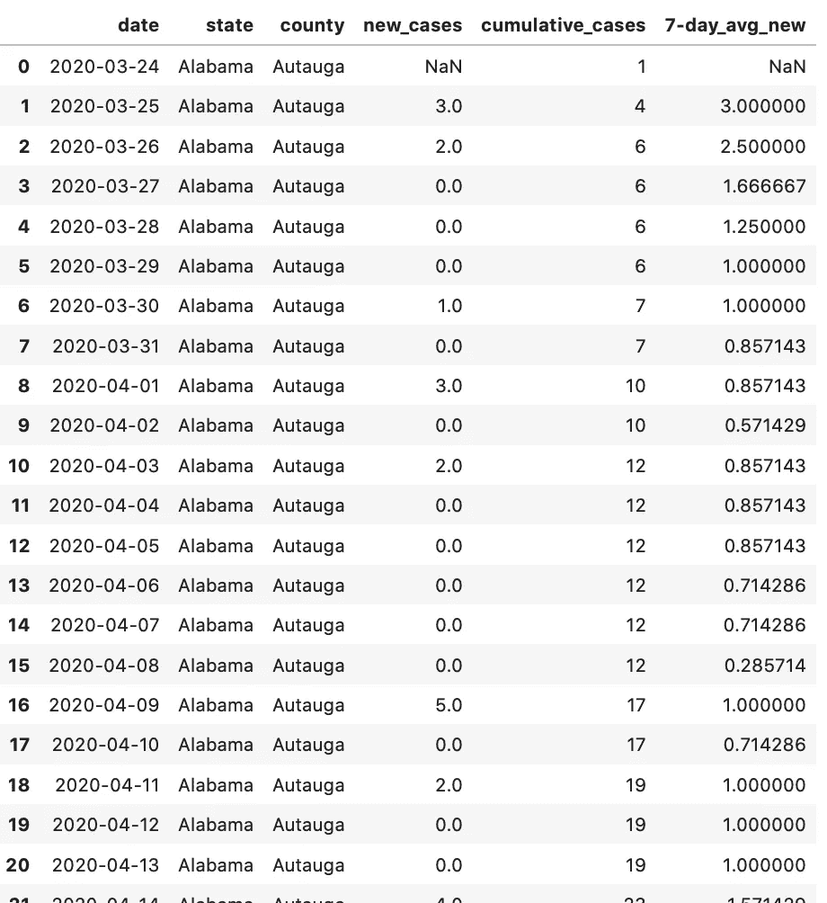

# 让我们来谈谈 SQL —第 6 部分

> 原文：<https://medium.com/analytics-vidhya/lets-talk-about-sql-part-6-12228b1d2ca0?source=collection_archive---------9----------------------->

窗口功能好玩！


这是 SQL 系列文章的第六篇。

我关于 SQL 的第五篇文章更多的是关于连接和查询结构。你可以在这里阅读。

概括地说，在上一篇文章中，我们讨论了内连接和左连接以及如何构建查询。我们还使用连接代替子查询重写了第 4 部分中的查询。

用 SQL 编写:

```
SELECT c.state, c.county, c.cases, c.deaths, 
       c.cases/c.deaths as ‘case/death ratio’, m.ALWAYS
FROM counties as c
JOIN mask_use as m on c.fips = m.countyfp
JOIN election as e on c.fips = e.fips
ORDER BY e.clf_unemploy_pct DESC
LIMIT 25
```

在这篇文章中，我们将讨论窗口函数，并使用它们来计算跨行而不是列的值。听起来很有趣，对吧？

我们将使用来自纽约时报和麻省理工学院的相同数据，我们已经在整个系列中使用。

那么，到底什么是窗口函数呢？基本上，窗口函数允许您跨行而不是列执行计算。

**窗口函数—****函数，对一组行进行操作，返回该行的单个值。*窗口*指的是函数将要操作的一组行。**

**因此，给定我们的 counties 表，我们希望看到每个县每天的新病例数。让我们快速看一下我们的表，看看我们有什么。**

```
SELECT *
FROM counties
WHERE date = ‘2020–09–07’
```

****

**我们的县表示例**

**乍一看，似乎我们已经在表中有了这些信息，但是当我们查阅数据字典时，我们发现每天报告的病例和死亡是累积的。为了找到每日新增病例和死亡人数，我们需要做一些数学计算。为了便于说明，我们只看一个县——伊利诺伊州库克县。**

****

**伊利诺伊州库克县的部分县表数据**

**为了得到 9 月 10 日的新病例数，我们需要从 9 月 10 日的总数(132，966)中减去 9 月 9 日的总数(132，401)。9 月 10 日，伊利诺伊州库克县新增病例 565 例。因此，我们的窗口函数需要告诉 SQL 创建一个新列(我们称之为“new_cases”)，从当天的总数中减去前一天的总数。换句话说，从当前行中减去上一行。我们该怎么写？**

**我们用滞后！**

****LAG —** LAG 是一个窗口函数，它提供与当前行有指定偏移量的行。**

**这听起来比实际情况复杂得多，所以让我们把它写出来。**

```
SELECT date, state, county, cases,
       cases - LAG (cases,1) OVER (ORDER BY date) as ‘new_cases'
FROM counties
WHERE state = ‘Illinois’ 
      AND county = ‘Cook’ 
      AND date >= ‘2020-09-01’
ORDER BY date
```

****

**使用 LAG 创建的新列“new_cases”**

**让我们使用上面突出显示的单元格来分解我的窗口函数。
案例-滞后(案例，1)超过(按日期排序)**

**这里的第一件事是告诉 SQL 从哪个字段开始。在本例中，SQL 将使用当前行的“cases”列(在我们突出显示的示例中，这是 9/10)。**

**下一部分设置窗口— **LAG (cases，1)** ，告诉 SQL 我想使用上一行中的 cases 列(偏移量为 1)并将其从当前行中减去。**

**然后，我们告诉 SQL 在进行计算时我们希望行如何排序。在本例中，我们按照日期从**到(ORDER BY date ASC)** 的升序排序。我们希望将计算结果放在一个新列中，我们称之为“new_cases”。**

**如果我想知道过去 7 天的新病例总数，该怎么办？我们会改变偏移量！让我们试一试。**

```
SELECT date, state, county, cases,
       cases - LAG (cases,1) OVER (ORDER BY date) as ‘new_cases’,
       cases - LAG(cases,7) OVER (ORDER BY date) 
               as ‘7-day_new_cases’
FROM counties
WHERE state = ‘Illinois’ 
      AND county = ‘Cook’ 
      AND date >= ‘2020-09-01’
ORDER BY date
```

****

**我们更改了偏移量来计算 7 天的新病例总数**

**还有一个 LEAD 函数，它的工作方式类似于 LAG，但它是当前行之后的行，而不是当前行之后的行。您可以像编写 LAG 函数一样编写它，使用当前行的字段、LEAD 关键字、列和偏移量，后跟您想要的行顺序。让我们试一试。**

```
SELECT date, state, county, cases,
       cases - LEAD (cases,1) OVER (ORDER BY date DESC) 
               as ‘new_cases’,
       cases - LEAD (cases,7) OVER (ORDER BY date DESC) 
               as ‘7-day_new_cases’
FROM counties
WHERE state = ‘Illinois’ 
      AND county = ‘Cook’ 
      AND date >= ‘2020-09-01’
ORDER BY date
```

****

**我们用超前代替滞后，通过将日期改为 DESC 顺序，我们得到相同的结果**

**结果是相同的，但是顺序不同，这是因为我指出我希望行按日期降序排列，这使得计算与 LAG 函数相同。整洁！**

**现在，如果我想查看伊利诺伊州的所有县，但仍然希望每天都有新病例，该怎么办？我们可以将我们的县分组，然后应用窗口函数！为此，我们使用关键字 PARTITION BY。**

```
SELECT date, state, county, cases,
       cases - LAG (cases,1) OVER (PARTITION BY county 
                                   ORDER BY date) as ‘new_cases’,
       cases - LAG (cases,7) OVER (PARTITION BY county 
                                   ORDER BY date)  
               as ‘7-day_new_cases’
FROM counties
WHERE state = ‘Illinois’ 
      AND date >= ‘2020-10-15’
ORDER BY date
```

****

**PARTITION BY 允许我们按县分组，然后计算案例**

**现在，伊利诺伊州每个县每天都有新病例。您还可以在 PARTITION BY 子句中使用多列，例如，PARTITION BY state，county 将对州进行分组，然后对县进行分组，这样您就可以得到所有的州和县。**

**现在，如果我想查找连续 7 天的平均新病例，该怎么办呢？我们不能用使用窗口函数的窗口函数创建列。所以我们需要创建一个 cte。什么是 cte？很高兴你问了！**

****CTE —** 常见的餐桌表情。cte 是一个临时结果集，与临时表不同，它只在查询范围内可用，而临时表可以在 SQL 会话期间使用。使用 WITH 语句定义 cte。**

**酷，酷。那里有很多不是很有用的行话。让我们看看它的运行情况。我将查找 7 天滚动平均新案例。**

```
WITH cte as (SELECT date, state, county,
                    cases - LAG (cases,1) OVER 
                    (PARTITION BY fips ORDER BY date) 
                    as  ‘new_cases’,
                    cases as ‘cumulative_cases’
             FROM counties)SELECT date, state, county, new_cases, cumulative)_cases,
       AVG(new_cases) OVER (PARTITION BY state, 
                            county ORDER BY date ASC 
                            rows 6 PRECEDING) as ‘7_day_avg_new’
FROM cte
ORDER BY state, county, date
```

****

**通过查询 cte，我们可以在新的窗口函数中使用计算出的值！**

**因此，我们的 cte 只是创建一个非常临时的表的一种方法，我们可以在下一步中查询这个表。我们也可以使用临时表来实现这一点，但是因为我们只需要查询 cte 一次，所以这是一个更有效的选择。我们稍后将讨论临时表，但它们非常类似于 cte，只适用于整个 SQL 会话。**

**不错！但是，这是目前计算不到 7 天的新病例数据的平均值。如果我们看 3–25，我们显示 3 个新案例，总共 4 个案例，它显示我们在 7 天的滚动窗口内平均有 3 个新案例。我们需要更新这一点，以便平均显示，直到我们有 7 天的数据。我们将在下一篇文章中讨论这个问题。**