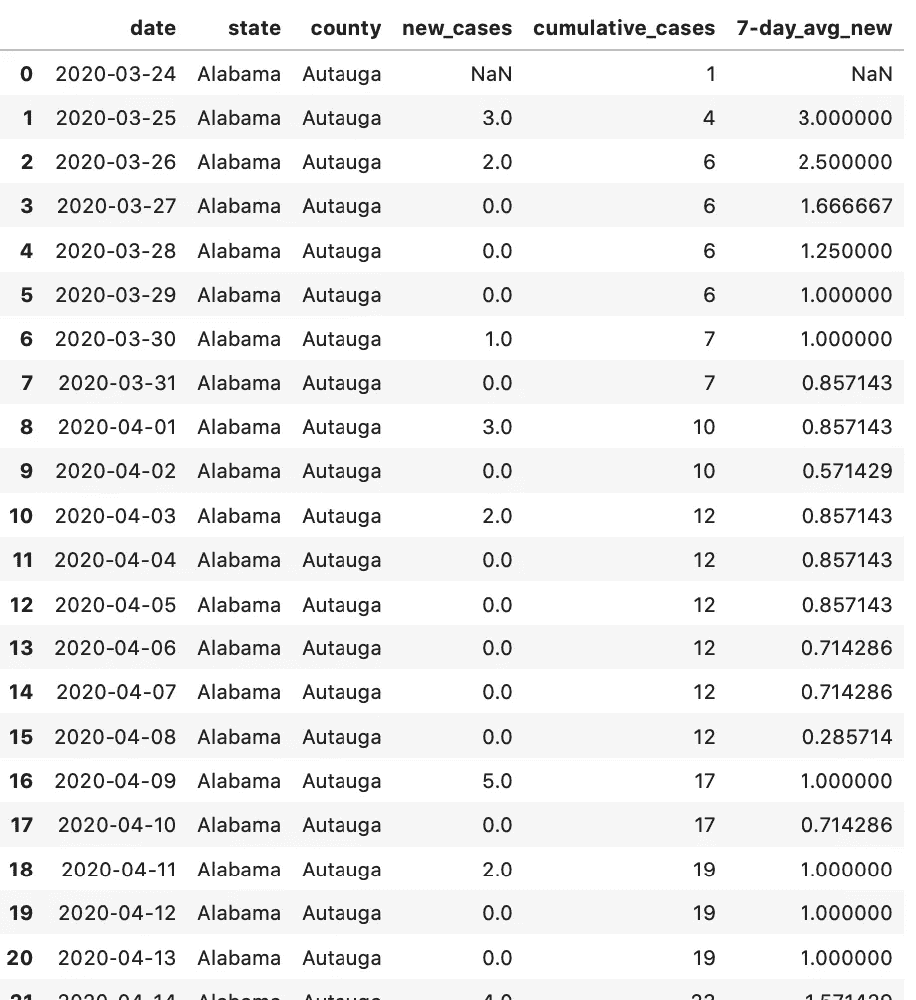
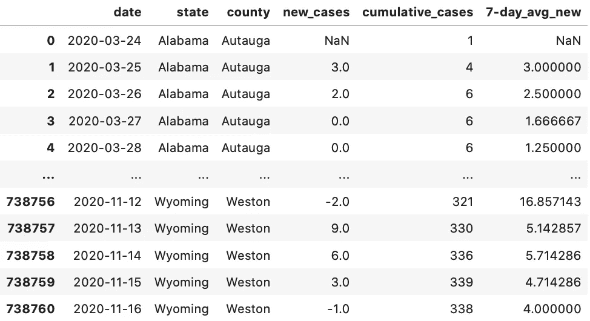
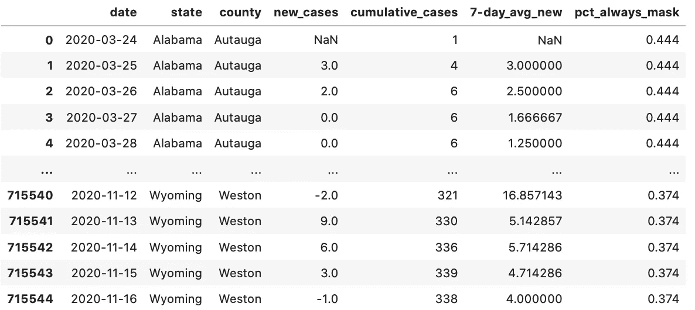
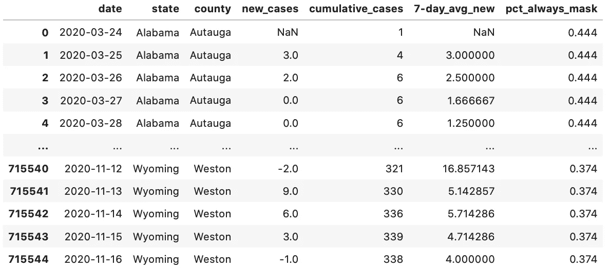

# 让我们来谈谈 SQL —第 7 部分

> 原文：<https://medium.com/analytics-vidhya/lets-talk-about-sql-part-7-242364486a0f?source=collection_archive---------6----------------------->

临时表、cte 和子查询


在我的上一篇文章中，我向你展示了一些简单的窗口函数。你可以在这里阅读。SQL 中的最后一个查询:

```
WITH CTE as (SELECT date, state, county,
             cases — LAG (cases,1) OVER(PARTITION BY 
             fips ORDER BY date)as ‘new_cases’,
             cases as ‘cumulative_cases’FROM counties)SELECT date, state, county, new_cases,cumulative_cases,
       AVG(new_cases) OVER (PARTITION BY state,county 
                            ORDER BY date ASC
                            rows 6 PRECEDING) as ‘7_day_avg_new’
FROM CTE
ORDER BY state, county, date
```

我们在这个查询中使用了 CTE，以便为我们提供一种临时查询表，因此这似乎是讨论 cte、临时表和子查询之间的区别的好时机。我们将使用同样的 NYT·科维德和麻省理工学院的选举数据，这些数据在过去的几篇文章中使用过。

首先，我们从一些定义开始。

**CTE 或公共表表达式—** 一种存放查询结果的临时数据源。cte 仅在查询期间存储。

**子查询—** 就像 cte 和临时表一样，子查询是一种生成临时结果集的方法，以便在主查询中使用。

**临时表—** 与 cte 一样，临时表是一种存储为表的临时数据集。临时表可用于整个 SQL 会话。

为了说明不同之处，我们将使用这些临时数据存储解决方案生成相同的结果集。如果这听起来不像是一个好时机，那么我不知道什么才是！开始了。

我们已经有了一组使用 CTE 的结果，这是我们在上一篇文章中使用的。



使用 CTE 的结果，前 20 行

我们可以使用 CTE 作为子查询来重写查询:

```
SELECT date, state, county, new_cases, cumulative_cases,
       AVG(new_cases) OVER (PARTITION BY state, county 
                            ORDER BY date ASC
                            rows 6 PRECEDING) as ‘7-day_avg_new’
FROM (SELECT date, state, county,
      cases — LAG (cases,1) OVER (PARTITION BY fips 
                                  ORDER BY date)as new_cases,
      cases as cumulative_cases
      FROM counties)
ORDER BY state, county, date;
```

这会给我们相同的结果:



使用子查询的结果(仅显示结果的头部/尾部)

我们有什么理由选择使用 CTE 而不是子查询呢？就性能而言，它们几乎是一样的。从我们关于 SQL 中的操作顺序的讨论中，请记住子查询将在主查询之前运行，CTE 也是如此，因此无论哪种情况，您基本上都是在查询一个查询。

如果两个选项的性能相同，为什么要选择 CTE 而不是子查询呢？对于像我的例子这样的简单查询，它可能会归结为个人偏好。然而，对于需要多个子查询的更复杂的查询，使用 cte 可以使您的查询更容易理解。当您编写需要多个用户使用或编辑的查询时，这一点尤其重要。使用子查询结构，并不总是容易看出作者的意图。

您可以创建多个 cte 在查询中使用，就像您可以创建多个子查询一样。您也可以随意命名您的 CTE(我之前使用 CTE 来说明哪个部分是 CTE，但是最好使用描述性的名称)，这也将更容易理解您的查询在做什么。这里有一个例子:

```
WITH mask AS (SELECT DISTINCT state, county, never, rarely,
                     sometimes, frequently, always
              FROM mask_use m
              JOIN counties c on c.fips = m.countyfp), new AS (SELECT date, state, county,
                    cases — LAG (cases,1) OVER
                    (PARTITION BY fips ORDER BY date) as new_cases,
                    cases as cumulative_cases
     FROM counties)SELECT date, n.state, n.county, new_cases, cumulative_cases,
       AVG(new_cases) OVER (PARTITION BY n.state, n.county 
                            ORDER BY date ASC rows 6 PRECEDING) 
                            as ‘7-day_avg_new’, 
       always as ‘pct_always_mask’
FROM new n
JOIN mask m on n.state = m.state AND n.county = m.county
ORDER BY n.state, n.county, date
```

我们也可以使用多个子查询来编写:

```
SELECT date, n.state, n.county, new_cases, cumulative_cases,
       AVG(new_cases) OVER (PARTITION BY n.state, n.county 
                            ORDER BY date ASC rows 6 PRECEDING) 
       as ‘7-day_avg_new’, 
       always as ‘pct_always_mask’
FROM (SELECT date, state, county,
             cases — LAG (cases,1) OVER
             (PARTITION BY fips ORDER BY date) as new_cases,
             cases as cumulative_cases
      FROM counties) n
JOIN (SELECT DISTINCT state, county, never, rarely, sometimes,  
             frequently, always
      FROM mask_use m
      JOIN counties c on c.fips = m.countyfp) m
ON n.state = m.state AND n.county = m.county
ORDER BY n.state, n.county, date
```

使用多个 cte 的查询更容易阅读，但是无论您以何种方式编写查询，都会得到相同的结果。



cte 和子查询将给出相同的结果集！

这里需要指出一点，当使用多个 CTE 时，你只需要使用一次 WITH 关键字，用逗号分隔各个 cte。

所以，所有这些都表明 CTE 和子查询将完成同样的事情。临时表呢？CTE/子查询表和临时表之间有一个主要区别。在同一个 SQL 会话中，多个查询可以访问临时表。CTE/子查询仅适用于单个查询。

那是什么意思？假设我有多个查询需要使用相同的“掩码”CTE，我可以将 CTE 放在每个查询的开头，但这将需要大量的额外输入(这在我的浪费时间的方法列表中并不多)，并且性能会下降—每个查询都将运行相同的临时结果集，这需要额外的时间。这就是我们临时桌子的原因。让我们来看看这是如何工作的。

```
CREATE TABLE temp.mask AS
       SELECT distinct state, county, never, rarely, sometimes,
              frequently, always
       FROM mask_use m
       JOIN counties c on c.fips = m.countyfp
```

一旦创建并填充了临时表(SELECT 子句正在填充该表)，就可以多次查询它，直到断开 SQL 会话。请注意，此语法适用于 SQLite，SQL Server 和其他 SQL 实例支持 SELECT INTO 语法。

```
SELECT distinct state, county, never, rarely, sometimes,
              frequently, always
INTO #mask
FROM mask_use m
JOIN counties c on c.fips = m.countyfp
```

因此，现在我们可以像平常一样使用 temp.mask 表进行查询。

```
WITH new AS (SELECT date, state, county,
                    cases — LAG (cases,1) OVER
                    (PARTITION BY fips ORDER BY date) as new_cases,
                    cases as cumulative_cases
             FROM counties)SELECT date, n.state, n.county, new_cases, cumulative_cases,
       AVG(new_cases) OVER (PARTITION BY n.state, n.county 
       ORDER BY date ASC rows 6 PRECEDING) as ‘7-day_avg_new’,
       always as ‘pct_always_mask’
FROM mask m
JOIN new n on m.state = n.state AND m.county = n.county
ORDER BY n.state, n.county, n.date
```



临时表的查询方式与任何其他表一样

请注意，我们仍然使用了 CTE，查询时，您的临时表就像任何其他表一样工作，您只需为任何会话运行它一次。有一些事情要记住，您的临时表将被存储，因为它不是为每个查询运行的(像 CTE/子查询)。如果您使用相同的临时数据运行多个查询，这可以显著提高性能。但是，因为如果您仅在单个查询中使用临时表，则会存储临时表，所以使用临时表时性能会更差。

总之，我们可以互换使用 CTE/子查询，但是 CTE 更容易阅读和看到正在发生的事情，所以当查询将被其他用户使用/编辑时最好使用它。这些的用例是单个查询—信息不需要在单个 SQL 会话中被多个查询访问。临时表也是一个临时数据源，但是在同一个 SQL 会话中，它可用于多个查询。