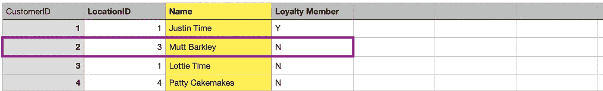

# 让我们来谈谈 SQL

> 原文：<https://medium.com/analytics-vidhya/lets-talk-sql-44e198d7acc3?source=collection_archive---------15----------------------->

**关系数据库简介**

**这是 SQL 系列文章的第一篇。**

根据 IADSS 的一篇文章，SQL 是数据科学招聘中第二常见的技能，仅次于 python。这使得 SQL 成为任何数据科学家、数据分析师或数据工程师的核心技能。那么 SQL 是什么，为什么它对数据科学家如此重要？这篇文章旨在对什么是 SQL 以及如果你想从事数据职业，为什么拥有这项技能很重要做一个非常基本的、高层次的概述。

我们在这个博客上的重点是数据科学，所以我们将专注于查询数据库——数据科学家的一项经常性任务是检索存储在关系数据库中的数据。

**什么是 SQL，什么是关系数据库？**

结构化查询语言，简称 SQL，是一种用于访问和操作关系数据库的编程语言。理解 SQL 的第一步是理解我们所说的关系数据库是什么意思。

关系数据库使用彼此相关的数据点来存储信息。这些数据点存储在表格中。

假设我们在一家在线目录公司工作。为了让我们的业务正常运行，至少我们需要知道销售的产品、销售给谁以及运往哪里。我们可以为每个订单、客户、产品和地址制作一个非常大的表。然而，这将导致大量的重复信息，我们最终将耗尽存储空间。

从上面的例子可以看出，我们的客户有多个订单，产品有多个订单，等等。因为每次下新订单时都要输入每个订单的所有信息，所以我们还会遇到许多数据输入错误。

关系数据库的结构是，通过使用不同的表，客户、产品和地址信息只需输入一次。这节省了存储空间并减少了数据输入错误。

客户表

产品表

位置表

现在，当下订单时，订单表只需要*将*引用到其他表。这是通过 ID 列完成的——我们将在以后的文章中详细讨论这一点，但是现在重要的是要理解每个客户、产品和地址在它们各自的表中都有一个惟一的标识符。

我们的 orders 表现在将引用这些 id 来获取每个订单的所有信息。

订单表

很好，现在您可能想知道如何将所有表中的数据放在一个地方，以便了解数据的情况。这就是 SQL 查询的由来。

**什么是查询？**

查询只是‘信息请求’的一种奇特说法——如果我查询一个数据库，我是在请求它检索特定的信息。在上面的订单示例中，我可能请求特定客户下的所有订单，或者在特定日期下的每个订单，或者具有特定产品的任何订单。

为了发出这些请求，我们使用 SQL。如果我想找到一个特定客户下的所有订单，我将需要请求数据库检索我正在寻找的客户的所有订单 id**引用**。下一篇文章将讨论具体的 SQL 查询结构，但是在这里我们将从更高的层面讨论如何构造请求。

第一步是决定您的请求需要哪些表。为了获取特定客户下的每个订单编号，我需要 customer 和 orders 表。

第二步是理解这些表之间的关系。orders 表中有一个 CustomerID 列，该列也在 customer 表中。因此，我想从两个表中共享一个 CustomerID 的数据库中获取信息。

接下来，我们决定要从每个表中检索哪些列。假设我们只对特定客户的订单号感兴趣。我们可能会问‘我可以要一份马特·巴克利的订单号清单吗？’

为了获得这些信息，我们将首先指示数据库在 Customer 表中查找“Mutt Barkley”并检索 CustomerID (2)。

客户表—“Mutt Barkley”具有唯一的 CustomerID

接下来，我们指示数据库在 orders 表中查找 CustomerID 也为 2 的任何行。

订单表—“Mutt Barkley”订单参考 CustomerID

因为我们只要求订单编号列表，所以我们只需要一列—订单 ID。该查询将返回“1”。

用最基本的术语来说，我们要求数据库在 customer 表中找到名称“Mutt Barkely ”,然后将该行中的 CustomerID 与 order 表中的 CustomerID 进行匹配(这称为联接，稍后将详细介绍),并返回任何匹配的 orderID。

用 SQL 编写:

选择订单 Id

来自订单

在客户上加入客户。CustomerID =订单。CustomerID

顾客们。马特·巴克利

这是最基本的解释——本系列的下一篇文章将分析 SELECT、FROM、JOIN 和 WHERE 语句的作用以及如何编写它们。

*[https://www . iadss . org/post/skill-set-analysis-on-LinkedIn-data-scientists-engineers-analysis-vs-job-posting](https://www.iadss.org/post/skill-set-analysis-on-linkedin-data-scientists-engineers-analysts-vs-job-postings)