# 来了解一下 ROC-AUC！

> 原文：<https://medium.com/analytics-vidhya/lets-understand-roc-auc-98fc00a5e1fb?source=collection_archive---------6----------------------->

马库斯·斯皮斯克在 [Unsplash](https://unsplash.com?utm_source=medium&utm_medium=referral) 上的照片

在这篇文章中，我将浏览 AUC 和 ROC(通常称为 AUROC)曲线，并解释它如何评估二元分类器模型的性能。

AUROC 是二元分类模型性能的最重要特征之一。

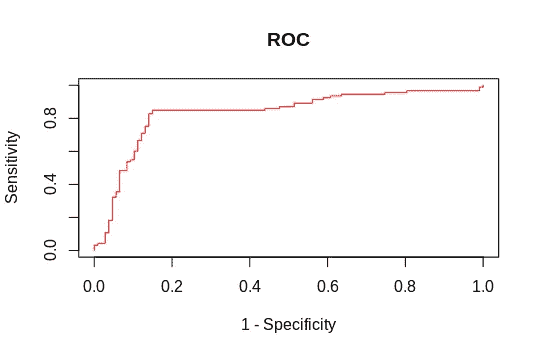

## 什么是 AU-ROC 曲线？

接收器工作特性曲线下的面积告诉我们，对于给定的阈值，您的模型可以很好地区分这两个类别。假设您构建了一个预测客户是否会购买汽车的模型。因此，一个更好的模型可以准确地区分这两者，而一个差的模型则不能。

AUC 值越高，模型越好。

*让我们看看模型的混淆矩阵。*

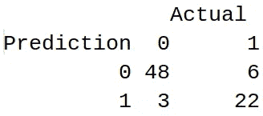

*注*:在这种情况下，会买车的客户用 1 表示(正类)，不会买车的用 0 表示(负类)。

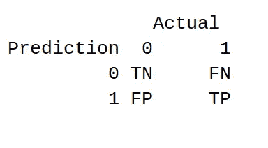

## 定义术语

1.  **True Positive (TP)** :我们的模型预测将购买汽车并且实际购买汽车的客户总数。
2.  **真阴性(TN)** :我们的模型预测不会买车且实际上没有买车的客户总数。
3.  **误报(FP)** :我们的模型预测会买车但实际上没有买车的客户总数。
4.  **假阴性(FN)** :您预测不会购买汽车但实际购买汽车的客户总数。
5.  **真阳性率(TPR) /灵敏度/召回率:**

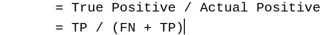

6.**真阴性率(TNR) /特异性:**

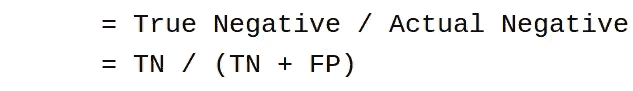

正如我们前面看到的，ROC 曲线是对敏感度和(1-特异性)的绘图，其中敏感度在 y 轴，而(1-特异性)在 x 轴，但什么是(1-特异性)？

**我们来推导一下(1-特异性)到底是什么？**

特异性= TN / (TN + FP)

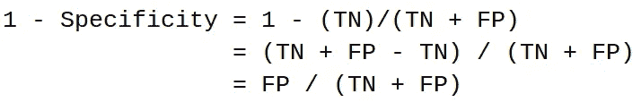

因此，1-特异性是假阳性率(FPR)

因此，ROC 曲线表明正类概率与负类概率的分离程度。

**如何评价模型的表现？**

AUC = 1 的模型是理想模型，这意味着它的准确度是 100%,并且它可以正确地预测所有的 0 为 0，所有的 1 为 1。AUC = 0 的模型是最差的模型，这意味着它的准确性是 0%,它的预测是错误的，它预测 0 是 1，1 是 0。

所以一个更好的模型是 AUC 接近 1。

解释上述陈述。

让我们画出概率分布图。

*注*:红色曲线为负类(不会买车的客户。)绿色曲线是针对积极阶层(会买车的客户。)

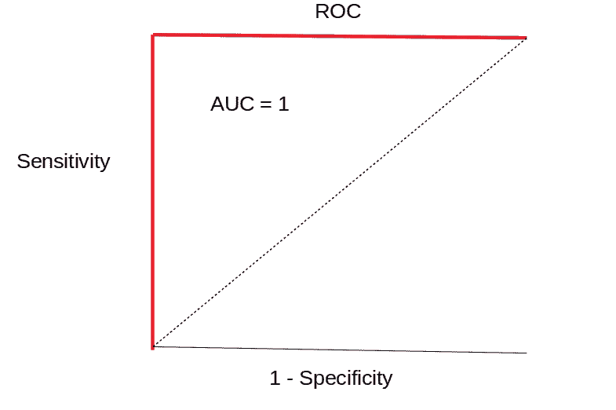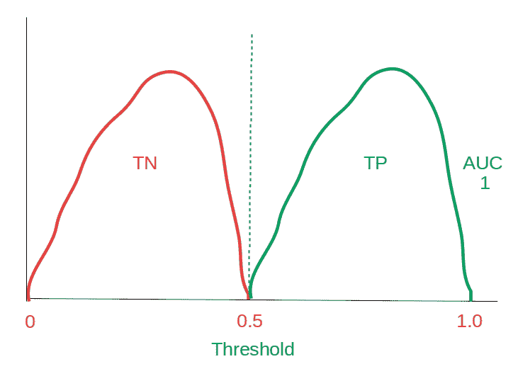

当两条曲线不重叠时，这是一个理想的条件，这意味着我们的模型可以很好地区分类别。其 AUC 为 1。

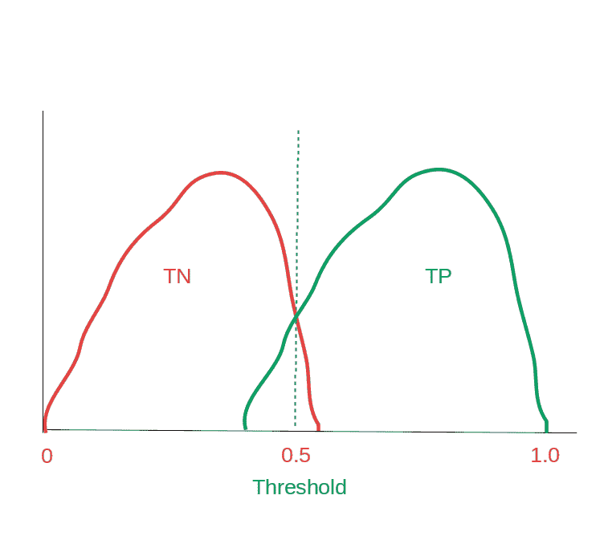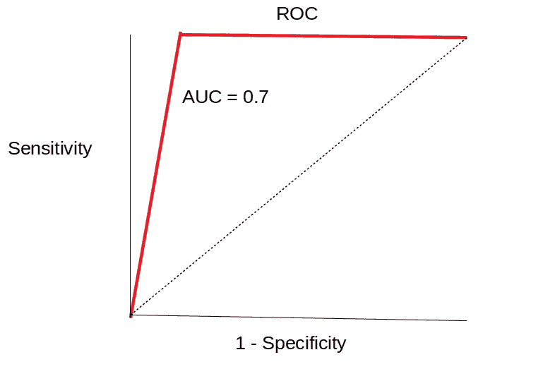

当两条曲线重叠时，这意味着引入了一些误差，我们的模型预测了一些错误的 1 和 0。但是假设我们有一些 AUC 大于 0.7 的其他模型，那么我们的第二个模型比第一个模型好。

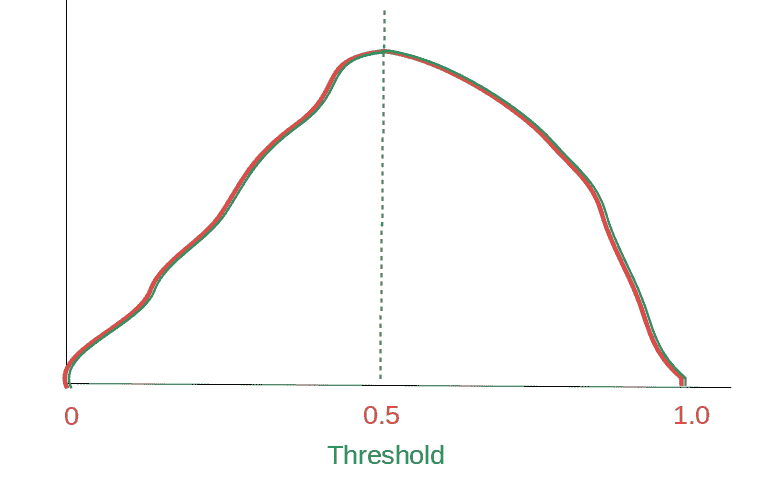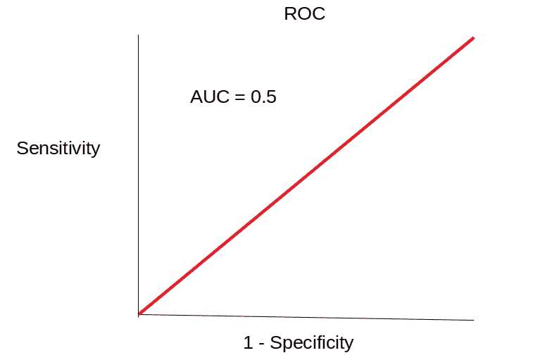

当两条曲线完全重叠时，这意味着我们的模型不能区分正类和负类。在这种情况下，AUC 几乎等于 0.5。

感谢阅读。

我希望我已经让你对什么是 AUC-ROC 曲线有了一些了解。我随时欢迎你的问题和建议。你可以在脸书、推特、Linkedin 上分享这些，这样有需要的人可能会看到这些。