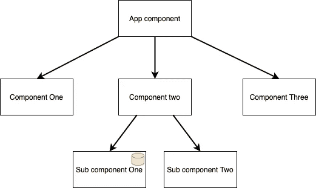
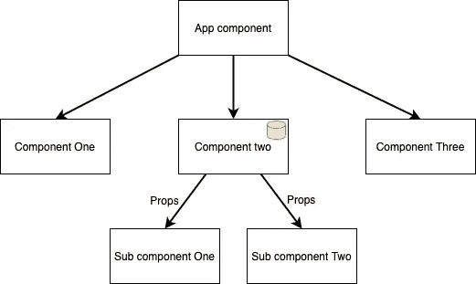
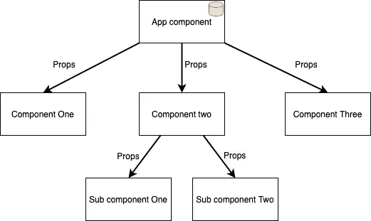
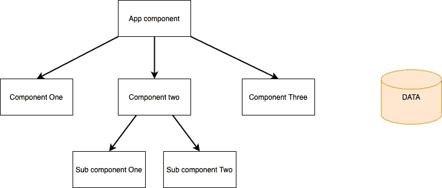
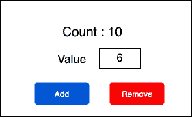
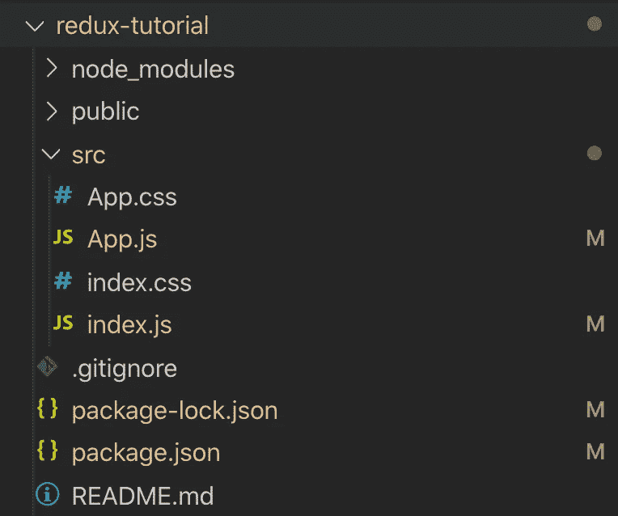
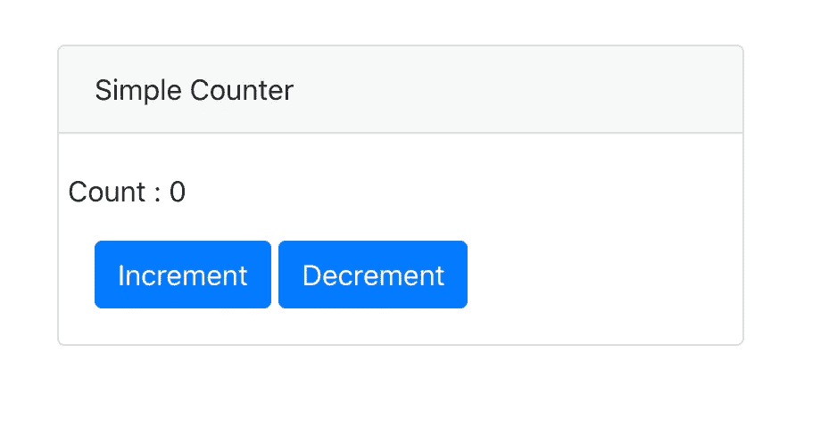
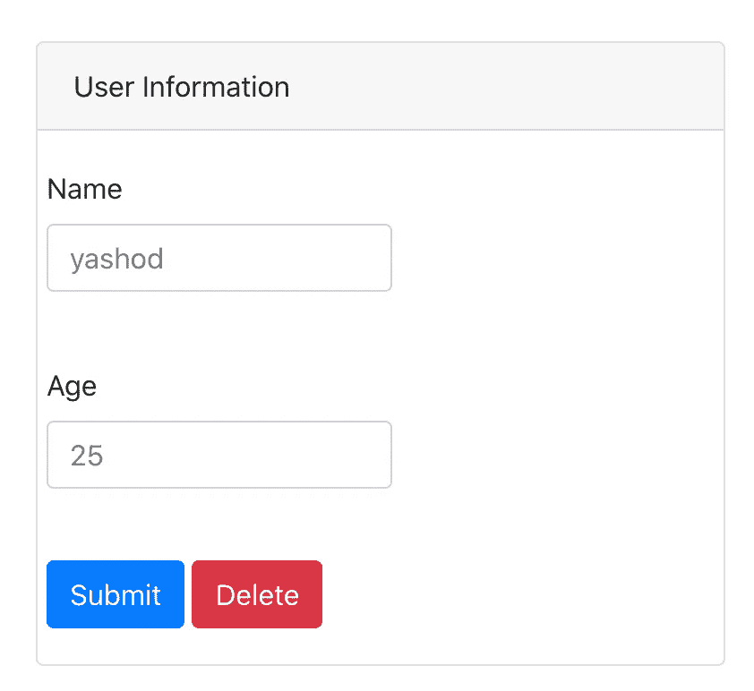
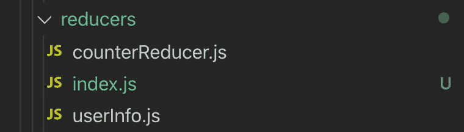

# 让我们在 react 中使用 redux

> 原文：<https://medium.com/analytics-vidhya/lets-use-redux-in-react-7d7cb066e7c5?source=collection_archive---------10----------------------->


由[凯利·西克玛](https://unsplash.com/@kellysikkema?utm_source=unsplash&utm_medium=referral&utm_content=creditCopyText)在 [Unsplash](https://unsplash.com/s/photos/values?utm_source=unsplash&utm_medium=referral&utm_content=creditCopyText) 上拍摄的照片

> Redux 使用起来超级简单。动作用于指示可以对状态做什么，缩减器用于指示状态的转换，分派用于执行动作，存储用于将所有这些结合在一起。听起来像希腊语吗？我来详细解释一下。

## **redux 是什么？**

Redux 是一个状态管理库，可以用在 React 中，也可以用在 Angular、Vue 甚至 vanilla JavaScript 中。除了上下文之外，API 可以作为 Redux 的替代。

> 为什么我们需要 redux？不能用状态和道具吗？这是额外的负担。



让我解释一下，如果子组件有它自己的状态，那么管理它们就不成问题。如果子组件 2 需要这些数据呢？然后，我们必须执行**状态提升**并将这些数据传递给父组件，如下所示，并将它们作为道具传递给子组件。那么还是可控的。



如果组件 1 和组件 2 也需要这些数据呢？然后我们不得不面对如下的**道具钻**的问题，因为我们不得不使用道具到处传递那些数据，这变成了负担。



然后 redux 通过将数据从组件中分离出来来解决这个问题，如下所示。



> 好，然后画面变得清晰。但是 redux 是怎么做到的呢？

## redux 如何管理状态？

让我们举一个例子，在常见的情况下，状态会因为我们采取的操作而改变，比如单击“添加”按钮，我们可以增加一个数字。在 redux 中也有 4 个独立的组件来管理状态。

*   存储—保留所有状态。
*   行动——能对国家做些什么。
*   还原器——动作如何改变状态。
*   分派—调用操作来更改状态。

> 啊啊！我没得到它。好的，这很好，因为这也是我的第一个表达。

让我们举一个例子，按给定的数增加或减少计数。



这些动作可以实现为增量和减量。那么当调用递增动作时，缩减器将指示状态将增加给定的数量，或者调用递减动作时，状态将递减给定的数量。除此之外，减速器将启动状态。然后在需要执行动作时调用 dispatch。

> 好的，那么商店的意义是什么？

商店将包装所有的减压器。这就是为什么我们称之为州保持所有的州。

> 我们可以在 React 中直接使用 redux 吗？

不，我们不能。我们必须使用`react-redux`库来连接 React 和 Redux。

## 让我们做三个例子来获得清晰的理解

1.  没有参数的简单递增和递减。
2.  带自变量的增量和减量。
3.  在 redux 中处理对象状态。

## 没有参数的简单递增和递减。

首先使用`npx create-react-app redux-tutorial`制作一个 react 应用，然后使用`npm install redux react-redux`安装 redux 和 react-redux 库

然后让我们清除如下的文件夹结构和`src/index.js`和`src/App.js`。



`src/index.js`

```
import React from 'react';
import ReactDOM from 'react-dom';
import './index.css';
import App from './App';ReactDOM.render(
    <React.StrictMode>
        <App />
    </React.StrictMode>,
    document.getElementById('root')
);
```

`src/App.js`

```
import React from "react";
import "./App.css";function App() {
    return (
        <div>
            <p>Hello</p>
        </div>
    );
}export default App;
```

然后先在`src/actions/counterActions.js`做动作。

```
// Increment action.
export const increment = () => {
    return {
        type: "INCREMENT"
    }
}// Decrement action.
export const decrement = () => {
    return {
        type: "DECREMENT"
    }
}
```

> 哦等等！为什么我们在动作中只表示常量，这真是个笑话？等等！一旦我们继续下一个例子，你就会明白这一点，因为这是最简单的一个例子，类型是我们在这里唯一可以添加的东西。

那我们就在`src/reducers/counterReducer.js`里做减速器吧。

```
const conterReducer = (state = 0, action) => {
    switch (action.type) {
        case "INCREMENT":
            return state + 1;
        case "DECREMENT":
            return state - 1;
        default:
            return state;
    }
};export default conterReducer;
```

正如我前面提到的，reducer 启动状态，它将指示一旦分派了动作，状态将会发生什么。正如您在切换案例中看到的，它将在类型位于动作对象中的`**action.type**` 之间切换。

然后我们必须将这些状态存储在**存储库**(在我们的例子中只有一个状态)中，并且我们必须将存储库注入到`src/index.js`中的组件树中。

```
import React from "react";
import ReactDOM from "react-dom";
import "./index.css";
import App from "./App";
import { createStore } from "redux";
import reducers from "./reducers/counterReducer.js";
import { Provider } from "react-redux";// Initiate the store.
const store = createStore(reducers);ReactDOM.render(
  <React.StrictMode>
  {/* Inject store to the component tree. */}
  <Provider store={store}>
      <App />
    </Provider>
  </React.StrictMode>,
  document.getElementById("root")
);
```

那么让我们做一个简单的 UI 来表示如下的变化。



然后我们可以修改`src/App.js`如下。

```
import React from "react";
import "./App.css";
**// Import useSelector to connect to the store.
// Import useDispatch to connect actions.**
import { useSelector, useDispatch } from "react-redux";
import Row from "react-bootstrap/Row";
import Button from "react-bootstrap/Button";
import Card from "react-bootstrap/Card";
**// Import actions.**
import { increment, decrement } from "./actions/counterActions";function App() {
  **// Assign the store to a value.**
  const counter = useSelector(state => state);
  **// Initiate the dispatch.**
  const dispatch = useDispatch();return (
    <div>
      <Card style={{ margin: 50, width: "30vw" }}>
        <Card.Header>Simple Counter</Card.Header>
        <Card.Body>
        <Row>
        **  {/* Show the count. */}**                    
          <p>Count : {counter} </p>
        </Row>
        **{/* Dispatched increment action. */}** <Button onClick={() => dispatch(increment())}>
           Increment
        </Button>{" "}
        **{/* Dispatched decrement action. */}**        
        <Button onClick={() => dispatch(decrement())}>
          Decrement
        </Button>
        </Card.Body>
      </Card>
    </div>
  );
}export default App;
```

然后应用程序将工作，你可以在这里找到代码。

## 带自变量的增量和减量。

让我们来看一个高级的例子，我们需要用一个数字来增加或减少计数。首先，我们必须改变动作以接受一个参数，如下图`src/actions/counterActions.js`所示。

```
export const increment = **num** => {
  return {
    type: "INCREMENT",
    **value: num**
  };
};export const decrement = **num** => {
  return {
    type: "DECREMENT",
    **value: num**
  };
};
```

然后上面的动作将接受一个参数并在对象中返回它。然后会根据`src/reducers/counterReducer.js`动作中给定的值改变减速器来改变状态。

```
const conterReducer = (state = 0, action) => {
  switch (action.type) {
    case "INCREMENT":
      return state + parseInt(**action.value**);
    case "DECREMENT":
      return state - **action.value**;
    default:
      return state;
  }
};export default conterReducer;
```

counterReducer 将根据动作对象的给定数值改变状态。之后我们可以更改`src/App.js`来制作一个简单的 UI 如下。


```
import React, { useState } from "react";
import "./App.css";
import { useSelector, useDispatch } from "react-redux";
import Row from "react-bootstrap/Row";
import Button from "react-bootstrap/Button";
import Card from "react-bootstrap/Card";
import Form from "react-bootstrap/Form";
import { increment, decrement } from "./actions/counterActions";function App() {
  const counter = useSelector(state => state);
  const dispatch = useDispatch();
  // To set the value in the field.
  const [value, setValue] = useState(0);

  return (
    <div>
    <Card style={{ margin: 50, width: "30vw" }}>
      <Card.Header>Simple Counter</Card.Header>
      <Card.Body>
        <Row>
          <p>Count : {counter} </p>
        </Row>
        <Form>
          <Form.Group controlId="formBasicValue">
            <Form.Label>Value</Form.Label>
            <Form.Control type="text"
               placeholder={value}
               onChange={event => setValue(event.target.value)}
            />
          </Form.Group>
        </Form>
        <Button onClick={() => dispatch(increment(value))}>
          Increment
        </Button>{" "}
        <Button onClick={() => dispatch(decrement(value))}>
          Decrement
        </Button>
     </Card.Body>
  </Card>
  </div>
  );
}export default App;
```

然后应用程序将工作，你可以在这里找到代码。

## **在 redux 中处理对象状态。**

让我们用 redux 处理一个有两个字段的对象。在这个例子中，让我们创建下面的表单来更改或删除这个人的姓名和年龄。



首先创建另一个动作文件`src/actions/userActions.js`，如下所示。

```
export const update = (name, age) => {
  return {
    type: "UPDATE",
    val: {
      name,
      age
    }
  };
};export const remove = () => {
  return {
    type: "DELETE"
  };
};
```

*   在更新函数中，它获取姓名和年龄作为参数，并将其作为类型的对象传递。
*   在删除操作中，它只传递类型。

然后我们可以在文件`src/reducers/counterReducer.js`中创建相应的 reducer，如下所示。

```
const userInfoReducer = 
  (state = { name: "yashod", age: 25 }, action) => {
    switch (action.type) {
      case "UPDATE":
        state = { 
          name: action.val.name,
          age: action.val.age
        };
        return state;
      case "DELETE":
        state = {
          name: "",
          age: null
        };
        return state;
      default: 
        return state;
    }
  };export default userInfoReducer;
```

*   在“更新”中，它将使用从动作传递的值来改变状态。
*   在"删除"状态下它会清除所有的值。

那么让我们把`src/App.js`文件修改如下。

```
import React, { useState, useEffect } from "react";
import "./App.css";
import { useSelector, useDispatch } from "react-redux";
import Row from "react-bootstrap/Row";
import Button from "react-bootstrap/Button";
import Card from "react-bootstrap/Card";
import Form from "react-bootstrap/Form";
**import { update, remove } from "./actions/userActions";**function App() {
  const user = useSelector(state => state);
  const dispatch = useDispatch();
  **// To set the name.**
  const [name, setName] = useState(user.name);
  **// To set the age.**
  const [age, setAge] = useState(user.age); **// useEffect hook is used to set the name and age variable once               user state is set.**
  useEffect(() => {
    setName(user.name);
    setAge(user.age);
  }, [user]); return (
    <div>
    <Card style={{ margin: 50, width: "30vw" }}>
      <Card.Header>User Information</Card.Header>
      <Card.Body>
        <Row>
          <Form>
          <Form.Group controlId="formBasicName"> 
          <Form.Label>Name</Form.Label>
          <Form.Control
            type="name"
            placeholder={name}
            **onChange={event => setName(event.target.value)}**
          />
          </Form.Group>
          <br />
          <Form.Group controlId="formBasicAge"> 
          <Form.Label>Age</Form.Label>
          <Form.Control
            type="age"
            placeholder={age}
            **onChange={event => setAge(event.target.value)}**
          />
          </Form.Group>
          <br />
          <Button variant="primary" 
            **onClick={() => dispatch(update(name, age))}**
          > Submit
          </Button>{" "}
          <Button variant="danger" 
            **onClick={() => dispatch(remove())}**
          >Delete
          </Button>
          </Form>
        </Row>
      </Card.Body>
    </Card>
    </div>
  );
}export default App;
```

在这个组件中，

*   一旦名称字段被更改，它将使用**设置名称**功能自动更改本地**名称**状态。
*   一旦年龄字段被更改，它将使用**设置年龄**功能自动更改本地**年龄**状态。
*   一旦点击提交按钮，它将**分派****用年龄和姓名参数更新**功能。
*   一旦点击删除按钮，它将**发送**T21 删除功能。

> 它不起作用了！！！这是为什么呢？

然后你要把减速器导入的`src/index.js`换成如下。

```
import reducers from "./reducers/userInfo";
```

然后应用程序将工作，你可以在这里找到代码。

> 如果我们有多个 reducer 文件会怎样？

让我们转到 redux 基础知识的最后一部分。如果你有一个以上的 reducer 文件，你必须按照你想要的名字创建一个单独的文件(最好是`src/reducers/index.js`，按如下方式导入)。



然后在`src/reducers/index.js`中，您必须使用组合减速器功能组合这些减速器，如下所示。

```
import counterReducer from "./counterReducer";
import userReducer from "./userInfo";
import { combineReducers } from "redux";const reducers = **combineReducers({
  counter: counterReducer,
  userInfo: userReducer
});**export default reducers;
```

然后在`src/index.js`中，你必须如下导入减速器。

```
import React from "react";
import ReactDOM from "react-dom";
import "./index.css";
import App from "./App";
import { createStore } from "redux";
**import reducers from "./reducers";**
import { Provider } from "react-redux";
import "bootstrap/dist/css/bootstrap.min.css";const store = createStore(**reducers**);ReactDOM.render(
  <React.StrictMode>
    <Provider store={store}>
      <App />
    </Provider>
  </React.StrictMode>,
  document.getElementById("root")
);
```

您可以在任何组件中使用这些异径管，如下所示。

```
const user = useSelector(state => state.**userInfo**);
```

当访问上例中给出的状态(userInfo)时，记得调用用于合并 reducers 的子名称。

您可以在这里找到[中的示例代码。](https://github.com/yashodgayashan/redux-tutorial/tree/combine)

## 奖金部分

*   在哪里使用 API 调用——在操作中使用 API 调用，并将结果传递给缩减器。
*   请保持 reducers 简单，并使用给定的操作对象值构造状态的函数。
*   保持单独的动作文件和 reducers 文件，以便于维护。

希望这是有帮助的。

如果你觉得这有帮助，请点击那个👏并分享到社交媒体上:)。