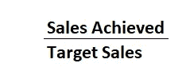
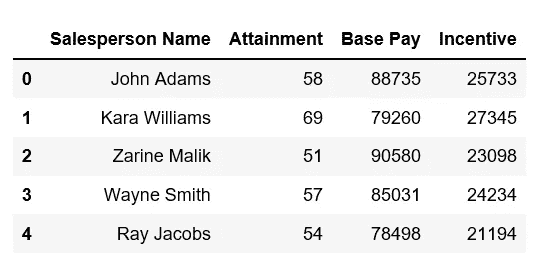
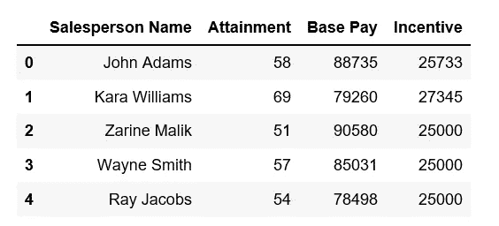

# 熊猫夹()函数

> 原文：<https://medium.com/analytics-vidhya/letss-clip-it-982e20f259cd?source=collection_archive---------30----------------------->

使用 Pandas clip()方法设置数据的界限，使用真实的业务场景。


[真诚媒体](https://unsplash.com/@sincerelymedia?utm_source=medium&utm_medium=referral)在 [Unsplash](https://unsplash.com?utm_source=medium&utm_medium=referral) 上拍摄的照片

世界各地的公司根据销售人员在一段时间内的表现为他们提供激励。在这种情况下，绩效通过一个叫做 ***销售业绩、*** 的指标来衡量，简单来说就是:



假设您正在为一家这样的公司 BigPharma Inc .提供咨询。

在当前新冠肺炎封锁的情况下，BigPharma Inc .的销售人员很可能无法达到他们的目标。

然而，该公司不希望其忠诚的员工在这个关键时期遭受财务打击，并要求您为每个员工设定最低激励，而不考虑收入。

假设 BigPharma 将最低激励金额设定为 25，000 美元。

例如，销售人员 Ray Jacobs 的激励金额为 22，000 美元，因为他由于停工而无法覆盖他的路线。你的工作是把他的激励改成 25000 美元。

让我们使用 python 中的 pandas 库来解决这个问题。

```
import pandas as pd
```

阅读销售激励数据

```
data_inc=pd.read_csv('Sales_Incentives.csv')
#Read the first five rows
data_inc.head()
```



现在使用 clip 功能，将参数 *lower* 设置为$25，000，如下所示:

```
data_inc['Incentive']=data_inc['Incentive'].clip(lower=25000)
```

全部完成！您可以看到 Ray 的激励已经更新。



注意:

*   你也可以使用 clip()来应用一个激励的上限。只需将*上*属性设置为一个合适的值。
*   点击此链接找到本练习中使用的数据集