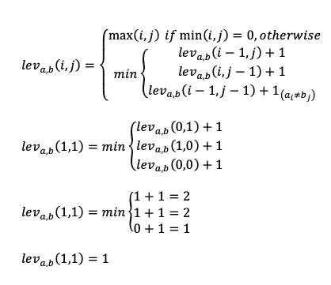
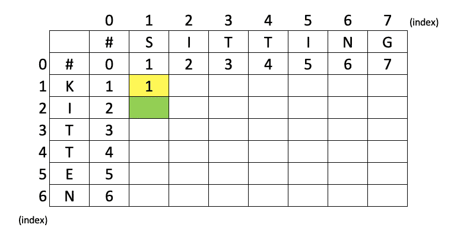

# 假人的 Levenshtein 距离

> 原文：<https://medium.com/analytics-vidhya/levenshtein-distance-for-dummies-dd9eb83d3e09?source=collection_archive---------10----------------------->

克拉丽莎·沃森在 [Unsplash](https://unsplash.com?utm_source=medium&utm_medium=referral) 上的照片

最近，我学习 NLP 来提高我在计算机科学方面的知识。我一步一步地阅读它，让我陷入了一个叫做 Levenshtein 距离的东西。我知道什么是 Levenshtein 距离，但我不知道它是如何工作的。现在，在很多教程开导我之后，我会试着用*人类*的话来写。

首先我给大家讲一下 Levenshtein 距离的定义和应用。

> **Levenshtein 距离**是一个[字符串度量](https://en.wikipedia.org/wiki/String_metric)，用于测量两个序列之间的差异。非正式地说，两个单词之间的 Levenshtein 距离是将一个单词变成另一个单词所需的单个字符编辑(插入、删除或替换)的最小数量[(维基百科)](https://en.wikipedia.org/wiki/Levenshtein_distance)
> 
> Levenshtein 距离是以俄罗斯科学家 Vladimir Levenshtein 的名字命名的，他在 1965 年设计了这个算法。如果你不能拼写或发音 Levenshtein，度量有时也被称为编辑距离。
> 
> Levenshtein 距离算法已用于:
> 
> **拼写检查
> 语音识别
> DNA 分析
> 抄袭检测**

 [## 莱文斯坦距离

### Levenshtein 距离(LD)是两个字符串之间相似性的度量，我们将它称为源…

people.cs.pitt.edu](http://people.cs.pitt.edu/~kirk/cs1501/Pruhs/Fall2006/Assignments/editdistance/Levenshtein%20Distance.htm) 

Levenshtein 距离是如何工作的？

在一个简单的例子中，我们可以用两个词来计算最小字符编辑。就像上面维基百科的解释一样，编辑是由一个或多个字符上的**插入、删除或替换**来定义的。

*例如:*

1.  FORM 和 FORK 之间的 Levenshtein 距离为 1。从 M 到 k 有一个替换。

2.小猫和坐的距离是 3，因为有 3 个角色编辑。

## Levenshtein 距离方程

Levenshtein D 距离方程式

现在我们将使用动态编程方法来计算两个单词之间的 Levenshtein 距离。我们将使用上面的等式来计算距离。

其中
a =单词 a
b =单词 b
a 和 b 是我们要计算距离的字符串或单词。
i 和 j 是帮助我们计算编辑的矩阵坐标。
在等式的最后一行，**只有当 *i* 和 *j* 不是同一个字符时，才添加+1(加一)运算符。**

下面是计算距离的步骤。

首先，做一个矩阵，包含这样的值。

然后我们将计算 Lev(1，1)，它是用黄色框突出显示的*。*

1.  因为 min(1，1)≠0，那么我们找到三个方程的最小值
2.  lev(0，1)表示我们从索引为 0 的行和索引为 1 的列中找到值
3.  lev(1，0)表示我们从索引为 1 的行和索引为 0 的列中找到值
4.  lev(0，0)表示我们从索引为 0 的行和索引为 0 的列中找到值。因为 K 不等于 S，所以我们在等式里加了+1。
5.  min(2，2，1)的值是 1，所以我们可以在上面的矩阵中放置 1。

现在，我们将找到 Lev(2，1)，它是用绿色框突出显示的*。*

1.  lev(1，1)表示我们从索引为 1 的行和索引为 1 的列中找到值
2.  lev(2，0)表示我们从索引为 2 的行和索引为 0 的列中找到值
3.  lev(1，0)表示我们从索引为 1 的行和索引为 0 的列中找到值。因为 I 不等于 S，所以我们在等式里加了+1。
4.  min(2，3，2)的值是 2，所以我们可以在上面的矩阵中放置 2。

如果采取了所有步骤，下面是一个完整的矩阵

最终的 Levenshtein 距离值总是在用红框突出显示的角上。

谢谢大家！