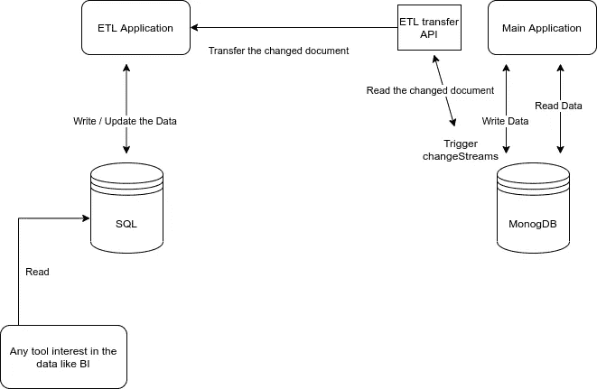

# 利用 Mongodb 变更流构建强大的 ETL 管道

> 原文：<https://medium.com/analytics-vidhya/leverage-mongodb-change-stream-to-build-a-strong-etl-pipeline-a0deb557e63b?source=collection_archive---------22----------------------->


约书亚·索蒂诺在 [Unsplash](https://unsplash.com?utm_source=medium&utm_medium=referral) 上拍摄的照片

在进入变更流之前，让我们知道为什么要将数据从 Mongo 迁移到另一个 SQL 数据库，特别是 Postgresql。当我们将像 Metabase 这样的分析工具与 mongo 连接时，出现了一个主要问题，因为我们正在处理文档数据存储，大多数关系都是嵌入式的，找到这些文档之间的关系可能会非常困难，这不符合我们的分析流程。

我们必须记住的另一件事是，我们需要该工具近乎实时地工作(总是给出最新的分析)。

最佳解决方案是将数据迁移到 SQL 数据库，并将任何分析工具直接连接到该数据库。此外，这可以用作数据的辅助备份，因为更新是实时的(感谢 Mongo change stream)。

那么什么是 Mongo 变化流呢？

> 根据[官方 Mongo 网站](https://docs.mongodb.com/manual/changeStreams/)::**更改流允许应用程序访问实时数据更改，而没有跟踪操作日志的复杂性和风险。** **应用程序可以使用变更流来订阅单个集合**、数据库或整个部署上的所有数据变更，并立即对它们做出反应。因为更改流使用聚合框架，所以应用程序还可以过滤特定的更改或随意转换通知”。

## 如何使用它:

[为了设置 mongo 来处理变更流，我跟随了这篇精彩的文章](/riow/mongodb-data-collection-change-85b63d96ff76)。它提供了关于这个主题的黄金信息。

但是最重要的一点是，mongo 默认情况下是作为一个独立的应用程序运行的。为了使用 **changeStreams** ，您必须将“**独立**”数据库转换为“**副本集**”数据库。

说到这里，我强烈建议你查看这篇文章。

Mongo changeStreams 可以在许多用例中使用，以使实时应用程序有效地工作。主要文档提到，在实现 ETL 时，它为开发人员节省了时间

**系统概述:**



使用[https://app.diagrams.net/](https://app.diagrams.net/)创建

这个代码例子摘自 mongo [官网](https://docs.mongodb.com/manual/changeStreams):

```
const collection = db.collection(‘inventory’);
const changeStream = collection.watch();let newChangeStream;
changeStream.once(‘change’, next => {
 const resumeToken = changeStream.resumeToken;
 changeStream.close();newChangeStream = collection.watch({ resumeAfter: resumeToken });
 newChangeStream.on(‘change’, next => {
 processChange(next);
 });
});
```

上面的例子使用 nodejs 来监听库存文档中的变化。

*   这个系统最近增加的另一个功能是批量拉取，这是一个直接从 MongoDB 拉取数据的后台服务。它定期运行(5 到 7 天)以确保数据完整性。

**但不幸的是**，没有免费的午餐**，**这种方法的主要缺点是增加了团队的可维护性问题。在 MongoDB 的主模式中添加或删除的每个新字段都需要反映在 ETL 服务和 SQL 模式中。这使得维护变得更加困难。

总之，mongo change stream 是一个非常强大的特性，您将摆脱许多第三方工具，在您的应用程序中实现实时性。它非常适合实现大多数常见用例，如 ETL、协作应用、通知和聊天。可能性是无限的。

**参考文献:**

*   [https://docs.mongodb.com/manual/changeStreams/](https://docs.mongodb.com/manual/changeStreams/)
*   [https://www . MongoDB . com/blog/post/an-introduction-to-change-streams](https://www.mongodb.com/blog/post/an-introduction-to-change-streams)
*   [https://medium . com/riow/MongoDB-data-collection-change-85b 63d 96 ff 7](/riow/mongodb-data-collection-change-85b63d96ff76)