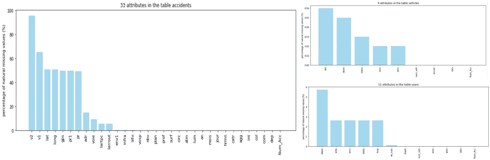

# 利用数据分析更好地了解法国的道路安全

> 原文：<https://medium.com/analytics-vidhya/leveraging-data-analysis-to-better-understand-road-safety-in-france-eb297bb385ee?source=collection_archive---------19----------------------->

我一直着迷于人类如何自信地高速控制这些被称为汽车的大而重的金属块。人类敢于冒险的能力让我们大大缩短了地点之间的距离:我们现在能够欺骗时间，快速旅行。然而，我们的道路网释放的这种力量是有代价的:每年都有许多人因交通事故而伤亡。在法国，政府经常发起运动(有时是积极的)来提高道路安全意识:

法国有道路事故数据，可用于更好地了解和预防伤亡。在下文中，我将使用公共数据来提供关于法国道路交通事故的见解:

*   2005 年至 2018 年的道路交通事故有什么变化？
*   影响事故发生的因素有哪些？
*   发生事故时导致死亡的因素是什么？
*   根据我们的数据分析结果，我们如何单独提高我们的安全性？

在开始分析之前，我们先来说说数据。

# **查看数据**

我将使用以下数据进行分析:

*   [*ka ggle*](https://www.kaggle.com/ahmedlahlou/accidents-in-france-from-2005-to-2016)2005 年至 2016 年法国道路交通事故记录；
*   法国政府网站 [*data.gouv.fr*](https://www.data.gouv.fr/fr/datasets/base-de-donnees-accidents-corporels-de-la-circulation/) 上 2017 年和 2018 年法国道路事故记录；
*   法国政府网站 [*data.gouv.fr*](https://www.data.gouv.fr/en/datasets/jours-feries-en-france/) 上的法国节假日；

浏览一下我们的数据，就会发现我们必须处理的缺失信息:

幸运的是，我们感兴趣的大多数属性几乎没有丢失信息。在我的 [***github 账号上***](https://github.com/Savadogo/Road-safety-in-France) ***，*** 我与你分享更多关于数据清洗和其他处理的细节。

## 2005 年至 2018 年法国道路趋势

这些趋势表明法国道路安全有所改善。事实上，2005 年至 2018 年期间，与道路事故相关的所有指标都大幅下降:

*   每年的事故数量下降了 34%；
*   每年涉及事故的人数下降了 34%;
*   每年在事故中受伤的人数下降了 46%；
*   死亡人数下降了 39%。

对每个地区的分析表明，这一改善几乎涉及所有地区(马约特除外):

在分析了法国交通事故的趋势后，让我们评估一下影响事故发生的因素。对于这一部分，我将选择 2018 年的数据。

## 影响道路交通事故发生的因素。

我们选择了六个属性来评估它们对事故发生的影响。

***发现:***

*   公共道路或部门道路比其他类型的道路更容易发生事故(catr)；
*   上午和下午的事故比一天中的其他时间(timeOfDay)多；
*   大多数事故都发生在十字路口之外。关于交点，X 和 T 中的交点比其他的(in T)更危险；
*   升天星期四比其他假日(假日)有更多的事故；
*   与非聚集区相比，建筑区发生事故的可能性更高。

现在让我们来评估影响道路交通事故死亡率的因素。

## 道路事故中死亡的风险因素

我们的数据包含了 2018 年涉及事故的人员记录。变量“ ***grav*** ”表示个人在事故中是否幸存(1 =没有幸存，0 =幸存)。这个变量与其他特征的关联热图给出了下面的结果:

在以下情况下，道路事故最有可能导致死亡:

*   此人没有使用安全设备(安全带、头盔……)；
*   事故发生在凝聚之外；
*   事故发生在部门公路上；
*   此人在没有开启公共照明的夜间驾驶；
*   碰撞是正面的。

## ***提高我们的道路安全***

我们注意到，致命事故更多发生在部门道路或聚集区以外的道路上。在这种类型的道路上，人们往往会开快车，将自己置于危险之中。遵守速度限制并在需要时休息以提高道路上的安全性是至关重要的。

此外，使用我们的安全设备将显著降低事故中的死亡风险。

关于我分析的更多细节，可以查看我的 [***github 账号***](https://github.com/Savadogo/Road-safety-in-France/) 。