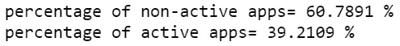

# 利用移动用户统计数据，通过深度学习获得有用的见解

> 原文：<https://medium.com/analytics-vidhya/leveraging-mobile-user-demographics-to-obtain-useful-insights-using-deep-learning-25081da73fd?source=collection_archive---------19----------------------->

在这篇文章中，我将回顾我对 [*移动用户人口统计数据问题*](https://www.kaggle.com/c/talkingdata-mobile-user-demographics/overview) (一场 Kaggle 竞赛)的解决方案，它让我进入了排行榜的前 9%。

照片由[科里·沙伊特](https://unsplash.com/@coryschadt?utm_source=unsplash&utm_medium=referral&utm_content=creditCopyText)在 [Unsplash](https://unsplash.com/s/photos/people-walking--crowd?utm_source=unsplash&utm_medium=referral&utm_content=creditCopyText) 上拍摄

# 业务问题和解决问题的潜在价值:

腾云天下是国内最大的第三方移动数据平台。他们每天处理超过 10tb 的数据和超过 10 亿次的会话请求，并提供移动应用分析、移动广告跟踪、移动市场情报和咨询服务。**挑战的重点是建立一个模型，根据用户的应用使用、地理位置和设备属性来预测用户的人口统计特征(年龄组和性别)**。有了这些信息，就有可能增强开发者和广告商的数据驱动营销，并使其与最终用户更加相关。了解移动用户的年龄组和性别对许多公司来说非常重要，因为这有助于他们进行非常有针对性的营销，并相应地呈现内容。

# **理解数据:**

该问题是一个 12 类分类问题(即，我们需要预测给定设备 id 的年龄组和性别)。

数据就是从这个 kaggle( [链接](https://www.kaggle.com/c/talkingdata-mobile-user-demographics/data))获得的。它包含以下文件，

1.  gender_age_train.csv，gender_age_test.csv-训练和测试，包含我们必须预测年龄和性别的设备 id。
2.  events.csv，app _ events . CSV——当用户使用 TalkingData SDK 时，事件连同其时间戳一起被记录在该数据中。每个事件都有一个事件 id，位置(纬度/经度)，事件对应 app_events 中的一个应用列表。
3.  app_labels.csv-包含应用程序及其相应的类别，label_id 可用于连接 label_categories
4.  label_categories.csv-文本形式的应用程序标签及其类别
5.  phone_brand_device_model.csv-包含每个唯一设备 id 的电话品牌和电话型号

# **关键绩效指标:**

多类日志丢失:每个设备 id 都有一个真实的类。使用模型，我们估计该设备 id 属于每个类别的概率。一旦我们有了这个，我们可以计算损失为

来源: [Kaggle](https://www.kaggle.com/c/talkingdata-mobile-user-demographics/overview/evaluation)

其中 N 表示数据中唯一设备 id 的数量，M 表示数据中唯一类别标签的数量。

# **探索性数据分析:**

让我们从分析**训练数据**开始，

它包含设备 id、性别、年龄和年龄组作为特征。让我们找出目标变量的分布

似乎有一些阶级的不平衡，而且数据包含更多的男性用户比女性用户，让我们看看到底有多少..

大约 65%的训练数据是男性

**手机品牌和型号分析:**

最初的数据集包含了所有的中文手机品牌。多亏了这个[翻译](https://www.kaggle.com/c/talkingdata-mobile-user-demographics/discussion/22186)，映射成了英语。

从柱状图来看，小米、三星、华为等品牌在市场上占据主导地位，其大多数客户恰好是男性。

还有一些必须处理的副本。

**事件分析:**

事件 id 是正在使用的设备的唯一实例。让我们数一数每天发生的事件的数量

每天发生的事件数量大致相同，从中没有多少有用的东西:(

让我们试着绘制地理数据并在地图上显示出来

正如所料，男性用户占主导地位。此外，大多数用户集中在中国东部地区。

在训练数据中出现的设备 id 中只有 30%出现在事件文件中。

**app 事件分析**:

对于所有行，is_installed 都是 1，因此没有使用该功能。我还找到了 is_active 特性的百分比

**来自 EDA 的结论:**

1.  训练数据中的大部分数据来自男性用户(64%)
2.  小米、三星、华为是最受用户欢迎的三大手机品牌
3.  手机品牌型号文件中有 529 行重复
4.  来自训练和测试的大约 31%的数据在事件文件中具有信息

# **我解决问题的方法:**

值得注意的是，70%的数据不包含事件信息，它们只包含手机品牌和型号信息。

1.  将训练数据分成两部分；包含事件信息的数据和不包含事件信息的数据。
2.  对于没有事件信息的数据，使用整个训练数据训练具有品牌和模型的模型，并对没有事件信息的测试数据进行预测。
3.  对于具有事件信息的数据，使用具有事件信息的训练数据，使用来自事件文件的品牌、模型和特征来训练模型，并预测具有事件信息的测试数据。
4.  将步骤 2 和 3 中的预测连接起来。

**特色工程:**

数据不能直接用于操作，因为它分布在多个表中，每个设备 id 可以有多个事件 id，每个事件 id 可以有多个应用 id，每个应用 id 可以有多个类别。

在这里，让我告诉你一个例子，我如何使用手机品牌来创建一个热门的功能。

首先，我们将一个整数分配给训练数据中唯一的设备 id。然后，我们在手机数据帧中对手机品牌进行标签编码。我们在 phone 和 gatrain 数据帧之间进行映射(内部连接)。最后，我们使用 scipy 包中的 [csr_matrix](https://docs.scipy.org/doc/scipy-0.14.0/reference/generated/scipy.sparse.csr_matrix.html) 来创建一个热特征。

下面是我如何使用地理数据(纬度和经度)创建要素的另一个例子。

一个设备 id 可以有多个纬度和经度条目(如果设备在多个地方使用)。所以把所有这样的纬度组合起来，找到它的中间值。现在，对于每个设备 id，我们都有一个中值纬度和中值经度。我们将它们组合并适合 kmeans 聚类算法以获得 10 个箱。

要了解更多关于所创建特性的信息，请查看我在文章末尾给出的 github repo。

**造型，无事件:**

训练数据仅包含电话品牌和电话型号作为一个热点表示(如上所述)。使用 80-20 列车测试分割。

我用了下面的神经网络架构。它是从这个 [kaggle 论坛](https://www.kaggle.com/c/talkingdata-mobile-user-demographics/discussion/23424)上引用的。

此外，我使用了神经网络集成；我用不同的种子训练模型 5 次，取每个模型预测的平均值。这样做是为了减少一次训练模型时可能出现的高方差。

这些模型的平均对数损失为 2.355

**造型，带事件:**

如前所述，我使用事件文件中的附加特性来建模，并使用 80–20 分割。

我用了两个模型，取了它们的加权平均值(后面会讨论)。

模型 1:引自本 [Kaggle 论坛](https://www.kaggle.com/c/talkingdata-mobile-user-demographics/discussion/23424)。

在对 10 个这样的模型的总体结果进行平均后，验证对数损失变成 1.905

模型 2:上述神经网络的变体，但是我试验了隐藏层的数量和密集层中神经元的数量。

在对 10 个这样的模型的总体结果进行平均后，验证对数损失变成 1.902

**模型组装:**

由于使用了 2 个神经网络来预测包含事件信息的数据，我对它们的预测进行了加权平均。由于两个神经网络的验证损失大致相同，我们给予 w1 和 w2 相等的权重。

# **结果:**

**私人排行榜得分:** 2.23900

**公众排行榜得分:** 2.23393

这种方法让我进入了排行榜的前 9%。以下是我试验过的所有模型的总结。

# **进一步改进:**

1.  组装时尝试不同的重量和模型架构。
2.  添加更多功能，如应用类别的熵，一周中的几天，一周中的几个小时。

# **结论和一些想法:**

1.  这些数据有很多缺失值，大约 70%的数据不包含事件信息。
2.  这个问题最难的部分是创建特性，因为数据分布在各个表中，每个表都有自己的主键
3.  数据被分成两组，包含事件文件的设备和不包含事件文件的设备，分别进行建模，并将其预测连接起来。这给出了最好的结果。

尽管竞赛截止日期已经过了，但通过探索这个案例研究，我们还是学到了很多东西。我希望我能让你理解这个问题。请随意查看我的 [GitHub 资源库](https://github.com/sooryav98/Talking-Data-Mobile-User-Demographics)中的完整解决方案，并通过 [LinkedIn](https://www.linkedin.com/in/soorya-v-11b01917b/) 联系我。

## **感谢阅读:)**

# **参考文献:**

1.  [应用课程](https://www.appliedaicourse.com/)
2.  [https://machine learning mastery . com/model-averaging-ensemble-for-deep-learning-neural-networks/](https://machinelearningmastery.com/model-averaging-ensemble-for-deep-learning-neural-networks/)
3.  [https://www . ka ggle . com/c/talking data-mobile-user-demographics/discussion/23424](https://www.kaggle.com/c/talkingdata-mobile-user-demographics/discussion/23424)
4.  [https://machine learning mastery . com/weighted-average-ensemble-for-deep-learning-neural-networks/](https://machinelearningmastery.com/weighted-average-ensemble-for-deep-learning-neural-networks/)