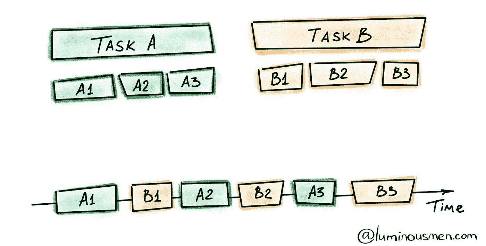
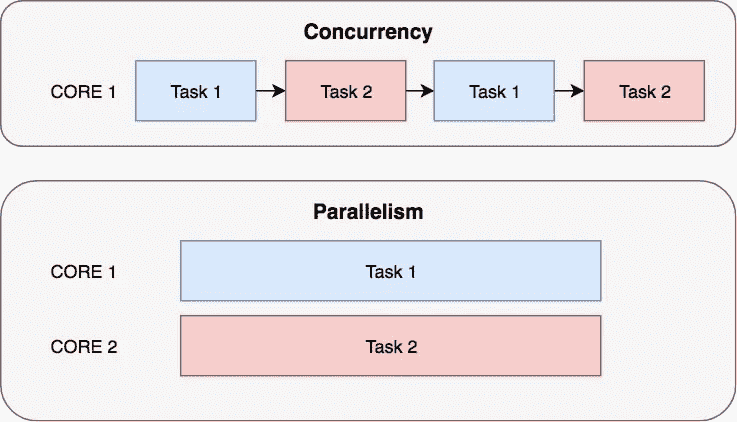

# 利用 Python——第一部分:并发方式

> 原文：<https://medium.com/analytics-vidhya/leveraging-python-part-i-the-concurrent-way-6743e89093fa?source=collection_archive---------23----------------------->

Python 是机器学习或数据科学相关任务的首选语言。但是在它吹嘘的顶级用户友好和直观的设计之下，有一个丑陋的方面——执行速度。

并发性——不，它不同于并行性

# **Python 速度慢。**

Python 是一种高级语言，在层次上高于 c。它也是一种解释语言，这意味着它容易执行指令，而不必事先编译成机器指令。它从用户那里抽象出计算机的细节:内存管理、指针等。一个更容易理解的想法是，它更接近人类的思维方式。

只有当我们将开发时间也考虑在内时，慢速的代价才是显而易见的。虽然 C 可能比 Python 执行得更快，但用 C 开发任何应用程序或程序的时间都远远超过后者。

也就是说，Python 仍然有一些有趣的范例，可以用来提高执行速度。尤其是并发性。

# 什么是并发？

简而言之，并发意味着同时处理多件事情。请注意，这与并行不同，并行是指多个任务同时运行。

并发性是启动多个任务，并在重叠的时间段内运行/完成它们

Python 是一种多范式编程语言。奇怪的是，它有一个全局解释器锁(GIL)，确保在任何给定时间**，只有一个线程运行**。这样做主要是为了处理线程安全的执行，并防止出现竞争情况。

GIL 似乎违背了并发的目的，但我们仍然可以通过利用它来提高执行速度——在 I/O 密集型操作、CPU 密集型高计算工作量、操作期间网站响应缓慢等情况下。

在这篇文章中，我们将看到如何开发一个简单的基于并发的程序来从网站列表中抓取数据。额外的收获是——如何用面向对象的方式将其模块化。毕竟 Python **是**一种 OOP 语言。

# Python 中的并发性

Python 有一个专用于异步执行调用的库。可以使用 ThreadPoolExecutor 或 ProcessPoolExecutor 分别对线程和进程执行异步执行。它们是抽象**执行器**类的实现。你可以在这里阅读更多关于他们的[。](https://docs.python.org/3/library/concurrent.futures.html)

让我们构建一个简单的程序来抓取链接，而不使用任何执行速度。

我们首先使用 Python 中的**请求**模块编写一个从网站下载内容的函数。可以通过 pip 轻松安装:
`pip3 install requests`

注意，我们使用了请求的 Session 对象，它允许某些参数跨请求持久化。如果向同一个主机发出几个请求，这是很有用的，因为相同的底层 TCP 连接将被重用。我们利用请求。会话()。get()从特定的 web 链接获取数据。我们希望将这些数据保存到一个简单的文件中，这是一个 I/O 操作。

现在我们有了基线(没有并发)，让我们写同样的并发。我们需要对代码做一些修改。

首先，我们需要**线程**和**并发.未来**模块。

1.  当线程被中断或有大量 I/O 操作时，操作系统会切换到另一个线程。线程间的数据是共享的，需要保护。因为请求。Session()不是线程安全的，我们需要替代策略，如线程本地存储或线程安全的数据结构。
2.  由于线程也有共享内存，我们需要存储一个本地存储实例。为此，我们使用了 threading.local()。它为每个单独的线程创建一个特定的对象，并且只需要初始化一次。这个对象负责分离不同线程对不同数据的访问。
3.  每个线程都需要有自己的请求。Session()对象。这样，一个线程可以在一个特定的 web 链接上持久存储参数。与本地线程存储相结合，这将有助于我们使并发进程顺利执行。

考虑到这些，并发版本可以很容易地编写成这样:

因为我们在这里处理 I/O 操作，所以我们可以看到通过使进程并发，执行时间有了显著的改进。

# 奖金——模块化的 OOP 格式

由于 Python 拥有 OOP 范例和并发范例，我们可以使用它们来编写一个简单、干净的代码模块供将来使用。更清晰的代码有助于理解代码是如何分组的，以及执行的格式。它有助于代码的重用，同时使调试更容易。在为代码编写简单的函数之后，总是要尝试清理代码。

我们创建一个类，并为它设置初始属性。Python 类函数的每个函数都有一个默认的 *self* 属性。

# 但是……**为什么**并发？

系统的计算资源是有限的。如果不利用并发性，系统实际上会处于空闲状态，并在 I/O 和 CPU 限制操作期间降低处理速度。充分利用可用资源是有益的，并发就是这样一种方法。并发扩展到单核，在某些情况下可以最大限度地提高性能。在其他情况下，我们可能需要选择真正的并行——使用**多处理**。

无论如何，在实践中——大量的机器学习和数据科学编程需要从多个来源收集和爬取数据。这意味着处理单个站点的延迟、数据库操作、查询等。所有这些操作都有 I/O 限制，这意味着并发可以更好地利用系统资源。大规模整理数据可能涉及多个数据源，每个数据源都会增加程序的处理时间开销。

将并发编程范例合并到 Python 代码中可以无缝地工作，并缓解一些执行速度问题。并发性与函数式编程和数据驱动编程紧密相连，这使得它对于基于机器学习和数据挖掘的程序非常有用。