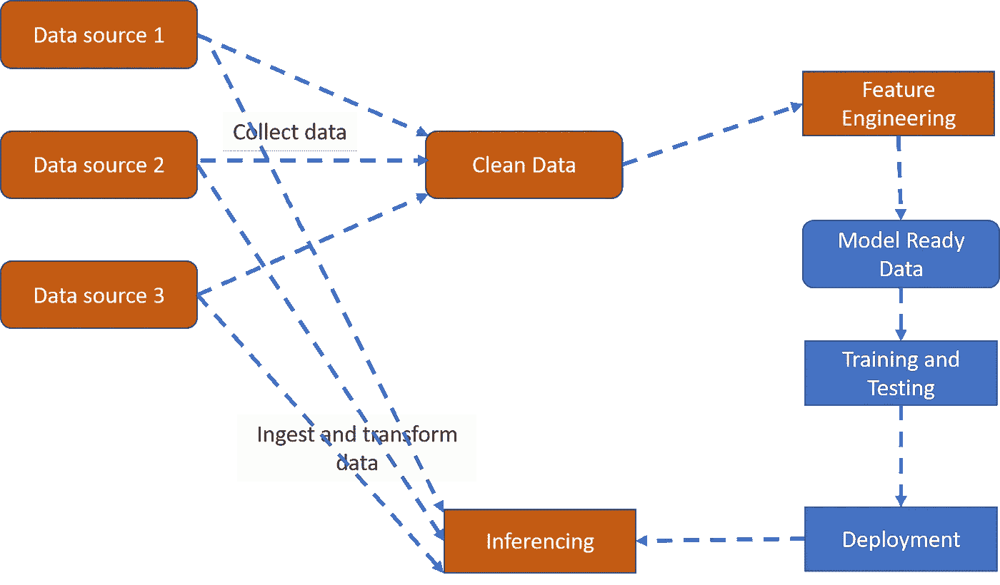
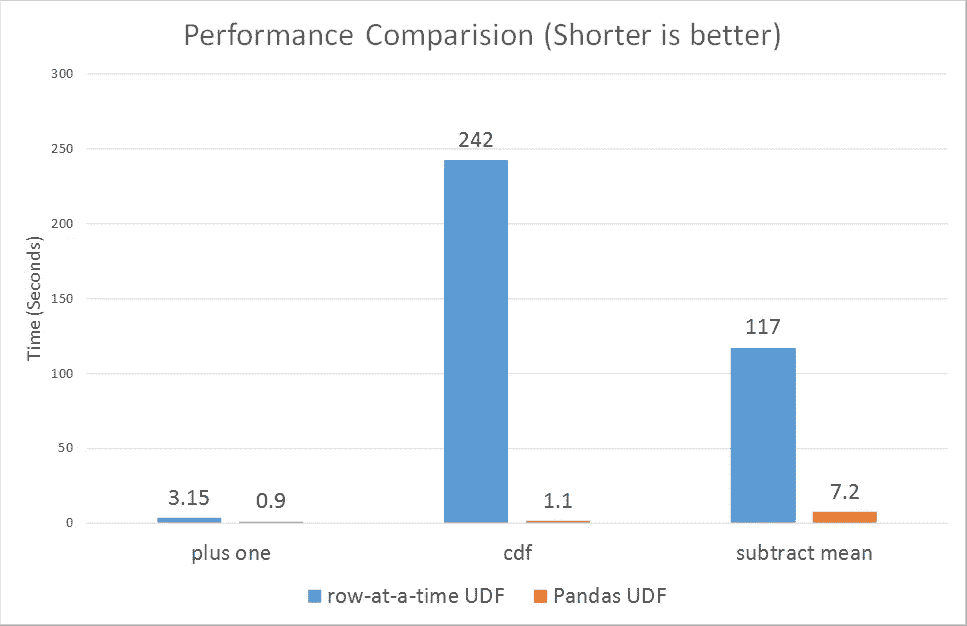

# 利用 Spark 进行大规模深度学习数据准备和推理

> 原文：<https://medium.com/analytics-vidhya/leveraging-spark-for-large-scale-deep-learning-data-preparation-and-inferencing-c42e92183f53?source=collection_archive---------3----------------------->

## 虽然众所周知，训练深度学习模型需要大量数据才能产生良好的结果，但快速增长的业务数据通常需要部署深度学习模型才能处理越来越大的数据集。如今，深度学习从业者发现自己在大数据世界中运营并不罕见。

为了解决训练中的大数据集问题，引入了分布式深度学习框架。在推理方面，机器学习模型，特别是深度学习模型通常被部署为 Rest API 端点，可扩展性是通过在 Kubernetes 等框架中的多个节点上复制部署来实现的。

这些机制通常需要大量的工程工作来正确设置，并且并不总是有效的，尤其是在非常大的数据量中。

在这篇文章中，我想介绍两种技术方法来解决大数据中深度学习的两个挑战:

1.并行处理结构化和非结构化数据的大量数据预处理

2.使用 Spark 在大数据管道中部署高性能批量评分的深度学习模型。

这些方法利用了 Spark Framework 和 Tensorflow 2.0 中的最新特性和增强功能。

# 1.介绍

深度学习通常用大量的非结构化数据进行训练，如图像、音频、文本…或具有数千个特征的结构化数据。提供数百 GB 的数据集作为训练的输入并不少见。如果使用单节点架构，可能需要非常长的时间来完成消化和训练。现在有一些分布式深度学习框架，如 Horovod 和分布式 Tensorflow，它们有助于全面扩展深度学习培训。但是这些框架专注于分配核心训练任务，即从模型的副本中计算数据碎片上的梯度，而没有很好地并行化其他一般计算步骤。Apache Spark 是一个[开源](https://analyticsindiamag.com/10-open-source-data-science-big-data-applications-well-supported-linux/)集群计算框架，它提供了一个接口，用于通过隐式数据并行和容错对整个集群进行编程，是一个以简单方式卸载一般计算步骤的优秀工具。



***图 1****:ML 开发的不同阶段，橙色的阶段可以卸载到 Spark*

通过使用 Apache Spark，我们可以卸载预处理步骤，包括数据清理、功能工程，并生成一个易于使用的数据集，然后可以使用深度学习框架。这将节省时间和成本，因为 GPU 等昂贵的资源可以用来专注于它的亮点:从大型张量矩阵计算模型的梯度。

另一方面，传统上 ML 模型是作为 Rest APIs 部署的。虽然这种方法适用于实时评分场景，但当数据以非常大的批量进入时，它可能无法提供最佳吞吐量。

同样，Spark 在这里大放异彩，是深度学习模型大批量、批量评分的绝佳选择。

虽然 Spark 已经存在了很长时间，并且已经有多个计划试图利用 Spark 来扩展深度学习，但是这些方法与其他方法有什么不同？

本文中的方法利用了 Spark 中的两个非常重要的特性，这两个特性解决了当前其他框架中的弱点:

*   支持二进制文件格式，以处理深度学习中几乎任何类型的非结构化数据
*   使用最新的熊猫 UDF，包括标量迭代器，允许缓存和重用内存中的多个批次的模型，而不必从存储重新加载

# 2.对任何类型的数据进行缩放数据预处理

数据预处理包括数据清洗和特征工程，产生可用于深度学习训练和推理的数据。

将这些逻辑卸载到 Spark 分布式框架可以显著提高深度学习训练的性能。

Spark 中有几个特性允许高效的分布式数据预处理:

1.  Spark 对二进制数据输入和 tfrecords 输出的支持
2.  在 worker 节点支持深度学习和 Python 库，并使用 UDF 来执行复杂的功能工程

首先，Spark 不仅能够处理结构化数据和文本数据，而且能够处理二进制数据，这一点很重要，因为深度学习通常处理图像、音频和其他非结构化数据。这简化了数据加载和预处理步骤，因为我们不需要为任务编写定制的读取器。

最近 Spark 对二进制数据的支持提供了这种能力。Spark 的二进制文件数据集提供了将二进制数据读入以下数据帧表示的能力

*   文件路径
*   修改时间
*   长度
*   二进制内容

其次，Spark 支持输出到深度学习的原生格式。对于 Tensorflow，有一个名为 Spark Tensorflow connector 的库，它允许将 TFRecords 格式的数据读取到 Spark Dataframe。

数据和特征工程的预处理可能涉及使用某些自定义库，如 Pillow for image、Scipy Librosa for audio，当然还有 tensorflow 本身。幸运的是，商业 Spark framework 使得跨集群中的节点安装定制库变得很容易。

现在的策略是使用 Spark 框架分割数据，并有一个预处理数据的机制。在这里，我们将使用 UDF，特别是 UDF 大熊猫来有效地做到这一点。

在下面的代码演示中，这是语音识别练习的一部分，我设计了一个 UDF 函数和所需的库，从一个音频文件中获取声谱图特征。

一种数据预处理算法

*   使用 Spark Dataframe 类型的二进制文件读取二进制数据
*   选择二进制内容列到 UDF 函数中以提取特征
*   根据需要选择其他列，如进入另一个 UDF 的文件路径(例如从文件名创建标签列)
*   在特征提取 UDF 函数中，导入所需的库来从二进制数据中提取特征

对于 Spark 本身支持的结构化数据，如 csv 和 parquet 文件，这个过程要简单得多。您可以对列值执行直接转换，最终将数据表单转换为 TFRecords。

下面是为深度学习训练预处理音频数据的示例代码

```
#Load wav data files using binaryFile format readerdf = spark.read.format("binaryFile") \
          .option("pathGlobFilter", "*.wav") \
          .option("recursiveFileLookup", "true") \
          .load("mnt/audioproject/data/voicecmd/data_speech_commands_v0.02")import pyspark.sql.functions as f
import pyspark.sql.types as t
from pyspark.sql.functions import col, pandas_udf#UDF 1: process core binary content using librosa and extract spectrogram as features
def audio_prep_tf(binary):
  import pandas as pd
  import numpy as np
  from io import BytesIO
  import os
  import librosa
  import random
  import stringaudio_list = []
  for binary in binary:
    x, sr = librosa.load(BytesIO(binary), sr=16000)
    X = librosa.stft(x,n_fft=2048)
    Xdb = librosa.amplitude_to_db(abs(X))
    zeros_to_pad = 38-Xdb.shape[1]
    Xdb = np.pad(Xdb, ((0, 0),(0,zeros_to_pad)),'constant')
    audio_list.append(Xdb.tobytes())return pd.Series(audio_list)#UDF 2: Get input file path and extract file name and look up index position in a label listdef process_label_tf(org_file_path):
  import pandas as pd
  label_list = ['backward','bed','bird','cat','dog',
                'down','eight','five','follow','forward','four','go',
                'happy','house','learn','left','marvin','nine','no',
                'off','on','one','right','seven','sheila','six','stop',
                'three','tree','two','up','visual','wow','yes','zero']
  label_index_list=[]
  for org_file_path in org_file_path:
    label = org_file_path.split("/")[-2]
    label_index=label_list.index(label)
    label_index_list.append(label_index)
  return pd.Series(label_index_list)#Register as Pandas UDF
audio_prep_tf_udf = pandas_udf(audio_prep_tf,returnType=BinaryType())
process_label_udf = pandas_udf(process_label_tf,returnType=FloatType())fields = [t.StructField("train/label", t.FloatType ()), 
          t.StructField("train/audio", t.BinaryType())]
schema = t.StructType(fields)#Apply the UDFs to transform data. Consolidate into 100 output TF filesresults_sdf = (
    df.coalesce(100)
    .select(
        audio_prep_tf_udf( f.col('content')).alias("train/audio"),
      process_label_udf( f.col('path')).alias("train/label")
    ))
#Write out the result to distributed file systemresults_sdf.write.format("tfrecords") \
           .option("recordType", "Example") \
           .option("schema",schema).mode("overwrite") \
           .save("/mnt/audioproject/data/voicecmd/converted_tf_data5")
```

# 3.高效大规模推理

Spark 作为深度学习部署的环境已经变得越来越好，它允许跨工作节点安装 Python 和深度学习库并与之互操作。最近的进步允许 Spark 在内存中加载和缓存大规模深度学习模型，以便在多批次评分中重复使用(Spark Pandas UDF)。Spark 数据表示和深度学习框架(Python object…)的数据转换有 Pyarrow 更好的支持。这些特性是在 Apache Spark 2.3 版本的 Pandas UDFs(也称为矢量化 UDF)特性中实现的，该特性大大提高了 Python 中用户定义函数(UDF)的性能和可用性。熊猫 UDF 解决了常规 UDF 一次操作一行的问题，因此受到高序列化和调用开销的困扰



**图 2:** *熊猫 UDF 的表现全面优于一次一行的 UDF，从* ***3x 到超过 100x*** *(来源 databricks.com)*

为了进一步支持深度学习大规模推理，有一个新版本的熊猫标量迭代器熊猫 UDF，它与上面的标量熊猫 UDF 相同，只是底层 Python 函数将一个批处理迭代器作为输入，而不是单个批处理，并且它不是返回单个输出批处理，而是产生输出批处理或返回输出批处理的迭代器。当 UDF 执行需要初始化某个状态时，标量迭代器熊猫 UDF 是有用的，例如，加载机器学习模型文件以对每个输入批次应用推理。

下面是一个使用标量迭代器 UDF 的持久化 Keras 模型批量评分的示例实现。再次使用二进制文件 Spark 数据帧加载原始数据，然后预处理和模型评分的逻辑可以有效地结合在一起。数据被拆分成熊猫系列的批次。请注意，对于多个批处理，模型加载和初始化只执行一次，因为这是一个开销很大的操作。

```
#Batch Scoring from raw data using Pandas UDF Batch Iterator
df = spark.read.format("binaryFile") \
          .option("pathGlobFilter", "*.wav") \
          .option("recursiveFileLookup", "true") \
          .load("mnt/audioproject/data/voicecmd/data_speech_commands_v0.02")import pyspark.sql.functions as f
import pyspark.sql.types as t
from pyspark.sql.functions import col, pandas_udf, PandasUDFType#UDF : preprocess binary data, load DL model and score  
[@pandas_udf](http://twitter.com/pandas_udf)("string", PandasUDFType.SCALAR_ITER)
def predict(binary_batch):
  import pandas as pd
  import numpy as np
  from io import BytesIO
  import os
  import librosa
  import random
  import string
  import tensorflow as tf
  from tensorflow.keras.models import load_modelpath ='/dbfs/mnt/ml/tmp/audioml'
  loaded_model = load_model(path)

  for binary_series in binary_batch:
    input_array=[]
    i=0
    for binary in binary_series:
      x, sr = librosa.load(BytesIO(binary), sr=16000)
      X = librosa.stft(x,n_fft=2048)
      Xdb = librosa.amplitude_to_db(abs(X))
      zeros_to_pad = 38-Xdb.shape[1]
      Xdb = np.pad(Xdb, ((0, 0),(0,zeros_to_pad)),'constant')
      audio = tf.reshape(Xdb, [1025,38,1])
      audio= tf.image.grayscale_to_rgb(audio)
      i=i+1
      input_array.append(audio)
    predicted_index = loaded_model.predict(np.array(input_array))
    predicted_index= [np.argmax(i) for i in predicted_index]
    yield pd.Series(label_list[predicted_index], index= range(i))predict_result_df = df.select(predict(f.col('content')).alias("predict"))
```

# 4.结论

使用 Spark 可以大幅提高深度学习开发的生产力，并利用大数据对性能进行评分。二进制文件和熊猫 UDF 的新高效实现使 Spark 成为几乎任何类型的深度学习开发和部署场景的可行解决方案，无论数据类型和模型复杂性如何。在培训中，Spark 可以用于卸载生产管道中的数据预处理任务，在 Spark 已经流行的地方，深度学习模型可以直接部署，以利用 Spark 强大的可扩展性，并且复杂性低得多。

# 5.数据

本文中的示例是在语音命令上执行的

谷歌数据集([https://ai . Google blog . com/2017/08/launching-speech-commands-dataset . html](https://ai.googleblog.com/2017/08/launching-speech-commands-dataset.html))

# 参考

1.  李阳，，Bobbie Chern 和 Andy Feng (@afeng76)，雅虎大 ML 团队，大数据集群的分布式深度学习，2017 年

2.Databricks，Spark 深度学习管道，2017 年。

3.Tensorflow 团队，Tensorflow 2.0 项目

4.阿帕奇星火组织，熊猫 UDF，2017

5.Databricks & Apache Spark Org，熊猫 UDF 标量迭代器，2019。

6.Databricks & Apache Spark Org，Spark 二进制文件 Dataframe，2019。

7.Tensorflow 团队，Spark Tensorflow 连接器，2016