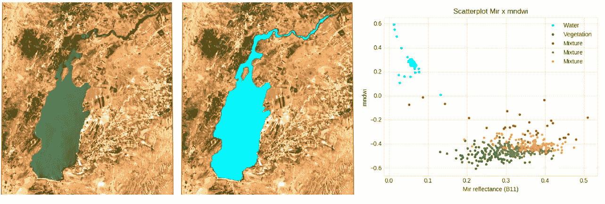
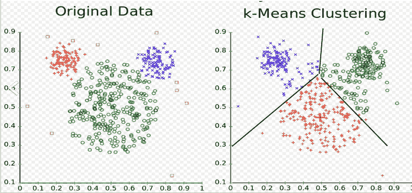
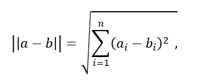
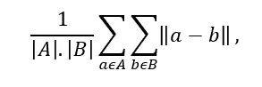
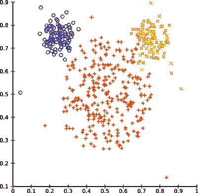
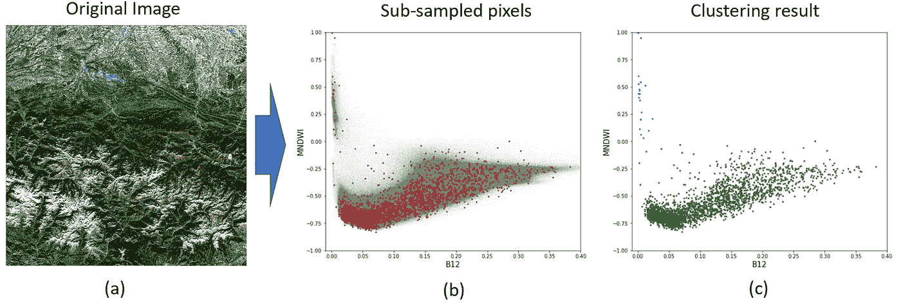
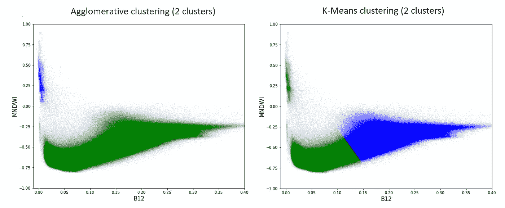
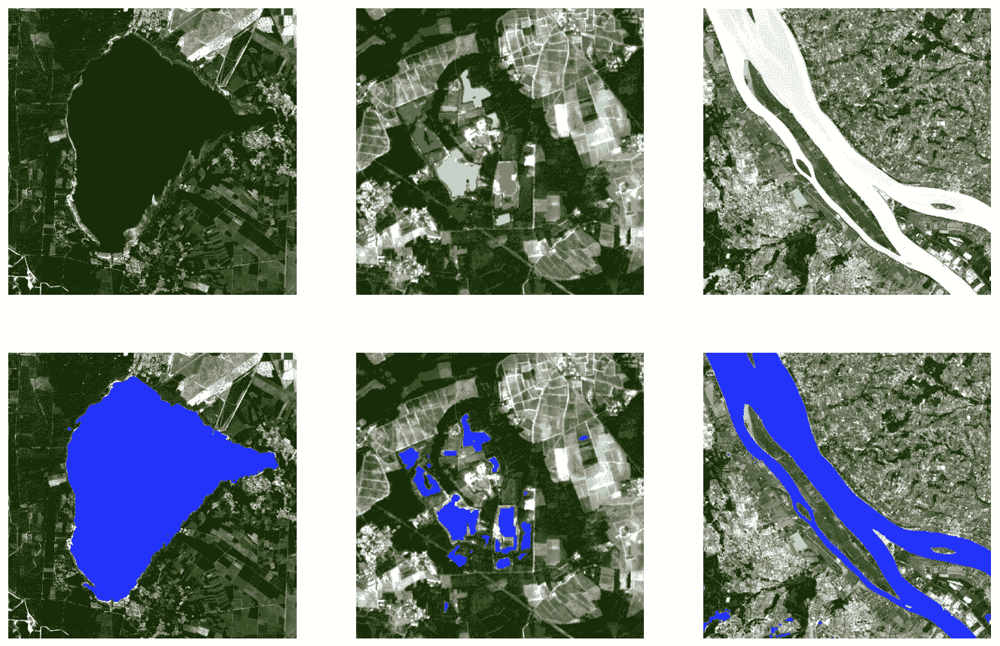

# 利用高分辨率卫星图像的凝聚聚类性能

> 原文：<https://medium.com/analytics-vidhya/leveraging-the-performance-of-agglomerative-clustering-for-high-resolution-satellite-images-part-f5d54a816f3d?source=collection_archive---------12----------------------->



图一。卫星图像中水探测的无监督凝聚聚类的例子。Qaraoun 湖(黎巴嫩)。

# 更新

关于课程**科学家 Python 入门** ( [可在 YouTube](https://youtu.be/oQaoj6LE5E4) ) 和其他类似文章的信息，请访问我的网站[cordmaur.carrd.co](http://cordmaur.carrd.co/)。介绍

# 介绍

聚类分析是一种用于在多维数据空间中识别(即分组)相似样本的非监督技术。在遥感数据的背景下，它主要用于像素分类，其中多维空间表示像素在*不同波长(传感器波段)或任何其他组合下的反射率。*

*在我攻读博士学位的第一年，在保罗·萨巴捷大学(图卢兹)，更具体地说是在 GET 实验室工作期间，我们一直在利用来自 Sentinel-2 和 Landsat-8 任务的卫星图像来评估内陆水面。由于水的反射率会因地区、大气条件和成分的不同而有很大差异，因此采用单一的阈值或一套固定的规则来区分水和土地是不可行的。因此，挑战之一是开发一种算法来自动识别场景中的水像素。*

*选择的方法是运行无监督聚类算法来识别最接近水体像素光谱的像素。在接下来的两节中，我将简要介绍 K-Means 和凝聚聚类算法。如果您已经熟悉这些技术，您可以跳到**建议的解决方案**部分。使用 waterdetect python 包在高分辨率卫星图像中进行水检测的故事[中解释了底层代码以及 git 存储库。](https://towardsdatascience.com/water-detection-in-high-resolution-satellite-images-using-the-waterdetect-python-package-7c5a031e3d16)*

## *k 均值和“鼠标”数据集*

*到目前为止，遥感界最常用的聚类算法是 K 均值聚类。它很快，很容易实现或在软件包中找到，但它的结果对于这种任务来说并不好。*

*K-Means 背后的思想是，给定期望数量的聚类来分割数据集，每个样本属于最近的聚类质心。然后，该算法通过重复地将样本分配给聚类，然后重新计算质心，来搜索最小化聚类内方差(从样本到聚类质心的距离的方差)的质心。该方法的快速解释可以在下面的视频中找到。*

*视频: [K 均值聚类:工作原理](https://www.youtube.com/watch?v=_aWzGGNrcic)。*

*K-Means 在算法的收敛性方面有一些问题，这取决于初始化质心，但有一些替代方法，如 Scikit-Learn 和其他包中实现的 k-means++可以克服这一问题。*

*然而，K-Means 有一个固有的缺点。最终的解决方案是 Voronoi 图，所有聚类共享相同的大小，这可以通过所有样本属于最近的聚类质心的初始假设来容易地解释。因此，对于具有不同聚类大小的数据集(例如“鼠标”数据集)，这可能导致次优解决方案(图 2)。*

**

*图二。“mouse”数据集中 k-means 聚类的结果。*

*考虑到我们的主要目标是将 ***水*** 的像素与 ***陆地*** (所有其他的)的像素分开，您可以想象这些簇的大小会有多么不同(图 1)。*

## *另一种选择是:凝聚集群*

*为了克服这个 K-Means 问题，我们选择使用凝聚聚类。凝聚聚类是层次聚类的一个子类型，遵循自下而上的方法，其中每个观察值从自己的聚类开始，然后迭代合并，直到达到所需的聚类数。*

*该算法决定是否合并两个聚类的关键参数是度量和链接。该度量指定了观察值对之间的距离度量。我们对多维空间使用简单的欧几里德距离:*

**

*公制公式*

*在这个公式中 *a* 和 *b* 是在一个 *n* 维空间中的点坐标，而 *i* 是考虑的尺寸。*

*除了度量之外，链接标准确定了如何根据观测值之间的成对距离来计算聚类之间的距离。本研究中使用的平均关联考虑了每个聚类中所有点的平均距离，可描述为:*

**

*链接公式*

*在这个公式中，A 和 B 是 n 维空间中的坐标，而|A|和|B|是每个聚类中的观测值的总量。*

*在每次迭代期间，该算法合并所有聚类中的两个聚类，这两个聚类考虑上述标准而彼此更接近。迭代继续，直到达到指定的 K 数。使用这种算法,“鼠标”数据集看起来会像这样:*

**

*图 3。鼠标数据集的凝聚聚类解决方案。信用:[实现层次聚类](https://elki-project.github.io/tutorial/hierarchical_clustering)。*

*一切都很好，除了一个细节……一整幅 Sentinel-2 图像根本不适合这样的算法，原因只有一个，那就是在 [**理解层次聚类技术的概念**](https://towardsdatascience.com/understanding-the-concept-of-hierarchical-clustering-technique-c6e8243758ec) 的故事中解释的:*

> ***层次聚类技术的空间和时间复杂度:***
> 
> ***空间复杂度:**当数据点的数量很大时，层次聚类技术所需的空间非常大，因为我们需要将相似性矩阵存储在 RAM 中。空间复杂度是 n 的平方的数量级。*
> 
> *空间复杂度= O(n)其中 n 是数据点的数量。*
> 
> ***时间复杂度:**由于我们要进行 n 次迭代，每次迭代都需要更新相似度矩阵和恢复矩阵，时间复杂度也很高。时间复杂度是 n 的立方的数量级。*
> 
> *时间复杂度= O(n)其中 n 是数据点的数量。*

## *提议的解决方案*

*正如我们所看到的，层次聚类更适合我们的任务，但由于其时间和空间的复杂性，它是不可伸缩的(这是 K-Means 在遥感社区中更常见的一个原因)。*

*在我们的算法中，计算聚类的时间和空间可以达到 10k，最多 50k 像素，但 Sentinel-2 图像有 10980x10980…总共有**1 . 2 亿像素**。*

*解决方案是对图像进行二次采样，提取完全随机的像素。这里唯一关心的是提供一个仍然可以表示整个场景和所有目标的数量。在下一个故事中，我们将证明对于 Sentinel-2 图像，10k 像素(即 0.01%)就足够了。*

**

*图 3。(a)原始图像；(b)所有像素(透明灰色)和选定像素(红色)的散点图；(c)在所选像素中产生凝聚聚类。*

*图 3-a 显示了哨兵 2 的全部场景，图 3-b 显示了图像中所有像素的散点图，以及用红色表示的子采样像素。由于我们的主要目标是识别水，修正的归一化水指数— MNDWI 和波段 B12(短波红外)分别用作 Y 轴和 X 轴。在此图中，水像素预计位于左上角，具有高 MNDWI 和低 B12 反射率。图 3c 示出了像素子样本的聚类解决方案。*

*应用聚类后，我们有了所有子采样像素的标签(图 3-c ),问题变成了如何推广整个场景的聚类解决方案。*

*这可以通过应用机器学习算法来轻松完成，该算法可以实际“学习”每个簇的特征，然后将其复制到场景中的所有其他像素。对于这个任务，许多机器学习算法是可用的。最常见的是随机森林(RF)，支持向量机(SVM)，多层感知器(MLP)，朴素贝叶斯和许多其他方法。为了实现这一点，我们可以使用像 [Scikit-Learn](https://scikit-learn.org/stable/index.html) 这样的机器学习包，这个过程基本上有两个步骤:*

1.  *将模型与之前标注的数据进行拟合。这与“训练”模型是一样的。*
2.  *预测值*

*因为我们要预测所有 1.2 亿像素类，所以所选算法在准确性和速度方面具有良好的性能是非常重要的。在提到的研究中效果最好的是朴素贝叶斯，它在准确性和速度上有很好的关系。*

*在 Scikit 中，这两个步骤可以通过以下代码获得:*

```
***# train a NB classifier with the data and labels provided**model = GaussianNB()model.fit(clusters_data, clusters_labels)**# return the new predicted labels for the whole dataset**return model.predict(data)*
```

*其中`clusters_data` 和`clusters_labels`是聚类过程中使用的向量，`data` 是要预测的整个场景数据。正如已经提到的，将这些步骤应用到卫星图像的代码和 api 将在下一篇文章中解释(准备中)。该过程的结果如图 4 所示，并与相同数据的 K-Means 聚类结果进行了比较。*

**

*图 4。使用建议的解决方案(凝聚+朴素贝叶斯)和对整个数据集使用普通 K 均值的聚类过程的结果。*

## *结论*

*正如我们所看到的，遥感中无监督分类的结果可以通过使用凝聚层次聚类而不是最常用的 K-Means 得到极大的改善。时间和空间复杂性的缺点可以通过所提出的对图像进行子采样并随后使用快速机器学习算法(如朴素贝叶斯)对其进行概括的解决方案来解决。这一概括步骤在不到 1 分钟的时间内完成，否则，用常规的聚集聚类方法将不可能实现完整的数据集。*

*故事[使用 waterdetect python 包在高分辨率卫星图像中进行水检测](https://towardsdatascience.com/water-detection-in-high-resolution-satellite-images-using-the-waterdetect-python-package-7c5a031e3d16)提供了一个在 waterdetect 包中应用该方法的示例。*

*图 5 显示了这种方法在一些法国场景中用于水识别的一些例子。*

**

*图 5。法国卫星图像水识别的无监督凝聚聚类。*

*如果你对如何改进这个故事有任何疑问或想法，请随时联系我或在评论中发表。如果你对遥感图像的深度学习感兴趣，可以看看我关于这个主题的其他故事:*

*   *[使用卷积神经网络(CNN 和 U-Net)和 Fast.ai 库的简单云检测走查](/analytics-vidhya/a-simple-cloud-detection-walk-through-using-convolutional-neural-network-cnn-and-u-net-and-bc745dda4b04)*
*   *[如何在 PyTorch 中为 Kaggle 的多波段卫星图像数据集从头开始创建自定义数据集/加载器](/analytics-vidhya/how-to-create-a-custom-dataset-loader-in-pytorch-from-scratch-for-multi-band-satellite-images-c5924e908edf)*
*   *[用 PyTorch 创建一个非常简单的 U-Net 模型，用于卫星图像的语义分割](/analytics-vidhya/creating-a-very-simple-u-net-model-with-pytorch-for-semantic-segmentation-of-satellite-images-223aa216e705)*

*谢谢你。*