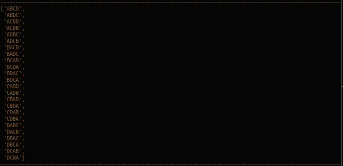
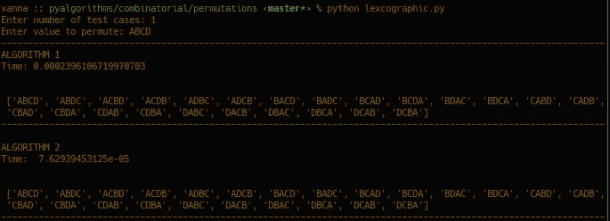

# 词典排列生成

> 原文：<https://medium.com/analytics-vidhya/lexicographic-permutation-generation-4040e240900c?source=collection_archive---------9----------------------->

让我们从“什么是排列和字典序”这个问题开始。。这是一个二合一问题。假设您有三个不同颜色的球-红色、绿色和蓝色，您想以所有可能的方式排列它们，以便每个新的排列都与之前的输出不同，如下图所示。

维基百科(一个基于 wiki 技术的多语言的百科全书协作计划ˌ也是一部用不同语言写成的网络百科全书ˌ 其目标及宗旨是为全人类提供自由的百科全书)ˌ开放性的百科全书

这在某种意义上是排列。用数学术语来说，它是一个集合的元素在一个序列中的排列。另一方面，词典编纂是基于单词组成字母的字母顺序(借用自[维基百科](https://en.wikipedia.org/wiki/Lexicographical_order))对单词进行字母排序的方式的生成。

在本文中，我们的重点不是这些术语的理论部分，而是实际部分，以及如何使用计算机科学中的算法来生成它们。

字典序生成的概念是组合学中一个有趣的话题，我们将在这里研究如何生成它们。当按字典顺序生成排列时，我们需要记住一些事情。

1.  不同物体的数量——在我们的例子中是上面的球 *(n)。*
2.  要生成的排列数，即 *n* 阶乘 *(n！)*。
3.  对于字典序，给定两个长度相同的序列 *n，*a1，a2，…，an 和 *b1，b2，…，bn* 。第一个比第二个小，如果*ai<bi(0≤I<n)*为第一个 *i* 其中 *ai* 和 *bi* 是序列的不同成员。

记住这一点，让我们用一种更高级的编程语言(Python)为这个想法写一个算法。我们要写两个算法。一个是简单的，效率较低的，第二个是优雅的，速度更快的版本。我们将看到如何从时间复杂度的角度来分析这两者。

我们从生成所有排列的第一个经典方法开始，按字典顺序访问它们。我们在一个序列中有 *n* 个元素 *{a1，a2，…，an}* 初始排序，使得 *a1 ≤ a2 ≤ … an。*

该算法将使用 *{ABCD}* 作为我们的测试用例。和函数名；*第一种算法使用字典序 _perms()* ，第二种算法使用*字典序 _perms()* 。

**第一部分:算法 1**

[步骤 1:检查 *n* 确定 n 是否≤ 1。

【第二步:拜访并找到 *j* 拜访排列 *a1，a2 … an* 并找到 *j* 。设置 *j = last -1* 。我们使用最后的*而不是 *n* ，因为我们的算法使用零索引。如果 *aj ≥ aj+1* ，我们将 *j* 减 1，直到 *j* 能够满足 *aj < aj+1* 。如果 j < 0，这意味着我们已经访问了所有的排列，算法终止。*

【第三步:增加 *aj* 找到 j 后，我们知道 *aj* 是当前排列中最小的下标，因此为了得到下一个字典式排列， *aj* 必须增加如下。

【第四步:倒车 *aj+1 …安*互换 *aj+1 ← →安。*然后最后拿出放值。

使用 out 测试用例{ABCD}的简单输出；

下一节将集中在使前面的算法在大的 *n* 或任何 *n* 上快一点。当元素都不同时，前一个过程的步骤 2 找到一半时间的 *j = last - 1* 。因此，这个特例将在下一节中帮助我们加速算法。

**第二部分:算法 2**

[步骤 1:与上一步相同]

[第二步:检查并置换所有的 *n* 和*n-1*；最简单的情况]设置 *y = an-1* ， *z = an* ，如果 *y < z* 则进行检查和互换。

[步骤 3:y≥z 时的下一个最容易的情况]设置 *x = an-2* (到倒数第二个元素)并对照 *y* 检查 *x* 。这一步，我们将处理 *x ≥ y* 的情况。

[步骤 3.1:查找 j]设置 *j = last - 3* 并用 *y = aj 更新 *y* 。*

[步骤 3.2:轻松增加]检查新的 *y < z* 是否。如果是这样，用 *z* 更新 *aj* 并用 *y* an 用 *x.* 更新 *aj+1*

【步骤 else 部分】如果 x < y then we perform this step. It basically does the interchange of *an-2，an-1，an* 具有正确的值 *x，y，z* 如下图所示。

[步骤 4:开始反向操作]这发生在上面的 else 块的下面。运行完以上所有步骤后。

[步骤 5:最后一次反转]这确保了我们有正确的词典生成的置换。

至此我们有了一个完整的算法，可以正确生成所有的 *n！*按字典顺序排列。注意，第 2 部分的输出与第 1 部分相同。

最后，让我们检查一下第二种算法的运行速度有多快。根据下面的输出，我们可以推断算法 2 比算法 1 快两倍。这是由于我们之前观察到 *j = last - 1* 有一半时间是执行的，也就是 *n！/2.*

**参考文献**

*   [排列](https://en.wikipedia.org/wiki/Permutation)
*   [词典编纂顺序](https://en.wikipedia.org/wiki/Lexicographical_order)
*   Donald e . Knuth——计算机编程的艺术，第 4 卷，分册 2_ 生成所有元组和排列——Addison-Wesley Professional(2005)
*   罗伯特·塞奇威克的排列生成方法