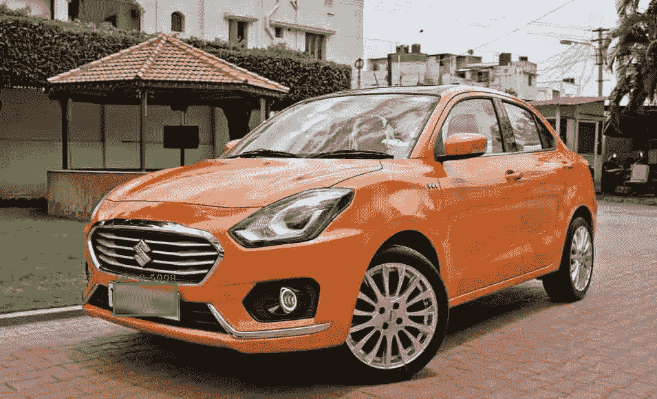
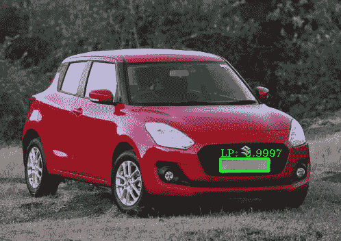
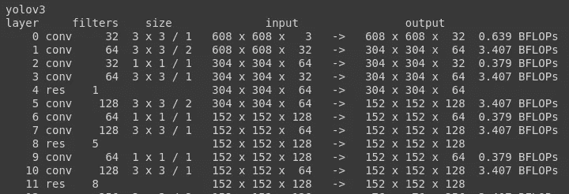
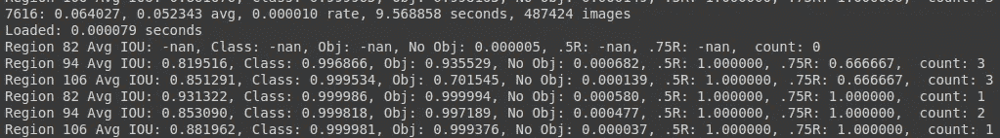

# 基于 YOLOv3 和车牌模糊的印度汽车牌照检测

> 原文：<https://medium.com/analytics-vidhya/license-plate-detection-on-indian-cars-using-yolov3-and-blurring-of-license-plates-9f2a24d48f04?source=collection_archive---------3----------------------->



具有车牌检测和模糊的汽车图像

## 介绍

自动车牌识别系统被执法机构、交通管理、控制机构、各种政府和非政府机构广泛使用。ANPR 还广泛应用于商业领域，如电子收费、个人安全、访客管理系统、停车管理等。

本文将介绍检测和隐藏印度汽车牌照的用例。这个用例用于在线汽车转售公司，用户发布汽车图片进行销售。

Google Colab 在本文中用于模型训练。你可以从这个[链接](https://colab.research.google.com/notebooks/intro.ipynb)了解更多关于 Google Colab 的信息。

# 步骤 1:准备数据集

a.把有车牌的印度车拍下来。创建两个文件夹“测试”和“训练”,分别传输测试文件夹中 20%的图像和训练文件夹中 80%的图像。

或者，您可以使用我用于训练的测试和训练数据。请参考 [Github 库](https://github.com/CodinjaoftheWorld/ANPR_INDIANCARS_YOLOV3)访问带有注释文件的测试和训练文件夹。

b.使用 LabelImg 对各个测试和训练文件夹中的所有图像中的牌照进行注释，并生成带注释的。各个文件夹中图像的 xml 文件。你可以从[这里](https://github.com/tzutalin/labelImg)获得更多关于标签的细节。

这里值得一提的是，LabelImg 可以帮助你生成 2 种格式的注释。第一种是帕斯卡沃克格式，另一种是 YOLO 格式。

在 LabelImg 的左窗格中提供了选择格式的选项。一旦你点击了一种 PascalVOC 格式，它就会切换到另一种格式。

YOLO 要求一个具体的。带有带标签的边界框细节的 txt 文件。所以你可以生成 YOLO 兼容的。txt 文件，也可以生成 pascalVOC 兼容的。xml 文件，并在以后将它们转换成 YOLO 兼容格式。(转换过程在步骤 3 中提到)

# 步骤 2:安装基础暗网系统

安装 Google Drive

```
from google.colab import drive
drive.mount('/content/gdrive')%cd /content/gdrive/MyDrive
```

下载 YOLOv3 项目

```
! git clone [https://github.com/AlexeyAB/darknet](https://github.com/AlexeyAB/darknet)
```

打开 darknet/Makefile，在 GPU、CUDNN、OPENCV 前面放 1 而不是 0。如果你想在 google colab 上使用 GPU，这些改变是必需的。

```
GPU=1CUDNN=1CUDNN_HALF=0OPENCV=1
```

用下面的命令安装基础 darknet 框架。

```
%cd darknet 
! make
```

# 步骤 3:在 Google Colab 中上传图片并生成 YOLO 兼容的注释文件

从 [Github 库](https://github.com/CodinjaoftheWorld/ANPR_INDIANCARS_YOLOV3)中解压缩 test.zip 和 train.zip 文件，并将它们上传到 darknet 目录中，或者手动将您的注释图像与 convert.py 文件一起上传到 darknet 目录中的 test 和 train 文件夹中。

将边框坐标从。xml 文件添加到。txt 文件(YOLO 兼容格式)。

```
! python convert.py
```

这一步将从每一个中选择坐标。xml 文件并把它们转换成 YOLO 兼容的。txt 文件放在相同的测试和训练目录中。此外，train.txt 和 test.txt 文件是在包含图像位置的 darknet 文件夹中创建的。

# 步骤 4:准备自定义“我的数据”文件夹

运行以下命令创建一个名为“my_data”的自定义文件夹

```
! mkdir my_data
```

将 train.txt 和 test.txt 文件从 darknet 目录移动到 my_data 目录。

```
! mv train.txt my_data/ 
! mv test.txt my_data/
```

在 my_data 目录下创建 class . names 文件，类名为“LP”。

```
! touch /content/gdrive/MyDrive/darknet/my_data/classes.names! echo LP > /content/gdrive/MyDrive/darknet/my_data/classes.names
```

在 my_data 目录中创建权重目录。

```
! mkdir my_data/weights
```

在 my_data 目录中创建文件 darknet.data，以提供配置详细信息。

```
! touch /content/gdrive/MyDrive/darknet/my_data/darknet.data
```

将以下详细信息粘贴到 darknet.data 文件中。

*   类别= 1
*   train = my_data/train.txt
*   有效= my_data/test.txt
*   names =我的数据/类
*   备份=我的数据/重量/

将 cfg 文件从 darknet/cfg/yolov3.cfg 复制粘贴到 darknet/my_data 目录。

```
! cp /content/gdrive/MyDrive/darknet/cfg/yolov3.cfg /content/gdrive/MyDrive/darknet/my_data
```

对 my_data 目录中的 yolov3.cfg 进行以下更改。

*   第 603、693 和 780 行将过滤器改为 18。(过滤器=(类别+ 5) * 3)。在我们的例子中，我们只检测 1 个类别，因此过滤器的数量将等于 18。
*   第 783 行，将类的数量更改为 1。

# 步骤 5:下载用于训练定制数据的初始 yolo 权重

从 darknet 目录运行以下命令。

```
! wget https://pjreddie.com/media/files/darknet53.conv.74
```

# 步骤 6:设置将权重文件保存在权重目录中的标准

从 darknet/examples 目录中打开 detector.c 文件，并如下所示更改行号 138。

```
if(i%1000==0 || (i < 1000 && i%200 == 0))
```

这一改变将每 200 次迭代的权重保存在 my_data/weights 目录中，直到 1000 次迭代，然后每 1000 次迭代。

# 第七步:现在开始训练

从 darknet 目录运行以下命令。

```
! ./darknet detector train /content/gdrive/MyDrive/darknet/my_data/darknet.data /content/gdrive/MyDrive/darknet/my_data/yolov3.cfg /content/gdrive/MyDrive/darknet/darknet53.conv.74
```

注意:万一你得到“/bin/bash:。/darknet:权限被拒绝”错误，然后运行下面的命令，然后运行上面的命令。

```
! chmod +x darknet
```

注意:由于 google colab 的限制，您可能无法一次性训练出模型。检查 my_data/weights 文件夹中存储的最新权重，然后使用更新后的权重再次训练模型。例如，如果您的 weights 文件夹中有 yolov3_8000.weights，则运行下面的命令，用新的权重再次训练模型。

```
! ./darknet detector train my_data/darknet.data my_data/yolov3.cfg /content/gdrive/MyDrive/darknet/my_data/weights/yolov3_8000.weights
```

如果你看到下面的输出，这意味着你的模型正在训练。



yolov3 训练开始

模型的输出如下所示。



yolov3 培训输出

对第一行输出的快速解释:

*   7616 表示当前的训练迭代
*   0.064027 表示总损失。它应该低于 0.03 才能获得好的结果。
*   0.052343 表示平均损失误差。应该是越低越好。
*   0.000010 是当前学习率，如中所定义。cfg 文件。
*   9.568856 秒表示处理该批次花费的总时间
*   487424 表示训练期间使用的图像总量。

# 第八步:检测并模糊图像中的车牌

在运行下面的代码之前，更改第 12 行的 weightsPath 和第 15 行的图像文件名。

你应该看到一辆车的图像，上面有检测和模糊的车牌。

注意:OpenCV 的 imshow()函数在 google colab 笔记本上不起作用。所以我必须使用 matplotlib 在图像上显示预测。您可以从 Github 存储库中下载 predicton.py 文件，并在本地测试映像上运行它。不要忘记从 google colab 下载最新的权重文件，并在 weightspath 变量中提到位置。

```
%matplotlib inline
import numpy as np 
import imutils 
import cv2 
import matplotlib.pyplot as plt 
import warnings 
warnings.filterwarnings('ignore')CONF_THRESH, NMS_THRESH = 0.5, 0.5weightsPath = 'my_data/weights/yolov3_8000.weights'
configPath = 'my_data/yolov3.cfg'
namesPath = 'my_data/classes.names'
image = 'images8.jpg'# Load the network using openCV
net = cv2.dnn.readNetFromDarknet(configPath, weightsPath)
net.setPreferableBackend(cv2.dnn.DNN_BACKEND_OPENCV)
net.setPreferableTarget(cv2.dnn.DNN_TARGET_CPU)# Get the output layer from YOLOv3
layers = net.getLayerNames()
output_layers = [layers[i[0] - 1] for i in net.getUnconnectedOutLayers()]# Read and convert the image to blob and perform forward pass
img = cv2.imread(image)
gray_img = cv2.cvtColor(img, cv2.COLOR_BGR2GRAY)
height, width = img.shape[:2]blob = cv2.dnn.blobFromImage(img, 0.00392, (416, 416), swapRB=True, crop=False)
net.setInput(blob)
layer_outputs = net.forward(output_layers)class_ids, confidences, b_boxes = [], [], []for output in layer_outputs:
    for detection in output:
        scores = detection[5:]
        class_id = np.argmax(scores)
        confidence = scores[class_id]if confidence > CONF_THRESH:
        center_x, center_y, w, h = (detection[0:4] * np.array([width, height, width, height])).astype('int')
        x = int(center_x - w / 2) 
        y = int(center_y - h / 2) b_boxes.append([x, y, int(w), int(h)])
        confidences.append(float(confidence))
        class_ids.append(int(class_id)) # Perform non maximum suppression for the bounding boxes to filter overlapping and low confident bounding boxes
indices = cv2.dnn.NMSBoxes(b_boxes, confidences, CONF_THRESH, NMS_THRESH).flatten().tolist()if len(indices) > 0:
    # Draw the filtered bounding boxes with their class to the image
    with open(namesPath, "r") as f:
        classes = [line.strip() for line in f.readlines()] colors = np.random.uniform(0, 255, size=(len(classes), 3)) for index in indices:
        (x,y) = (b_boxes[index][0], b_boxes[index][1])
        (w,h) = (b_boxes[index][2], b_boxes[index][3])# Blur the ROI of the detected licence plate
        img[y:y+h, x:x+w] = cv2.GaussianBlur(img[y:y+h, x:x+w] ,    (35,35),0)
        cv2.rectangle(img, (x, y), (x + w, y + h), (0, 255, 0), 2)          
        text = "{}: {:.4f}".format("LP", confidences[index])
        cv2.putText(img, text, (x, y - 3),     cv2.FONT_HERSHEY_COMPLEX_SMALL, .75 , (0, 255, 0), 1)plt.figure(figsize=(10, 5)) 
plt.imshow(img) 
plt.show()
```

[GitHub 库](https://github.com/CodinjaoftheWorld/ANPR_INDIANCARS_YOLOV3)的链接