# 基于深度学习的车牌目标检测和识别

> 原文：<https://medium.com/analytics-vidhya/license-plate-object-detection-yolov3-and-recognition-pytesseract-d7628de1d110?source=collection_archive---------6----------------------->

## 为人类 2019 年使用 Yolov3 和 pytesseract

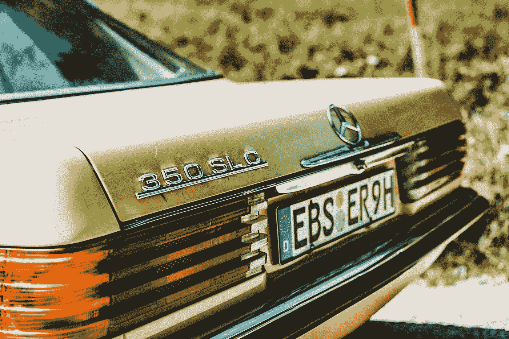

汤姆·格伦鲍尔在 [Unsplash](https://unsplash.com?utm_source=medium&utm_medium=referral) 上的照片

在尖端世界的不同部分下，信息发展的巨大融合，已经刺激了车辆作为信息系统中计算资源的处理。由于决策信息结构在没有任何数据的情况下没有任何意义，因此需要改变当前世界中的车辆信息。

有两种方法来理解这些信息，要么在人类管理员的帮助下，要么在最新技术的帮助下，帮助我们通过车牌识别车辆的证据。监控在几乎每个行业都起着至关重要的作用，无论是建筑工地、安全驾驶、头盔检测，还是帮助我们识别未注册车牌的车牌检测。

深度学习在通过计算机视觉进行检测和识别的领域有着广阔的前景。深度学习的使用包括使用用于图像分类的卷积神经网络、深度神经网络、递归神经网络等。为了检测目标，可能的方法是 R-CNN 或更快的 R-CNN 和其他预训练模型。

# **工作范围**

车牌检测项目可以帮助我们识别违反交通规则的人，特别是在信号灯处，在学校附近超过一定的最低速度等。在两轮车的情况下，牌照检测可以与头盔检测相结合，用于在驾驶时可能不戴头盔的驾驶员。然而，与印度车牌检测问题相关的基本问题是缺乏从低分辨率相机拍摄的高质量图像。

另一个问题是，与外国不同，缺乏明确或具体的车牌尺寸。在开发车牌检测的解决方案时，我想到的一个方面是车牌的一部分，通常是字符和数字上方的部分，指定了一些文字信息。例如，在高级政府官员的情况下，它规定了人员的职务(见下图)。我们不想考虑这一部分，并删除不需要的文字部分，只检索牌照上的数字和字符。

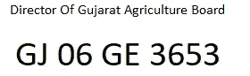

注意:所使用的图像仅用于解释目的，并不打算使用任何私人车牌号码或名称

印度人还可以在车牌上指定任意形状的数字，而不仅仅是机器生成的数字。例如，下图将数字“214”指定为一个字符序列，表示北印度语中 Ram 勋爵的姓名。

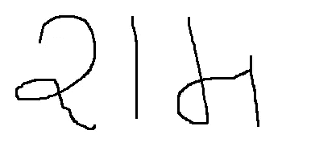

注意:所使用的图像仅用于解释目的，并不打算使用任何私人车牌号码或名称

# **解决方法**

**使用的算法/库:**

1.  Json 文件预处理:数据集存在于 json 文件中，指定内容、标签、图像宽度、图像高度以及右下角和左上角边界框的 x 和 y 坐标。我们必须将所有字段分开，并以 csv 格式存储它们。为此，我使用了 python 中的 pandas 库。
2.  对于数据扩充:Darknet 使我们能够通过改变 yolo-tiny-obj.cfg 中图像的饱和度、色调和亮度来执行数据扩充，yolo-tiny-obj . CFG 包含了我们模型的架构。欲了解更多信息，请参考[2]
3.  对于目标检测:目标检测的主要部分是决定使用哪个模型。有大量的型号可供我们选择，每种型号都有所不同。宽泛的分类或广泛使用的可以分为 YOLO(你只看一次)，RetinaNet 和 SSD5 模型。

从下图来看，最好的机型是 YOLOv3 和 RetinaNet。YOLOv3 的平均精度(map)时间与 RetinaNet 相当。尽管如此，推理时间比 RetinaNet 短。因此，我使用 YOLOv3-tiny 模型进行物体检测。

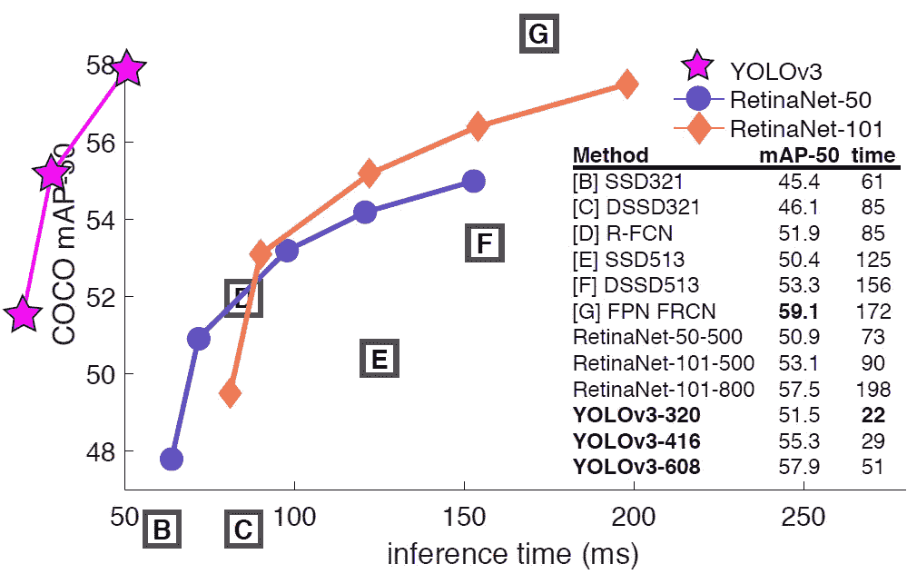

各种模型在推理时间方面的比较[4]

4.对于光学字符识别:在获得牌照上所需的边界框后，我们必须生成包含字符和数字的字符串。以下任务是使用库 pytesseract 库完成的。有关文档，请参考[4]。

# 实施细节

**预处理步骤**

json 文件中的数据被转换成. csv 格式，包含内容、标签、边界框的给定坐标、图像高度、图像宽度、注释和附加内容等列。需要注意的是，坐标是归一化形式的。首先将所有细节转换成内容、注释、附加内容、左上角坐标等，并存储在 csv 文件中。为此，运行***separate . py***文件。

获得 csv 文件中的所有细节后，我们将从 web 链接中抓取图像。图像以增量方式保存为图像(I)。jpg，其中 I 是 I 的值，从 0 到 data-1 的大小，还添加了另一列，即 csv 文件中每个图像的名称。运行***image _ save . py***

左上和右下坐标以标准化形式存储在 csv 文件中。我们通过将图像的 x 坐标乘以宽度，y 坐标乘以高度，将它们转换成非标准化形式。这四列被添加到指定非标准化坐标值的数据集中。这一步的完成是因为 YOLO 有一种特殊的格式来获取围绕感兴趣区域的边界框的输入坐标，这将在下一段中讨论。运行***binding _ box . py***。要在图像上随机查看有界框，运行***draw _ bounding _ box . py***

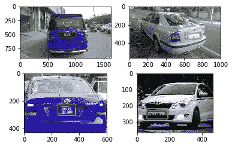

横跨车牌的边界框

在 YOLO，我们必须为每个图像创建一个. txt 文件，并且应该与图像同名。对于每个图像，txt 文件将包含五个值——类标签，在我们的例子中是 0，绝对中心坐标，x_center 和 y_center，以及边界框相对于整个图像形状的绝对宽度和高度

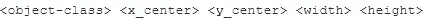

注释的方向。YOLO 的 txt 文件

例如，具有图像宽度 806 和高度 466 的坐标(582，274)和(700，321)的边界框被转换为:

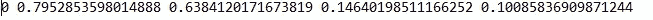

# 设置暗网 YOLOv3:

从[2]中克隆 darknet YOLOv3 架构。在命令提示符下执行以下命令来设置 darknet。

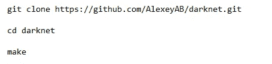

从[2]克隆 Darknet

将图像及其相应的 txt 文件复制到 data 下名为 obj 的文件夹中。创建指定类名的 obj.names 文件。在数据文件夹下，还创建一个 obj.data 文件，指定以下内容:

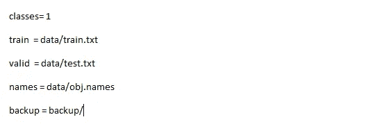

在 obj.data 文件中指定详细信息

因为我们只处理一个类，我们必须通过在输出 YOLOv3 层设置过滤器和 classes 参数来改变指定 YOLO 架构的配置文件。在我们的例子中，设置 classes=1，filters =(classes+5) *3 = 18 [2]。

# 培训和测试

按照图 Run***split _ train _ test . py***所示的格式将图像分成训练集和测试集

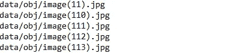

存储在数据文件夹中的 train.txt 文件快照

运行以下命令来训练模型

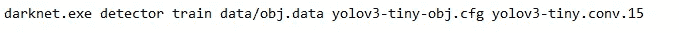

训练对象检测模型

对于 Linux 或 Mac，将 darknet.exe 替换为。/darknet

要测试图像并获取感兴趣区域的坐标，请运行 predict.py，命令行参数为 image_name，architecture。cfg 文件、训练重量文件和类别文件(对象名称)

**注意:给出重量和其他文件的完整路径**。

***predict . py—image path _ to _ img—config yolo v3-tiny-obj . CFG—weights yolo v3-tiny . conv . 15—classes data/obj . names***

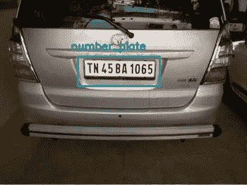

车牌预测。

**获取字符(OCR):**

一旦我们知道了包围盒的坐标值，就可以使用 PIL 库裁剪原始图像，使其只包含车牌，而不是整张图像。

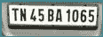

捕获感兴趣区域的裁剪图像

然后使用 tesseract 从图像生成文本。

***python ocr . py trying.jpg***

trying.jpg 是裁剪图像的名称。

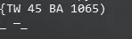

宇宙魔方库的输出

你可以在我的 github 库下载预训练的权重和必要的文件

【https://github.com/anuj200199/licenseplatedetection 

# **参考文献**

[1]Yann le Cun、Patrick Haffner、Leon Bottou、Yoshua Bengio 使用基于梯度的学习进行目标检测。

[2]用于 Windows 的 Yolo-v3 和 Yolo-v2，由 AlexeyAB 开发。

[3]YOLOv3 —你只看一次(对象检测改进了 YOLOv2，性能与 RetinaNet 相当，速度快 3.8 倍！作者 Sik-Ho Tsang。

[4]Mathias A . Lee 的 Python 宇宙魔方。