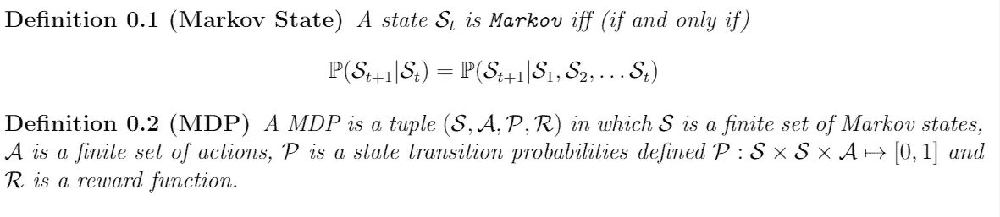
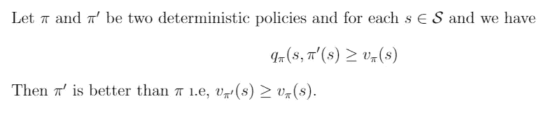
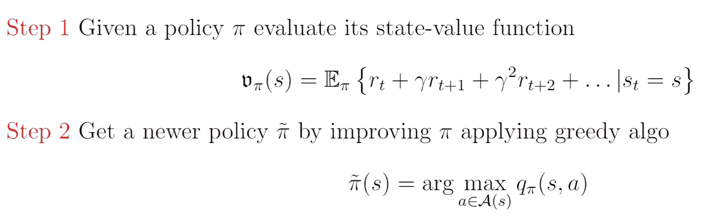

# 生活是强化学习

> 原文：<https://medium.com/analytics-vidhya/life-is-reinforcement-learning-7dece10190c5?source=collection_archive---------11----------------------->

罗伯特·科埃略在 [Unsplash](https://unsplash.com?utm_source=medium&utm_medium=referral) 上的照片

> 从与环境的互动中学习的本质是获得所有直觉和智慧的基石。人类的思想和行为可以被解释为从其环境中习得的反应，由此发展了当前的学习和强化概念，这为更深入地理解现实世界的问题提供了有用的基础，并更成功地设计了实用的解决方案。

***关键词:*** *强化学习，马尔可夫决策过程，Q-学习，策略梯度算法，演员-评论家算法。*

## 什么是强化学习？

在我们的一生中，这种互动是知识的主要来源，是关于我们为了实现不同目标而采取的行动的结果的丰富信息。

有许多这样的情况，我们的行为直接受到激励或惩罚的影响。例如，我们在考试中因为成绩好而学习，跑马拉松而获得认可。我们所有的行为都受到一种动机的影响，那就是通过努力获得回报。受此启发，我们不断探索，试图发现哪种行为可能会带来更好的回报。这个过程在继续，没有任何明确的主管，我们从基于我们以前的行动获得的反馈中获得经验，我们随着时间的推移改进我们的政策，变得越来越强大，因此，我们离我们的目标越来越近。

这就是我们机器学习术语中所说的***【RL】****又名* 半监督学习模型。

## 家庭的

正如现代 RL 的创始人之一 Richard Sutton 所描述的，关键实体是**主体、环境、政策、奖励信号、价值函数**和**环境模型。**

**代理:**在 RL 中起核心作用。从通过传感器感知环境开始，经历、决策任务，最后通过执行器对环境做出反应，这是智能体应该做的事情。所以任何拥有这些品质的人都是特工。例如，我们人类是一个代理人，因为我们有传感器眼睛，耳朵等，在与我们经历的宇宙中的不同环境进行交互时，做出决定，建立我们的策略，并最终通过手，腿等执行器来行动。

**环境:**这个词本身是自成体系的。重要的是代理人和环境之间的区别，即他们的边界线。一个有趣的事实是这里的边界不像一个代理人身体的物理边界；相反，它比那要近得多。例如，机器人的任何机械连接，像它的传感硬件、马达都是环境的一部分。任何不能被代理任意改变的东西都被认为是环境的一部分。对于动物肌肉来说，骨骼被认为是环境的一部分。
因此，边界线代表了一个主体绝对控制的极限，而不是它对环境的了解。 ***有趣的是在某些情况下，环境是完全可知的*** 。这是 RL 的一个重要话题，也是今天讨论的一部分。
状态空间是环境的一部分，通常用 *S* 表示。

**□** 在足球比赛中，环境是部分可观察的，因为球员不知道其他球员的策略、位置和球的速度。类似地，纸牌游戏、骰子、战舰也属于这一类，因为对手的状态对玩家(代理人)是部分隐藏的。
尽管如此，带时钟的象棋游戏、纵横字谜都是完全可观察环境的完美例子。

> **马尔可夫决策过程(MDP) :**
> —给定现在，未来独立于过去。

当环境完全已知时，我们称这种表象为 MDP。正式定义，

***带回家的信息*:** 历史代表了我们不看数据流就能知道的关于过去的最多信息。瓶颈是历史也随着时间增长 *t* 变得庞大而笨拙。

**状态被视为历史的函数。**

**如果状态是马尔可夫的，那么我们可以安全地清除缓存，并且只关心当前状态 *Sₜ* 以便处理未来的 *Sₚ* 其中 *p=t+1。***

**T**智能体和环境在一系列离散时间步骤的每一步相互作用， *t =0，1，2，3，…。*在每个时间步 *t* 代理接收环境状态的一些表示 *Sₜ ∈ S，*基于此选择动作 *Aₜ ∈ A，*作为结果接收奖励，时间递增 *t+1，*环境转换到新状态 *Sₚ (p=t+1)* 并且过程继续*。*

**策略:**基本上它是一个代理为完成任务而遵循的策略。可能是好的，也可能是坏的，但这是学习代理在给定时间的行为方式。选择哪种行动的决定是由政策决定的。策略可以是确定性的，也可以是随机的。
设， *A* 为动作空间，则确定性策略 *π* 是从状态空间 *S* 到选择每个可能动作的概率空间 *P(A)* 的映射，而随机策略 *π(a|s)* 是在给定状态 *s ∈ S* 的情况下选择任意动作 *a ∈ A* 的概率，即 *除非另有说明 *S，*A 都是有限集。*

**奖励:**它是 ***动机*** 也是训练一个算法的有力工具。它既可以是积极的，也可以是消极的，因此是代理人决定什么是好政策和坏政策的主要依据。如果遵循的政策导致低回报，那么它有可能被改变，但是，有一个权衡。
***“有时候为了成就一番伟业，你不得不失去一些小事”。***
一个代理人的最终目标是累积报酬最大化。
它是一个实数，有两种定义。可以定义为状态-动作对 *r : S × A ↦ ℝ* 或者状态-动作-下一个状态三元组 *r : S × A × S ↦ ℝ* 。前者对在给定状态下执行某个动作给予奖励，而后者则针对状态间的特定转换给予奖励。

**价值功能:**在 RL **中也起核心作用的另一个实体。**这种成分决定了什么 ***小事情要失去才能成就大事情。*** 换句话说，它指定了从长远来看什么更有利可图。坦率地说，我们不太关心回报，但这个功能在决策中至关重要。 ***这是 RL*** 的心脏。行动的选择是基于回报最高的状态，而不是最高的回报。一旦我们学会了有效地估计这个函数，我们的战斗就成功了一半。所以长话短说学习 RL 差不多就是学习价值函数了。
价值函数是为特定策略定义的。定义了两个值函数:状态值函数

和动作值函数

这里*γ∈【0，1】*是*折扣因子(* ***诱惑度！*T7*)*。后者在文学上有一个‘特殊’的名字即，*Q*-值。就是强调*质量*。对于折扣因子和价值函数的详细讨论，下面给出了一些经典参考文献。
价值函数是根据经验估算的。然而，确定价值要困难得多，但是市场上存在某些强大的方法，可以根据代理人随时间推移所做的一系列观察来估计价值。显然，价值函数逼近是智能的主要目的，也是 RL 算法中最重要的组成部分。计算价值函数的一种有效方式是通过 ***贝尔曼方程*** 。这个等式的重要性在于它为计算每个状态和相应动作的值的迭代方法打开了大门，因为它表达了一个状态的值与其后续状态的值之间的关系。**

对于 *s∈ S，*

**期望状态值和状态-动作值方程**

一旦我们在状态 *s* 中选择了一个动作 *a* ，那么后一个动作也可以被重写为:

有了这些方程，现在也有可能计算最优政策和最优价值函数。一个策略 *π₁* 大于(或优于)π₂当且仅当对应的状态值大于或等于每个状态 *s ∈ S.* 优于任何策略的策略称为最优策略(o.p)。求解一个给定的 MDP 意味着评估 o.p

**政策改进定理**

现在的问题是如何提出一个更好的政策？给定任何政策，如何找到相对更好的政策？这是通过一个反馈过程完成的，并被命名为“ ***贪婪算法*** ”。这项政策通过贪婪的行动逐步得到改进。重复这个过程，你最终会得到一个 o.p

第一步→第二步→第一步→第二步。。。。。递归地继续这个过程，在一段时间后，你将观察不到状态值函数的改进。恭喜你。你已经完成了获得 o.p .的使命。

**这就是所谓的 ***策略迭代*** 方法。**

****概念“arg max”表示动作 *a* ，其后面的表达式被最大化。****

****所有这些概念都可以很容易地扩展到随机政策。****

****然而，这种方法有一个缺点。该算法在每一步都涉及政策评估，这在大多数实际问题中本身就是一个麻烦的任务。可以使用近似法，一些高效的数值方法(如最小二乘法)也可用于编程解决此类问题。****

****它可以在其他时间探讨，但现在我将在这里简要概述一种不同的方法。大概动态编程中最流行的一种机制叫做 ***值迭代*** 方法。****

******□** 之前，我们选择了一个随机策略并评估其价值函数，然后获得先前策略的改进版本，并再次评估其价值函数，以此类推。我们的意图是提取一个 o.p.
但是在这个过程中，我们随机选择一个价值函数，我们的意图是实现最优价值函数。一旦获得，那么由此产生的策略也应该是最优的。这是肉。下面给出了基本的数学框架。****

********

****西尔弗教授指出这是一步到位的前瞻****

****一个自然的问题是何时终止？实际上，一旦价值函数在一次扫描中仅发生少量变化，我们就可以停止。****

> ****我们所讨论的一切，只有在给定一个完美的环境模型，如 MDP 时，才是适用的。但是生活并不总是那么容易。如果我们没有 MDP 的知识，也就是说，支配这一现象的方程不存在，那会怎么样呢？模型的缺乏产生了对 MDP 采样的需要，以便获得关于未知模型的统计知识。这些被称为**无模型 RL** 技术，蒙特卡罗学习、时间差分学习是文献中常用的两种主要算法。在不久的将来，我也会就这个话题写一篇独立的博客。****

******环境的模型:**模型用于规划，例如，它有助于预测未来的状态和可能的回报。基于此，行动的过程可以在没有经历环境的情况下被预先决定。
在基于模型的 RL 中，代理并不拥有环境的先验模型，而是在学习时对其进行估计。在学习过程中，它与环境的交互次数最少，并试图构建一个模型。在归纳出一个合理的环境模型后，代理应用类似动态编程的算法来计算策略。相比之下，在无模型 RL 中，代理通过试错过程学习模型。它直接从经验中学习，执行一个动作，收集奖励(积极的或消极的)，然后更新价值函数。****

****我们来看一个例子，玩家 A 和 B 在下一盘棋。A 走了第一步，然后 B 走了一步，A 又走了一步，过了一段时间后，A 发现他的几步都不够好。他输了比赛，但他从错误中吸取了教训。然而，如果 A 在观察了对手的几个动作后，在他的大脑中模拟了他的动作，并准备了一个模型并相应地进行了比赛，那么情况就会不同了！！****

# ****欢迎任何批评、建议和提示****

****参考文献
1。强化学习:导论——理查德·萨顿和安德鲁·g·巴尔托****

****2.强化学习:Youtube 视频——大卫·西尔弗****