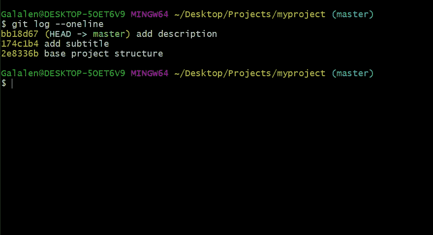
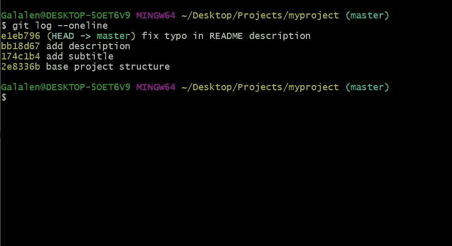
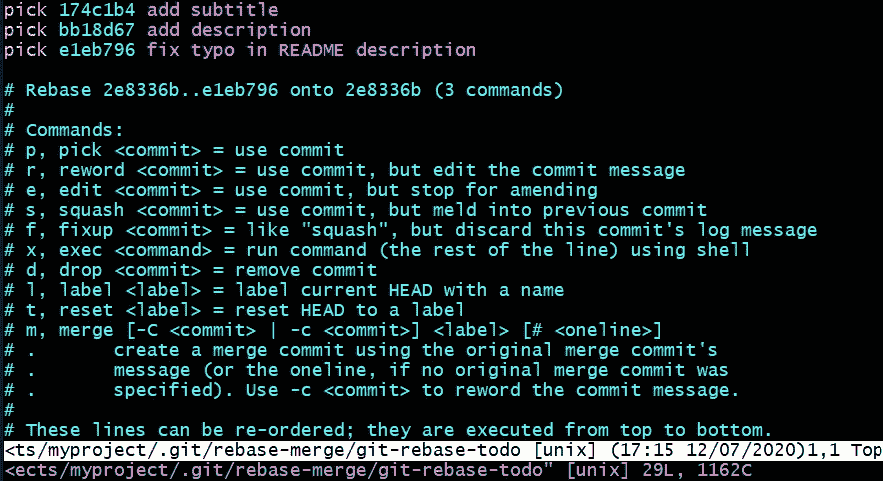
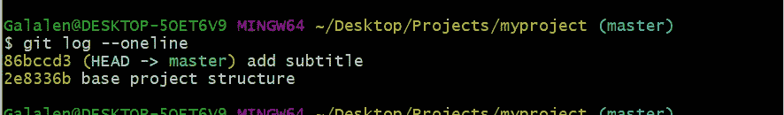
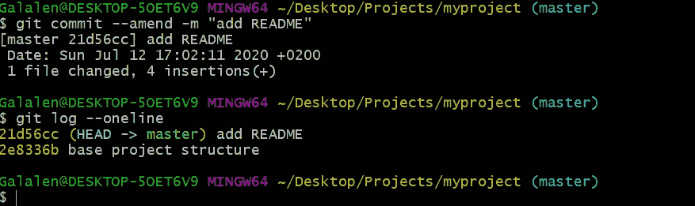
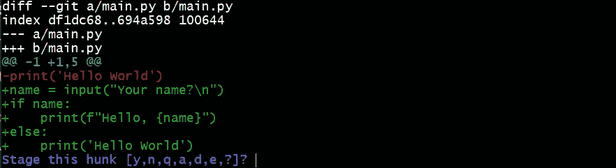

# 我最近知道的救命 Git 命令

> 原文：<https://medium.com/analytics-vidhya/life-saving-git-commands-i-recently-knew-f69e9c973701?source=collection_archive---------23----------------------->


Git 是处理任何项目的基本工具，它支持协作工作，并使您的工作有条不紊。

我想向您展示一些我最近才知道的命令，它们让我受益匪浅。

## 将提交压缩为一个提交

谁有时不会写一长串提交呢？想象一下，你正在写文档，在提交了你的修改后，你意识到你拼错了一个单词，然后你将不得不再次提交这个修改，老实说，我以前在拼写单词时犯过两次没有意义的错误。你会发现自己有很多的承诺，一些商品和其他像我的 2 个无意义的承诺。你想组织你的公关有一个简洁的承诺和一个好消息。

这里是 ***git rebase -i 头~n*** 前来救援。它将前 n 个提交压缩为一个。

这里我们创建了一个简单的项目并添加了自述文件



而且，继续向自述文件添加提交



然后，我们使用神奇的命令挤压前三个提交

```
git rebase -i HEAD~3
```



该窗口将弹出，显示提交将受到其他选项的影响。如果我们想在 rebase 或 squashing 操作中包含提交，我们共享更改**在提交到 **squash** 或 **s** 的前面选择**字。然后保存文件，我在这里使用 vim，所以我将按下 **ESC** ，然后按下 **:wq** 。

*   *您应该将第一次提交保留为* ***选择*** *选项，因为提交将被挤入其中。*

哒哒，犯罪被粉碎了



之后，将提交消息重命名为适当的名称



## 将更改存储在补丁中

让我们假设您正在处理任务 X，并且您编写了许多行来实现该任务，到目前为止，您希望在提交更改之前回顾一下您已经做了什么以及哪些更改。

```
git add -p
```

根据 git 帮助文档:*交互地选择索引和工作树之间的补丁块，并将它们添加到索引中。这使用户有机会在将修改的内容添加到索引之前检查差异。*

这里我对 main.py 文件做了一些修改，我可以用[y，n，q，a，d，e，？]选项

```
y - stage this hunkn - do not stage this hunkq - quit; do not stage this hunk or any of the remaining onesa - stage this hunk and all later hunks in the filed - do not stage this hunk or any of the later hunks in the filee - manually edit the current hunk? - print help
```



要编写一个可靠的提交消息，在提交之前检查您的更改是非常有帮助的。

Git 仍然有许多命令需要深入研究才能发现和理解它们。你只需要在那种情况下，让你搜索它们。