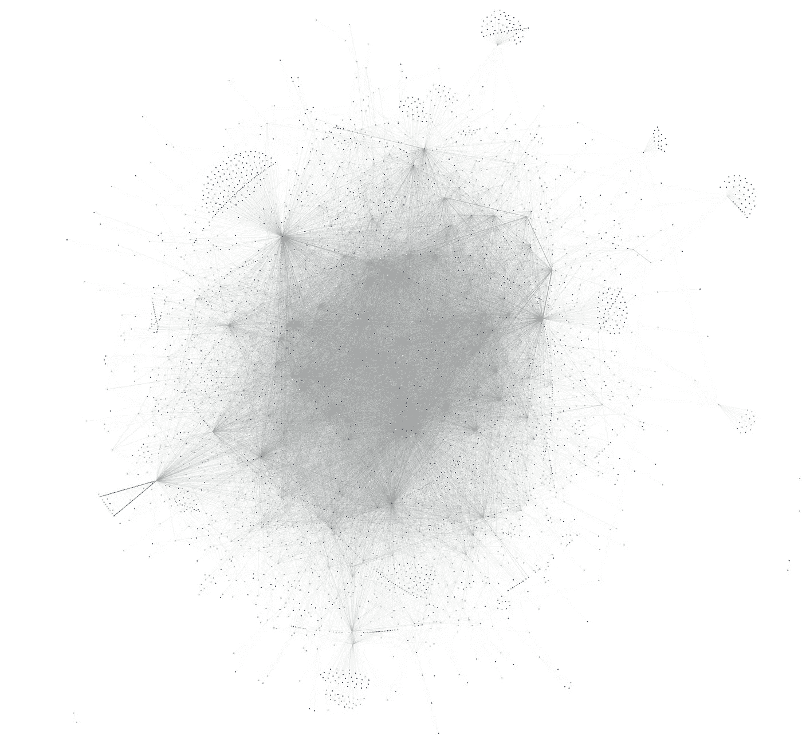
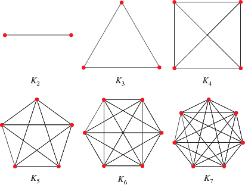
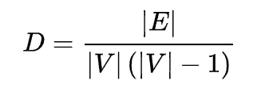
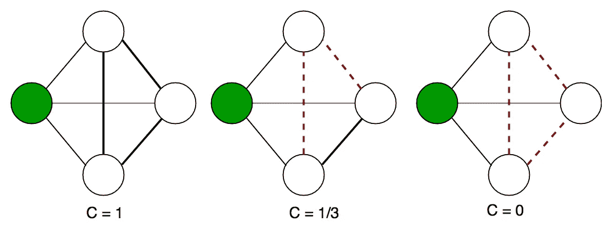
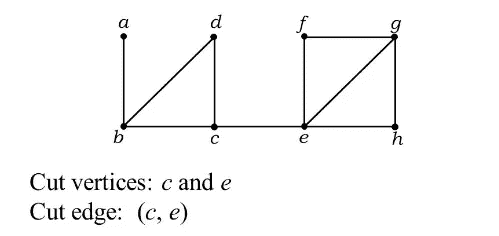

# 闪电网络:一些图论度量——第 1 部分

> 原文：<https://medium.com/analytics-vidhya/lightning-network-some-graph-theory-metrics-part-1-7fb3ca83b291?source=collection_archive---------13----------------------->

# 介绍

闪电网络仍被宣传为一项实验性技术，其作为比特币第二层解决方案的可行性还有待证明。然而，即使在试验阶段，自 2018 年 1 月 mainnet 发布以来，该网络在节点/通道数量和存储的总容量方面都有了快速增长。最近，加密货币交易所 Bitfinex 甚至宣布已经在他们的交易所启动闪电存款和取款。

本文是旨在使用图论概念分析闪电网络的系列文章的第一篇。在本文中，我们将研究一组图表指标，这些指标可用于监控网络的增长及其连接的健康状况(例如:弹性)。第二篇文章介绍了运行 Lightning 节点时计算这些指标的代码，请点击这里查看。

*注:如果你想了解网络的现状，我们将在下面查看的所有指标都可以在 bitcoinvisions*[*网站*](https://bitcoinvisuals.com/lightning) *上找到。*

# 为什么需要度量标准？

观察网络发展的一种流行方式是通过可视化工具，如 ACINQ Lightning explorer、1ML 的可视化表示或下图所示的 LND Explorer⁴。

撰写本文时闪电网络的视觉呈现(来源:[https://graph.lndexplorer.com](https://graph.lndexplorer.com)

然而，随着网络变得越来越大，通过可视化来理解网络的拓扑已经并将继续变得越来越困难。事实上，我们对这种观想的解释可能天生就有缺陷。它依赖于我们的眼睛来理解它们所看到的东西，我们的眼睛很容易被网络视觉表示中节点的位置所欺骗，StopAndDecrypt 在下面的文章中对此进行了详细的讨论:

 [## 在我看来，这些闪电网络节点看起来的确很集中！怎么回事？

### (只是你的眼睛在捉弄你)

hackernoon.com](https://hackernoon.com/them-lightning-network-nodes-sure-do-look-centralized-to-me-what-gives-ee39c9b12ac0) 

幸运的是，由于运行闪电节点并与其他同行通信的任何人都可以公开获得信息，因此还有其他方法来分析闪电网络的结构。运行你自己的 Lightning 节点可以让你访问网络图描述，即:如果 **公开可见**，组成网络**的节点和通道的信息。**

这些信息可以总结为一组关键指标(如果你学习过图论，你可能会很熟悉)，例如图的*直径*和*半径*，图的*传递性*、*密度*(或完整性)以及图中的*切割边*和*节点*的数量。这些是可以用来理解网络的一般结构和弹性或者描述其中特定节点或信道的重要性的一些属性。让我们在下一节中定义以上所有内容以及更多内容。

# 这些指标是什么？

闪电网络的目标是充当比特币的可扩展支付层。因此，它为用户提供了向其他用户/服务发送资金的机会。在网络中，用户由一个节点表示，支付通过支付通道发送，支付通道对应于图论术语中的一个*顶点*和一个*边*(我们将在整篇文章中互换使用这些术语)。这两个节点之间不需要直接通道，因为它们可以通过一个或多个其他节点进行通信，这些节点在它们之间形成路由，也称为*路径*。

通常指的是闪电网络上的节点/通道总数或总容量，以显示其在过去一年中增长了多少。然而，这些指标并没有告诉我们这些新节点和信道是否真的提高了网络的可用性。相反，我们可以使用许多其他指标来研究这些节点和通道的有用性和重要性。作为一个希望为网络发展做出贡献的人，您可以使用这些指标来确定网络作为支付系统(或者更一般地作为路由系统)的整体健康状况。

在我们深入研究这些指标之前，您已经可以在 BitcoinVisuals 网站上通过[这里](https://bitcoinvisuals.com/lightning)看到它们了。前四个(节点数、通道数、网络容量和每个通道的容量)以及最后两个(每个节点的通道数和每个节点的容量)都是不言自明的，我假设它们不需要在本文中解释。至于其他的，让我们一个一个来看！

## **距离测量**

*距离:*在一个图中，两个顶点 *v* 和 *u* 之间的距离被测量为形成从顶点 *v* 到顶点*u*的最短路径的边的数量。

*直径:*图的直径是连接图中任意两个顶点的最大距离。

*半径:*图的半径是连接图中任意两个顶点的最短最大距离。

> 在 Lightning 网络中，直径表示为了在两个节点之间路由一个事务，一个事务最多不得不做**的跳数**(假设它不会因为资金不足或其他原因而需要原路返回)。如果我们假设最短路径计算已经考虑了路由费用和每个通道的容量，那么我们应该以最小化图的直径为目标，因为更多的跳意味着更多的费用。

## **完整性度量**

如果组成一个图的所有顶点都彼此相连，则称这个图是完整的。换句话说，如果所有的顶点都有一条边通向所有其他的顶点。这在一张图中看得最清楚。

大小为 1 到 7 的完整图形示例(来源:[http://mathworld.wolfram.com/CompleteGraph.html](http://mathworld.wolfram.com/CompleteGraph.html)

*密度:*(有向)图的密度是指图中边的总数与其可能拥有的最大边数之比。公式是:

[https://en.wikipedia.org/wiki/Dense_graph](https://en.wikipedia.org/wiki/Dense_graph)

其中 E 是边的数量，V 是顶点的数量。

> 在闪电网络中，非常高的密度是不现实的，甚至是不必要的。密度为 1(即:一个完整的图)或接近 1 将需要打开一个与您希望处理的每个节点的通道。考虑到网络传送支付的能力，这将完全是资源的浪费。非常低的密度也是不希望的，因为它将代表低网络弹性。
> 
> 事实上，具体来说，非常低的密度意味着节点比信道多得多。这种情况要么发生在大型中央路由集线器(顶点)上，要么发生在没有替代路由的长路由路径上。为了确定两者中的哪一个正在发生，我们需要找到图中切割边和切割顶点的数量(参见下面的连通性度量)
> 
> 但是，低密度不一定表示网络薄弱，还需要考虑其他指标。除此之外，网络密度随时间的演变(向上或向下)可能预示着健康或不健康的增长。

## **聚类度量**

图中的簇是一组紧密互连的顶点或子图。这种聚类可以通过查看图中出现的三角形(也称为闭合三元组)的数量来找到。如果长度为 2 的路径循环回到三元组的第一个节点，则形成封闭的三元组。如果它不回环，它被称为一个开放的三重三角形，因为三角形没有关闭。

*传递性:*一个图的传递性比，也叫*全局聚类系数，*是封闭三元组的个数与图中三元组总数的比值。或者换句话说，三角形的数量超过可能的三角形的总数。它也可以针对特定顶点进行计算。在这种情况下，它是顶点所在的三角形的数量与它可能所在的三角形的总数之比。我们接着谈*局部聚集系数*。

绿色顶点的局部聚类系数示例。(来源:[https://www . geeks forgeeks . org/clustering-coefficient-graph-theory/](https://www.geeksforgeeks.org/clustering-coefficient-graph-theory/))

> 在闪电网络中，不太可能看到高的图传递率，原因与不太可能达到完整性的原因相同，它只是需要太多的通道。另一方面，高顶点传递率允许我们在网络中找到簇(邻域中顶点之间的紧密互连)。作为一个例子，想象一个自由职业平台，其中用户既可以是买家也可以是卖家，并且每个用户与另一个用户打开一个渠道来销售/购买服务。这样一个平台有可能形成一个用户群，为他们各自的服务互相付费。

## **连通性测量**

一个图可以是连通的，也可以是不连通的。如果图中每两个顶点之间都有一条路，则称它是连通的。等价地，如果对于图中的任意两个顶点，没有连接它们的路径，则称它是不连通的。

*割顶点:*割顶点是这样一个顶点，如果从一个连通图中去掉，它就把它断开成两个连通分量。它们有时也被称为*铰接点*。

*割边*:类似地，割边是这样一条边，如果从连通图中移除，它会将该图断开为两个不同的连通分量。它们有时被称为*桥*。

切割顶点和切割边的示例(来源:[https://gate overflow . in/108391/graph-theory-problem-test-series](https://gateoverflow.in/108391/graph-theory-problem-test-series))

> 在闪电网络中，切割顶点和切割边可以被视为网络的弱点，因为它们的移除将完全断开网络的两个部分。因此，应该尽量减少。这对于高度切割节点或大容量切割信道尤其如此，因为网络的良好运行严重依赖于它们。

# 摘要

总之，本文概述了一系列指标，这些指标对任何希望监控 Lightning 网络的增长和整体健康状况的人都很有用。我们简要总结了所有这些指标的含义，并回顾了它们在闪电网络环境中的具体含义。如果网络的规模在接下来的几个月到几年内持续增长，那么能够在不仅仅依赖可视化工具的情况下监控它将变得越来越有趣和重要。即使在今天，如果您愿意运行一个路由节点，并为网络的良好运行和弹性做出贡献，上述指标也可以成为进行智能信道管理的重要参考点。

如果你喜欢这篇文章，或者你想讨论它的内容，不要犹豫，留下你的评论。您也可以通过下面列出的任何平台与我联系。如果您想让代码计算这里看到的所有指标，请查看第二部分[这里](/@stelios.rammos/lightning-network-some-graph-theory-metrics-part-2-practical-guide-cfc37fb8e047)。下次见！

# 参考

[1] Bitfinex 闪电集成:【https://www.bitfinex.com/posts/440 

[2] ACINQ 闪电的探索者:【https://explorer.acinq.co 

[3] 1ML 网络表示:[https://1ml.com/visual/network](https://1ml.com/visual/network)

【4】https://graph.lndexplorer.com[LND 探险家](https://graph.lndexplorer.com)

# 让我们社交吧！

请通过以下任何平台联系我:

**推特:** @Stelios_Rms

**邮件:**stelio.rammos@gmail.com

**领英:**[https://www.linkedin.com/in/stelios-rammos-675382149/](https://www.linkedin.com/in/stelios-rammos-675382149/)

**我的闪电节点:**

022604 e 344 cf 69 a0ad 85309840 CDB 65656 B3 CD 773 f 241413 e6e 534895 da 0f 802 c 9 @ 192 . 168 . 0 . 12:9735