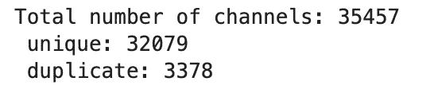

# 闪电网络:一些图论度量——第 2 部分(实践指南)

> 原文：<https://medium.com/analytics-vidhya/lightning-network-some-graph-theory-metrics-part-2-practical-guide-cfc37fb8e047?source=collection_archive---------7----------------------->


# 介绍

本文是旨在使用图论概念分析闪电网络拓扑的系列文章的一部分。在[的第一篇文章](/@stelios.rammos/lightning-network-some-graph-theory-metrics-part-1-7fb3ca83b291)中，我回顾了一组有助于监控网络增长及其连接健康状况的指标，例如图的直径/半径、完整性、传递性等等。在这一篇中，我们将回顾运行 Lightning 节点时自己计算这些指标的代码。如果你不熟悉上面提到的指标，你可能想看看这里的第一部分。不然我们就直入主题吧！

阅读完本文后，您将能够自己监控网络的增长，并获得一些关于其连通性的有价值的见解。如果您想成为一个有价值的路由节点，并为网络的良好运行做出贡献，您可能会发现其中一些非常有用。

*注意:您将需要自己的 lightning 节点来运行 LND 实现。如果您尚未设置，请查看以下指南，从头开始设置并运行您的节点。*

[](https://veriphi.io/en/blog/tutorial-from-scratch-to-a-lnd-transaction) [## 简单的比特币所有权

### 上周，我们通过一个视频演示了闪电网络协议 BOLTs(闪电技术基础)

veriphi.io](https://veriphi.io/en/blog/tutorial-from-scratch-to-a-lnd-transaction) 

# 计算网络度量

## **前置要求**

1.  运行 LND 的闪电节点
2.  Python 的工作版本(我用的是 Python 3.7.5)
3.  以下 python 库:Pandas、Numpy、graph-tool、NetworkX
4.  可选:Jupyter 实验室

*注意:几乎所有的事情都可以用 NetworkX 或 graph-tool 来完成，但是我发现 graph-tool 对于一些计算来说要快得多，因为它是用 C 语言编写的，带有 Python 包装器。另一方面，NetworkX 感觉更像 python，您可能会发现它更容易使用。*

*注意 2:不能使用 pip 安装 graph-tool，您必须手动或使用软件包管理器安装依赖项，然后自己编译。这可能是一个乏味的过程，需要很长时间来编译，所以去给自己泡一杯好咖啡吧。*

*注 3:为了简单起见，我们假设该图是无向的。然而，这两个库也可以处理有向图。当将 JSON 图转换成另一种格式时，只需要多做一点处理。如果你想让我再发一个帖子来回顾这个过程，请告诉我！*

## 创建我们的项目环境

让我们首先创建一个保存图形数据的项目目录:

```
$ mkdir ln-graph-stats
$ cd ln-graph-stats 
```

然后，我们需要为它创建一个虚拟环境(可选，推荐)。

```
$ python3 -m venv ln-venv
```

**提示:**如果你要使用 graph-tool，我建议你把它安装在你的系统包中，而不是安装在你的虚拟环境中，这样会省去你很多麻烦。在这种情况下，请改为运行以下命令(在安装并编译 graph-tool 之后):

```
$ python3 -m venv ln-venv --system-site-packages
```

最后激活你的虚拟环境，我们准备好了！

```
$ source ln-venv/bin/activate
```

## **获取图形数据**

为了获得图形数据，我们首先需要确保我们有一个 LND 实例启动并运行。完成后，打开终端选项卡并运行以下命令:

```
$ lncli describegraph > /full/path/to/ln-graph-stats/lngraph.json
```

## 用 python 读取图形数据

图形数据将采用 json 格式。这对于存储数据很好，但是对于处理数据却不太好。因此，我们希望将它解析成一种我们可以使用的格式。我将向您展示如何将 json 解析成:Pandas 数据帧、NetworkX 图和 Graph-Tool 图。每一种都有自己的优点，平衡了速度和方便性，我会让你决定你更喜欢使用哪一种。我将始终指定我对每个统计数据使用哪一个。

**熊猫数据帧**

**网络 x 图**

**图形-工具图形**

## 现在，指标！

好的，太好了！我们可以选择用三种不同的格式保存我们的图表。每种格式都有自己的优势，您使用哪种格式主要取决于您希望进行的分析类型。出于实用指南的考虑，我将展示这三种方法在不同指标计算中的使用。然而，正如我上面提到的，你可以自由地在 Graph-Tool 和 NetworkX 之间选择，这取决于你是喜欢速度还是易用性。请记住，Graph-Tool 可能也没有 NetworkX 提供的所有功能。

**平均值和分位数**

如果你查看 BitcoinVisuals 网站，你会注意到大多数统计数据显示的是平均值，以及以下分位数值:0.9、0.5 和 0.1。平均值有时会产生误导，分位数值可以更好地反映值在网络中的实际分布。因为我们将为大多数统计数据再现平均值/分位数，所以您可以利用这个有用的小函数来节省一些时间和代码行。

**节点(熊猫数据帧)**

我决定以一种实际上和代码上最有意义的方式将一些指标组合在一起。因此，在这一点上，我们将看看与网络节点相关的所有指标，这些指标不需要任何花哨的图形库。只是一些旧的熊猫相框。我们将计算**有通道**和无通道**的节点总数**、**每个节点的通道数**和**每个节点的总容量**。此外，因为我们无论如何都要查看通道策略，所以我们将计算每个节点启用的通道总数和百分比。

以下函数将把以下各列添加到我们的图形数据框中:' num_enabled_channels '，' num_channels '，' percent_enabled_chan '和
'total_node_capacity '，这是我们计算上述统计数据所需的全部内容。

在调用上述函数并将返回值赋给变量`graph_nodes`之后，可以调用`graph_nodes.head()`来确保正确添加了列。输出应该如下所示:


如果列被正确追加并且值看起来正确，我们现在就可以使用内置的 pandas 函数来检索我们想要的信息。

注意，在上面的代码片段中，我区分了活动节点和非活动节点(没有任何已启用通道的通道)。如果一个信道不是路由的可行选项(例如:缺乏足够的容量),则网络会将该信道标记为禁用，以便网络尝试避免通过该信道。仅统计已启用的通道让我们可以看到节点和网络的“可用”容量。代码的输出应该如下所示(值可能会不同):


**频道(熊猫数据帧)**

接下来，让我们看看如何检索网络上的频道数量以及重复频道的数量。这一点也可以用两个图形库中的任何一个来完成，但因为我们从数据帧中获取这些值非常简单，而且相对较快。

输出应该如下所示:



**网络容量(熊猫数据帧)**

获得总网络容量也非常简单。一旦有了`df_channels`数据框架，只需运行这个命令`df_channels.capacity.sum()`。

**每通道容量(熊猫数据帧)**

对于每个通道的容量，我们将再次使用我们的`get_basic_stats`函数，如下所示:

```
values = df_channels.capacity.values
average, percentiles = get_basic_stats(values, 'capacity per channel')
```

**距离度量(图形-工具图)**

在我们可以测量图中的距离之前，我们必须确保图是连通的，否则我们将得到错误的距离度量。

*注意:我发现 NetworkX 在计算图的直径和半径时非常慢，所以从那以后我就不再使用它了。*

如果图是不连通的，我们应该检索不同图的连通部分并分别分析它们。正如我们在下面看到的，图表主要是连接的。然而，我们也观察到由 2 到 5 个节点组成的几个较小的连接组件，这些节点很可能只是希望在彼此之间进行交易，而对路由支付不感兴趣，它们之间的通道被称为**私有通道**。

如果您希望执行网络分析，只保留最大的连通分量更有意义(下面代码片段的第 4 行和第 5 行)，因为我们可以假设专用信道无论如何都不想参与路由过程。我们还应该删除重复的边缘，这可能会扭曲一些其他措施(第 9 行)。

现在，我们可以使用下面的函数来检索图形的平均距离、直径和半径。

如果将`pseudo_diameter`参数设置为真，该功能将使用 Graph-Tool 使用的快速直径近似算法。你可以在文档[这里](https://graph-tool.skewed.de/static/doc/topology.html?highlight=diameter#graph_tool.topology.pseudo_diameter)读到更多。`return_dist`参数将返回所有顶点的所有距离的数据帧。

**完整性度量(熊猫数据框架)**

假设我们已经计算了通道的总数(在上面的节点部分),那么计算完整性是很简单的。我们只需要计算这些通道与图中可能的通道总数之比，即 n*(n-1)/2，其中 n 是顶点数。代码看起来应该是这样的:

```
# Completeness measure: density of the graph
max_num_channels = (total_cnt_nodes*(total_cnt_nodes-1))/2
completeness = num_unique_channels/max_num_channels
```

**聚类度量(图形-工具图)**

聚类度量包括图的传递性和单个节点的传递性。Graph-Tool 有一个计算两者的函数，对于图的传递性称为`global_clustering()`,对于顶点的传递性称为`local_clustering()`。

```
# Transitivity is the ratio of potential triangles present.
transitivity, sd = gt.clustering.global_clustering(gtgraph)
print('Graph transitivity: {}\n'.format(round(transitivity,3)))# Clustering coefficient is the ratio of interconnections between a node's peers.
transitivities = gt.clustering.local_clustering(gtgraph).a
get_basic_stats(transitivities, 'node transitivities')
```

**连通性测量(图形工具和网络 x 图)**

对于连通性测量，我必须同时使用 Graph-Tool 和 NetworkX，因为 Graph-Tool 没有计算切割边的功能(据我所知)。如果你一直在使用 Graph-Tool，你可以使用 **NetworkX Graph** 部分的功能。

## 摘要

总之，本文介绍了计算有用指标以分析 Lightning 网络拓扑所需的代码。我们看到了如何将 JSON LN 图转换成一种格式，使用这种格式我们可以更容易地计算所有指标。根据易用性和性能，我们使用了三种不同的工具:Panda DataFrames、NetworkX 和 Graph-Tool graphs。你也可以在我的 Github 上的 Jupyter 笔记本中找到本文的所有代码，在[这里](https://github.com/SteliosRammos/lightning-network-graph-analysis)。

如果你喜欢这篇文章，或者如果你想讨论它的内容，请随时留下评论或通过下面列出的渠道给我发消息。

正如我在开头所说，这篇文章是围绕闪电网络及其图形的系列文章的一部分。目的是帮助人们更熟悉图拓扑，并为渠道管理提供一些参考。以下是我对下一篇文章的一些想法:

1.  计算图论中使用的更多度量来分析网络拓扑
2.  自动化指标计算以创建类似仪表板的体验

我想听听你最感兴趣的是什么，我也愿意在这些方面进行合作，因为我自己仍在学习这项技术。

# 让我们社交吧！

请通过以下任何平台联系我:

**推特:** @Stelios_Rms

【stelio.rammos@gmail.com】邮箱:T4

**领英:**[https://www.linkedin.com/in/stelios-rammos-675382149/](https://www.linkedin.com/in/stelios-rammos-675382149/)

**博客:**http://www.blog.steliosrammos.com