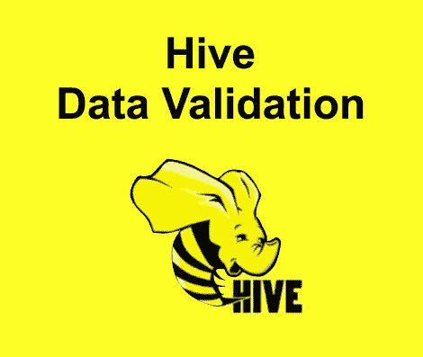

# 配置单元数据验证的限制

> 原文：<https://medium.com/analytics-vidhya/limitation-of-hive-data-validation-1eec015e5ca6?source=collection_archive---------10----------------------->

在大数据世界中，hive 是最流行的数据仓库工具之一。虽然它有一些方便和灵活的功能，包括 SQL 类数据操作语言或方便的数据导入机制，用户只需简单地将数据文件复制到指定的 hdfs 位置。它也有一些缺点，这就是为什么必须有**“数据验证”机制**。