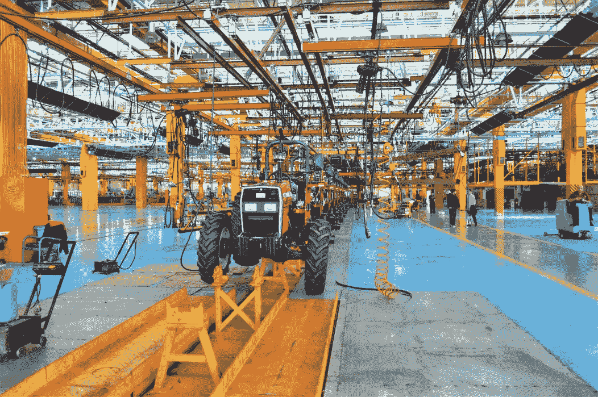

# 带 R 的线路平衡

> 原文：<https://medium.com/analytics-vidhya/line-balancing-with-r-b845e2d7c99c?source=collection_archive---------6----------------------->

## r 代表工业工程师

## 了解生产节拍、周期和提前期

图片由 Amin Khorsand 拍摄，可在 [Unsplash](https://unsplash.com/photos/tAnzPbVXjQo) 获取

# 人工投入线性平衡法

生产线平衡是在特定生产线内调整操作的过程，以最大限度地减少生产波动、操作停机时间和工作站闲置。它使生产线更灵活地吸收外部…