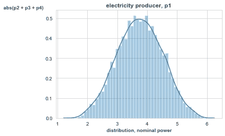
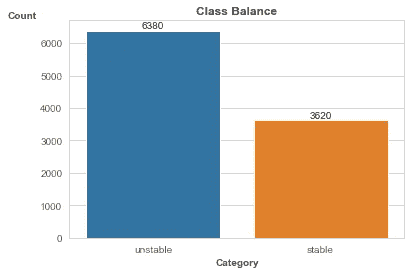
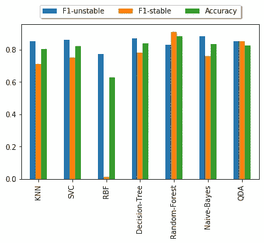
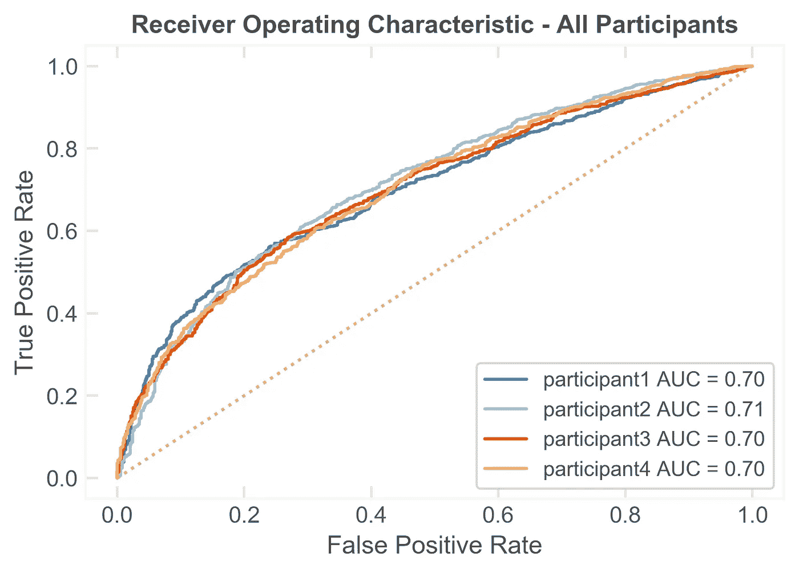
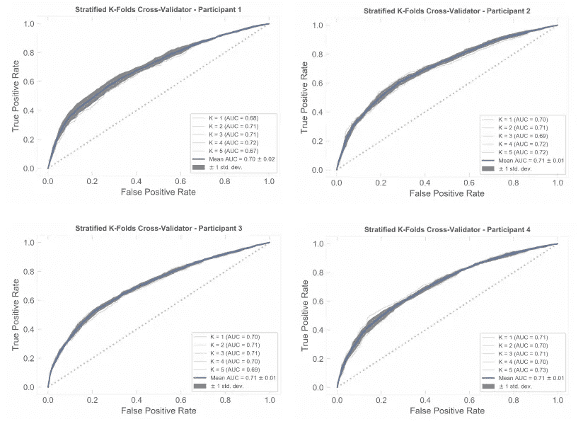
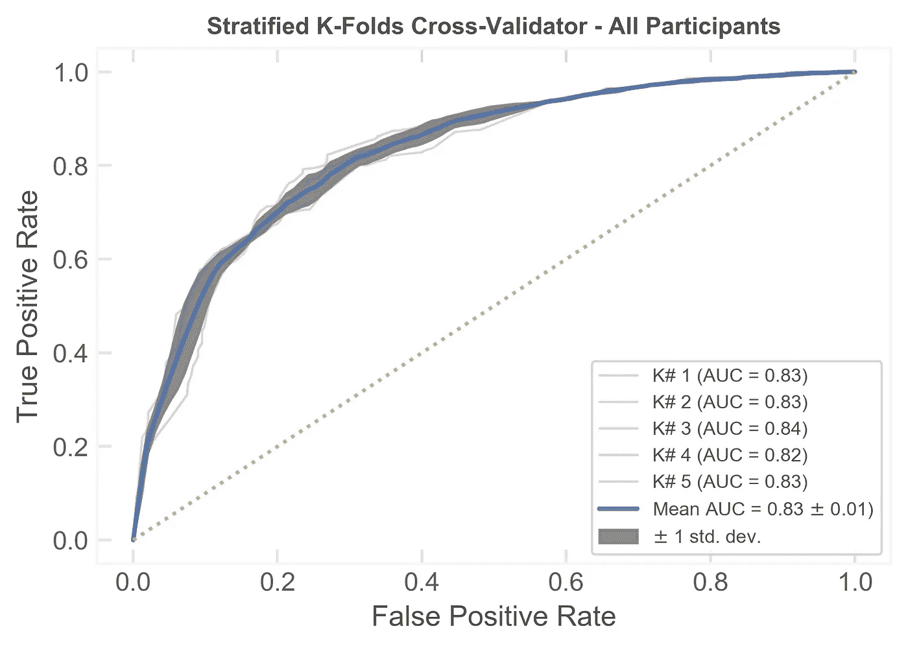
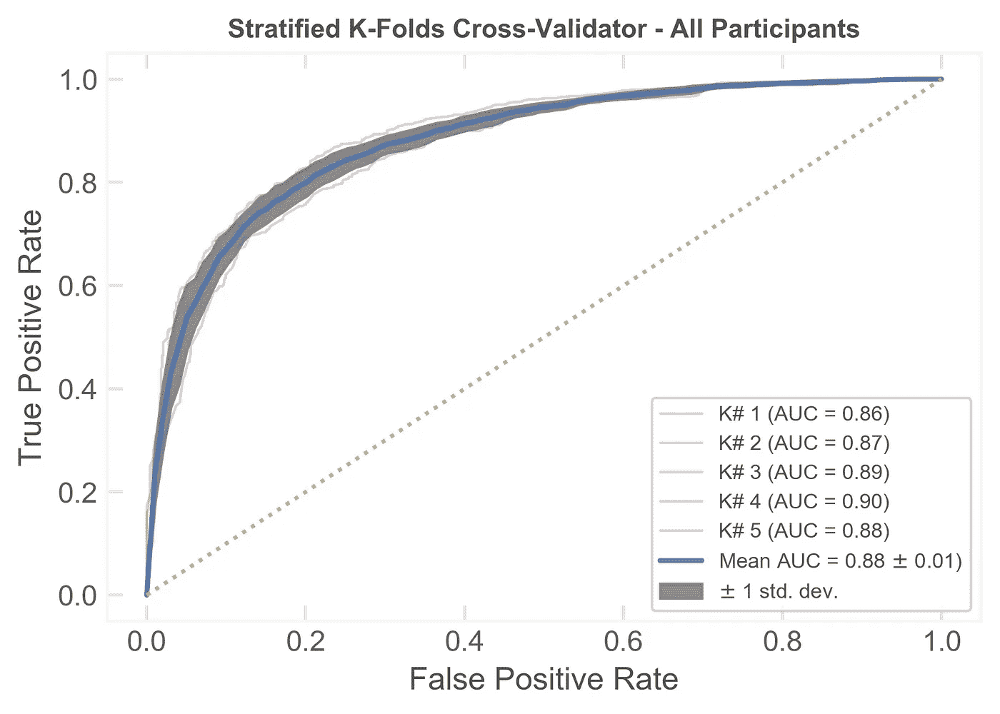

# 分散智能电网控制(DSGC)的线路稳定性分析

> 原文：<https://medium.com/analytics-vidhya/line-stability-analysis-of-the-decentral-smart-grid-control-d5ef7e94fe77?source=collection_archive---------9----------------------->


从海湾[花园](https://www.gardensbythebay.com.sg/)看到的新加坡传单。在我的联想 K3 笔记本上拍摄的照片。

在这个阳光明媚的岛屿上，许多人见证了开放能源市场模式的实施，该模式于 2018 年下半年推出，现在应该已经结束。对于许多人来说，参与选择下一个能源供应商是一次令人兴奋的经历——是留下还是转换。

在深入研究机器学习分类模型和技术时，这样的“话题”仍然引起了共鸣。这也是我们在分布式智能电网控制系统的线路稳定性方面开展监督机器学习项目的动机。

然而，如果在这个节骨眼上，你有兴趣了解更多关于开放能源市场的信息，那就直接进入:
[终极比较:哪家电力零售商是新加坡最便宜的？https://blog . seedly . SG/electricity-retailer-comparison-priest-in-Singapore/](https://blog.seedly.sg/electricity-retailer-comparison-cheapest-in-singapore/)

这里不是对 DSGC 本身的深入研究，而是对其机器学习方面的深入研究，以收集在确定电气线路稳定性时对机器学习分类过程的见解。如果你想去那个方向，有关于这个系统的期刊和出版物是很容易搜索到的。

# 什么是 DSGC？

电力定价遵循供需经济模型，在传统系统中，需求驱动的电力生产决定了系统电网的稳定性。

分散智能电网控制(DSGC)是一个前瞻性系统，既适合传统能源，也适合非灵活(即可再生)能源。DSGC 服务于所有参与者，即能源消费者和生产者，将电价与电网频率联系起来，电网频率决定了电网的稳定性。

# **数据**

在确定电网稳定性时，用于研究分类系统的数据集是[电网稳定性模拟数据集](https://archive.ics.uci.edu/ml/datasets/Electrical+Grid+Stability+Simulated+Data+)，可在 UCI 机器学习知识库网站上获得。数据集相当新，上传到存储库还不到一年。

数据集是模拟 DSGC 的 4 节点恒星系统的结果。它包含 14 个特征——12 个输入特征、1 个真实目标和 1 个分类目标。12 个输入功能是:

*   参与者 1(制作人)
*   参与者 2
*   参与者 3
*   参与者 4
*   参与者的度量标准

—参与者的反应时间
—消耗(负)/产生(正)(实际)的名义功率
—与价格弹性成比例的系数(γ)

# **PostgreSQL**

将数据填充到 PostgreSQL 是一个非常简单的过程，包括:

1.  创建新的数据库，
2.  连接到数据库，
3.  用必需的字段及其数据类型创建适当的表，
4.  最后将数据导入数据库。

上述过程通过将命令附加到 SQL 脚本中并从命令行执行来实现自动化:

```
$ psql -f setup.sql
```

一个重要的注意事项是，实数不是以浮点数的形式，而是以数字(精度、小数位数)的数据类型格式存储。

调用带有适当连接参数的 Pandas 函数 *read_sql* 将数据加载到 python 数据帧中:

```
import pandas.io.sql as pd_sql# connection parameters
params = {'host': '127.0.0.1', 'user': 'hostname', 'port': 5432}connection = connect(**params, dbname='proj3')df = pd_sql.read_sql_query("SELECT * FROM dsgc_data;",con=connection)
```

# 查看数据

生产者 p1 分布预期呈现正态分布，使用 seaborn *distplot* 函数绘制。样式和格式属性应用于绘图，以实现所需的视觉效果。

```
import seaborn as sns# set the style
sns.set_style("whitegrid")
# plot
sns.distplot(df['cp_p1'])
plt.title("electricity producer, p1", fontweight='bold', color='#404040')
plt.xlabel('distribution, nominal power', fontweight='bold', color='#505050')
plt.ylabel('abs(p2 + p3 + p4)', color='#505050', rotation=0, fontweight='bold', horizontalalignment='right', y=1.0)
```



“不稳定”类别大约是“稳定”类别的 1.7 倍，表明类别平衡是可接受的。如果我们发现模型性能不可接受，我们可以重新研究技术，例如过采样来均衡类平衡。然而，正如我们将看到的，这不是必需的。

类余额的文本输出也可以通过调用 dataframe 的 *value_counts* 函数获得:

```
print(df.op_categorical.value_counts())
```

为了可视化类平衡，调用 seaborn *countplot* 函数，并设置适当的属性以实现所需的视觉样式:



```
# set the style
sns.set_style("whitegrid")
# plot
splot = sns.countplot(df['op_categorical'])
# add the value counts on top of each bar
for p in splot.patches:
    splot.annotate(format(p.get_height(), '.0f'), (p.get_x() + 
# align the value count text
p.get_width() / 2., p.get_height()-180), ha = 'center', va = 'center', xytext = (0, 10), textcoords = 'offset points')
# further styling
plt.title("Class Balance", fontweight='bold')
plt.xlabel('Category', fontweight='bold', color='#505050')
plt.xticks(color='#606060')
plt.yticks(color='#606060')
plt.ylabel('Count', color='#505050', rotation=0, fontweight='bold', horizontalalignment='right', y=1.0)
```

# **分类器比较和模型选择**

选择合适的分类器包括建立各种分类器模型，并计算它们的 F1 和准确度分数，以比较它们的性能。准确度提供了对性能的快速浏览，而 F1 分数为每个目标结果提供了更平衡的测量。



分类器比较

结果显示，决策树、随机森林和 QDA(二次判别分析)的性能优于其他方法。随机森林分类器实现了最高的 F1 稳定和准确性分数。而 QDA 分类器在 F1 稳定和 F1 不稳定类别上表现同样好，但是具有较低的准确度分数。

QDA 类似于朴素贝叶斯模型，因为它们都使用高斯分布和决策树的随机森林模型集合，选择**随机森林分类器**，因为随机森林和决策树分类器都在前三名。

# 参与者比较

既然已经选择了分类器，那么将每个参与者的数据快速运行到有待优化的模型中，以获得每个参与者将如何单独执行的洞察。这种比较的目的是为模型提供一个机会来检测每个参与者特征中的异常。

接收器操作特性度量用于评估模型分类。



为了快速分析每个参与者的结果，该模型受到每个参与者的分层 K-Fold 交叉验证。



# 调整和优化选定的模型

该模型的性能也受到分层 K-Fold 交叉验证，以获得基线。



可接受的曲线下面积(AUC)分数及其均值的低方差是一个很好的指示。随后，通过优化其超参数来调整模型导致了更好的性能，从曲线下面积分数的改善可以明显看出。绘制接收器工作特性曲线可以让我们直观地了解模型的性能。



下面概述了分层 K 折叠交叉验证的 python 代码:

```
print(__doc__)from scipy import interp
import matplotlib.pyplot as plt 
import seaborn as sns
from sklearn.metrics import roc_curve, auc
from sklearn.model_selection import StratifiedKFold
import numpy as np
import pickle# Classification and ROC analysissns.set()
sns.set_style("white", {'text.color': '.15', 'xtick.bottom': True, 'xtick.color': '.9', 'xtick.direction': 'in', 'xtick.top': True,'ytick.color': '.9', 'ytick.direction': 'in','axes.labelcolor': '.85', 'ytick.left': True,'axes.edgecolor': '.97'})# Run classifier with cross-validation and plot ROC curves
X = df.drop(['op_real','op_categorical'], axis=1)
y = df['op_categorical']cv = StratifiedKFold(n_splits=5)
tprs, aucs = [], []
mean_fpr = np.linspace(0, 1, 100)# Load the model
with open(f"models/selected-tuned-RF-model.pickle", "rb") as pfile:
    exec(f"classifier = pickle.load(pfile)")i = 0
for train, test in cv.split(X, y):
    probas_ = classifier.fit(X.iloc[train], y.iloc[train]).predict_proba(X.iloc[test])
    # Compute ROC curve and area the curve
    fpr, tpr, thresholds = roc_curve(y.iloc[test], probas_[:, 1], pos_label="unstable")
    tprs.append(interp(mean_fpr, fpr, tpr))
    tprs[-1][0] = 0.0
    roc_auc = auc(fpr, tpr)
    aucs.append(roc_auc)
    plt.plot(fpr, tpr, lw=1, alpha=0.3, label='K# %d (AUC = %0.2f)' % (i+1, roc_auc))i += 1mean_tpr = np.mean(tprs, axis=0)
mean_tpr[-1] = 1.0
mean_auc = auc(mean_fpr, mean_tpr)
std_auc = np.std(aucs)
plt.plot(mean_fpr, mean_tpr, color='b', label=r'Mean AUC = %0.2f $\pm$ %0.2f)' % (mean_auc, std_auc), lw=2, alpha=.8)std_tpr = np.std(tprs, axis=0)
tprs_upper = np.minimum(mean_tpr + std_tpr, 1)
tprs_lower = np.maximum(mean_tpr - std_tpr, 0)
plt.fill_between(mean_fpr, tprs_lower, tprs_upper, color='grey', alpha=.9, label=r'$\pm$ 1 std. dev.')plt.plot([0, 1], [0, 1],'y:')
plt.xlim([-0.05, 1.05])
plt.ylim([-0.05, 1.05])
plt.ylabel('True Positive Rate', color='#505050')
plt.xlabel('False Positive Rate', color='#505050')
plt.xticks(color='#606060')
plt.yticks(color='#606060')    
plt.title('Stratified K-Folds Cross-Validator - All Participants', color='#505050',fontweight='bold', fontsize=10)
leg = plt.legend(loc="lower right", prop={'size': 8})
for text in leg.get_texts():
    plt.setp(text, color = '#505050')
plt.savefig('tuned-roc.png', bbox_inches='tight')
plt.show()
```

# 结论

分散智能电网控制的线路稳定性快速分析表明， ***随机森林分类器模型能够预测*** 系统的线路稳定性，曲线下面积精度为 0.88。

为了确定模型的稳健性，有必要获得更多的现场数据和边缘案例。

超参数调整中的一个常见问题是过度拟合问题，在确保超参数不被过度调整时考虑到了这一点。

此外，DSGC 系统的基本假设，例如固定投入问题、平等问题、物理模型假设等。，可以进一步探索改进的领域知识，这又会导致改进的机器学习分类模型。

# 承认

我们要感谢 Vadim Arzamasov 分享了 UCI 机器学习知识库上提供的数据集，以及关于“走向网格稳定性的简明模型”的研究。
网址:[https://archive . ics . UCI . edu/ml/datasets/Electrical+Grid+Stability+Simulated+Data+](https://archive.ics.uci.edu/ml/datasets/Electrical+Grid+Stability+Simulated+Data+)

动词 （verb 的缩写）Arzamasov，k . bhm 和 P. Jochem，“走向电网稳定性的简明模型”， *2018 年 IEEE 智能电网通信、控制和计算技术国际会议(SmartGridComm)* ，奥尔堡，2018 年，第 1–6 页。网址:[http://ieeexplore.ieee.org/stamp/stamp.jsp?tp=&ar number = 8587498&is number = 8587411](http://ieeexplore.ieee.org/stamp/stamp.jsp?tp=&arnumber=8587498&isnumber=8587411)