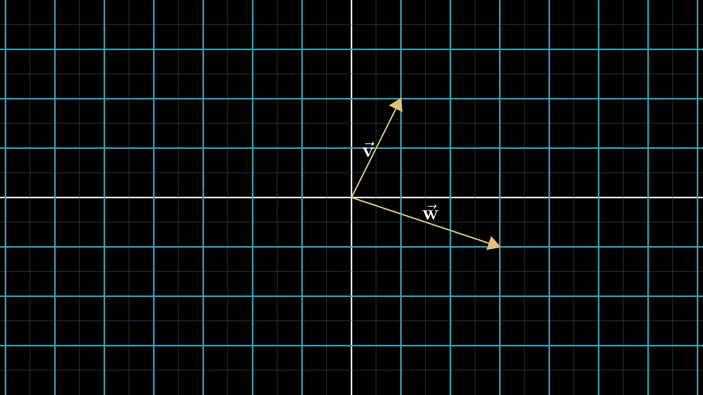

# 线性代数讲解—第一部分

> 原文：<https://medium.com/analytics-vidhya/linear-algebra-explained-part-1-f91c477eca0f?source=collection_archive---------13----------------------->

大多数领域都需要线性代数，尤其是机器学习和数据科学。我看了一个名为[线性代数精华](https://www.youtube.com/playlist?list=PLZHQObOWTQDPD3MizzM2xVFitgF8hE_ab)的视频系列，我发现它们对理解线性代数背后的逻辑非常有帮助。我想分享这些视频中的一些要点。如果你没有时间看视频或者只是想记住线性代数的基础知识，请随意阅读这篇文章。

## 什么是向量？

关于向量有不同的观点。物理学家认为它们是太空中的箭头，计算机科学家认为它们是数字列表。对于数学家来说，向量可以是任何东西，只要你能把两个向量相加，然后把一个向量乘以一个数。

虽然对向量有不同的解释，但不管你想到的是箭头还是数字列表，都没关系。这里重要的是它们之间的转换，因为这给了数据分析师一个很好的方式来可视化许多数字列表并更好地理解数据。或者它给物理学家或程序员一种用数字描述空间的语言。

坐标系

## 什么是坐标系？

坐标系是箭头和数字列表之间发生转换的地方。对于二维，它有 x 轴、y 轴和一个原点。向量的坐标显示了如何从向量的尾部到顶端。

添加两个向量

## 向量怎么加？

要添加两个向量，我们可以移动第二个向量，使其位于第一个向量的顶端。为了理解其背后的原因，我们可以想象向量显示空间中的运动。因此，先移动第一个向量，再移动第二个向量，意味着我们改变了位置，变成了两个向量的和。

将向量与标量相乘

## 一个向量怎么乘以一个数？

将一个矢量乘以一个数字意味着你要拉伸或压缩它，换句话说，就是缩放它。这就是为什么这些数字叫做标量。

表示两个缩放矢量相加的矢量

## 什么是基本向量？

2D 空间中的矢量有两个坐标。我们可以把这些坐标看作标量，每个轴上的标度单位向量，叫做 i^and j^. i^and j^，叫做基向量。我们可以选择不同的基向量，得到一个新的坐标系，用不同的坐标表示同一个向量。

向量的线性组合

## 什么是线性组合？

缩放矢量并将它们加在一起称为线性组合。但是为什么称之为线性呢？如果您固定一个向量，并让另一个向量自由地改变其值，则结果向量提示会绘制一条线，称之为线性是有意义的。

## 什么是 span？

我们可以自由地改变两个向量，取它们的线性组合，而不是像前面的例子那样固定一个向量，改变另一个向量。

1.  对于大多数向量对，我们可以到达空间中的每一个向量。
2.  如果两个向量都在一条直线上，那么产生的向量就仅限于通过原点的一条直线。
3.  如果两个向量都是零，并且只有零向量是可达的。

给定向量对的线性组合所能达到的所有可能向量的集合称为这两个向量的跨度。

两个 3D 向量的跨度是二维的。如果有三个三维向量，它们的跨度是三维的。但是如果第三个向量在其他向量的跨度上，它们仍然跨越相同的 2D 空间。

## 什么是线性相关向量和独立向量？

我们讨论了 2D 和三维向量的跨度。在某些情况下，添加新矢量不会改变跨度。在这种情况下，我们说向量是线性相关的。其中一个向量可以表示为其他向量的线性组合，因为该向量已经在它们的区间内。如果每个向量确实增加了另一个维度，那么它们就是线性无关的向量。

有了这些新的信息，我们现在可以说空间的基是一组跨越整个空间的线性无关的向量。

## 什么是线性变换？

变换就像以向量作为输入，以向量作为输出的函数。对变换的直观解释是在输出向量上移动输入向量。

为了从整体上理解变换的思想，我们可以想象看着每一个可能的向量移动到其对应的输出向量，或者点，如果我们只考虑向量的尖端。因此，变换就像变形空间本身。从几何的角度来看，线性变换意味着所有网格线保持平行和均匀间隔。

为了用数字来描述这个变换，我们只需要记录 i^和 j^在哪里着陆，其他的一切都会随之而来，因为我们可以把每隔一个向量写成一个基本向量的线性组合。我们可以用这四个数完整地描述 2D 线性变换，可以写成一个 2×2 的矩阵。为了找到一个特定的向量在变换后会落在哪里，我们取向量的坐标，将它们乘以相应的矩阵列，然后相加。这是矩阵向量乘法。

请继续关注本系列的第 2 部分:)