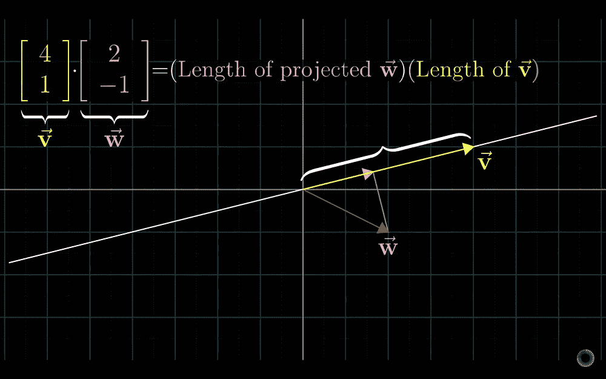
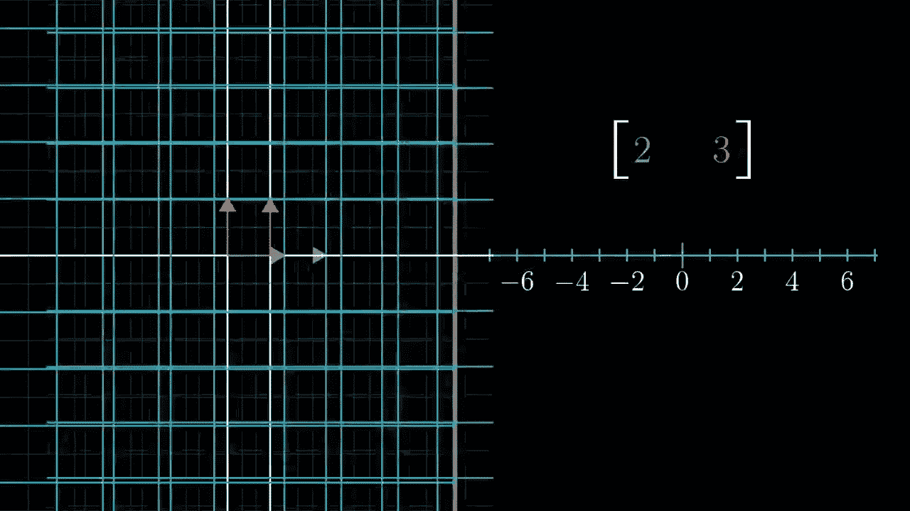
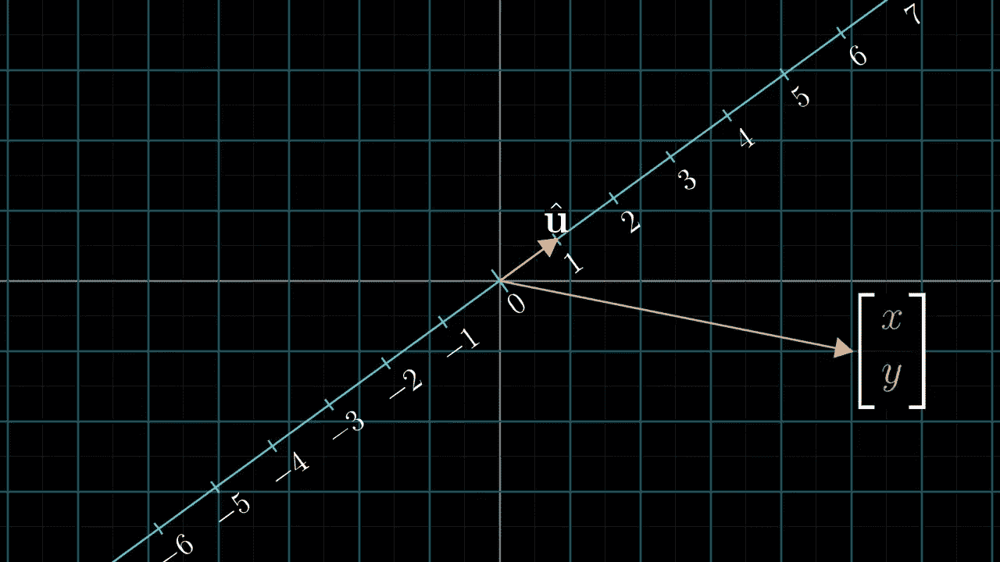

# 线性代数讲解—第三部分

> 原文：<https://medium.com/analytics-vidhya/linear-algebra-explained-part-3-be3afd2b5246?source=collection_archive---------17----------------------->

在这篇文章中，我们将试着理解点积。你可以在这里阅读本系列之前的帖子:[第一部分](https://link.medium.com/SZq8iEVgZ3)、[第二部分](https://link.medium.com/Tnjphys1Z3)。

## 什么是点积？

先说点积的标准定义。我们取两个相同长度的向量，然后将每对坐标相乘。然后将这些相加，得到两个向量的点积。

点积的计算

几何学上，点积意味着其中一个向量投影到另一个向量所在的直线上。投影向量和另一个向量的长度相乘得到点积。当向量指向相反方向时，点积为负，而如果向量垂直，点积为零，因为投影长度为零。

点积的几何解释

但是为什么这个计算与投影的想法有关呢？为了理解这一点，让我们看看从多维到一维的线性变换。它们就像函数获取多维向量，输出一维向量，一维向量就是数字。在[第 1 部分](https://link.medium.com/SZq8iEVgZ3)中，解释了当网格线保持平行和均匀间隔时，变换被称为线性。类似地，对于一维的线性变换，如果我们选择均匀间隔的点，它们保持均匀间隔。

均匀分布的点表示变换是线性的。

我们在[第 1 部分](https://link.medium.com/SZq8iEVgZ3)中也看到，变换是用基向量所在的坐标定义的，在这种情况下，i^and j^.变换是从二维到一维，对应的矩阵是 1x2。

1x2 矩阵描述了 2D 到 1D 的转换

为了将这种变换应用于向量，我们将 1x2 的矩阵乘以 2D 向量。该计算与点积相同。

对向量应用变换

因此，我们可以说 1x2 矩阵和 2D 向量之间存在关联。但是这种关联几何上意味着什么呢？

2D 向量与 1x2 矩阵的关联

为了理解 1x2 矩阵和 2D 向量之间关联的几何意义，让我们想象我们在 2D 坐标空间的顶部对角放置一条数线，并且数字 0 位于原点。让我们也定义一个二维矢量 u^whose 尖端，它位于数轴上的数字 1 处。之后，让我们定义一个投影变换。这种变换是线性的，因为均匀间隔的点在变换后仍保持均匀间隔。

投影变换是线性的

由于变换是线性的，我们可以将其表示为 1x2 矩阵。我们需要找到 i^and j^lands 和这些数字将成为矩阵的列。

变换后基向量的坐标

由于 u^、i^和 j^have 的单位长度，我们可以在这里使用对称性。下图解释了 i^lands 在 ux 上和 j^lands 在 uy 上的表现。因此，矩阵的条目是 u^.的坐标

变换后求基向量坐标的对称性思想

计算任意向量的投影变换在计算上等同于用 u^.取点积。这就是为什么用单位向量取点积可以解释为将向量投影到单位向量的跨度上并取长度。

这里的教训是，任何时候你有一个线性变换，它的输出空间是数轴，就会有一个唯一的向量 v 对应于这个变换，从这个意义上说，应用这个变换和用这个向量做点积是一样的。这是二元性的一个例子。

这个系列是视频系列“线性代数的本质”的总结。你可以在这里观看视频[。](https://youtu.be/kjBOesZCoqc)

第 4 部分很快就到:)