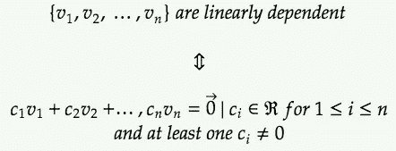
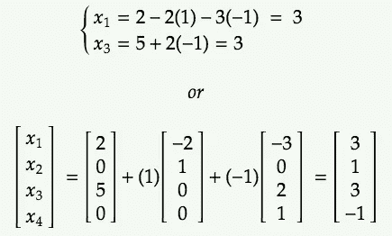
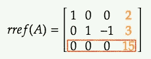
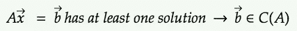
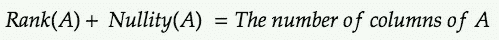

# 数据科学中的线性代数第 1 部分:基本概念

> 原文：<https://medium.com/analytics-vidhya/linear-algebra-for-data-science-part-1-basic-concepts-1b8379ee834d?source=collection_archive---------0----------------------->

艾蒂安·布朗热在 [Unsplash](https://unsplash.com/s/photos/science?utm_source=unsplash&utm_medium=referral&utm_content=creditCopyText) 上的照片

当我开始我的数据科学家生涯时，我得到了一份 2017 年来自 [Cafe Bazaar](https://cafebazaar.ir) 公司的工作面试，以下是面试结果:

虽然他们没有为我的拒绝提供任何特别的原因，但我猜想这主要是因为我无法回答他们关于统计和线性代数的问题。事实上，自从我在大学学习这些课程以来，我对所有的主题都很熟悉，但是由于我在日常活动中没有使用这些概念，所以我忘记了其中的大部分！老实说，拒绝对我来说很震惊。我感到沮丧的原因是我一直想为这家公司工作，它是伊朗最受欢迎的 IT 公司之一。

此外，我对自己的技能和能力非常有信心，因为我在伊朗一所顶尖大学学习过计算机科学。在那次经历之后，我看到了这篇有用的文章[“如何建立数据科学投资组合”](https://towardsdatascience.com/how-to-build-a-data-science-portfolio-5f566517c79c)，作者是 [Michael Galarnyk](https://towardsdatascience.com/@GalarnykMichael?source=post_page-----5f566517c79c----------------------) 。在这篇文章中，他提到了 Airbnb 的数据科学家 Kelly Peng 的一句话，她坚持不懈，不断工作和改进:

> 记下你被问到的所有面试问题，尤其是那些你没有回答的问题。你可以再次失败，但不要在同一个地方失败。你应该一直学习和提高。

*如果你还没有得到面试机会，申请更多的工作，继续寻找学习和提高的方法。([来源](https://towardsdatascience.com/how-to-build-a-data-science-portfolio-5f566517c79c))

结果我接受了这个挫折，开始提高对线性代数和统计的理解。我在此期间接受了另一家公司的工作邀请，大约两年后，我对我第二次去 Cafe Bazaar 的改进简历感到不满。这一次，这些类型的问题似乎没有第一次那么难，所以我能够进入面试过程的下一步。尽管取得了这样的进步，但在最后的面试阶段，我还是因为另一个原因被拒绝了。这次经历对我来说仍然是一项成就，因为我学会了不让我的弱点成为我前进道路上的障碍！

因此，不要重复我的错误！成为一名优秀的数据科学家需要一些前提条件；拥有足够的不同领域的知识，比如统计学、线性代数、机器学习、微积分等等，就是其中之一。所以，试着学习每个领域的重要主题，以便更好地理解你在用数据做什么。

> 线性代数是数学的一个重要分支，学习它可以理解大多数机器学习算法如何处理数据流以创造洞察力。

[这里的](https://www.analyticsvidhya.com/blog/2019/07/10-applications-linear-algebra-data-science/)是一个有用的链接，在这里你可以找到线性代数在数据科学中的应用。

在这篇文章中，线性代数的基本概念将被解释。作为一名数据科学家，您必须了解的线性代数中的其他重要主题将在不久的将来的另一篇文章中讨论(作为本文的第 2 部分)。

# 单位向量

单位向量的大小(或长度)为 1。

将向量()除以其大小，将会找到一个与“”方向相同但大小为 1 的向量:

-方向的单位向量，大小为 1

# 跨度

{v₁,v₂，…，vn}的跨度就是可以用{v₁,v₂，…，vn}的线性组合来表示的所有向量

*   **例一:**

c₁和 c₂是𝕽.的任何实数因此，向量(1，0)和(0，1)的跨度是𝕽中所有向量的集合。

*   **例 2:**

由于 c₁and c₂在𝕽是任意实数，向量(1，0，0)和
(0，1，1)的跨度是𝕽第二个和第三个条目相同的所有向量的集合。

# 线性依赖和独立

向量 v₁,v₂，…，vn 是 ***线性相关的*** 当且仅当存在一些 cᵢ，而不是全为零，使得它们的线性组合等于零:

例如，如果 c₁≠0，那么 v₁将被写成其他向量的线性组合；这意味着它们是线性相关的。

另一方面，如果这个方程的唯一解是 cᵢ = 0(对于所有 1≤i≤n)，那么它们是 ***线性独立的*** ，因为它们都不能写成其他向量的线性组合。

> [两个向量是线性相关的⇔，一个是另一个的标量倍数，两个向量是线性相关的⇔，这两个向量彼此不平行。](http://algebra.math.ust.hk/vector_space/07_independence/lecture2.shtml)

*   **例 1:** [1，4]和[3，5]线性无关，因为

*   **示例 2:** 考虑以下子集:

这个系统有许多非零解。因此，子集 *S* 中的向量是线性相关的。

# 子空间和子空间的基

## 子空间

把 *V* 看作 n 维空间(Rⁿ) *的子集。V* 是 Rⁿ的一个*子空间*，如果它满足以下准则:

*   *V* 包含零矢量。

*   *“乘法下的闭包”*:对于 *V* 中的任意一个向量，如果乘以任意一个标量，结果仍然会在 *V* 中。

*乘法运算下的闭包*

*   *“加法下的闭包”*:对于 *V* 中的任意两个向量，如果我们将它们相加，结果仍然会在 *V.* 中

*追加关闭*

*   可以证明 *n* 个向量的跨度是 Rⁿ:的有效子空间

证据是:

“n 个向量的跨度是 Rⁿ的有效子空间”的证明

## 子空间的基

如果一个子空间有基，那么该子空间的任何成员都可以由这些基向量的唯一组合来唯一确定。

# 柯西-施瓦茨不等式

# 向量三角形不等式

# 向量之间的角度

## 垂直向量和正交向量

*   如果两个向量之间的角度为 90 度，则这两个向量是垂直的。这意味着如果两个向量不为零，并且它们的点积等于 0，那么它们就是垂直的。

*   所有垂直矢量都是**正交**。
*   0°向量与其他任何东西都正交(甚至与其自身)。

# 矩阵简化的行-梯队形式(RREF)

有时需要将矩阵转换为简化的行梯队形式，以求解线性方程组，找到矩阵的秩或零值(我们将在本文稍后讨论这些主题)。

当满足以下条件时，矩阵处于**缩减行梯队形式** (rref ):

*   具有所有零元素的行被放置在矩阵的底部，在具有至少一个非零元素的所有行之下。
*   在至少有一个非零元素的行中，左起第一个非零数字，也称为**透视元素，**为 1。
*   在包含 pivot 元素的列中，列中唯一的非零条目是 pivot 元素。

简化行梯队形式的矩阵

## 将矩阵转换为简化的行梯队形式

使用**初等行运算**可以将矩阵改变为其*缩减行梯队形式*。这是三种基本的矩阵行操作 **:**

1-交换任意两行

2-将一行乘以一个非零常数

3-将一行添加到另一行

## 用矩阵行列形式解三元线性方程组

线性方程组可以通过将其增广矩阵转化为降阶的行梯队形式来求解。[增广矩阵](https://en.wikipedia.org/wiki/Augmented_matrix)是通过附加两个给定矩阵的列获得的矩阵:每行代表系统中的一个方程，每列代表一个变量或常数项。让我们继续举一个例子。考虑以下线性系统:

为了求解这个线性方程组，相应的增广矩阵应该转换成它的 rref。步骤如下:

计算 rref(A)以求解 3 个方程和 3 个变量的系统的步骤

方程中对应系数的 rref 矩阵(除了包含方程常数的最后一列)是一个 [**单位矩阵**](https://en.wikipedia.org/wiki/Identity_matrix) 。因此，这个方程组有唯一的解，这个解是:

## 用矩阵列梯队形式解 4 个变量的 3 个线性方程组

对于这一部分，我使用了来自 [KhanAcademy](https://www.khanacademy.org/math/linear-algebra/vectors-and-spaces/matrices-elimination/v/matrices-reduced-row-echelon-form-1) 的一个例子:

为了求解这个线性系统，首先要计算相应增广矩阵的 rref。步骤如下:

计算 rref(A)以求解具有 4 个变量的 3 个方程的线性系统的步骤

正如您在扩充矩阵 *A* 的简化行梯队形式中看到的，有两个枢纽元素，对应于 x₁和 x₃变量——也称为**枢纽变量**。x₂和 x₄是**自由变量**，因为在它们对应的列中没有枢纽元素。因此，这个线性系统的解是:

在解决方案中，自由变量 x₂和 x₄可以是任何实数。然而，一旦为它们选择了一个值，这些值就立即被上述等式分配给 x₁和 x₃。例如:

*   通过选择 x₂ = 1 和 x₄=-1，解决方案将是:

考虑 x₂ = 1 和 x₄=-1 的四元三次线性方程组的解

*   通过选择 x₂ = 0 和 x₄=2，解决方案将是:

考虑 x₂ = 0 和 x₄=2 的四元三次线性方程组的解

自由变量的不同取值会给出系统不同的解。

## 用矩阵的行列形式表示线性系统无解

如果没有一组满足所有方程的未知数的值，则线性系统是**不一致的**。在这样的系统中，我们在计算其 rref 形式后会得到矛盾的信息，比如 2 = 1！例如:

没有任何解的线性方程组

*rref(A)* 是:

在 *rref(A)* 的最后一行中，可以看到存在 0=15 的不一致性！因此，这个线性系统无解。

概括地说，根据线性系统的增广矩阵的简化行梯队形式，我们可以得出以下结论:

# 矩阵的零空间

矩阵 *A (N(A))* 的 N *全空间*是所有向量的集合，使得:

*N(A)* 可定义如下:

可以证明:

*   *零空间(A)* 是有效的子空间。
*   *零空间(A) =零空间(rref(A))*

以下面的矩阵为例，我们想计算它的*零空间*:

为了找到 N(A) ，我们应该找到所有的向量 *x，使得:*

通过将矩阵 *A* 乘以向量 *x* ，我们得到:

现在，我们应该把这个方程看作一个线性方程组来求解:

在上一节中，我们学习了如何为上述系统的相应增广矩阵计算 *rref* 。通过考虑*零空间(A) =零空间(rref(A))* ，我们将得到:

因此，上述方程的解是:

x₂和 x₄是ℝ.的自由变量因此，*零空间(A)，*中满足原始方程 *Ax=0，*的所有向量都可以表示为这两个向量的线性组合。

**回忆:**两个向量的线性组合就是那两个向量的跨度。

因此，可以说*零空间(A)* 是:

## 用零空间表示矩阵列向量的线性无关性

如果矩阵的列向量是 ***线性无关的*** ，那么该矩阵的*零空间*将只由零向量组成。同样，如果一个矩阵的*零空间*只包含零向量，这意味着该矩阵的列是线性独立的。为了更好地理解，让我们做一点数学！考虑矩阵 *A(n*m)。*我们可以把它改写为它的列向量(A₁到安)如下:

为了计算*零空间(* A)，我们应该找到满足 *Ax=0:* 的所有向量 *x*

**回想一下:**向量 v₁,v₂，…，vn 是 ***线性无关的*** 当且仅当它们的线性组合为零的方程的唯一解是 c₁=c₂=…=cn=0.

因此，如果 *Ax=0 的唯一解是 xᵢ=0(对于 1≤i≤n)，*我们可以说 *A* 的列向量是线性无关的。换句话说:

# 矩阵的列空间

矩阵的*列间距*是由它的列向量产生的跨度。换句话说，基于*跨度*的定义，矩阵 A(m*n)的*列空间是*可以由其列向量{A₁，…，An}的线性组合表示的所有向量:

以下是关于矩阵的*列空间的一些要点:*

*   矩阵的列空间也是一个有效的子空间。
*   如果我们想解方程 Ax=b，但是向量 b 不在*列-空间(A)中，*就可以得出方程 Ax=b 无解的结论。

*   如果方程 *Ax=b* 至少有一个解，那么可以说向量 b 肯定是*列空间(A)的成员。*

*   如果矩阵 *A* 的列向量是线性独立的，那么这些向量将是 *A* 的*列空间*的基础。否则，线性相关的应被删除。

# 子空间的维数

子空间的维数可以定义为该子空间的基中元素的数量。

## 零空间:零空间的维度

任何矩阵的**无效性**等于*缩减行梯队形式中非枢纽列(自由变量)的数量。*

## 秩:列空间的维度

任何矩阵的**秩**是能够跨越整个列空间的线性无关列向量的数量。这意味着*减少的行梯队形式的枢轴元素的数量。*

**示例:**考虑矩阵 *A* ，我们在上一节中计算了它的*零空间*:

红色列是包含 pivot 元素的 *rref(A)* 中的列，蓝色列是矩阵 *A* 中的相应列。它有两个枢轴元素和两个非枢轴元素。*零空间(A)* 为:

因此，*的 Nullity(A)等于 2。*

*对于*列空间(A)* ，需要考虑原矩阵 *A* 中枢纽列对应的列。于是， ***秩(一)*** 等于 2。*

*一般来说，一个矩阵的**秩**和**零值**之和等于它的列数。*

**

# *结束语*

*在本文中，我们学习了线性代数中的基本概念，如跨度、线性相关或独立、子空间、计算简化的行-梯队形式、解线性方程组、矩阵的零空间和列空间，这将有助于我们更好地理解数据科学项目中使用的算法。请记住这是不够的！在这个领域仍然有重要的主题，如*矩阵变换，寻找矩阵的逆矩阵和行列式，矩阵的转置，特征值和特征向量*，我将在另一篇文章中讨论。所以，继续读！*