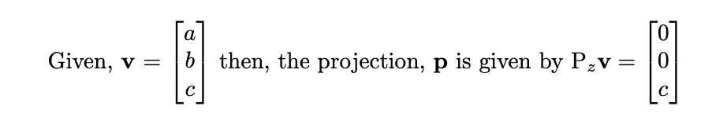

# 斯特朗的线性代数。

> 原文：<https://medium.com/analytics-vidhya/linear-algebra-from-strang-3394007ec79c?source=collection_archive---------3----------------------->

## python 中的投影矩阵。

斯特朗教授的《线性代数导论》是一次进入线性代数领域的不可思议的旅程。在接下来的几篇文章中，我的目标是从 Python 的角度阐明其中的一些部分。尽情享受吧！

在这篇文章中，我想研究一类特殊的矩阵，*投影矩阵。*首先看一些相当直观的投影矩阵，它们将 3D 中的线投影到定义它们的标准正交基上。其次，我们将看看如何将任意向量投影到直线上。然后，我们将总结如何定义任意平面的投影矩阵。

一路上，我们将使用 vanilla numpy 和 plotly 将这些想法翻译成 python 语言。

开始前请注意。在阅读本文之前，你应该对矩阵的基本运算有所了解，例如内积和外积。

## 投影矩阵

给定某个 n 维向量，v = (a1，a2，…，an)我们可以考虑这个向量到 Rn 中各个子空间的投影。你猜对了，我们用投影矩阵来描述这些投影。

让我们把自己限制在三维空间。然后我们可以描述投影矩阵，它们分别将向量 v 投影到 z 轴和 xy 平面上。


投影矩阵。当作用于三维列向量时，它们分别挑选出 z 和 xy 平面中的分量。

假设我们有一个向量 **v** ，那么我们可以像这样把这个矩阵投影到 z 轴上



我们可以看到，投影矩阵挑选出了 **v** 的分量，该分量指向我们希望投影到的平面/直线。斯特朗对投影矩阵的目的描述如下。

> 目标是找到每个子空间中的部分 P，以及产生该部分 p=Pv 的投影矩阵 P。—奇怪

## Python 中的投影矩阵

让我们在一些 python 脚本的帮助下，想象一下这些特殊的三维投影矩阵在做什么。我们可以将投影矩阵定义如下…

```
import numpy as np P_z = np.matrix([[0, 0, 0], [0, 0, 0], [0, 0, 1]])
P_xy = np.matrix([[1, 0, 0], [0, 1, 0], [0, 0, 0]]) 
```

我们现在可以使用这些投影矩阵将任意一个定义在同一基上的向量分别投影到 z 轴和 xy 平面上。

```
b = np.matrix([2,3,4])
p_xy = P_xy*b.T
p_z = P_z*b.T
```

这显示了投影是如何找到的。我们简单地用投影矩阵和我们想要投影的向量计算内积。


图中显示了将向量 **b** (蓝色)分别投影到 x 轴(绿色)和 xy 平面(红色)的结果。

## 投影到直线上

上面的例子相对简单，因为我们选择投影到标准正交基向量上，我们的向量 **v** 就是在这些向量中定义的。如果我们想投影到任意一条线上呢？

> 投影的关键是正交性:从 b 到 p 的直线垂直于向量 a


图片取自《线性代数导论—陌生》

有了这一点几何知识，我们将能够推导出任意直线**和**的投影矩阵。也就是说，我们将找到一个投影矩阵 P，它将任何一条线投影到 **a** 上。我们可以把它分成几个步骤。

首先，我们注意到 **b** 到 **a** 的投影可以被认为是**a**的某个标量倍数


其次，我们注意到“误差”(从 **b** 到 **a** ) **b** 的垂直距离)可以用矢量 **b** 及其到 **a** 的投影来表示。


从上面的等式可以用 **b** 和一些标量时间 **a** 来表示。


抓住你了！这里唯一的未知数是我们的标量 x，回想一下误差垂直于 a 的事实，我们可以取内积，把结果设为零。


重新排列我们可以解出未知的标量。


这就允许我们用 **b** 和 **a** 来表达 **p** 。这真是太棒了。它告诉我们，我们可以取 R3 上的任何其他向量，并使用这个相同的投影矩阵来计算到 a 上的投影。


## 用 python 投影到一条线上

将上面的内容转录成 python 非常简单。首先让我们写一个函数，它接受向量并返回它的投影矩阵。

```
def gen_projection_matrix(a):
    return np.outer(a, a) / a.dot(a)
```

接下来，我们编写一个函数，它采用一个作用于向量 **b** 的投影矩阵。

```
def calc_projection(b, P):
  return P.dot(b.T)
```

让我们用两个 3D 向量来试试。

```
a = np.array([1, 2, 2])
b = np.array([1, 1, 1])P = gen_projection_matrix(a)
p = calc_projection(b, P)
```

让我们把这些向量和误差一起画出来。


描绘投影的图形(绿色)。向量 **b** (红色)到线 **a** (蓝色)上。误差是矢量 **b** 到 **a** 的垂直距离。

## 投影到平面上

斯特朗在本书的这一部分开始陈述如下。

> 从 Rm 中的 n 个向量 a1，…，an 开始。假设这些 a 是线性独立的。问题:求最接近给定向量 b 的组合 p = x1 a1 ++ Xn an .—Strang。

这听起来可能有点令人生畏。然而，我们很快就看到了几何解释是如何让一切井井有条的。


图片取自《线性代数导论—陌生》

一个平面可以用横跨该平面的向量基来描述。我们让这些向量构成 a 的列空间，这样我们的误差项将垂直于平面上所有的向量。


从这一点出发，上面的推导遵循了一个非常相似的思路。导致投影 **p** 到 A 所跨越的平面上，描述如下。


## 用 python 投影到平面上

让我们把这些方程写成 python 的语言。投影矩阵可以这样计算。

```
def calc_proj_matrix(A):
    return A*np.linalg.inv(A.T*A)*A.T
```

而 **b** 在 A 所跨越的平面上的投影由下面的等式描述。

```
def calc_proj(b, A):
    P = calc_proj_matrix(A)
    return P*b.T
```

A 的列定义了平面，所以我们投影到 A 的列空间。计算 A 的列空间中向量的叉积，并让平面通过原点，这为我们提供了绘制平面所需的一切。


描绘投影的图形(绿色)。将矢量 **b** (红色)投影到平面(灰色)上。误差是矢量 **b** 与平面的垂直距离。

## 一句话

一个简洁但完全直观的事实是，对于给定的投影矩阵，P 的平方，或 P 的任意次方，将与 P 完全相同。


这告诉我们，如果你将一个投影应用到一个子空间多次，它在第一次投影后保持不变。一旦它被投射到子空间上，它就在子空间上！

对于所有代码签出—[https://github . com/mjhoshea/linear _ algebra _ from _ strang/blob/master/projections _ and _ least _ squares . ipynb](https://github.com/mjhoshea/linear_algebra_from_strang/blob/master/projections_and_least_squares.ipynb)