# 线性代数-它是如何在人工智能中使用的？

> 原文：<https://medium.com/analytics-vidhya/linear-algebra-how-uses-in-artificial-intelligence-2e1e001c65?source=collection_archive---------1----------------------->

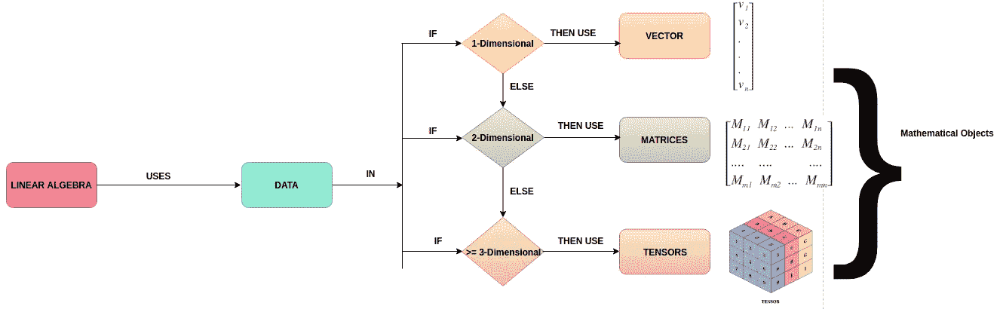

**如何在 AI 中使用数学或线性代数对象(向量、矩阵和张量)来存储不同维度的数据。**

**了解线性代数在人工智能中的应用。**

线性代数(数学对象)在人工智能中的应用。

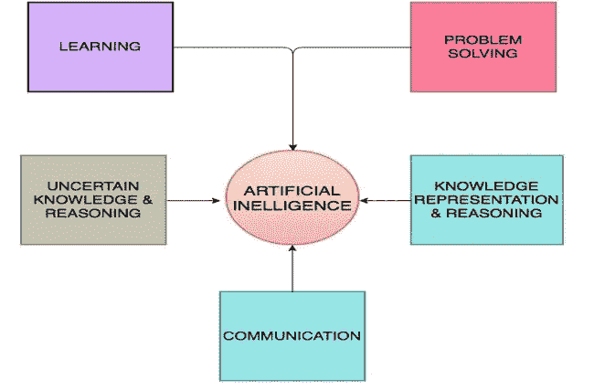

**AI 中的子字段**

人工智能不是一个单一的学科，它有子领域，如学习(机器学习和深度学习)，使用 NLP 的通信，知识表示和推理，问题解决，不确定知识和推理。

在这篇文章中，将解释对象及其属性是如何在人工智能的子领域 ML，NLP，DL 等中使用的。，算法。

描述可以应用 LA 对象的子领域概念。

浏览每个子领域，解释相关主题以及如何应用。下图解释了我们在人工智能中应用线性代数的领域。

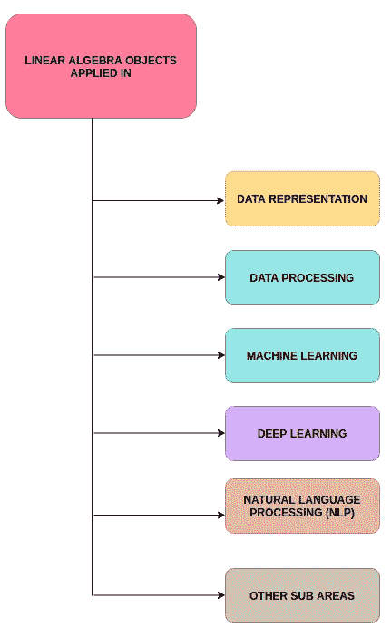

**应用于这些人工智能领域的 LA 对象**

N

在上面的图表中，使用了其他子领域，如问题解决、知识表示和知识推理，但在学习(ML/DL)和 NLP 中使用的不多。

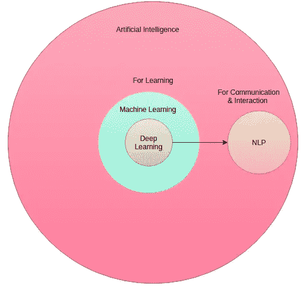

**描述这些子字段中的 LA 对象&属性**

线性代数或数学对象是向量、矩阵和张量。根据数据的维度，你必须选择正确的对象来存储和处理，标题图描述了这一点。

在开始如何在 AI 中使用数学对象之前，最好先刷新一下[线性代数](/@syedshafiuddin/linear-algebra-in-artificial-intelligence-quantum-computing-c61ea629367c?source=friends_link&sk=e23b456585fb059a08c54b8222ec63fa)。

**数据表示**:用数学对象向量、矩阵、张量来解释。

**数据集**:是实例或数据点或对象的集合。每个示例都是一组功能。每个示例是一行，特征是一列。

**设计矩阵:**数据集可以通过设计矩阵来描述。设计矩阵是每行包含不同示例的矩阵。例如:

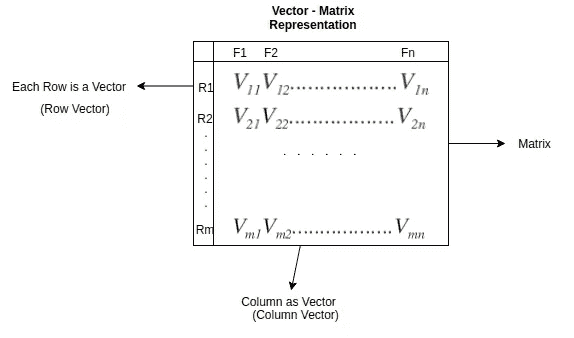

**设计矩阵表示**

如果数据没有特定的顺序，即每个示例/行的列不相同。在这种情况下，我们把包含“m”个元素的集合描述为具有不同向量大小的集合。

在监督学习中，数据集包含标签或目标以及特征集合。

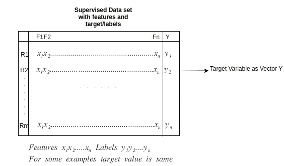

**监督学习的设计矩阵**

**数据处理**:在我们在 ML 算法或人工智能的任何子领域中使用数据集之前，有必要准备好数据集(净化&过滤)。

有 3 种形式的数据处理均值减法、归一化和 PCA &白化。这些表格在下图中简单描述。

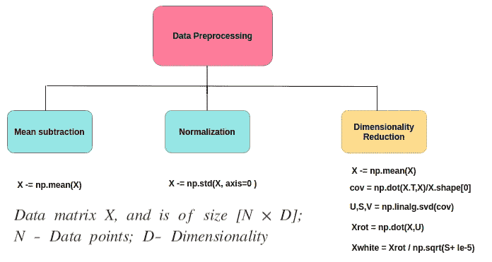

**通过 Numpy 解释的数据处理操作**

这三者形成访问矩阵并产生所需的。第三种形式的 PCA 用于降维，它完全在纯线性代数中工作，下面的算法描述它。

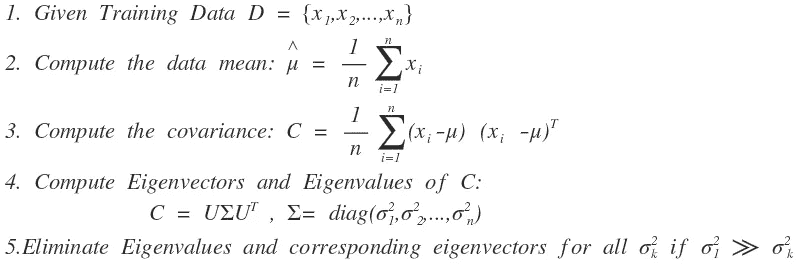

**训练数据的 PCA 算法**

在数据选择、工程、数据清理等过程中使用的一些操作。、argmin 和 argmax 是数据处理中的运算。它作用于矩阵和向量，并分别选择最小或最大的行或列。

这里轴可以是列或行。轴 0(零)表示列，轴 1(一)表示行。

**argmin** :返回一个轴上最小值的索引。

**argmax** :返回轴上最大值的索引。

**机器学习(ML) : ML** 是一种基于算法的方法，它从训练数据中学习，并对看不见的数据做出决策。最大似然中有许多算法用于监督和非监督学习。

**LA 概念如何应用于 ML-回归算法:**这里描述线性代数如何应用于回归分析。通过线性多元回归算法解释概念。下图描述了 ML 和 DL 中的 LA 概念。

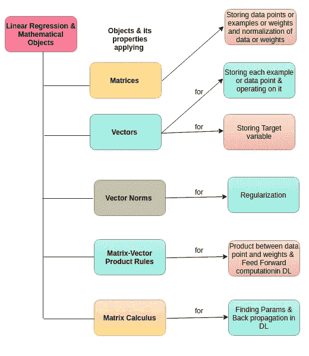

**ML 和 DL 中的 LA 对象、属性和用法**

**回归分析**用向量、矩阵及其性质来解释。

**什么是回归**？它是一种统计技术，用于估计因变量和自变量之间的关系。

回归分析最常见的形式是**线性回归**

下面的等式将描述简单和多元线性回归。

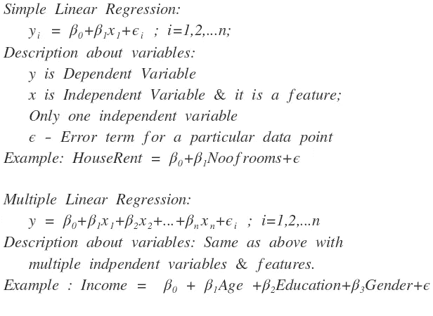

**简单&多元回归举例**

这种技术预测连续的反应——例如，预测股票价格、房租等。,.

**残差**:在机器学习/统计术语中，是目标变量的观测值与估计值之差。

符号如下所示:

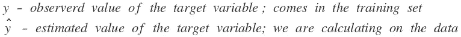

**目标变量**的观测值&估计值的符号

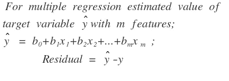

**多元回归中的残差**

**残差平方和**:我们把残差定义为**‘r’。**

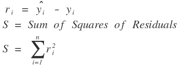

**最小二乘法**:最小二乘法是标准方法，它使残差**的平方和最小化。**

普通最小二乘法(OLS)或线性最小二乘法通过最小化残差平方和来估计回归模型中的参数。它通过使观察值和预测值(或拟合值或估计值)之间的 SSE 最小化的数据点画一条线。

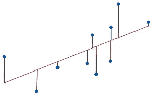

最重要的应用是数据拟合。

**数据拟合**:它是构造一个曲线拟合或数学函数的过程，对一组数据点进行最佳拟合。

曲线拟合可以是线性的，也可以是非线性的。下文描述了两条曲线。

**线性曲线**:

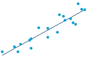

**线性曲线**

在引入回归分析之后，让我们定义它的损失和成本函数。

**损失函数**:线性回归的损失函数定义如下

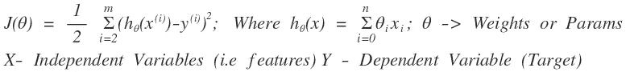

**回归的损失函数**

对参数求导求参数。

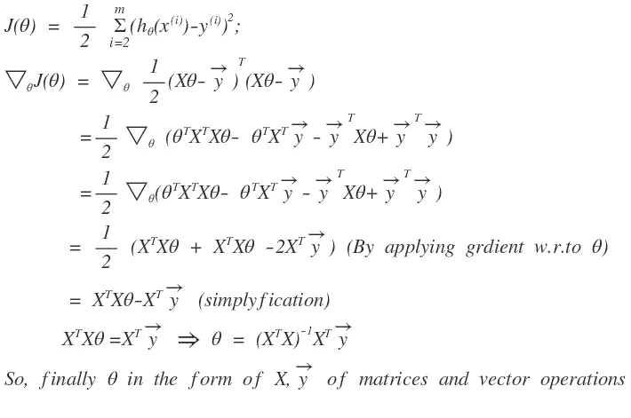

**通过对损失函数应用梯度来寻找权重或参数**

**什么是正则化**:为了避免过拟合问题，正则化技术被用来缩小参数的大小。这可以通过将罚值(参数和的函数)添加到成本函数中来实现。L1、L2、辍学和最大范数约束用于 DL，而 L1、L2、L1+L2 用于 ML。

如果你使用神经网络进行最大似然算法，你可以应用以上 4 种正则化技术。

**L2 正规化**:这是最常见的正规化形式。它可以通过直接在目标中惩罚所有参数的平方值来实现。

**L1 正则化**:每个权重 w 我们给目标函数加上 param*|w|项，L1、L2 都定义如下:

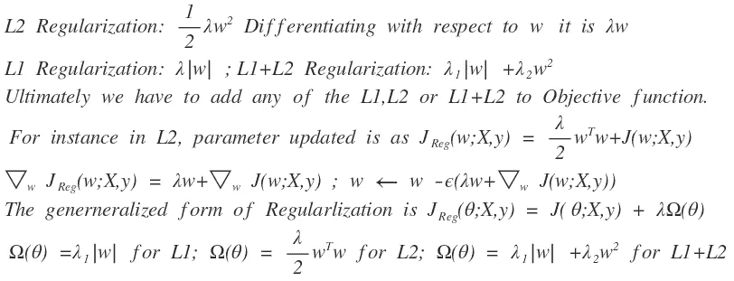

**广义正则化**

**在用于正则化的机器学习中使用向量范数:**

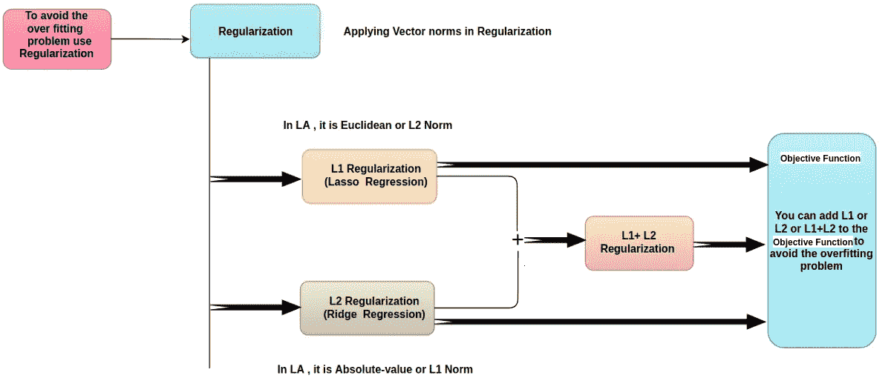

**正则化中的向量范数，以避免过拟合问题**

D**eep Learning(DL)**:它是 ML 的一个分支，深度学习文本、图像或视频。像图像或视频这样的非结构化数据可以使用 DL 来处理。DL 有许多应用，如图像处理(使用 CNN 的计算机视觉)、视频处理(使用 RNNs 的计算机视觉)、文本处理(使用 RNNs 的 NLP、LSTMs)等。，我们可以结合强化学习(DEEP RL)。

DL 的灵感来源于神经元。一个神经元与多个神经元连接，并在该神经元上应用激活功能。

向量、矩阵和张量是在 DL 领域使用的对象。下图是神经网络的示例，描述了输入、神经元、层、前馈传播、反向传播等。,

深度学习涉及许多数学学科，本文考虑线性代数。描述数学对象在每个阶段是如何被使用的。

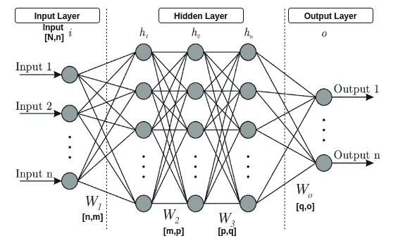

**常见神经网络架构**

**输入**:输入以向量、矩阵或张量的形式输入到神经网络。最后，每个数据对象/样本将在向量中。这里的输入是一个 n 维向量。它是数据集中的一个例子或数据点。

**神经元或节点**:这里我们对前一层的输入和权重或连接应用激活函数。它是一组相互连接的自然或人工神经元，使用数学或计算模型进行信息处理，基于连接主义的计算方法。

**连接:**生物神经元的连接被建模为权重。

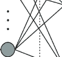

**每个神经元将连接到下一层的其他神经元**

**层**:每一层包含一组神经元，如下图所示。

**层包含神经元，并将在矢量级操作。**

**前馈传播**:这些被称为深度前馈网络或前馈神经网络或多层感知器(MLPs)。这些被称为前馈，因为信息流从 x 开始通过被评估的函数，通过用于定义 f 的中间计算，最后到达输出 y。

前馈神经网络之所以称为网络，是因为它们通常由许多不同的函数组合而成。

举个例子，我们的网络有三个功能连接成一个链，形成

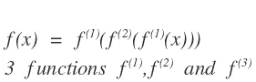

这些链结构被用作神经网络的结构。

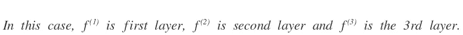

让我们看看如何在前馈网络中应用向量和矩阵。

1.  向量化输入、权重和偏差:x:n 维的输入向量；下一层 n 行 m 个神经元的 w-权重矩阵，下一层 m 个神经元的偏差。

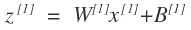

**输入、权重和偏差的整体计算进入临时变量 Z**

由此可以得出结论

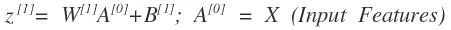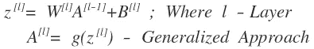

**广义方法**

2.将中间变量 Z 应用于激活函数

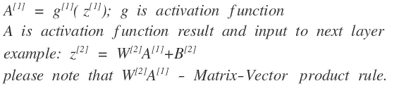

**前馈到下一层**

3.重复上述步骤，并以正向方式将结果馈送到下一层。

每个神经元的中间计算和激活函数如下:

考虑一个输入 2 个特征、3 个隐藏层和 1 个输出层的神经网络的例子，具有 3，5，4，2，1 个隐藏单元。

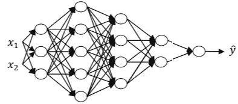

**具有 1 个输入、4 个隐藏和 1 个输出层的神经网络**

让我们将向量、矩阵运算用于正向传播。

**正向传播 4 层**

**了解你的矩阵维度**:

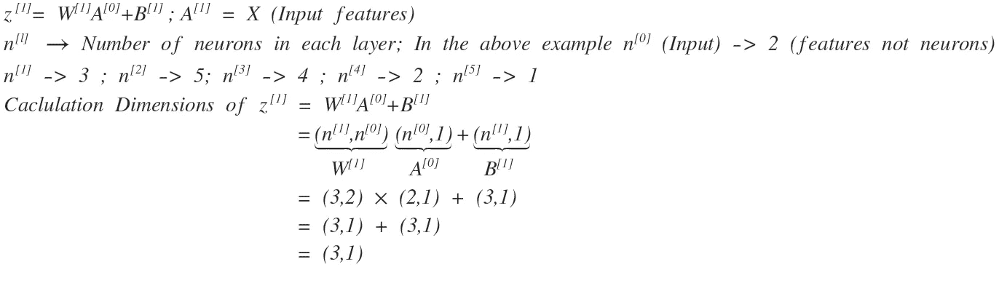

**矩阵的维数，前馈传播中的矢量**

**前馈传播** =矩阵-矢量积法则，矩阵与激活函数相加。

**反向传播** =矩阵演算+线性代数乘积规则——将在下一篇文章中介绍。

**自然语言处理(NLP):** NLP 关注的是人和计算机之间的交互，特别是如何对计算机进行编程，以处理和分析大量的自然语言数据。

这里我们描述用于 NLP 的 Word2Vector (W2V)技术。在 Word2Vec 中，每个不同的单词都有一个特定的数字列表，称为矢量。基于 W2V，我们可以应用向量属性来检查向量之间的相似性和语义相似性。

在 NLP 中，我们使用的向量和矩阵如下:

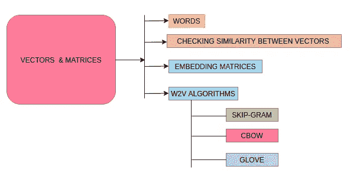

**W2V 算法中使用的向量和矩阵**

W2V 用于自然语言处理中的许多任务，它是将单词捕获到向量中的基础。自然语言文本=离散符号序列

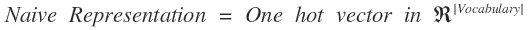

基于单词的上下文/使用产生密集的矢量表示。

**什么是目标&上下文单词**:考虑一个上下文窗口大小=2 的文本实例。以下描述

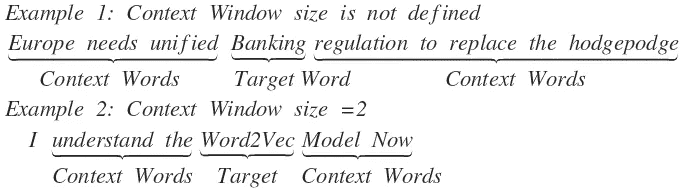

上下文和目标/当前单词

**如何表示一热表示法？**

**词汇**:特征向量中编码的单词集合称为词汇，所以向量的维数等于词汇的大小。简而言之，|V| =词汇表的大小。

假设我们的文本数据集包含以下几行

1.  “可爱的小猫发出呜呜声，然后…
2.  “可爱的毛茸茸的猫呜呜叫着…”
3.  "小猫喵喵叫着，她.."
4.  “那只毛茸茸的大狗跑过来咬了……”

从这 4 个句子的基础词汇:{比特，可爱，毛茸茸，大声，喵喵叫，咕噜，跑，小} — 8 是词汇长度。让我们定义目标词和上下文词。

目标词:**小猫**，语境词:{可爱，咕噜，小，喵喵}

目标词:**猫**，语境词:{可爱，毛茸茸，喵喵叫}

目标词:**狗**，上下文词:{大声，毛茸茸，跑，咬}。

现在我们把词汇长度表示为一个向量 **8。**

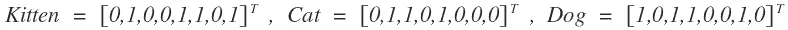

**作为向量的词**

我们将向量定义为当上下文单词出现时指定“1”，否则在向量的维度上指定“0”。

**检查向量之间的相似性**:为了检查相似性，我们可以使用内积(或)余弦作为相似性核心。

Sim(小猫，猫)=余弦(小猫，猫)~ 0.58；Sim(小猫，小狗)=余弦(小猫，小狗)~ 0.00；Sim(猫，狗)=余弦(猫，狗)~0.29

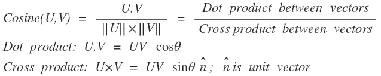

向量之间的余弦、点和叉积

**嵌入矩阵**:嵌入矩阵可以定义为行- >目标单词和列- >上下文单词的数量是上下文窗口的长度

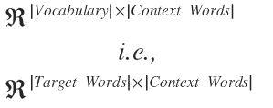

嵌入矩阵维数

行是单词向量，所以我们可以用一个热向量来检索它们

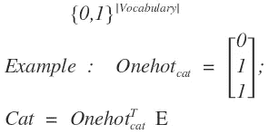

**用一个热键表示单词**

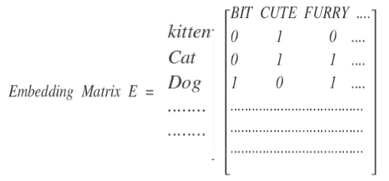

**以行为目标词的嵌入矩阵及其上下文词**

**构建嵌入矩阵的算法**:

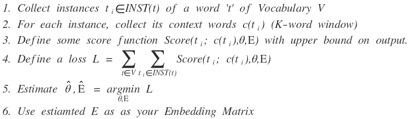

**构建嵌入矩阵的步骤**

捕捉单词含义的向量。也可以称为 Word2Vec，Word Emebedding。以下是算法

1.  **Skip-gram (SG)** :预测由目标单词给出的上下文单词
2.  **连续单词包(CBOW)** :预测上下文单词给出的目标单词
3.  **Glove** :利用全局共现统计。Glove 由一个加权最小二乘模型组成，该模型对全局单词-单词共现计数进行训练。

以上 3 种算法在《线性代数》中的用法说明。

**步骤 1:跳格(SG)** :跳格(SG)模型的目标是最大化平均对数概率

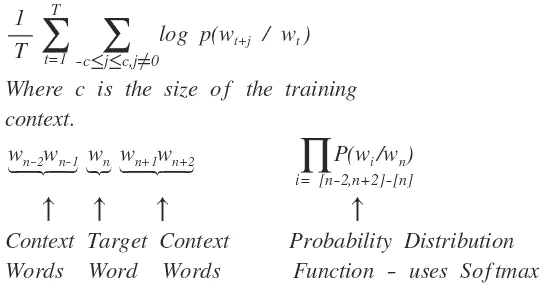

描述上下文和目标词

**步骤 2** :投射到词汇 Softmax

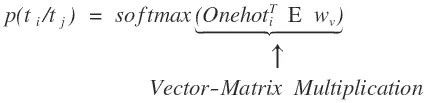

第三步:学会估计上下文单词的可能性

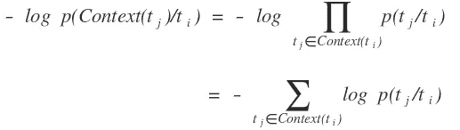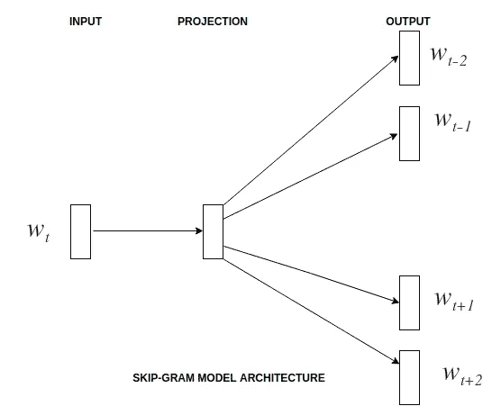

**跳格图**

**连续词包(CBOW)** :根据上下文词预测目标词或当前词。它的可能性分布是

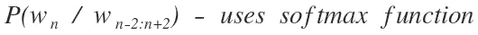

*   投射回词汇大小/最大值

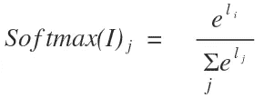

*   嵌入上下文单词，添加它们。

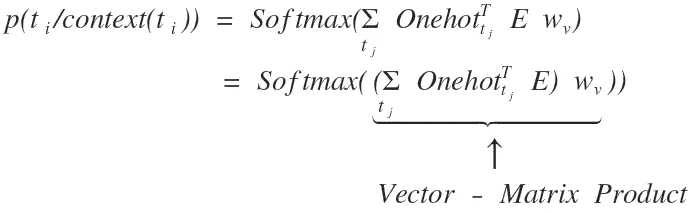

**在 LA** 中以向量矩阵乘积规则的 softmax 形式表示当前单词

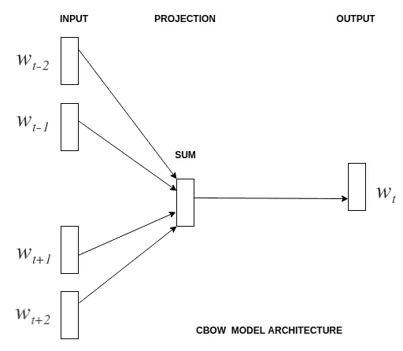

**CBOW**

**GLOVE** :和 word2vec 一样，GLOVE 是一组捕捉语义信息(即单词的含义)的向量。它由一个加权最小二乘模型组成，该模型对全局单词-单词共现计数进行训练。

Glove 利用了全局发生统计。

**共现矩阵**:我们使用下面的语料库定义这个矩阵。

我喜欢深度学习；我喜欢 NLP 我喜欢飞行。

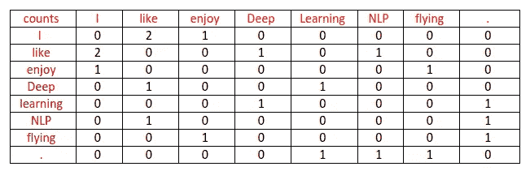

**同现矩阵**

设 X 为单词-单词共现计数矩阵。

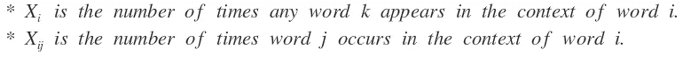

像 word2vec 中的情况一样，每个字有两个向量，输入(v)和输出(u)

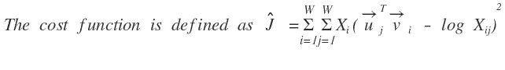

**手套模型的成本函数**

**结论**:描述了线性代数如何应用于人工智能的各个领域，在我们进入 ML、DL 或 NLP 之前，最好对线性代数感兴趣。我试图从算法的角度讲述如何应用线性代数的东西，我希望它能给我更多地参与线性代数的力量。

线性代数促进了其他学科的发展，如在 DL 语言中大量使用反向传播的矩阵微积分。

感谢您阅读这篇文章，如果有任何错误，请留言，并感谢您的反馈。

**参考文献**:

1.  《人工智能:一种现代方法》,作者斯图尔特·罗素，彼得·诺维格，
2.  [深度学习书籍](https://www.deeplearningbook.org/)作者:伊恩·古德菲勒、约舒阿·本吉奥和亚伦·库维尔
3.  [https://en.wikipedia.org/wiki/Regression_analysis](https://en.wikipedia.org/wiki/Regression_analysis)
4.  [http://web.stanford.edu/class/cs224n/](http://web.stanford.edu/class/cs224n/)
5.  [向量空间中单词表示的有效估计](https://arxiv.org/pdf/1301.3781.pdf)
6.  [https://nlp.stanford.edu/projects/glove/](https://nlp.stanford.edu/projects/glove/)