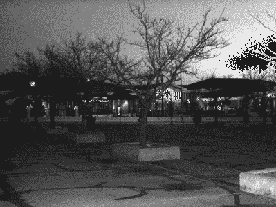

# 线性代数很有趣，相信我！(第一部分)

> 原文：<https://medium.com/analytics-vidhya/linear-algebra-is-fun-trust-me-part-1-dfab83c2453e?source=collection_archive---------7----------------------->


来源:[线性代数漫画指南](https://www.amazon.in/Manga-Guide-Linear-Algebra-Guides/dp/1593274130)

线性代数是在机器学习中广泛使用的一个数学领域，尤其是在深度学习领域。为了理解各种机器学习和深度学习算法，需要很好地理解这一领域。

有许多资源有助于建立一个坚实的线性代数基础，并彻底解释概念。我个人推荐的是吉尔伯特·斯特朗教授的[麻省理工学院的线性代数课程](https://ocw.mit.edu/faculty/gilbert-strang/)和古德费勒、本吉奥和库维尔的深度学习书籍的第二章[(我在这里](https://www.deeplearningbook.org/contents/linear_algebra.html)对第 [章做了**总结，以使内容更易于读者理解)。3 布鲁斯 1 布朗**](https://github.com/thechange/Book-Summaries/blob/master/DeepLearningBook/2.%20Linear%20Algebra..ipynb)做了一件了不起的工作，通过可视化来解释数学概念。

然而，即使一个人已经理解了所有的数学知识，也很难弄清楚**线性代数在哪里**和**在实现现实生活中的应用**时到底有多合适？通过这个系列，我试图通过解释一点(不太严格的)数学以及它们在我们经常遇到的各种应用中的使用，为您提供足够的细节来理解线性代数的一些关键概念。

*请注意，我在这里展示的实现非常简单，可能从来没有在生产中使用过，但会让您了解线性代数在现实生活中的应用。*

让我们从以下主题开始:

*   标量、向量和矩阵
*   ____ 转置
*   ____ 标量乘法
*   ____ 点产品
*   ____ 卷积

# 【TL；DR]:帖子中涉及的应用:

*   **强度缩放**
*   **文档相似度**
*   **图像模糊/平滑**
*   **检测图像中的模糊**

# 标量、向量和矩阵

本节涵盖标量、向量和矩阵的基础知识，以及转置、点积、标量乘法等概念。如果您已经熟悉这些应用程序，可以直接跳到**应用程序。**


空间向量的可视化

一个**标量** *s* (通常用小写斜体表示)只是一个单一的数字，与此相反的是一个**向量** **x** (通常用小写粗体表示)是一组相同类型的数字。我们可以把向量看作是空间中的识别点，每个元素给出了沿 different 轴的坐标，如图(左)所示。

另一方面，**矩阵** **A** (用大写加粗字体表示)是一个二维数字数组，如下所示:


Aᵢⱼ表示矩阵的第 I 行第 j 列中的元素

例如，一个**图像**是一个按列和行排列的正方形**像素**的**矩阵**。有时我们可能需要一个二维以上的数组。在线性代数中，这样的物体被称为**张量。**


来源:[https://dev . to/mmithrakumar/scalars-vectors-matrix-and-tensors-with-tensor flow-2-0-1f 66](https://dev.to/mmithrakumar/scalars-vectors-matrices-and-tensors-with-tensorflow-2-0-1f66)

现在让我们看看对这些对象执行的操作。

## 移项

转置是对矩阵执行的最重要的操作之一。一个矩阵 **A** 的转置 **Aᵀ** 是通过翻转其对角线(称为**主对角线**)得到的矩阵。


转置:(Aᵀ)ᵢⱼ = Aⱼᵢ)

如果你认为一个向量是一个只有一列(或一行)的矩阵，那么它的转置将产生一个只有一行(或一列)的行向量(或列向量)。

## **标量和矩阵相乘**

我们可以将一个矩阵乘以一个标量、向量或乘以另一个矩阵。这些操作中的每一个都有自己的特点和用法。我们一个一个来看。

**标量乘法:**


标量乘法|来源:可汗学院

一个矩阵可以乘以一个标量，只要把矩阵的每个元素都乘以它。

现在，你一定想知道这样一个简单的手术能有什么好处。嗯，标量乘法的一个非常流行的用法是图像中的**强度缩放**(不要与几何缩放混淆)。

给定大于 1 的缩放因子，强度缩放将使图像变亮，如果标量小于 1，将使图像变暗。例如，下图是在光线不足的情况下拍摄的。


原象

图像太暗了，我们几乎什么也看不见。让我们试着乘以一个标量，看看它是如何变化的。

```
image = cv2.imread('image.jpg')
cv2.imshow('Bright Image', image*4)  #Scalar multiplication by 4
```



亮度缩放后的图像

简单地将每个像素缩放 4 倍，我们获得了一个更清晰的图像(左图)。但是，我们应该确保计算出的像素不超过最大值。例如，如果我们将上面的图像乘以系数 6，我们会得到右边的图像。如果你注意到，右上区域是扭曲的。原始图像中乘以 6 后超过最大值(本例中为 255)的所有像素被**从 255 环绕**回到 0。

*所以下次你使用照片编辑应用程序来改变图像的强度时，你就知道幕后发生了什么。*

**矩阵乘法**


点产品|来源:可汗学院

涉及矩阵的最重要的运算之一是两个矩阵相乘。对于矩阵 **A** 和**B**的**矩阵乘积**，A**A**中的列数(n)应该等于 B**B**中的行数(p)。如果 **A** 的形状为 *m* x *n* 并且 **B** 的形状为 *p* x *q* ，则得到的矩阵 **C** 的形状为 *m* x *q.*

产品操作可以通过上图直观显示，并由以下内容定义:


两个向量 ***x*** 和 ***y*** 的点积可以写成


两个向量按范数的点积

其中|| ***x*** ||₂和|| ***y*** ||₂表示向量坐标到向量空间原点的距离( [L₂范数](https://en.wikipedia.org/wiki/Norm_(mathematics)))，θ表示它们之间的角度。

点积的一个非常著名的应用是计算**文档相似度。**实际上，**余弦相似度**是用于确定两个文本/文档相似程度的相似度度量。假设我们有两个向量，每个向量代表一个句子。它们之间的角度(从点向量获得)使我们了解它们的相似性，其中正交性(θ= 90°**)**表示不相似，θ= 0°(平行)表示文档相似。

比如考虑以下三句话:
a = "这篇文章真的很有趣"
b = "另一篇文章真的很有趣"
c = "这很无聊"

现在，我们将这些句子中的每一个表示为向量，向量中的每一个元素都将表示所有三个句子中单词的存在。(这种方法被称为**单词袋**方法。你可以在这里阅读其他一些文本矢量化技术。


让我们看看相似之处是什么:

```
def cosine_sim(a, b):
    dot_product = np.dot(a, b)
    norm_a = np.linalg.norm(a)
    norm_b = np.linalg.norm(b)
    return dot_product / (norm_a * norm_b)#Representing sentences as vectors
a = np.array([1, 0, 0, 1, 1, 1, 0, 1]) 
b = np.array([0, 1, 1, 1, 1, 1,  0, 1])
c = np.array([1, 0, 0, 1, 0, 0,  1, 0])#Sentence a and b should be more similar
print(cosine_sim(a, b)) # 0.73
print(cosine_sim(b, c)) # 0.23
print(cosine_sim(a, c)) # 0.23
```

我们看到，与 b 和 c(或 a 和 c)相比，句子 a 和 b 更相似，因为它们有更多的共同词汇。不管这看起来有多天真，通过一些预处理，余弦相似性已经显示出可以给出很好的结果。

**卷积**

卷积是乘法运算的一种改进，其中两个矩阵(维数相同)的元素乘法之后是求和。

卷积是计算机视觉领域中最关键和最基本的构件之一。简单来说，有一个小矩阵(称为**内核**)位于一个大矩阵(比如说，原始图像)上，从左到右和从上到下滑动，同时在每个坐标上应用卷积。


卷积:黄色矩阵表示内核，而绿色矩阵可以被认为是原始图像的一部分

虽然卷积形成了最复杂的计算机视觉应用的基础，但是一些基本应用涉及图像中的模糊、锐化、边缘检测等。

以下是使用 **7x7 平均模糊内核**平滑/模糊图像的示例

```
image = cv2.imread('original.jpg')
blur_filter = np.ones((7, 7), np.float)/(49.0) #kernel*#filter2D performs the convolution operation for us* image_blur = cv2.filter2D(image, -1, blur_filter)
```


原始图像与模糊图像

你有没有注意到现在的照片管理应用程序是如何将模糊图像和非模糊图像区分开来的？有趣不是吗？正如你一定已经猜到的，卷积为他们完成了这个任务。

一种非常有效的方法是通过计算拉普拉斯的**变化(由 Pech-Pacheco 等人在其论文[明场显微镜中的硅藻自动聚焦:比较研究](http://optica.csic.es/papers/icpr2k.pdf)中提出)。该方法可以分两步**实施。****


拉普拉斯滤波器

*   使用**拉普拉斯滤波器**卷积图像
*   计算响应的方差，并将其与阈值进行比较

OpenCV 用一行代码帮助我们做到了这一点。让我们把它应用到我们用来模糊的图像上。

```
 cv2.Laplacian(image, cv2.CV_64F).var()
```


根据模糊程度分类的图像。[代号](https://github.com/thechange/Blogs/blob/master/Linear%20Algebra%20is%20fun%20Part%201.ipynb)

我强烈建议你通过 [PyImageSearch](https://www.pyimagesearch.com/) 的[这篇](https://www.pyimagesearch.com/2015/09/07/blur-detection-with-opencv/)教程来详细了解模糊检测。

# 结论

这个帖子到此为止。我希望这些应用能让线性代数对你更有吸引力。在接下来的帖子中，我会涉及更多的概念，比如**基、奇异值分解**和**特征分解**。你可以在这里找到覆盖所有这些应用[的**完整** **代码**。](https://github.com/thechange/Blogs/blob/master/Linear%20Algebra%20is%20fun%20Part%201.ipynb)

敬请关注即将发布的帖子！！

请随时提供反馈和建议(喜欢就鼓掌)。你可以在 [Linkedin](https://www.linkedin.com/in/shanya-sharma-thechange/) 和 [Twitter](https://twitter.com/evolvedeve) 上和我联系。