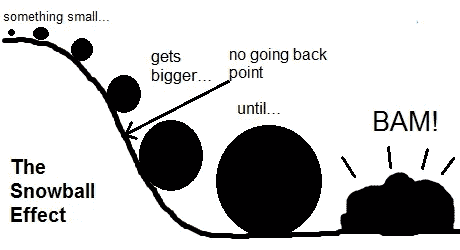
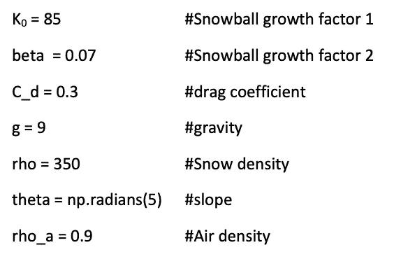
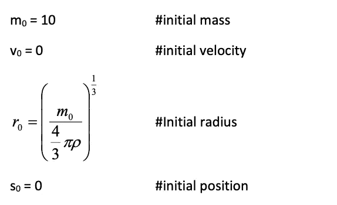
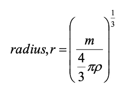
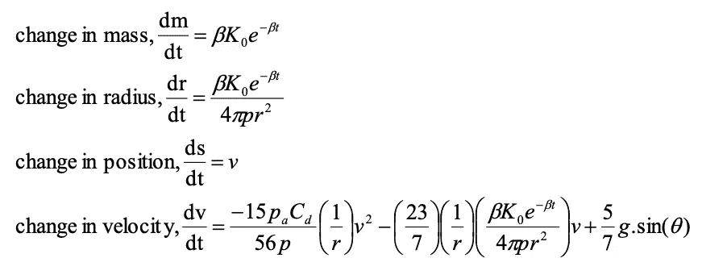
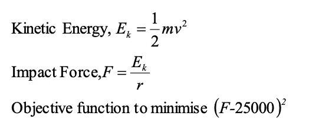

# 数据科学的线性规划

> 原文：<https://medium.com/analytics-vidhya/linear-programming-for-data-science-f5d93c214818?source=collection_archive---------13----------------------->

作为一名渴望成为数据科学家的人，我忽略了成为一名数据科学家所需的最基本也是最重要的话题之一，那就是线性编程。线性规划是一种简单的技术，通过线性函数来描述复杂的关系，然后找到最佳点，或者用外行的术语来说，对问题进行优化。优化是我们日常生活的一部分，因为我们必须在有限的资源和时间下生活，为了生存我们需要充分利用它。优化可以以简单的形式出现，例如事先规划我们的购物行程，一直到创建一种算法，在当前的新冠肺炎疫情期间，在所有旅行限制的情况下，将航空乘客连接到他们的目的地。在这里，我将检查一个问题，以帮助您更好地理解如何使用线性编程来解决任何问题。

注意:我假设你熟悉高中数学，因为我不会详细解释某些部分。

[**Github 库更多例子**](https://github.com/yudhiesh1997/Optimisation-Deep-Learning/blob/master/LinearProgramming2.ipynb)

## 雪球问题

一个雪球从山上滚下 30 秒后，最初要多大才能撞倒一棵树？假设推倒一棵树需要 25000 牛顿。



# 公式和参数:

这里是我们将用来帮助我们解决这个问题的公式和参数。

## 参数:



## 初始雪球条件:



## 半径公式:



## 动态雪球功能:



## 目标函数的函数:



我知道一开始被抛出一堆公式和参数看起来很吓人，但请耐心听我说，一旦我们开始解决它，它会变得更容易理解。

# 开始编码吧！

这里是为此需要的进口。NumPy 是用于科学计算的 python 库。SciPy 是一个用于数学函数的 python 库。

```
**import** **numpy** **as** **np
import** **pulp** **as** **p** 
**from** **scipy.optimize** **import** minimize **from** **scipy.integrate** **import** odeint
```

## 决策变量和约束

这里我们定义了决策变量所需的参数。这些变量将决定产量。约束是对决策变量的约束或限制。它们作为限制器来限制决策变量的值。这里的约束是**目标力**和**时间。**

```
*# define the parameters*
K0 = 85
beta = 0.07
C_d = 0.3
g = 9.8
rho = 350
theta = np.radians(5)
rho_a = 0.9

*# initial snowball conditions* 
m0 = 10
v0 = 0
r0 = (m0/(4/3.0* np.pi *rho))**(1/3.0)
s0 = 0

*# Target Force* 
F_d = 25000

*# Set up time array to solve for 30 seconds* 
t = np.linspace(0,30)
```

这里我们定义了滚落山下的雪球的运动方程的函数。我们解开变量**质量**、**半径**、**物体移动的距离**以及**速度**距离 **w.**

我们还从 **p** 解包参数，并在代表四个微分方程的**函数的 **f** 中使用它们。**函数存储在一个列表中，我们可以对其进行索引，以便以后访问。虽然看起来很复杂，但所有这些方程都只是微分方程的代码，输入时你必须格外小心，因为这是一项非常繁琐的任务，很容易出错。

```
*# define the function of dynamics snowball, the equations of motion*
**def** snowball_dynamics(w,t,p):

    *#Unpack state variables*
    M, r, s, v = w

    *#Unpack parameters*
    K0, C_d, g, rho, theta, rho_a, beta = p

    *#Make an array of the right hand sides of the four differential equations that make up our system*
    f = [beta * K0 * np.exp(-beta*t),
        (beta * K0 * np.exp(-beta*t))/(4*np.pi*rho*r**2),
        v,
        (-15*rho_a*C_d)/(56*rho)*1/r*v**2-23/7*1/r*beta*K0*np.exp(-beta*t)/(4*np.pi*rho*r**2)*v+5/7*g*np.sin(theta)]
    **return** f
```

## 目标函数与非负约束

目标函数用于设定决策的目标。在这个例子中，我们试图计算出或最小化一个能击倒一棵树的雪球的大小。大是有点主观的，所以我们将计算出雪球的质量和半径。当我们谈论最小化一个函数时，我的意思是，满足这个问题的函数的最小可能值是多少？例如，当处理梯度下降时，目标是最小化成本函数，以便在训练实例上获得模型的最低可能误差。

非负限制确保决策变量应该总是取非负值，或者应该大于或等于 0。这是在倒数第二行完成的，其中声明了 **obj** 。

```
*#Define the objective function, minimise the output of this function by changing the initial snowball mass*
**def** objective(m0): *#load parameters*
  p = [m0, C_d, g, rho, theta, rho_a, beta] *#get the initial radius from initial mass*
  r0 = (m0/(4/3.0*np.pi*rho))**(1/3.0) *#set initial guesses*
  w0 = [m0, r0, s0, v0] *#integrate forward for 30 seconds*
  sol = odeint(snowball_dynamics, w0, t, args=(p,)) *#calculate kinetic energy at the end of the run
  #* sol[:,0][-1] 
  # we are accessing the last values from the first column which stores    mass
  # column 3 contains the values of velocity  ke = 0.5 * sol[:,0][-1]* sol[:,3][-1]**2 *#calculate force required to stop snowball in one snowball radius*
  F = ke/ sol[:,1][-1] *#Compare to desired force: This should be equal to zero when we are done*
  obj = (F - F_d)**2
  **return** obj
```

## 最后运行函数以获得结果

这里我们用参数 **m0** 最小化目标函数。当我们在寻找初始质量时，我们取结果中的第一个值，并用它来计算初始质量(千克和磅)以及初始半径(厘米和英寸)。

```
*# Call optimisation using the function defined above*
res = minimize(objective, m0, options ={"disp": **True**})

*# Get the optimized initial mass from solution* 
m0_opt = res.x[0]

*# calculate the optimised initial radius from the initial mass*
r0_opt = (m0_opt/(4/3.0*np.pi*rho))**(1/3.0)

print(f'Initial mass : **{m0_opt}**kg {m0_opt*2.02}lbs')
print(f'Initial radius : {r0_opt*100}cm  {r0_opt*39.37}inches')
```

## 输出:

我们的答案是，初始质量大约为 54.5 千克，初始半径为 33.4 厘米

```
Optimization terminated successfully.
         Current function value: 0.000000
         Iterations: 9
         Function evaluations: 33
         Gradient evaluations: 11
Initial mass : 54.4727546940319kg 110.03496448194444lbs
Initial radius : 33.36882350231841cm  13.137305812862758inches
```

# 结论:

对于任何对机器学习/数据科学感兴趣的人来说，线性编程是一项至关重要的技能。在机器学习和深度学习中，一切都是关于优化的。在它的核心，你试图最小化某种损失函数，这本身就是一个优化问题。我建议学习线性规划的主要原因是因为它将帮助你理解为什么凸/非凸优化方法有效的理论结果。ML 算法由凸优化或非凸优化组成。这两个类别之间的基本区别是，在凸优化中只能有一个最优解，这是全局最优的，或者您可能会证明该问题没有可行的解决方案，而在非凸优化中可能有多个局部最优点，并且可能需要花费大量时间来确定该问题是否无解或者该解决方案是否是全局的。因此，凸优化问题的时间效率更好。凸优化问题的主要类型是有限维空间中的逻辑回归或无限维空间中的核支持向量机。非凸优化，如使用深度神经网络，是当今大多数研究的内容。至此，我希望你能更好地理解线性规划以及如何用它来解决其他问题。