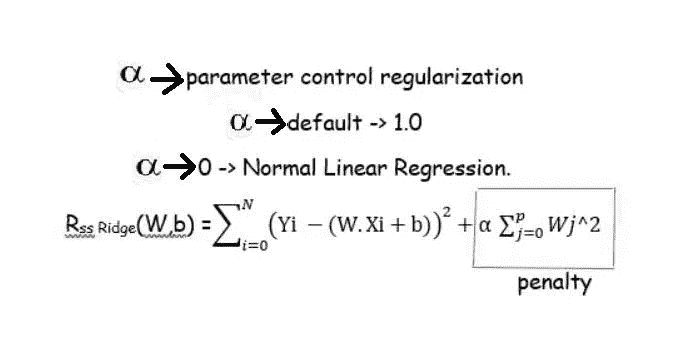

# 线性回归

> 原文：<https://medium.com/analytics-vidhya/linear-regression-225904ee7bcc?source=collection_archive---------9----------------------->


# **什么是回归？**

回归分析是一种强大的统计方法，允许您检查两个或更多感兴趣的变量之间的关系。回归分析是确定哪些变量对感兴趣的主题有影响的可靠方法。执行回归的过程允许您自信地确定哪些因素最重要，哪些因素可以忽略，以及这些因素如何相互影响。

## **线性回归**

它是研究*变量之间的线性*、*加法*关系。线性回归模型的因变量是连续变量，而自变量可以采用任何形式(连续、离散或指示变量)。

为了全面理解回归分析，有必要理解以下术语:

*   因变量:这是你试图理解或预测的主要因素。
*   **自变量:**这些是你假设对因变量有影响的因素。

## **简单线性回归**:

简单线性回归模型只有一个自变量，而多元线性回归模型有两个或更多自变量。对于寻找两个连续变量之间的线性关系(直线关系)很有用。(因果关系)


必须选择 b0 和 b1 值，以使误差最小。

在线性回归中，
预测因子- > X - >特性。
预测- > Y - >目标变量。
系数- > b0，b1。

## **误差平方和**:

它被认为是度量，然后目标是获得减少误差的最佳线。


如果我们不平方误差，那么正负点就会互相抵消。

X 的单位变化影响 Y 的速率(预测)

使用 OLS(普通最小二乘回归)技术计算系数。OLS 技术捕捉最佳可能直线，给出预测(Y)和预测(X)变量之间更好的关系。是尽可能接近多点的线。计算每一点离直线的距离。我们从 y 轴得到的距离，有些是正的，有些是负的。平方然后求和。距离最小的线是可能的最佳线。


因此选择具有最小均方误差的线。它也被称为剩余平方和。


Yi =训练集目标值。(W.Xi+b)=使用模型预测的目标值。

## **python 实现**

让我们以波士顿房价数据为例，

```
import pandas as pd
import numpy as npfrom sklearn.datasets import load_boston
boston = load_boston()
print(boston.data.shape)
boston.keys() 
```

**数据**

```
pd.DataFrame(boston.data).head()
```

**目标**

```
pd.DataFrame(boston.target).head()
```

**功能名称和描述**

```
print(boston.feature_names)
print(boston.DESCR)
```


**创建数据帧**

```
boston_data = pd.DataFrame(boston.data)
boston_data.columns = boston.feature_names
boston_data['MEDV']=boston.target
print(boston_data.head())
```


**可视化**

```
import matplotlib.pyplot as plt
plt.hist(boston.target)
plt.title('Boston Housing Prices and Count Histogram')
plt.xlabel('price ($1000s)')
plt.ylabel('count')
plt.show()
```


下面将创建一个散点图，显示每个要素名称与波士顿房价的关系。

```
import seaborn as snssns.pairplot(boston_data,x_vars=['CRIM','ZN','INDUS','CHAS','NOX','RM','AGE','DIS','RAD','TAX','PTRATIO','B','LSTAT'], y_vars=["MEDV"])
```


```
#separating the dependent and independent variables
X = boston_data.drop('MEDV', axis = 1)
Y = boston_data['MEDV']
```

> **sci kit-learn 中的最小二乘线性回归:**

```
x_train, x_test, y_train, y_test = train_test_split(X, Y, random_state = 0)Linreg = LinearRegression().fit(x_train, y_train)print("Linear model intercept(b):{}".format(Linreg.intercept_))
print("Linear model coeff (w):{}".format(Linreg.coef_))
print("R-squared score(training): {:.3f}".format(Linreg.score(x_train,y_train)))
print("R-squared score(test): {:.3f}".format(Linreg.score(x_test,y_test)))
```

Y=W0。X0+b
W0 = Linreg.coef_，b=linreg.intercept_

***linreg.coef_*** 和***linreg . intercept _***:-下划线表示来自训练数据的量，与用户设置相反。


```
y_pred = Linreg.predict(x_test)plt.scatter(y_test, y_pred)
plt.xlabel("Prices: $Y_i$")
plt.ylabel("Predicted prices: $\hat{Y}_i$")
plt.title("Prices vs Predicted prices: $Y_i$ vs $\hat{Y}_i$")
```


```
from sklearn.metrics import mean_squared_error
mse = mean_squared_error(y_test, y_pred)
print(mse)
```


这意味着这个模型不是一个真正伟大的线性模型

现在让我们借助于正则化来改善这个“R 分数”。

## **线性回归中的变化:**

## ***1。*岭线性回归**:

它使用相同的“最小平方准则”,但是增加了对“W”参数(b1)的大变化的惩罚，以避免过度拟合和复杂的模型。
罚参数称为正则化
岭回归采用- > L2 正则化



具有较大特征权重(W)的模型将为目标函数的总体值增加更多。
因为我们的目标是最小化整体目标函数，正则化项充当具有大量大特征权重值的模型的惩罚。
·更高的 Alpha 意味着更规范。

## **特征归一化的需要:**

当输入变量、特征具有非常不同的尺度时，那么当正则化系数时，具有不同尺度的输入变量将对该 L2 惩罚具有不同的贡献。
因此，所有输入特征必须在相同的比例上。


**使用标量对象:拟合和变换方法**

```
from sklearn.preprocessing import MinMaxScaler
Scaler = MinMaxScaler()
X_train_Scaled = Scaler.fit_transform(x_train)
X_test_Scaled = Scaler.transform(x_test)
clf = Ridge().fit(X_train_Scaled , y_train)
R2_score = clf.score(X_test_Scaled, y_test)
```

**正则化参数为α的岭回归**

```
from sklearn.linear_model import Ridgeprint('Ridge regression : effect of alpha regularization parameter \n')
for this_alpha in [0,1,10,20,50,100,1000]:
    linridge = Ridge(alpha = this_alpha).fit(X_train_Scaled,y_train)
    r2_train = linridge.score(X_train_Scaled, y_train)
    r2_test = linridge.score(X_test_Scaled, y_test)
    num_coeff_bigger = np.sum(abs(linridge.coef_)>1.0)
    print('Alpha = {:.2f}\n numabs(coeff) >1.0:{}, r->squared training: {:.2f}, r_squared test: {:.2f}\n'.format(this_alpha,num_coeff_bigger,r2_train,r2_test))
```


## 岭回归在做什么？

它通过对“w”系数的大小施加平方和惩罚来正则化线性回归。所以α的作用是将 w 系数收缩到零，并相互靠近。

## **2。*拉索回归* :**

这是另一种形式的正则化线性回归，使用 L1 正则化。
L1 惩罚:最小化系数的绝对值之和。


这具有将“w”中的参数权重设置为零的效果。影响最小的变量。这就是所谓的稀疏解。这是一种特征选择。


```
from sklearn.liner_model import Lasso
from sklearn.preprocessing import MinMaxScalerScaler = MinMaxScaler()
X_train_Scaled = Scaler.fit_transform(x_train)
X_test_Scaled = Scaler.transform(x_test)
clf = Ridge().fit(X_train_Scaled , y_train)
R2_score = clf.score(X_test_Scaled, y_test)linlasso = Lasso(alpha=0.0001, max_iter=10e5).fit(X_train_Scaled,y_train)
print('lasso regression linear model intercept:{}'.format(linlasso.intercept_))
print('lasso regression linear model coeff:\n{}'.format(linlasso.coef_))
print('Non-zero feature :{}'.format(np.sum(linlasso.coef_!=0)))
print('R-Squared score(training):{:.3f}'.format(linlasso.score(X_train_Scaled, y_train)))
print('R-Squared score(test):{:.3f}\n'.format(linlasso.score(X_test_Scaled,y_test)))
```


**什么时候使用山脊 vs 套索回归？**
许多小型/中型效果:使用山脊
只有少数变量具有中型/大型效果:使用套索

## **3。*线性回归多项式特征* :**

生成由原始两个要素(X0，X1)的所有多项式组合组成的新要素。
多项式的次数指定了每次有多少变量参与每个新特征。(我们的 eg: degree 2)
这仍然是特征的加权线性组合，因此它仍然是线性模型，并且可以对“w”和“b”(系数)使用相同的最小二乘消除方法。


**我们为什么要转换数据？**
通过将原始特征作为特征添加到线性模型中来捕捉它们之间的相互作用。
·简化分类问题。

***例如:*** 作为一个理论上的例子，房价可能是作为房屋坐落的土地价格和为该房产支付的税款的二次函数而变化的。
简单的线性模型无法捕捉这种非线性关系，但通过在线性回归模型中添加多项式等非线性特征，我们可以捕捉这种非线性关系。

小心高次多项式特征扩展，因为这会导致过度拟合的复杂模型。
因此，多项式特征扩展通常与岭回归等正则化学习方法相结合。

**现在同时运行所有三个并检查:**

```
from sklear.linear_model import LinearRgression
from sklearn.linear_model import Ridge
from sklearn.preprocessing import PolynomialFeaturesPoly = PolynomialFeatures(degree =2)
X_F1_poly = Poly.fit_transform(X)
x_poly_train, x_poly_test, y_train, y_test = train_test_split(X_F1_poly, Y, random_state = 0)linreg = LinearRegression().fit(x_poly_train, y_train)
print('(poly deg 2) Linear model coeff(W):\n{}'.format(linreg.coef_))
print('(poly deg 2) Linear model intercept(b):{:.3f}'.format(linreg.intercept_))
print('(poly deg 2) R-Squared score (training):{:.3f}'.format(linreg.score(x_poly_train, y_train)))
print('(poly deg 2) R-Squared score (test):{:.3f}'.format(linreg.score(x_poly_test, y_test)))
```


添加许多多项式特征通常会导致过度拟合，因此我们经常将多项式特征与具有正则化惩罚的回归(如岭回归)结合使用。

**岭回归避免过拟合:**

```
Poly = PolynomialFeatures(degree =2)
X_F1_poly1 = Poly.fit_transform(X)
x_poly_train1, x_poly_test1, y_train, y_test = train_test_split(X_F1_poly1, Y, test_size=0.4, random_state = 0)linrid = Ridge(alpha = 0.001).fit(x_poly_train1, y_train)
print('(poly deg 2) Linear model coeff(W):\n{}'.format(linrid.coef_))
print('(poly deg 2) Linear model intercept(b):{:.3f}'.format(linrid.intercept_))
print('(poly deg 2) R-Squared score (training):{:.3f}'.format(linrid.score(x_poly_train1, y_train)))
print('(poly deg 2) R-Squared score (test):{:.3f}'.format(linrid.score(x_poly_test1, y_test))))
```


正如我们从上面的输出中所看到的，带有岭回归的多项式特征在没有过度拟合的情况下给出了最佳的可能输出。

***1。第一次回归*** :只使用最小二乘回归，没有多项式特征变换。
**2。** ***第二次回归*** :创建次数设置为 2 的多项式特征对象，然后调用多项式特征的‘fit _ transform’方法。然后代码调用普通最小二乘线性回归。
我们可以在这个扩展的特征表示上看到过度拟合的迹象，因为训练集上的模型 R 平方分数接近 1，但是在测试集上低得多。
**3。*第三次回归*** :训练和测试集基本相同。正则化多项式回归的测试分数在所有三个回归中表现最好。

还有其他评估指标。但在本文中，我主要集中在 R 平方得分和 MSE(均方误差)来解释线性回归和线性回归的变化及其对准确性的影响，并避免过度拟合。

实施代码请参见“[https://github.com/rohithramesh1991/Linear-Regression](https://github.com/rohithramesh1991/Linear-Regression)

感谢您的阅读…