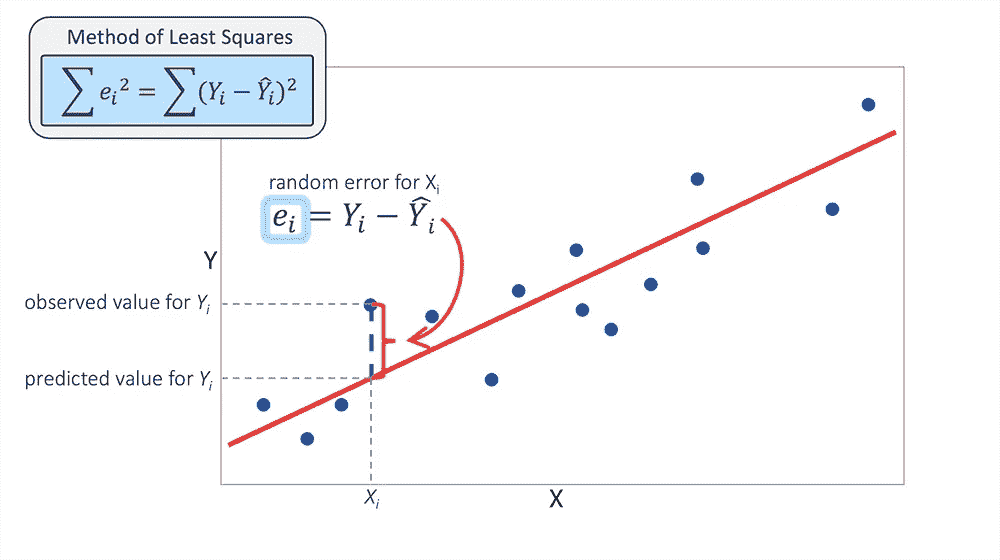
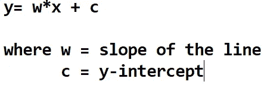
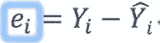

# 线性回归

> 原文：<https://medium.com/analytics-vidhya/linear-regression-45bac8688203?source=collection_archive---------24----------------------->

> 线性回归坚持认为，有一条(且只有一条)线可以描述趋势以及两个变量之间的关系。

## 线性回归是一种机器学习算法，其中我们使用直线来解释因变量(Y)和一个或多个解释变量或自变量(X)之间的关系。

这里，**目标类必须是连续特征**并且影响目标类的特征可以是连续的或分类的。

在直接应用线性回归之前，应该记住几件事。

## **1)-线性**:X 和 Y 的关系是线性的。

## **2)-同方差**:残差的方差在 x 的所有值上都是相同的(残差或误差是期望值和预测值的差)。

## **3)-独立性**:独立变量不应该相关，即没有多重共线性

## **4)-正态性**:残差项应正态分布。

记住所有这些假设，我们可以建立一个非常有效的线性回归模型。

# 线性回归工作

线性回归试图找到最佳拟合线，通过一条直线来表达所有数据点，以便在不久的将来我们可以预测这些值。

最佳拟合线方程

残差或误差

其中 y_i=期望值

y_i(hat) =预测值

残差平方和

> 线性回归试图最小化残差平方和，提供最小误差的线将被视为**最佳拟合线**

现在，问题出现了***如何找到这条最佳拟合线*** *。*

一种方法是创建通过数据点的多条线，然后找出所有线的最小残差平方和，并将其绘制为最佳拟合线。相反，更有效的方法是绘制对应于**不同斜率** s 的**成本函数**，具有最小成本函数的斜率将被视为最佳拟合线的斜率。

线性回归的成本函数(J)是预测 y 值(pred)和真实 y 值(y)之间的**均方根误差(RMSE)** 。

**如何实现具有最小代价函数的斜率？**答案是**梯度下降。**

2D 的梯度下降曲线[案例 1 和案例 2]

这个想法是从随机 w(斜率)值开始，然后迭代更新这些值，达到最小成本。

**梯度下降的收敛**

收敛定理

**在情况 1 中，导数是负的，如果我们从 w 中减去导数，它将增加新的斜率(w’)并更接近最小值**

**在情况 2 中，导数是正的，如果我们从 w 中减去导数，它将减少 w '值，并接近最小值。**

随着独立要素数量的增加，梯度下降图将看起来像 3D 或 4D 图，这取决于要素的数量，并且所有要素都试图移动到全局最小点。

## 注意:学习率应该非常小，因为如果我们保持高学习率，它将导致高计算量，因为梯度下降将非常非常慢地收敛。

这样我们就能找到合适的斜率。从而找到最佳拟合线的方程。

快乐学习。