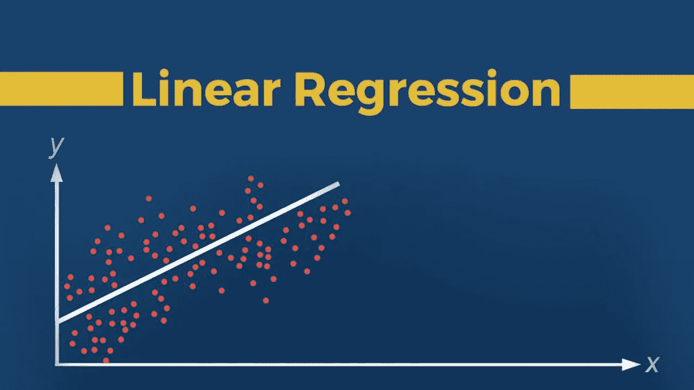
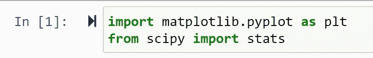
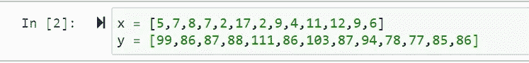
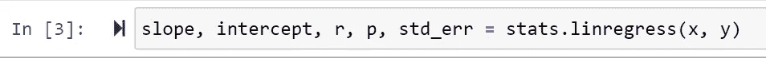
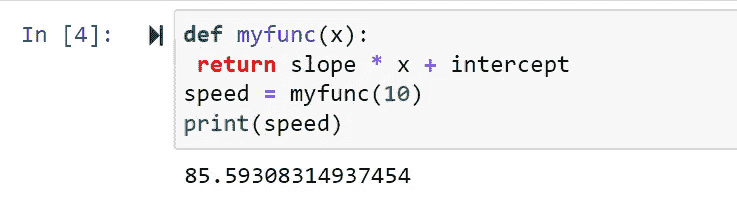
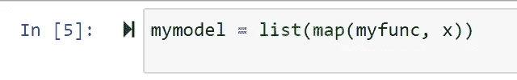
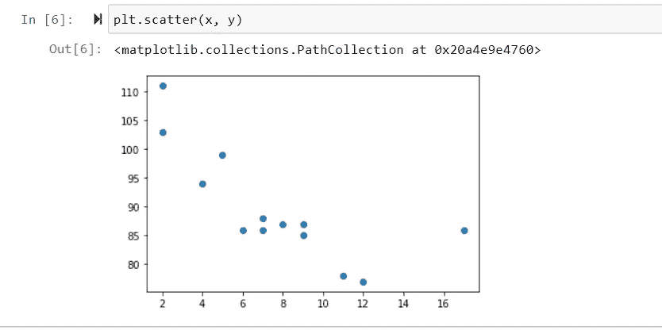
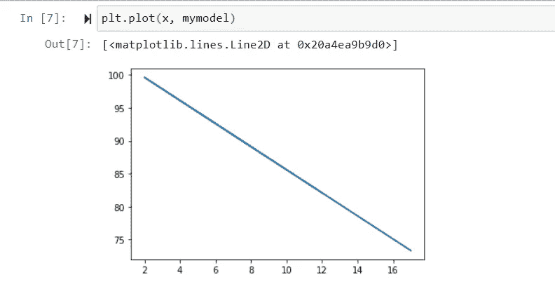
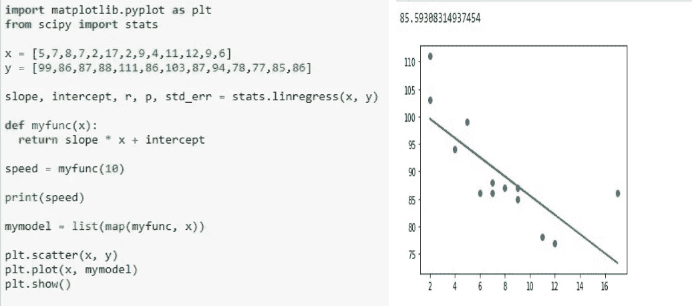

# 线性回归

> 原文：<https://medium.com/analytics-vidhya/linear-regression-4a8054576241?source=collection_archive---------23----------------------->

回归分析是统计学中最重要的领域之一

图 1 —回归

机器学习。有几种回归方法可用。线性回归就是其中之一。回归搜索变量之间的关系。在统计建模和机器学习中，这种关系用于预测进一步或未来事件的结果。

# **线性回归**

线性回归可能是最重要和最广泛使用的回归技术之一。这是最简单的回归方法之一。它的主要优点之一是易于解释结果。

线性回归试图通过对观察数据建立线性方程来建立两个变量之间的关系。一个变量被认为是描述性变量，另一个被认为是因变量。

图 2-x 和 y 之间的线性回归关系

**简单线性回归:**简单线性回归是线性回归的最简单情况，只有一个自变量，𝐱 = 𝑥.

**多元线性回归:**多元线性回归是一种多元自变量的线性回归。

**多项式回归:**多项式回归是线性回归的一种推广情况。假设输出和输入之间的多项式相关性，因此，多项式估计回归函数。

# **在 Python 中实现线性回归**

图 Python 中的线性回归

用于线性回归的 Python 包:

包 **NumPy** 是一个基本的 Python 科学包，它允许在一维或多维数组上进行许多高性能操作。它还提供了许多数学例程。它是开源的。

包 **scikit-learn** 是一个广泛用于机器学习的 Python 库，构建在 NumPy 和其他一些包之上。它提供了预处理数据、降低维数、实现回归、分类、聚类等方法。和 NumPy 一样，scikit-learn 也是开源的。

**用 scikit-learn 进行简单线性回归:**先从最简单的情况说起，就是简单线性回归。

实施线性回归有五个基本步骤:

1.  导入所需的包和类。
2.  提供要处理的数据，然后进行适当的更改。
3.  创建一个回归模型，并用现有数据进行拟合。
4.  查看模型拟合的结果，了解模型是否令人满意。
5.  应用模型进行预测。

让我们看一个例子，我们预测一辆 10 年车的速度。

*   导入所需的模块。

图 4 —导入所需的模块

*   创建表示 x 轴和 y 轴值的数组:

图 5-x 和 y 的值

*   执行返回线性回归的一些重要关键值的方法:

图 6 —返回键值的方法

*   创建一个使用斜率和截距值返回新值的函数。这个新值表示相应的 x 值将被放置在 y 轴上的什么位置:

图 7 —定义一个函数

*   通过函数运行 x 数组的每个值。这将产生一个新数组，其中包含 y 轴的新值:

图 8 —在函数中运行 x

*   绘制原始散点图:

图 9 —散点图

*   绘制线性回归直线:

图 10-线性回归线

*   显示图表: **plt.show()**

图 11 —带有输出的代码截图。

# 结论:

线性回归易于实现，并且更容易解释输出系数。当你意识到自变量和因变量之间的关系是线性关系时，这种算法是最好的选择，因为它比其他算法更简单。线性回归是分析变量之间关系的一个很好的工具，但在大多数实际应用中不推荐使用，因为它通过假设变量之间的线性关系而过度简化了现实世界的问题。