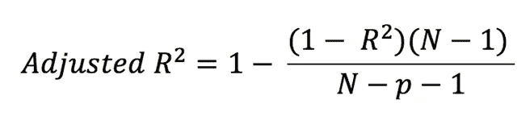

# 线性回归概念

> 原文：<https://medium.com/analytics-vidhya/linear-regression-900a7f4ee2ba?source=collection_archive---------19----------------------->

如果你正在学习机器学习，那么线性回归是第一个也是最简单的机器学习算法。让我们开始吧。

线性回归也称为普通最小二乘(OLS)算法。这是一个有监督的机器学习算法，预测连续的数值。

让我们借助 1 个特征和 1 个目标变量来理解线性回归，它也称为简单线性回归。在简单的线性回归中，模型试图将给定的特征映射到目标变量，并使用直线方程来映射: **y = mX + C**

m =斜率，C =常数，X=特征，y =目标变量

所以线性回归的最终目的是找到这条线，而找到这条线的模型需要找到 m 和 c 的值。

一旦模型找到 m 和 C 的值，它就可以绘制如上图所示的线。现在，对于 x 轴上的任何新数据点，我们可以使用下面这条线在 y 轴上找到该数据点的预测输出。

## 剩余:

实际数据点和预测线之间的差异。我们可以说这是模型造成的错误。

## 成本函数:

有一个代价函数的概念是机器学习找出在所有数据点上模型产生了多少误差。

有许多成本函数来测量该模型产生的总误差。其中一些如下:

绝对平均误差

均方根误差

到目前为止，我们知道该模型的最终目标是找到 m 和 C 的值，使得均方误差最小。所以让我们试着理解模型是如何找到这些值的。

# 梯度下降:

梯度下降是优化任何成本函数的优化算法。在线性回归的情况下，它优化(减少)成本函数(MSE)。

步骤 1:用任意小的随机值初始化 m 和 C 的值。

步骤 2:使用 MSE 计算成本。

步骤 3:使用以下公式更新 m 和 C 的值。

m(t+1) = m(t) - learning_rate *导数(MSE)
C(t+1)= C(t)-Learning _ rate *导数(MSE)

重复步骤 2 和 3，直到时间 MSE 值变化不大。

# 线性回归的假设

线性回归需要满足一些假设，否则线性模型给出的输出是不可信的。这是面试中很常见的问题。

**简单线性回归:**当数据只有一个独立特征时，称为简单线性回归。

**多元线性回归:**当数据有 1 个以上的独立特征时，称为多元线性回归。

我们将借助简单线性回归来理解线性回归的假设。

# 1.X 和 y 变量之间存在线性关系。

这种假设认为独立和从属特征具有线性关系。为了检验这个假设，我们可以使用散点图，散点图应该看起来像上面的左图。

# 2.误差项呈正态分布。

这个假设认为误差项是正态分布的。这里预测误差减去实际目标。要检查这一假设，请根据数据拟合模型并进行预测。现在计算误差，并画出这个误差的分布(直方图)，这个分布应该看起来像正态分布。

3.**误差项相互独立**

为了检验这个假设，在目标变量和误差项之间画一个散点图。散点图不应显示明显的模式。

# 4.同方差性:误差项具有恒定方差。

要检查这一点，在独立特征和目标特征之间绘制一个散点图，然后在同一轴上，在独立特征和预测之间绘制一个散点图。您应该会得到一个类似上面左图的图形。

# 5.最小多重共线性:

多重共线性意味着 1 个要素与其他要素相关，我们希望最小化多重共线性。很明显，这个问题出现在多个线性回归中，因为它包含不止一个特征。为了检验这一假设，使用 VIF(方差膨胀系数)

VIF 值越高，多重共线性越高。在大多数情况下，VIF 值不应大于 10。

# **模型评估:**

你训练了线性回归模型，现在如何检验这个模型好不好？

**决定系数:**

r 称为决定系数或拟合优度。这个值告诉我们模型与数据的吻合程度，或者模型解释了数据中的多少差异。R 值越高，模型越好。

R 的问题在于它的值随着特征数量的增加而增加。因此，如果您在数据集中添加一个新要素，并且如果该要素没有用，那么 R 的值会增加。

为了解决这个问题，有了调整 R 的概念

这些都是你应该知道的线性回归中的重要概念。如果我错过了任何概念，请在下面随意评论。

***感谢您的配合！***