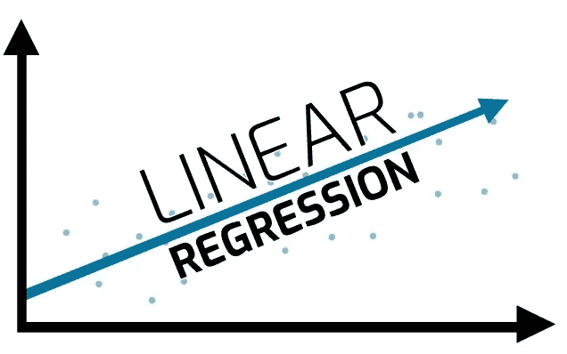
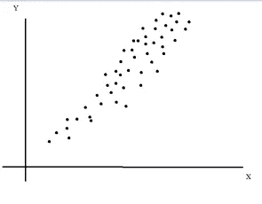
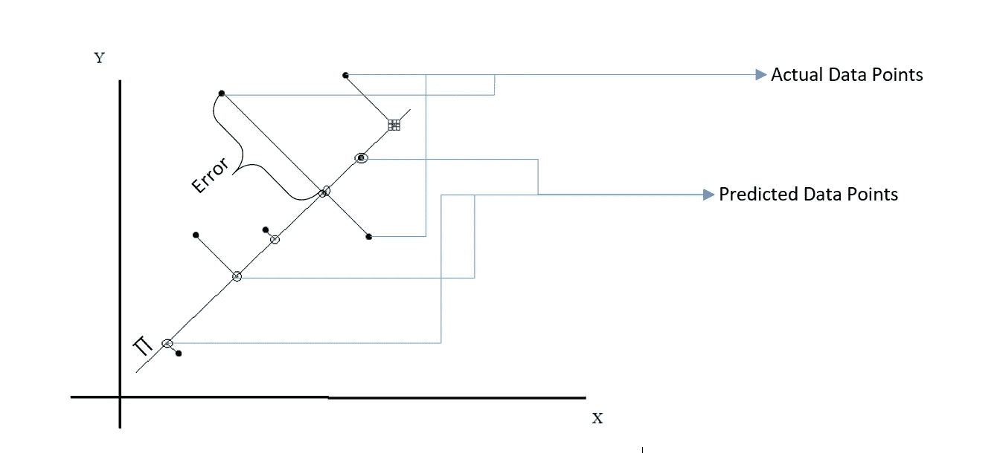
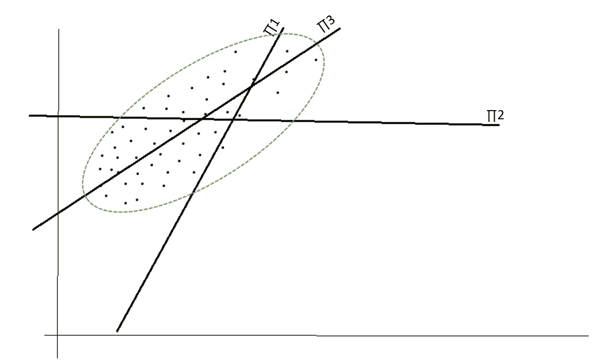
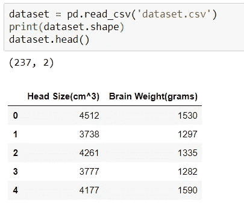
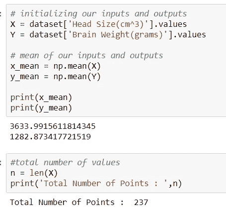
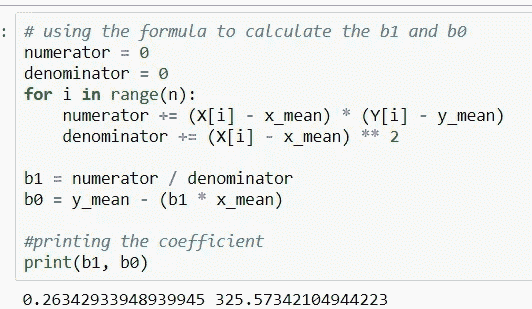
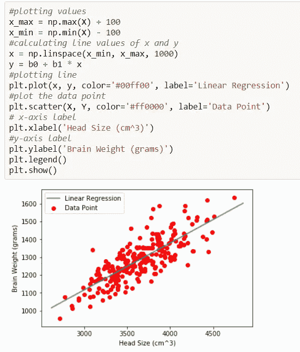
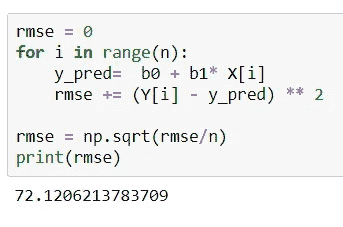

# 线性回归:初学者指南

> 原文：<https://medium.com/analytics-vidhya/linear-regression-a-beginners-guide-b02c23b02e29?source=collection_archive---------20----------------------->

今天我们将以一种非常简单直观的方式来谈论线性回归，以了解它的内部机制

来源:谷歌

为了更好地理解线性回归的大部分概念，你必须理解逻辑回归是如何工作的。可以参考我的 [**Logistic 回归的博客。**](/swlh/logistic-regression-a-beginners-guide-c3d3f9ca5993)

关于线性回归的第一件事是，与逻辑回归不同，它实际上是一种回归技术。

此后，我将线性回归称为 LiR，逻辑回归称为 LR。

像 LR 一样，LiR 也试图找到最佳超平面，以减少我们可以估计数据真实值的误差。

让我们假设我们有一个预测一些真实值的数据集，比如在给定其他参数的情况下，汽车的价格或一个人的身高。数据点沿着维度分布在整个频谱上，我们需要找到这样的线/平面/超平面，当用于预测时，它给出所有中最低的误差。

让我们想象我们的数据点看起来像下面，当我们试图绘制它们。

使用绘画创建

现在，我们的任务是创建一个超平面，它将覆盖大部分数据，并保持误差最小。通过最小误差，我的意思是，当数据点将被投影到平面上时，它给出最低的总误差。

我们需要明白一件事，那就是我们只能预测超平面内的值或点，而不能预测超平面外的值或点，让我给你们看一个例子。

使用 Paint + MS Word 创建

现在，你会对发生的事情有一个清晰的了解，想象一下模型确定了最好的超平面，以最小的误差估计最好的可能数据，现在，如果你看到的不是所有的点都在超平面上，那么从平面到点的垂直距离被认为是误差，现在，从 LR，我们知道最终一切都归结为优化问题，我们必须优化一些东西，或者说我们必须最大化或最小化一个实体，这里我们最小化误差，即点到平面的距离。

## 超平面是如何确定的？

为此，你需要参考我前面提到的博客。它使用所谓的优化方程来寻找符合我们数据的最佳超平面。

顾名思义，我们必须优化一些东西，在这种情况下，我们必须最小化上面提到的错误。

## 我们如何最小化误差？

通过选择最好的超平面。

## 我们如何选择最好的超平面？

让我们用简单的几何来理解这一点。

使用 Paint + MS Word 创建

正如你所看到的，我已经沿着平面上的所有点画了一条绿色的边界，现在用正常的直觉，我们可以说哪个超平面最适合我们的数据。

如果我们看到∏1，它覆盖了一些数据，但是我们的大多数点远离超平面，这将导致高损失值。

对于∏2，平面很好地划分了数据，它比∏1 好，但仍有改进的余地。

对于∏3，如果我们看到这可以被认为是覆盖所有点的最佳平面，并且包括数据点的大部分。

现在，如果我们将椭圆作为我们的数据分布的估计，哪个超平面穿过椭圆的大部分，它是∏3，因此它将是其余中最好的。

这就是我们的模型试图以直观的方式预测最佳超平面的方式。

## 模型优化了什么损失函数？

这叫做均方根误差

Root(∑ (yᵢ— yₚ) / n)

在哪里

yᵢ:iᵗʰ角的实际价值是多少

yₚ:是 iᵗʰ点的预测值

n:是总点数

现在，我们知道

错误= yᵢ — yₚ

## 为什么是平方和平方根？

这可以用一个简单的例子来解释:

假设我有两个数据点，一个是 0.5，一个是-0.5，而我的模型预测两个数据点都是 0。

所以这里的实际损耗是 0.5–0 = 0.5 和-0.5–0 =-0.5。

因此，如果我们将误差相加，则-0.5 + 0.5 使其为 0，这意味着我们的模型是完美的，但实际情况并非如此，因此我们取该项的平方来消除符号，最后用 n 除它使其成为平均值，然后取平方根来归一化平方项。

逻辑回归和线性回归的关键区别是损失函数，其余保持不变。

这就是我们对线性回归工作原理的直观解释。

## **超平面方程是什么样子的？**

正如在 LR 中提到的，超平面的方程几乎保持不变。

y = *W* ᵀX + b + e

其中“e”是误差项。

我们必须减少这里的误差。

让我们考虑一下上面的等式:

我们知道形式 LR，WᵀX + b 代表超平面，让我们考虑它通过原点，因此 b=0

因此，WᵀX 给了我们一个 y 值或预测值，从我们上面的等式中，我们可以说，Yi = WᵀX + e(即实际=预测+误差)

现在易— WᵀX = e

因此，这表明，实际预测会给我们带来误差，因此我们需要减少误差。

这就是我们的优化方程如何对超平面的不同值起作用，并且由于超平面只是系数的向量表示，我们可以通过我们的损失函数找到它。

# 从头开始编码:

## 让我们用代码来理解它:

为此，我们将使用包含两列的数据集:

1.  头部尺寸(厘米)
2.  大脑重量(克)

基本上，给定任何头部尺寸，我们将预测那个特定人的大脑重量，所以我们将只使用二维，这样我们很容易理解 LiR 是如何工作的。

现在，超平面将用 2 个系数来表示，因为我们只有 2 维。因此，这是一条线。

让我们称系数为“w”和“b”

因此，我们的线用 2 个系数表示如下:

y = w*x + b

## w 和 b 怎么算？

w = [ ∑ (x — x) — (y — y) ] / ∑ (x — x)

b = y — w* x

在哪里，

x:x 的平均值

y:y 的平均值

所以任何一点都会被计算成 y = w*x + b

## 实施:

**读取数据集:**

读取数据集

**计算平均值:**

计算平均值

**计算系数:**

系数

借助于系数，绘制数据和学习的超平面(线):

绘制点和线

## 错误:

均方根误差

均方根误差，如上所述计算。

代码和数据集可以在这里找到[。多亏了这个家伙，我在这里解释本质变得轻而易举。](https://github.com/FeezyHendrix/LinearRegressionfromscrath)

> **感谢阅读！**
> 
> 如果你想了解更多类似的话题或者看看我还能提供什么，一定要访问我的网站:[所有关于东西](https://digital.allaboutstuffs.com/)
> 
> 准备好让你的学习更上一层楼了吗？查看我提供的课程:[课程](https://digital.allaboutstuffs.com/courses/)
> 
> 生活工作压力大？花一点时间来放松和放松我的舒缓和放松的视频！现在就去我的频道，用"[灵魂镇定剂](https://www.youtube.com/c/TheSoulTranquilizer)"开始你的内心平和与宁静之旅