# 线性回归:完整的故事

> 原文：<https://medium.com/analytics-vidhya/linear-regression-a-complete-story-c5edd37296c8?source=collection_archive---------9----------------------->

## 关于回归分析你需要知道的一切。

来源:[https://international sales . lexisnexis . com/hk/image/Predictive-analytics . png](https://internationalsales.lexisnexis.com/hk/image/Predictive-Analytics.png)

线性回归是预测分析领域中广泛使用的最简单的机器学习算法之一。这种方法多用于预测和找出变量之间的因果关系。它是一个线性模型，即假设因变量(Y)和一个或多个自变量(X)之间存在线性关系。在这种技术中，因变量是连续的，自变量可以是连续的或离散的，回归线的性质是线性的。

该算法属于监督学习，即训练数据集中因变量的值是已知的。

线性回归模型在所有领域都有许多实际应用，例如预测零售业的销售额、预测房地产的房价、预测气象学中的天气、预测金融中的股票价格、预测医疗保健中生物因素引发的疾病等。因此，理解模型背后的直觉以及如何实现它将有助于我们解决预测分析中的问题。

**目录:**

1.线性回归假设

2.模型背后的数学

*   2.1.简单线性回归
*   2.2 多元线性回归

3.评估指标

4.动手示例

# 1.线性回归假设:

回归是一种参数方法。“参数化”意味着它对用于分析的数据做出假设。如果数据集无法满足其假设，那么模型在数据集上的表现将会很差。因此，验证这些假设对于成功的回归分析是至关重要的。

回归分析中的重要假设是:

**1。** **线性:**假设因变量(Y)和自变量(X)之间存在线性关系。

**2。** **自相关:**残差(误差)项之间应该没有相关性。如果存在某种相关性，则意味着模型无法识别数据中的某种关系。

**3。** **多重共线性:**自变量之间应该没有相关性。如果自变量中度相关或高度相关，那么就很难找出哪个变量有助于预测因变量(响应变量)。

**4。** **同方差:**误差项必须有常方差。误差项中非恒定方差的存在导致异方差。这种非恒定方差出现在异常值的情况下。当这种现象发生时，样本外预测的置信区间往往过宽或过窄。

**5。** **正态:**误差项必须正态分布。非正态分布的存在表明，必须仔细研究一些不寻常的数据点，以建立更好的模型。

# 2.模型背后的数学:

尽管我们有 python 库，可以在一行代码中完成回归分析，但了解模型背后的数学知识真的很重要。因为只有当你从头开始了解一个模型是如何工作的，你才能够根据你的问题陈述和手头的数据集来调整不同的模型参数，以获得想要的结果。

线性回归模型中有两种变量:

*   ***输入*** 或 ***独立*** 或 ***预测器*** 变量是模型的输入，它有助于预测输出变量。表示为 **X** 。
*   ***输出*** 或 ***因变量*** 是模型的输出，即我们要预测的变量。表示为 **Y** 。

## 2.1 简单线性回归:

当有一个输入变量/自变量(X)时，它被称为简单线性回归。

简单的线性回归方程如下所示:

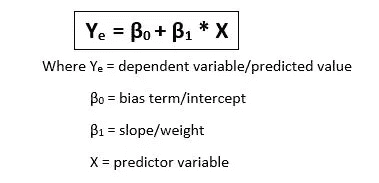

这个模型背后的主要思想是在数据中拟合一条直线。为了获得最佳拟合线，我们必须找到系数/参数β0 和β1 的最佳值，使预测值和实际值之间的误差最小。

那么，我们如何找到β0 和β1 的最佳值呢？简单的线性回归可以使用 ***【普通最小二乘法(OLS)*** 【统计方法】求解，以找到模型参数。

**普通最小二乘法:**

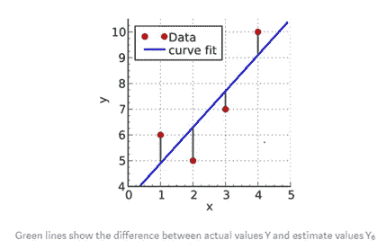

普通最小二乘(OLS)回归是一种统计分析方法，用于估计一个或多个自变量和因变量之间的关系。最小二乘法的目标是找到使 y 和 Yₑ.之间的平方差之和最小的β0 和β1 的值

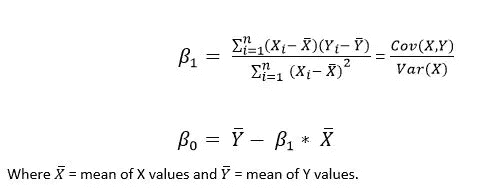

# 2.2 多元线性回归:

当有多个输入变量/独立变量(X1，X2，X3…)那么就叫多元线性回归。

多元线性回归方程如下所示:

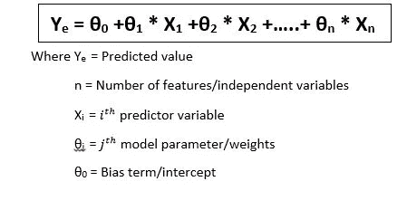

在简单的线性回归中，我们使用 OLS 方法来寻找最佳拟合线。然而在这种情况下，我们有一个以上的预测变量，这使得我们很难使用简单的 OLS 方法。

但是我们可以使用以下方法之一实现线性回归模型来执行普通最小二乘回归:

*   ***解析求解模型参数*** (正规方程组法)
*   ***使用优化算法*** (梯度下降，随机梯度下降等。)

## 正规方程(封闭解)

这种方法将数据视为矩阵，并使用线性代数运算来估计模型参数的最佳值。这意味着所有的数据都必须可用，并且必须有足够的内存来容纳数据和执行矩阵运算。因此，对于较小的数据集，应该首选这种方法。

多元线性回归看起来像这样:

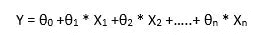

现在，采用矩阵形式的模型参数θ和 X:

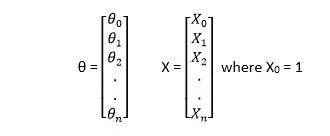

因此，多元线性回归方程的矢量化形式如下所示:

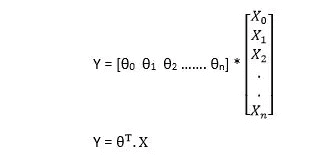

寻找模型参数最佳值的封闭解为:

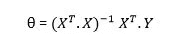

对于非常大的数据集，计算矩阵的逆矩阵代价很高，或者在某些情况下，逆矩阵不存在(矩阵是不可逆的或奇异的，例如，在完全多重共线性的情况下)。在这种情况下，以下解释的梯度下降方法是首选。

## 梯度下降:

梯度下降是一种非常通用的优化算法，能够找到各种问题的最优解。梯度下降的一般思想是迭代地调整参数以最小化成本函数。

这里的误差/成本表示预测值和实际值之间的误差平方和。该误差以函数的形式定义，称为*均方误差(MSE)成本函数*。因此，该梯度下降优化算法的目标是最小化 MSE 成本函数。

假设让我们假设我们站在浓雾中的山顶上；你只能感觉到脚下地面的坡度。快速到达谷底的一个好策略是朝着坡度最陡的方向下山。这正是梯度下降所做的:它测量误差函数相对于参数向量θ的局部梯度，并沿着梯度下降的方向前进。一旦梯度为零，你就达到了最小值。

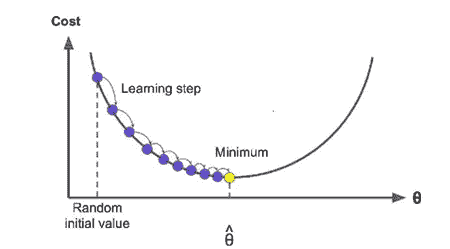

梯度下降中的一个重要参数是步长，由*学习速率*超参数决定。如果学习率太小，算法要经过多次迭代才能收敛，耗时较长。

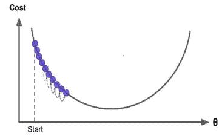

另一方面，如果学习率太高，算法将跳过最小值，使其发散。因此算法不会达到最小值。

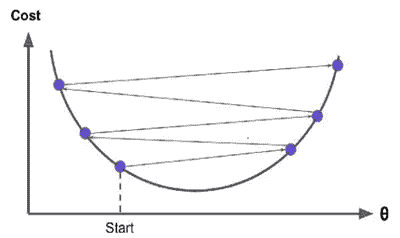

为了实现梯度下降，需要计算关于参数向量θ的成本函数的梯度。这里梯度是指如果参数向量θ有很小的变化，代价函数会有多大的变化。为了得到梯度，我们需要对成本函数求偏导数。

MSE 成本函数被定义为，

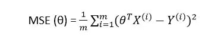

其中 m =数据集中的样本数。

成本函数的偏导数是，

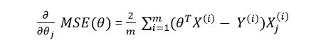

上面的等式单独计算每个数据点的偏导数。我们可以一次性计算所有的梯度，而不是使用矢量化的形式。

矢量化的形式看起来像，

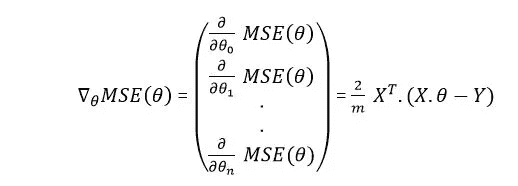

上面的梯度向量包含成本函数的所有偏导数(每个模型参数一个)。下面给出了获得更新的权重/参数的更新规则，

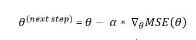

其中*α*是学习率超参数。

这总结了寻找线性回归模型参数的方法。从实际应用的角度来说，我们不需要每次需要应用线性回归模型的时候都从头开始写算法。Python 提供了一个名为 scikit-learn 的机器学习库，其中包含线性回归算法，我们可以通过一行代码来使用它，您将在下一节中看到。

# 3.评估指标:

到目前为止，您已经了解了线性回归模型的工作原理以及该模型中的参数。一旦您训练了您的模型并获得了预测的输出，您需要检查与实际输出相比，该预测有多好。如果模型的预测能力非常差，您需要返回并调整超参数或使用不同的算法，以便降低模型的误差，从而提高其预测能力。

线性回归最常用的评价指标有 ***平均绝对误差(MAE)、均方误差(MSE)、均方根误差(RMSE)。***

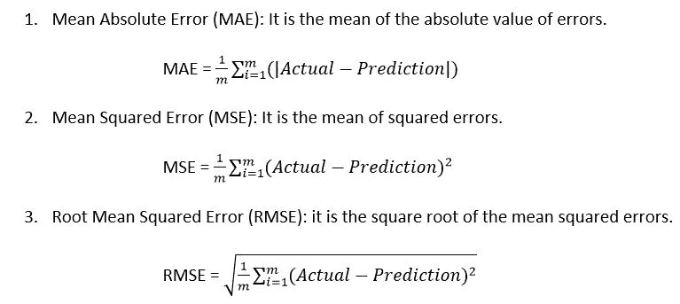

让我们在真实数据集中应用这个线性回归模型，看看它是如何工作的！

# 4.动手示例:

在本节中，我们将了解如何使用 python 应用线性回归。我们将在这里做多元线性回归问题，因为你将面临的几乎所有现实世界的问题都有两个以上的变量。但是要知道，我们进行多元线性回归的步骤和简单线性回归的步骤是一样的。

我们这里要用的数据集是红酒质量数据集。该数据集与葡萄牙“Vinho Verde”葡萄酒的红色变种相关。

你可以从[这里](https://www.kaggle.com/uciml/red-wine-quality-cortez-et-al-2009)下载数据集。

这个动手示例只是为了展示如何使用 scikit-learn 应用线性回归模型，所以我没有深入探讨探索性数据分析(EDA)部分。

让我们开始编码:

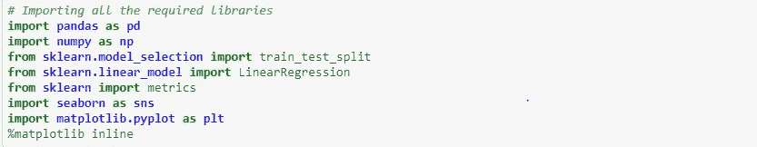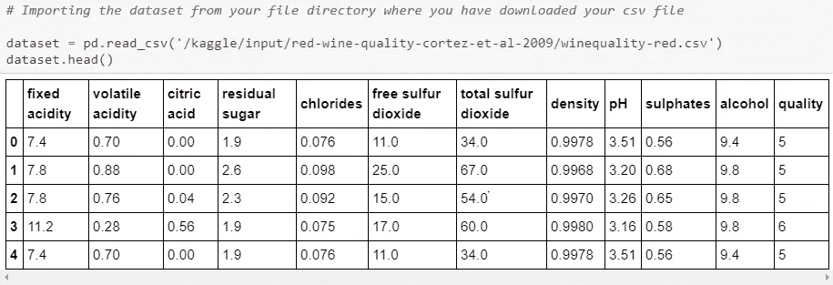

让我们检查数据集中的行数和列数。

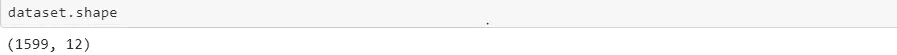

该数据集包含 1599 行和 12 列。该数据集中的每一行都代表葡萄酒，每一列都代表特定葡萄酒的特性。

现在，让我们检查数据集中是否有丢失的值。

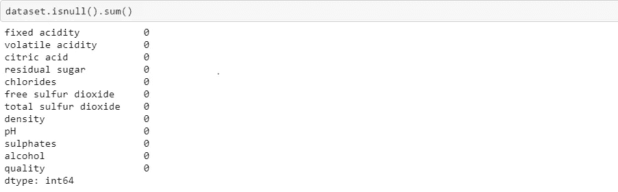

正如您在输出中看到的，数据集中没有丢失值。如果数据集中存在任何缺失值，我们需要首先处理它，然后继续下一步。因为该算法无法处理缺失值，因此要么需要将其删除，要么用其他值进行估算。

现在，我们将检查数据集的描述性统计数据，以了解数据:

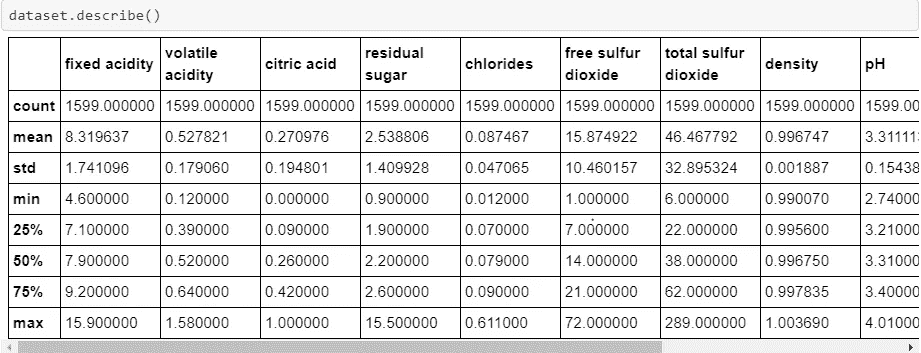

从上面的统计中，我们可以对数据集中的每个自变量有一个整体的了解，如计数、均值、标准差、最小值和最大值等。

在这个数据集中，我们将预测葡萄酒的质量，因此因变量是“质量”。其余的都是独立/预测变量，这是葡萄酒的特征，使用它我们将发现质量。

现在，让我们从数据集中分离出自变量和因变量。

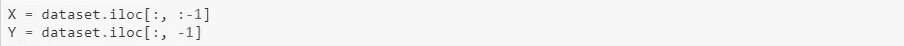

现在我们把 X 和 Y 分开。同样，我们将把这些数据集分成训练集和测试集，因为一旦我们的线性回归模型被训练，我们就需要一些数据来检查我们的模型表现如何。

我们将把完整的数据集分成 70%的训练数据和 30%的测试数据。

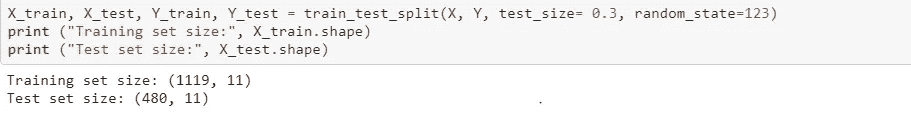

从输出中可以看出，训练集有 1119 个观察值，测试集有 480 个观察值。

现在，让我们训练我们的模型:

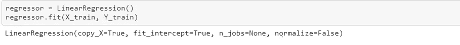

就像我已经提到的，训练一个线性回归模型只是一行代码。现在模型已经定型，可以预测测试集的值了。

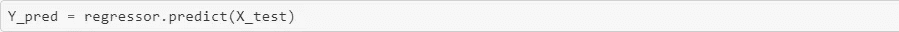

让我们比较一下测试集的实际值和预测值。

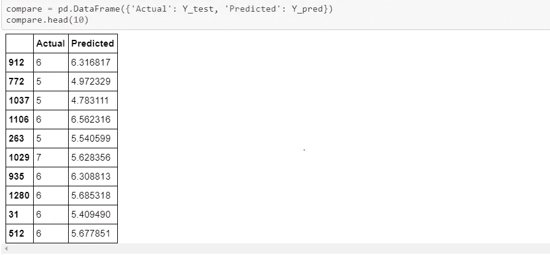

从输出中可以看出，模型预测得相当不错。为了更好地理解，我们来绘制实际值和预测值。出于可视化的目的，我们将只从测试集中选取 25 个观察值。

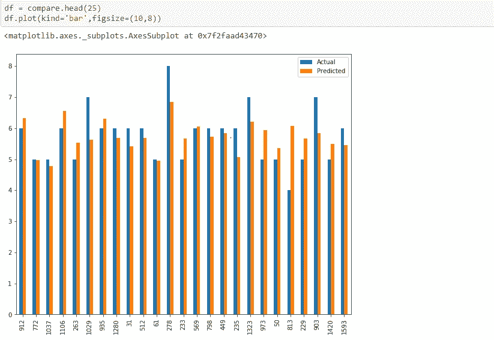

最后一步是评估模型的性能。我们将使用平均绝对误差(MAE)、均方误差(MSE)和均方根误差(RMSE)等评估指标。

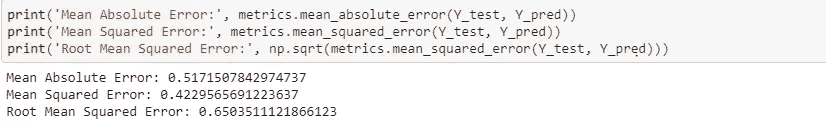

因此，我们使用 scikit-learn 在红酒质量数据集上成功应用了线性回归模型。这个例子只是给你一个如何执行回归分析的要点。

希望这篇文章能帮助你详细了解线性回归模型。还有一些主题，如多项式回归，正则化技术，优化算法，如随机梯度下降(SGD)，批量梯度下降，小批量梯度下降等。，这将在下一篇文章中讨论。

在那之前，学习愉快！！！！