# 线性回归——一种直观的方法

> 原文：<https://medium.com/analytics-vidhya/linear-regression-an-intuitive-approach-ded05ed39a87?source=collection_archive---------21----------------------->

让我们从最基本但最有用的算法之一“线性回归”开始。线性回归假设对输入变量(x)和输出变量(y)之间的线性关系进行建模。

线性回归线具有形式为 ***Y = a + bX*** 的方程，其中 ***X*** 是输入/解释变量， ***Y*** 是因变量/输出。直线的斜率为 ***b*** ， ***a*** 为截距(当 ***x*** = 0 时 ***y*** 的值)。

[散点图](http://www.stat.yale.edu/Courses/1997-98/101/scatter.htm)是确定两个变量之间关系强度的有用工具。如果散点图没有显示增加或减少的趋势，那么线性回归模型可能是无效的。在演唱会上座率和以日照(小时数)衡量的天气散点图中可以看到，随着日照小时数的增加，我们可以直观地观察到有增加的趋势。

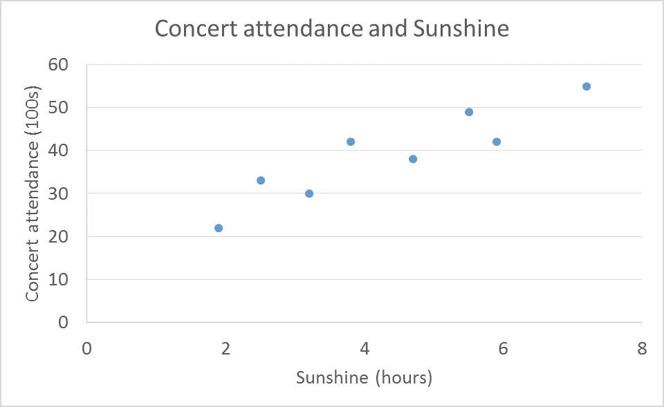

E

简单线性回归

**简单线性回归**是具有单一输入/解释变量的[线性回归](https://en.wikipedia.org/wiki/Linear_regression)模型。

在下面的示例中，显示了一条直线，它以最恰当的方式描述了这种关系。

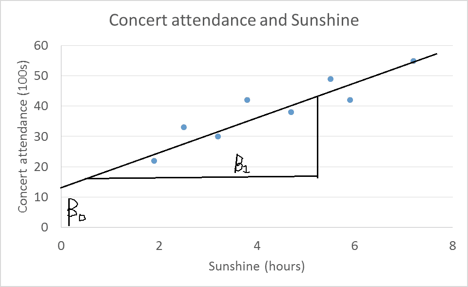

很明显，单条线不可能穿过该图的所有点。因此，在两个变量 x 和 y 之间不存在完美的函数关系。然而，散点图表明，可以画一条线，使所有点分散在它的周围

x 和 Y 之间的关系可以表示为

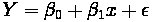

上面的方程就是线性回归模型。它被称为简单线性回归，因为只有一个因变量 x

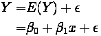

在回归模型中，自变量也称为回归变量或预测变量。因变量 Y 也称为响应。斜率β1 和截距β0 也称为回归系数。假设随机误差项 **ε** 遵循均值为 0、方差为σ的正态分布，因为 Y 是该随机误差项与均值 E(Y)之和，E(Y)是一个常数，因此，在 x 的任何给定值下，Y 的方差都遵循均值为 E(Y)、标准差为σ的正态分布。如下图所示。

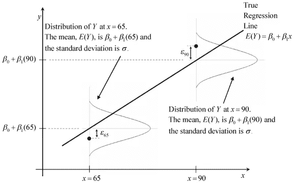

很明显，找不到一条线能穿过图中所有的点。因此，这两个变量之间不存在函数关系

# 拟合回归线

通过找到最小化残差平方和(RSS)的系数来获得拟合线。RSS 是一种统计技术，用于测量回归模型无法解释的方差。因此，非常直观地，如果方差最小化，我们的模型将相应地更加准确。如下所示，残差是预测值和实际值之间的距离

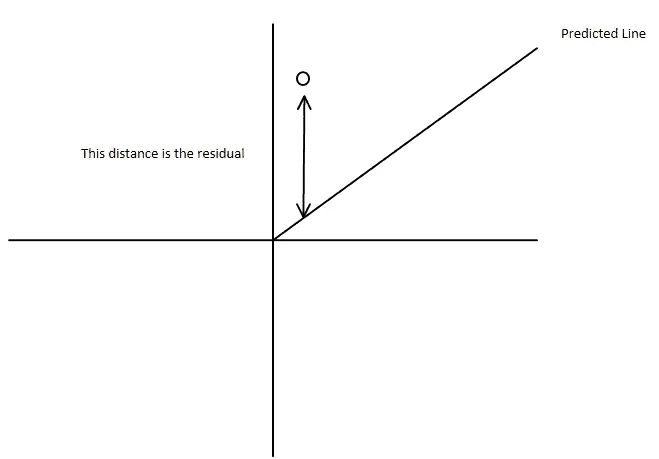

残留的；剩余的

如下所示，RSS 是所有残差的平方和，“因此残差平方和”已经使用微积分最小化。

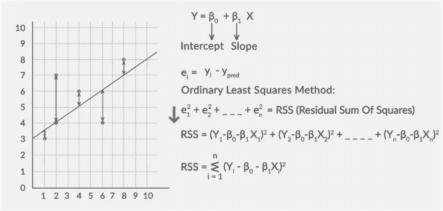

[**、总解释和残差平方和**](https://image1.slideserve.com/1607401/total-explained-and-residual-sum-of-squares-l.jpg)

*   解释的平方和:预测的 Y 和 Y 的平均值之间的平方差的和，或者，

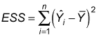

**直觉:ESS 告诉我们因变量的变化有多少已经被我们的模型解释了**

*   残差平方和:实际 Y 和预测 Y 的平方差之和，或者，

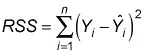

直觉:RSS 告诉我们有多少因变量的变化是我们的模型没有解释的。

*   总平方和:实际 Y 和 Y 平均值之间的平方差之和，或者，

给定这些定义，情况必然是…TSS = ESS + RSS

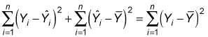

TSS=ESS + RSS

[**决定系数或 R 平方**](https://image1.slideserve.com/1607401/the-coefficient-of-determination-or-r-squared-l.jpg) 我们如何知道我们的方程有多精确？R-squared 告诉我们方差的多大比例已经被我们的模型解释了，它是一个介于 0 和 1 之间的值，值越高，拟合越好。

决定系数或 R 平方:

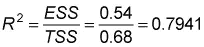

**RSS 的缺点**

这是实际 y 和预测 y 之间的绝对差值。现在，如果实际 y 和预测 y 的单位改变，RSS 也会改变。因此，我们使用相对项 R，即 1-RSS/TSS。

# 线性回归模型的假设

## 以下是与线性回归模型相关的四个假设:

1.  **线性**:X 和 Y 的均值成线性关系。
2.  **同方差**:残差的方差对于 x 的任意值都是相同的。
3.  独立性:观测值是相互独立的。
4.  **正态性**:对于 X 的任意固定值，Y 是正态分布的。

# **模型解释**

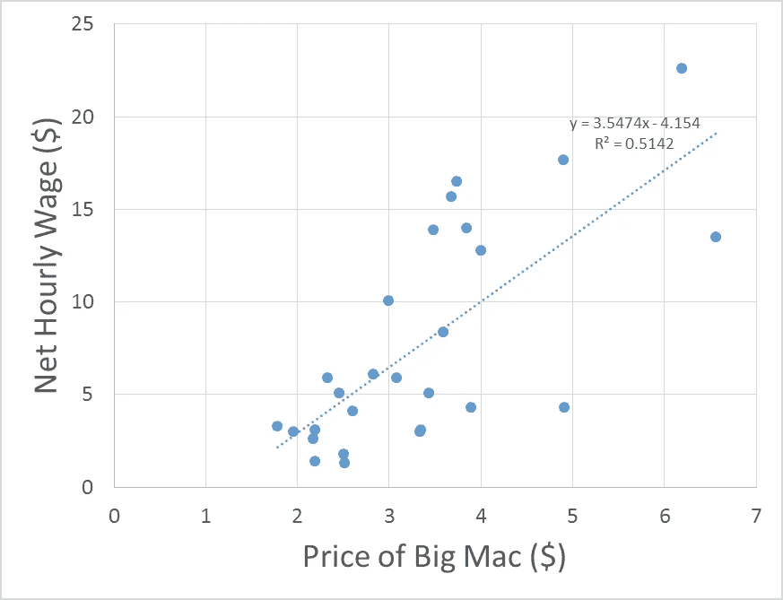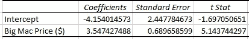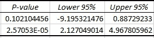

**释义**

下面是一个模型，它预测了时薪净额($)与巨无霸价格($)之间的关系

该模型估计参数:

*   β0 估计为-4.154
*   β1 估计为 3.5474

线性方程估计为:

每小时净工资($)**=**-4.154**+**3.5474 *巨无霸价格($)

使用假设检验评估模型的稳健性。

需要定义 H0 和 Ha。它们的定义如下:

*   H0(零假设):x 和 y 之间没有关系，也就是说，时薪净额和巨无霸价格之间没有关系
*   Ha(另一个假设):x 和 y 之间有某种关系，也就是说，净时薪($)和巨无霸价格($)之间有某种关系。

**β1:**β1 的值决定了净时薪($)与巨无霸价格($)之间的关系。如果β1 = 0，则没有关系。在这种情况下，β1 为正。这意味着净时薪(美元)和巨无霸价格(美元)之间存在某种关系。

**t-stat:**t-stat 值是系数估计值(β1)远离零的“多少标准差”的度量。小时工资净额(美元)与巨无霸价格(美元)之间的关系越密切，或者换句话说，该系数越显著。在这种情况下，t-stat 为 5.143。离零足够远了。

**p 值:** p 值是一个概率值。它表示在假设零假设为真的情况下，看到给定 t 统计量的机会。如果 p 值很小，例如< 0.0001 或小于显著性水平(α)，这意味着这是偶然的且没有关系的概率很低。在这种情况下，p 值很小。这意味着价格和引擎之间的关系不是偶然的。

关系就建立了。准确性怎么样？模型有多精确？为了感受模型的**准确性，一个名为 R 平方或决定系数的度量是很重要的。**

**R 平方或决定系数:**

**R** - **平方**衡量线性回归模型中自变量(X)解释的因变量(Y)变化的比例，在这种情况下，它是 0.52 或 52 %，这不是最好的，而是中等拟合，0 到 1 之间的分数越高越好。

**标准误差:**标准误差系数用于计算置信区间，并对因变量和自变量之间存在关系的假设进行统计检验。在我们的例子中，两个系数值都位于置信区间的上下界之间。

上限和下限计算如下。

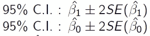