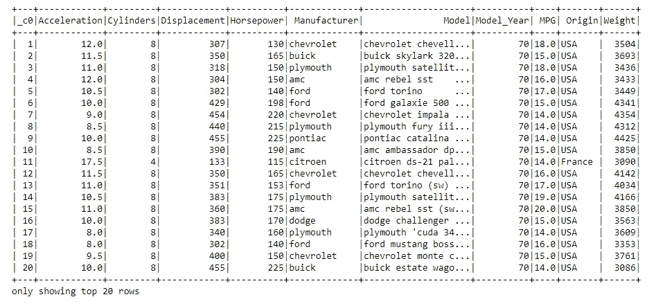
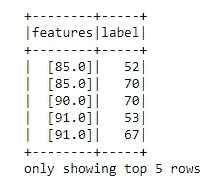
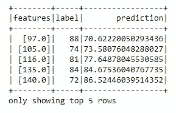
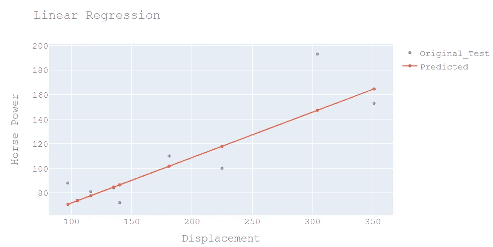
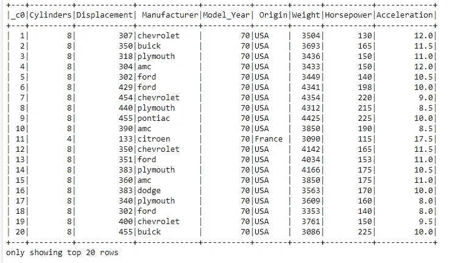
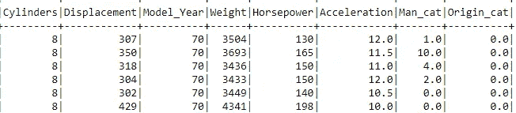
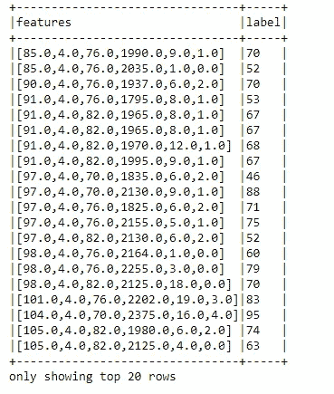
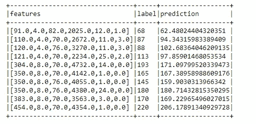
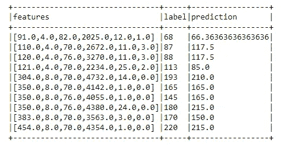

# 使用 Pyspark 实现线性回归和决策树

> 原文：<https://medium.com/analytics-vidhya/linear-regression-and-decision-tree-implementation-using-pyspark-bfcd93dee86?source=collection_archive---------3----------------------->

我们将构建一个简单的线性回归和决策树来帮助您开始使用 pyspark。考虑的数据集是小型汽车数据集。

需要做的第一件事是找到火花。

```
**import** **findspark**
findspark.init()
findspark.find()
**import** **pyspark**
[findspark](https://gist.github.com/Debpriyo97/cb485b98c7d79f675d5eea50d3629815).find()
```

下一步是创建一个 Spark 会话。

```
import matplotlib.pyplot as plt
import numpy as np
import pandas as pd
from numpy import polyfit
from pyspark.sql import SparkSession
from pyspark import SparkContext,SparkConf,SQLContextconf = SparkConf().setMaster('local').setAppName('ML_learning')
sc = SparkContext(conf=conf)
sqlcontext = SQLContext(sc)
```

加载数据，在这种情况下是一个 csv 文件。

```
data = sqlcontext.read.csv(path='C:\AAI\week 3\Small_Car_Data.csv', header = True, inferSchema = True)data.show()
```



小型汽车数据集

现在，导入实现线性回归所需的模块。

```
from pyspark.ml.feature import VectorAssembler
from pyspark.ml.regression import LinearRegression
from pyspark.ml.evaluation import RegressionEvaluator
```

最初对单个变量进行线性回归，并绘制结果以便更好地理解。

为培训和测试目的拆分数据。

```
data2 =data.select(data.Displacement,data.Horsepower.alias('label'))
train, test = data2.randomSplit([0.9,0.1])
```

矢量汇编器用于创建所有单个特征的矢量。

```
assembler=VectorAssembler().setInputCols(['Displacement',])\.setOutputCol('features')
train01 = assembler.transform(train)train02 = train01.select("features","label")
train02.show(5)
```



特征:所有单个特征的向量。

标签:目标变量。

在这种情况下，由于最初我们建立的是单变量线性回归模型，因此只有一个特征“位移”被转换为矢量。

现在，建立模型。

```
lr = LinearRegression()
model = lr.fit(train02)
```

用看不见的数据测试我们的模型。

```
test01 = assembler.transform(test)
test02 = test01.select('features', 'label')
test03 = model.transform(test02)
test03.show(5)
```



绘制线性拟合线。

```
import chart_studio.plotly as py
import plotly.graph_objects as go
fig = go.Figure()fig.add_trace(
    go.Scatter(
        x=x,
        y=y,
        mode='markers',
        name='Original_Test',
    ))fig.add_trace(
    go.Scatter(
        x=x,
        y=y_pred,
        name='Predicted'
    ))
fig.update_layout(
    title="Linear Regression",
    xaxis_title="Displacement",
    yaxis_title="Horse Power",
    font=dict(
        family="Courier New, monospace",
        size=18,
        color="#7f7f7f"
    )
)fig.show()
```



模型评估。

```
evaluator = RegressionEvaluator()
print(evaluator.evaluate(test03,
{evaluator.metricName: "r2"})
)print(evaluator.evaluate(test03,
{evaluator.metricName: "mse"})
)
print(evaluator.evaluate(test03,
{evaluator.metricName: "rmse"})
)
print(evaluator.evaluate(test03,
{evaluator.metricName: "mae"})
)
```

现在，让我们开始建立多元线性回归和决策树模型。

选择与建模相关的列。

```
small_cars=data.select(data._c0,data.Cylinders,data.Displacement,data.Manufacturer,data.Model_Year,data.Origin,data.Weight,data.Horsepower,data.Acceleration)
small_cars.show()
```



在构建模型之前，需要对数据集进行一些预处理。“原产地”和“制造商”等变量具有需要转换的分类值。

```
from pyspark.ml.feature import StringIndexerindexer = StringIndexer(inputCol="Origin", outputCol="Origin_cat")indexed = indexer.fit(small_cars).transform(small_cars)origin_cat=indexed.select(indexed._c0,indexed.Origin_cat)indexer_1 = StringIndexer(inputCol="Manufacturer", outputCol="Man_cat")indexed_1 = indexer_1.fit(small_cars).transform(small_cars)
man_cat=indexed_1.select(indexed_1._c0,indexed_1.Man_cat)inner_join = small_cars.join(man_cat, small_cars._c0 == man_cat._c0).drop(man_cat._c0)inner_join_1=inner_join.join(origin_cat,inner_join._c0==origin_cat._c0).drop('_c0','Manufacturer','Origin')inner_join_1.show(5)
```



为训练和测试拆分数据。

```
train, test = inner_join_1.randomSplit([0.9,0.1])
```

使用矢量汇编程序为所有单个特征创建一个矢量。

```
assembler=VectorAssembler().setInputCols(['Displacement','Cylinders','Model_Year','Weight','Man_cat','Origin_cat'])\
.setOutputCol('features')train_a = assembler.transform(train)train_b=train_a.select("features",train_a.Horsepower.alias('label'))train_b.show(truncate=False)
```



```
lr = LinearRegression()
model = lr.fit(train_b)
test_a = assembler.transform(test)
test_b = test_a.select('features', test_a.Horsepower.alias('label'))
test_c = model.transform(test_b)
test_c.show(truncate=False)
```



评估模型。

```
evaluator = RegressionEvaluator()
print(evaluator.evaluate(test_c,
{evaluator.metricName: "r2"})
)print(evaluator.evaluate(test_c,
{evaluator.metricName: "mse"})
)
print(evaluator.evaluate(test_c,
{evaluator.metricName: "rmse"})
)
print(evaluator.evaluate(test_c,
{evaluator.metricName: "mae"})
)
```

构建决策树模型。

```
from pyspark.ml.regression import DecisionTreeRegressordt = DecisionTreeRegressor()
model = dt.fit(train_b)
test_dt = model.transform(test_b)
test_dt.show(truncate=False)
```



评估模型

```
evaluator = RegressionEvaluator()
print(evaluator.evaluate(test_dt,
{evaluator.metricName: "r2"})
)print(evaluator.evaluate(test_dt,
{evaluator.metricName: "mse"})
)
print(evaluator.evaluate(test_dt,
{evaluator.metricName: "rmse"})
)
print(evaluator.evaluate(test_dt,
{evaluator.metricName: "mae"})
)
```

这就是如何在 Pyspark 中建立一个简单的线性回归和决策树模型。

谢谢