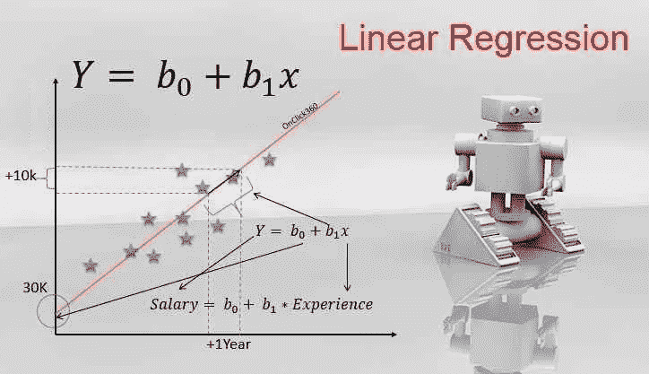

# 线性回归和对数据进行直线拟合

> 原文：<https://medium.com/analytics-vidhya/linear-regression-and-fitting-a-line-to-a-data-6dfd027a0fe2?source=collection_archive---------14----------------------->

线性回归是预测连续值输出的监督机器学习算法。在线性回归中，我们通常遵循三个步骤来预测输出。

*1。使用最小二乘法拟合数据线*

*2。计算 R 平方*

*3。计算 p 值*

# **对数据进行直线拟合**