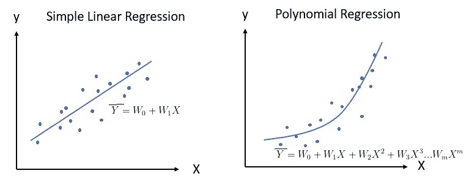
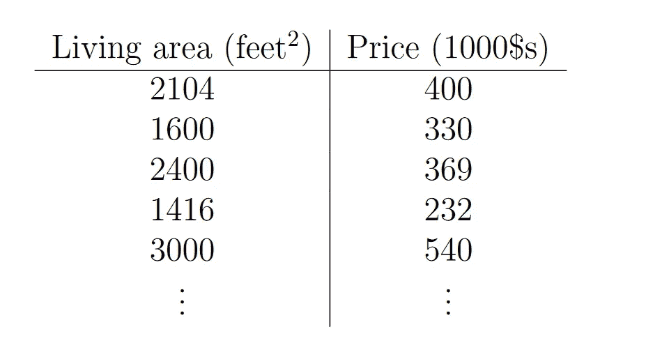
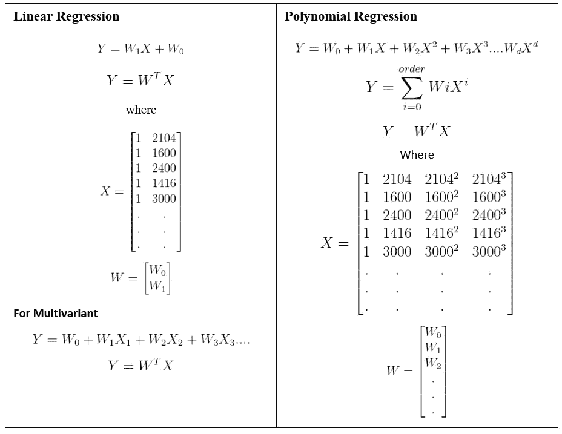
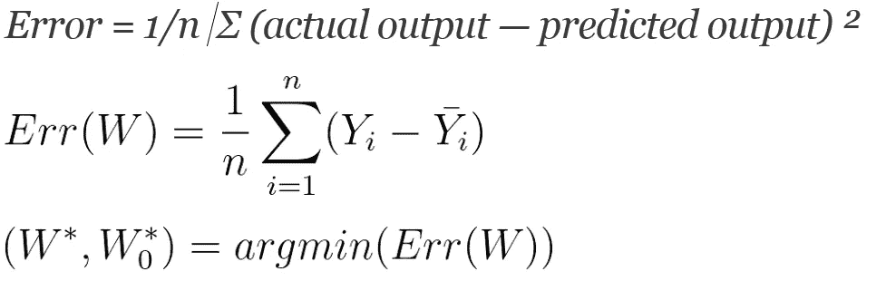
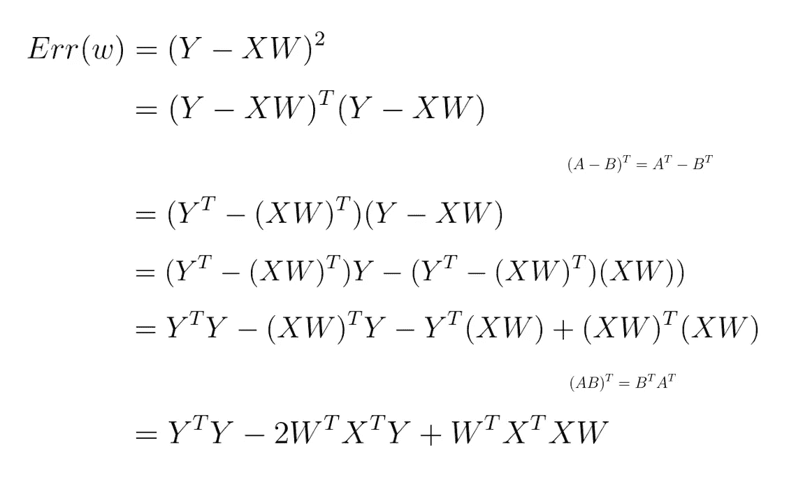
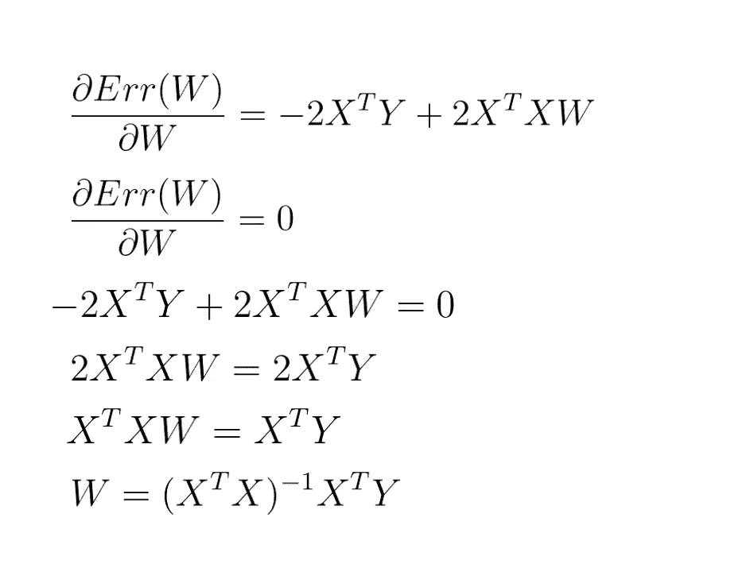

# 线性回归和多项式回归的正规方程法公式

> 原文：<https://medium.com/analytics-vidhya/linear-regression-and-polynomial-regression-using-normal-equation-method-c3929d71734d?source=collection_archive---------11----------------------->



线性回归和多项式回归是机器学习中简单的统计模型之一。

**回归是对因变量和自变量之间的关系进行建模的一种方法
回归有多种类型，如线性回归、多项式回归等。在这篇博客中，我们将讨论如何用正规方程方法解释线性回归和多项式回归。**

# **数据集**

****

**[http://cs229.stanford.edu/notes/cs229-notes1.pdf](http://cs229.stanford.edu/notes/cs229-notes1.pdf)**

****线性回归的假设&多项式回归****

****

# ****损失函数****

****

**我们需要找到最佳的 W，使误差最小。有许多寻找最佳 W 的技术，如梯度下降法、正规方程法等。梯度下降法是一种寻找可微函数局部极小值的迭代优化算法。在梯度下降中，我们从参数的初始假设开始，逐步调整这些参数，以便我们可以得到最适合给定数据点的函数。**

****

**梯度下降算法**

**如果我们用传统的数学方法找到最小值。没错，那就是法方程法。正规方程在涉及矩阵求逆和其他昂贵的矩阵运算的单一步骤中计算出参数。**

****法方程法的公式化****

****

**瞬时梯度为零的点将是函数的最小值。所以，我们把导数设为零。**

****

**X_t * X =方差(X) | X_t * Y =协方差(X，Y)**

**这是我们对 W 的解决方案，在这里损失最小。这里 W 只是系数。如果我们有多元数据，那么 W 将是超平面的法线，对于一元数据集，W 将是斜率和截距。
**备注:**无论我们从梯度下降中得到什么系数，都与正规方程的系数相同**

## ****使用正规方程法进行线性回归的代码****

```
def fnLinearRegression_NormalEquation(X, Y):
    X_transpose = np.transpose(X)
    X_covariance = np.dot(X_transpose, X)
    X_covariance_inv = np.linalg.inv(X_covariance)
    Y_covarinace = np.dot(np.transpose(X), Y)
    Coeff = np.dot(X_covariance_inv, Y_covarinace)
    return CoeffX_train_NE = np.c_[X_train,np.ones(X_train.shape[0])]
X_test_NE = np.c_[X_test,np.ones(X_test.shape[0])]Coeff = fnLinearRegression_NormalEquation(X_train_NE, Y_train)
```

# ****对比:****

****梯度下降****

*   **需要选择学习率**
*   **需要多次迭代—可能会使速度变慢**
*   **即使当 n 很大(百万)时也能很好地工作**
*   **更适合大数据**

****正规方程****

*   **无需选择学习率**
*   **不需要迭代，检查收敛等。**
*   **正规方程需要计算(X^T X)^-1，这是(n×n)矩阵的逆，逆计算需要 O(N)时间。**
*   **如果 n 较大，则速度较慢**

****ipython 笔记本:** [https://github . com/VenkateshGupt/medium articles/blob/master/Linear % 20 regression _ Normal _ Equation _ method . ipynb](https://github.com/VenkateshGupt/MediumArticles/blob/master/Linear%20Regression_Normal_Equation_Method.ipynb)**