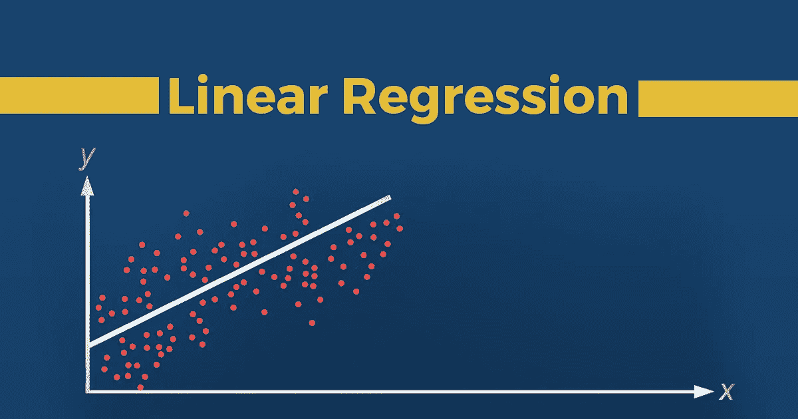

# 线性回归:初学者的方法

> 原文：<https://medium.com/analytics-vidhya/linear-regression-beginners-approach-57e49f5aa2a?source=collection_archive---------28----------------------->

来源:谷歌

*在开始写博客之前，让我们重温一些基本定义*

# 什么是机器学习？

> *机器学习(ML)是研究通过经验自动改进的计算机算法。它被视为人工智能的一个子集。机器学习算法基于样本数据建立数学模型，称为“训练…*