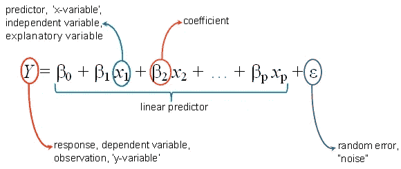

# 线性回归

> 原文：<https://medium.com/analytics-vidhya/linear-regression-dce0b8e3506e?source=collection_archive---------25----------------------->

线性回归是最简单的机器学习算法之一，属于监督学习技术，用于解决回归问题。

它用于在自变量的帮助下预测连续的因变量。线性回归的目标是找到能够准确预测连续因变量输出的最佳拟合线。

通过寻找最佳拟合线，算法建立了因变量和自变量之间的关系。

线性回归的输出应该只是连续值，如价格、年龄、工资等。

**线性回归一般分为两种:**

*   简单的**线性回归**。
*   多元线性回归。

# 简单线性回归

在简单线性回归中，基本上有一个因变量和一个自变量，由以下公式定义:

*b0 =代表截距*

*b1 =代表系数*

*x =代表自变量*

*y =代表输出或因变量*

这是一个只有一个解释变量的回归模型。

y- **截距**的部分估算过程是基于从**回归**模型中排除相关变量。

# **多元线性回归**

对于一个**多元线性回归**当我们有**多个输入(x)** 时，这条线被称为 **a 平面**或超平面。因此，这种表示就是方程的形式。

# 最小平方回归线

最小二乘回归是一种为一组数据找到最佳拟合线的方法。它通过创建最小化垂直距离平方和的模型([残差](https://www.statisticshowto.com/residual/))来做到这一点。

距离是平方的，以避免负号距离的问题。那么问题就变成了计算出你应该把线放在哪里，使得从点到线的距离最小化。

# 梯度下降

梯度下降是通过遵循成本函数的梯度来最小化函数的过程。为了使用梯度下降找到函数的局部最小值，我们采取与函数在当前点的梯度的负值成比例的步骤。

这包括知道成本和导数的形式，这样从一个给定点开始，你就知道了梯度，并且可以向那个方向移动。

## Python 实现

***数据集:薪资***

*以下是薪资数据集线性回归的 python 实现链接:*

[https://github . com/internity foundation/machine learning _ navu 4/tree/master/Day % 206% 20:% 20 linear % 20 regression](https://github.com/InternityFoundation/MachineLearning_Navu4/tree/master/Day%206%20:%20Linear%20Regression)

下面是 [*Jupyter 笔记本*](https://github.com/bhartendudubey/Supervised-Learning-Algorithms/blob/master/Linear_regression.ipynb) 为 python 实现的线性回归数学方式。

链接:[https://github . com/internity foundation/machine learning _ navu 4/blob/master/Day % 206% 20:% 20 Linear % 20 regression/Linear _ regression(mathematical _ way)。ipynb](https://github.com/InternityFoundation/MachineLearning_Navu4/blob/master/Day%206%20:%20Linear%20Regression/Linear_regression(mathematical_way).ipynb)