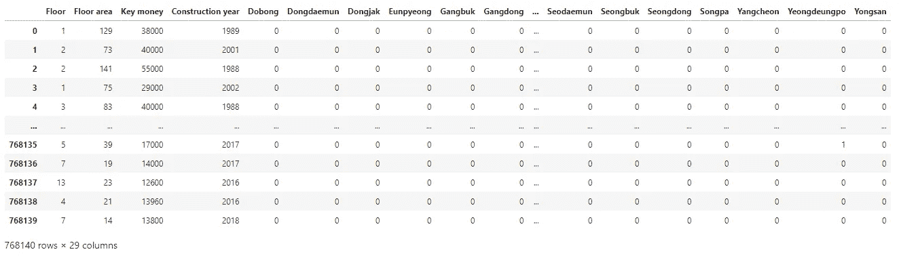

# 线性回归、决策树和集成学习在首尔房价中的应用

> 原文：<https://medium.com/analytics-vidhya/linear-regression-decision-tree-and-ensemble-learning-applied-to-seoul-housing-prices-830d3493cfdb?source=collection_archive---------3----------------------->

## 实现回归模型以对真实数据集进行预测


《寄生虫》，奉俊昊，2019。

这篇文章阐述了用 Python 准备数据集并通过 scikit-learn 库中实现的不同机器学习算法(线性回归、决策树、随机森林和三种提升算法— AdaBoost、梯度提升、XGBoost)运行数据集以解决回归问题的步骤。

[数据集](https://data.seoul.go.kr/dataList/OA-15549/S/1/datasetView.do)包含 2016 年至 2019 年间首尔市记录的超过 76 万宗租赁交易。目标是预测承租人为每笔交易支付的保证金(或额外租金)的金额。被认为与预测相关的特征是:1)楼层面积，2)楼层数，3)建造年份，以及 4)房产的位置。数据集的介绍见 B 部分。

将讨论以下几点:

*   如何塑造、可视化和清理数据
*   如何建立和训练模型(或预测器)
*   如何评价他们的表现

Jupyter 笔记本在 https://github.com/thierrylaplanche/SeoulHousingPrediction[有售](https://github.com/thierrylaplanche/SeoulHousingPrediction)

# A.总体结果


模型评估的不同指标

我们用于评估和比较不同模型(预测值)的度量是 R (R 平方，或决定系数)，它评估预测值与原始值相比的拟合程度。范围从 0 到 1，值接近 1 表示模型更好。在上表中:

*   *R^2 验证*是在交叉验证期间对验证集计算的平均 r 分数。
*   *R^2 测试*是对最终模型的评估，在包含训练期间未见过的数据的测试集上执行(在我们的例子中，占总数据的 30 %)。它通常低于 *R^2 验证*，但是太大的差异将是模型“过度拟合”训练数据并且不能很好地概括新数据的迹象。

就我们问题的预测准确性而言，基于决策树的算法远远领先于更简单的回归模型。最好的成绩是由 XGBoost 取得的。然而，当与简单的决策树(其超参数通过随机搜索 CV 进行调整)相比时，差异并不显著。


绘制核密度估计值可以看出预测值与实际值有多接近

上图表示目标变量(关键货币)的*核密度估计值*。实际值用红色表示，预测值用蓝色表示。我们可以看到，与简单的线性回归相比，使用 XGBoost 训练的模型的预测值更接近实际值。这证实了上述指标。

作为说明，下图显示了测试集的前 5 个目标值(租赁保证金金额)和每个模型的预测值(单位为 10，000 韩元，即 8.5 美元左右)。


每个模型的实际值与预测值

# B.数据集的呈现

数据集从首尔开放数据广场网站下载为 Excel 文件:[https://Data . Seoul . go . kr/dataList/OA-15549/S/1/dataset view . do](https://data.seoul.go.kr/dataList/OA-15549/S/1/datasetView.do)。它包含了首尔 25 个区从 2011 年到 2019 年的 200 多万笔租赁交易。


数据集由 20 多列组成，其中我们保留了以下内容:

*   *楼层面积:*确定押金数额的最明显标准
*   *楼层数:*我们预计随着我们上楼，押金会增加
*   *建造年份:*最近的建筑通常更贵
*   *地区名称:*位置是另一个重要的标准
*   *保证金*，或保证金:我们要预测的目标

为了提高计算效率，并最大限度地减少通货膨胀的影响，我们将数据过滤为 2016 年至 2019 年之间执行的交易。

# C.数据准备

执行以下操作为建模准备数据。朱庇特笔记本中提供了更多的细节。

*   使用正确的编码导入数据集

方法`read_csv`将逗号分隔的值文件解析成 pandas 数据帧，指定参数`encoding`来解释韩文字符。

```
import pandas as pddf_transactions = pd.read_csv('seoul_lease_transactions_20190916.csv', encoding = 'EUC-KR', dtype = str)
```

*   根据交易日期筛选行

```
df_transactions = df_transactions[(df_transactions['Transaction year'] < '2020') & (df_transactions['Transaction year'] > '2015')]
```

*   删除不必要的列

```
df_transactions = df_transactions.drop(
                  columns = {'Lot code', 'Institution code',
                            'Serial number', 'Collection year',
                            'District code', 'Neighborhood code',...
                            })
```

*   输入缺失数据

超过 200 000 行有未指定的楼层数。我们可以删除相应的行，删除整个属性“楼层数”，或者用最常见的值或中间值来估算缺失值。我们决定将缺失的楼层设置为数据集(2)中最常见的楼层。

```
# Find the most common values for column ‘Floor’
df_transactions['Floor'].value_counts().head()# Fill ‘null’ values with 2
df_transactions['Floor'] = df_transactions['Floor'].fillna(2)
```

*   删除损坏的数据

消除畸形或损坏的数字数据的一个简单方法是强制输入列的类型。我们将所有预期包含数值的列转换为数值类型，将参数`error`设置为‘强制’。任何无效值将被设置为`null`。

```
# Set numerical type to specific columns
df_transactions[['Floor', 'Floor area', 'Key money', 'Construction year']] = df_transactions[['Floor', 'Floor area', 'Key money', 'Construction year']].apply(pd.to_numeric, errors='coerce')# Remove null values
df_transactions = df_transactions.dropna()# Convert floats to integers to remove decimals
df_transactions[['Floor', 'Floor area', 'Key money', 'Construction year']] = df_transactions[['Floor', 'Floor area', 'Key money', 'Construction year']].astype(int)
```

*   寻找相关性

用方法`corr`查看相关系数给了我们特征之间任何线性关系的暗示。接近 1 的值表示强正相关，接近-1 的值表示强负相关。识别更复杂关系的另一种方法是通过调用方法`scatter_matrix`来绘制每个数字属性与其他属性的关系。

```
# Pearson correlation coefficient between each pair of attributes
df_transactions.corr()# Plot every numerical attribute against every other
pd.plotting.scatter_matrix(df_transactions, figsize =(20,15), alpha = 0.01)# Visualize correlation between the attribute ‘Floor area’ and the target ‘Key money’
df_transactions.plot.scatter('Floor area', 'Key money', alpha = 0.01)
```


“楼面面积”与“租金”:上升趋势是明显的，但不明显

*   消除异常值

为了帮助线性回归模型对看不见的数据进行归纳，从定型数据中移除极端样本是一种很好的做法。我们应用 [1.5 倍 IQR 法则](https://www.thoughtco.com/what-is-the-interquartile-range-rule-3126244)来隔离第一个四分位数以下低于 1.5 倍 IQR(四分位数间距)和第三个四分位数以上高于 1.5 倍 IQR 的数据。这对于基于决策树的预测器来说是不必要的，因为基于决策树的预测器对于异常值是鲁棒的。

```
# 1.5*IQR rule: function to compute the lower range and upper range
def range_keep(column):
   sorted(column)
   Q1,Q3 = np.percentile(column , [25,75]) # 25th to 75th percentile
   IQR = Q3 - Q1
   lower_range = Q1 - (1.5 * IQR)
   upper_range = Q3 + (1.5 * IQR)
   return lower_range, upper_range# Compute the lower range and upper range for column 'Key money'
lower_range, upper_range = range_keep(df_transactions['Key money'])# Keep only values that lie between that range
df_transactions =  df_transactions.drop(df_transactions[ (df_transactions['Key money'] > upper_range) |
(df_transactions['Key money'] < lower_range)].index)# Compute the lower range and upper range for column 'Floor area'
lower_range, upper_range = range_keep(df_transactions['Floor area'])# Keep only values that lie between that range
df_transactions = df_transactions.drop(df_transactions[ (df_transactions['Floor area'] > upper_range) | (df_transactions['Floor area'] < lower_range)].index)
```


移除异常值前后每个数值属性的直方图

*   将分类特征转换为二元(虚拟)变量

非数字特征通常需要在被馈送到机器学习算法之前被转换成二进制变量。列“区名”包含 25 个不同的文本值，每个值代表首尔的一个区，它被转换为 25 个二进制列。

```
# Automatically generate dummy variables from column 'District name'
dummy_district = pd.get_dummies(df_transactions['District name'])# Concatenate the original dataframe with the dummy variables
df_transactions_dummy = pd.concat([df_transactions, dummy_district], axis = 1)# Drop the original 'District name' column
df_transactions_dummy = df_transactions_dummy.drop(columns={'District name'}).reset_index(drop=True)
```



准备好的数据集

# D.数据建模步骤

有了干净的数据集，是时候为算法塑造它了。

*   定义输入和目标变量

输入矩阵(X)包含这些特征。输出向量(y)是我们要预测的目标(存款额，或关键金额)。

```
y = df_transactions_dummy['Key money']X = df_transactions_dummy.drop(columns={'Key money'})
```

*   分割训练/测试集

模型在原始数据的子集(训练集)上学习，并在不同的子集(测试集)上评估。我们把比例定为 70%-30%。

```
from sklearn.model_selection import train_test_splitX_train, X_test, y_train, y_test = train_test_split(X, y, test_size = 0.3, random_state = 2)
```

*   缩放功能

线性回归模型对缩放后的要素学习得更好。我们将所有特征的范围定为 0 到 1。对于基于决策树的模型，我们将使用原始(未缩放)数据。

```
from sklearn.preprocessing import MinMaxScalerscaler_x = MinMaxScaler(feature_range = (0,1))X_train_scaled = scaler_x.fit_transform(X_train)
X_test_scaled = scaler_x.transform(X_test)
```

下一步是拟合模型(详见 E 部分)并评估它们的性能。

*   模型评估

预测值的`score`方法返回决定系数(R)。我们使用这个指标来评估每个模型并比较它们的性能。

```
# Coefficient of determination (R^2) on the test set
tree_reg.score(X_test, y_test)
```

*   预测的可视化

在同一张图上绘制实际值和预测值的核密度估计值，暗示了预测的准确性。

```
import seaborn as snsax1 = sns.distplot(y_test, hist = False, color = 'r', label = 'actual')sns.distplot(y_pred, hist = False, color = 'b', label = 'prediction', ax = ax1)
```


*实际值和预测值的核密度估计*

*   使用`RandomizedSearchCV`进行超参数调谐

`RandomizedSearchCV`评估算法参数(超参数)的不同组合，并用找到的最佳组合重新训练数据集。

它采用*交叉验证分裂策略*，将训练集分裂成一定数量的子集(默认为 5 个)，然后每次在不同的折叠上训练和评估模型(4 个作为较小的训练集，剩下的一个作为验证集)。这通常导致比简单的训练/测试分割更少的偏差结果。我们之前构建的测试集并不包含在这个过程中，它是为模型的最终评估而保留的。

```
from sklearn.model_selection import RandomizedSearchCV# Hyperparameter values to test
param_grid = {'max_features': ['auto', 'sqrt'],
              'max_depth': np.arange(5, 36, 5),
              'min_samples_split': [5, 10, 20, 40],
              'min_samples_leaf': [2, 6, 12, 24],
             }# RandomizedSearchCV with a limit of 10 combinations to test
tree_reg = RandomizedSearchCV(estimator = DecisionTreeRegressor(), param_distributions = param_grid, n_iter = 10, verbose = 2, n_jobs = -1)tree_reg.fit(X_train, y_train)
```

# E.模型评论

*   线性回归

最简单的模型有时会产生最好的结果。当每个特征和目标变量之间的关系基于单个系数时，这就是线性回归的情况。然而，数据通常以更复杂的方式相互关联。对我们的数据集的探索没有揭示变量之间的任何明确的线性关系。因此，我们并不指望这种模式会有很大的成效。然而，我们可以用它作为基线来判断其他更复杂的预测器的性能。

```
from sklearn.linear_model import LinearRegressionlin_reg = LinearRegression()lin_reg_score = cross_val_score(lin_reg, X_train_scaled, y_train, verbose = 2)lin_reg.fit(X_train_scaled, y_train)y_pred = lin_reg.predict(X_test_scaled)lin_reg.score(X_test_scaled, y_test)
```


*   多项式回归

多项式回归允许表示变量之间更复杂(非线性)的关系。该方法基于与上述相同的线性回归算法，但对输入要素进行了预先数学变换，并创建了组合现有要素的新属性。这可能会导致功能数量激增，并大大减慢学习过程。此外，当我们增加多项式变换的次数时，这种方法容易过度拟合。

```
from sklearn.linear_model import LinearRegression
from sklearn.preprocessing import PolynomialFeatures# Polynomial transformation of degree 2
poly_features = PolynomialFeatures(degree = 2)# Returns a transformed version of X with new features
X_train_scaled_poly = poly_features.fit_transform(X_train_scaled)
X_test_scaled_poly = poly_features.fit_transform(X_test_scaled)poly_reg = LinearRegression()poly_reg_score = cross_val_score(poly_reg, X_train_scaled_poly, y_train, verbose = 2)poly_reg.fit(X_train_scaled_poly, y_train)y_pred = poly_reg.predict(X_test_scaled_poly)poly_reg.score(X_test_scaled_poly, y_test)
```


*   决策图表

决策树能够对数据中复杂的非线性关系进行建模，既适用于分类任务，也适用于回归任务。位于树的较高层的特征对预测有较大的影响，这使得模型易于解释。众所周知，决策树容易过度拟合。然而，这可以通过调整算法的超参数来防止，例如树的最大深度。

```
from sklearn.model_selection import RandomizedSearchCV
from sklearn.tree import DecisionTreeRegressorparam_grid = {'max_features': ['auto', 'sqrt'],
              'max_depth': np.arange(5, 36, 5),
              'min_samples_split': [5, 10, 20, 40],
              'min_samples_leaf': [2, 6, 12, 24],
             }tree_reg = RandomizedSearchCV(estimator = DecisionTreeRegressor(), param_distributions = param_grid, n_iter = 100, verbose = 2, n_jobs = -1)tree_reg.fit(X_train, y_train)
```

对超参数的随机搜索产生了以下最佳组合。

```
tree_reg.best_params_{'min_samples_split': 40,
 'min_samples_leaf': 2,
 'max_features': 'auto',
 'max_depth': 40}
```

决策树模型带有一个方便的`feature_importances_`属性，它返回模型中每个特征的重要性。也称为“基尼重要度”，它是包括该特征的所有树的分裂数之和，与它分裂的样本数成比例。在我们的案例中，预测存款金额的最具决定性的特征如下:

```
sorted(dict(zip(X_train.columns, tree_reg.best_estimator_.feature_importances_)).items(), key=lambda x: x[1], reverse=True)[('Floor area', 0.6650461951919517),
 ('Construction year', 0.1020058438278795),
 ('Floor', 0.09984360254893668),
 ('Gangnam', 0.02888171812885576),
 ('Seocho', 0.018332026175877324),
 ('Songpa', 0.013463453343552612),
 ('Yangcheon', 0.007425564646474106), ...
```

正如所料，建筑面积是预测存款的最决定性因素，其次是建筑年份和楼层数。接下来的地区列表或多或少按每个地区的平均存款额排序，最贵的地区权重最大。我们可以尝试去掉最不重要的特征，因为它们似乎对预测没有太大贡献。


*   随机森林

随机森林是一种集成学习方法，它包括并行生长几个决策树，并组合它们的输出来进行预测。每个决策树(称为“弱学习者”)都建立在训练集的不同随机子集上，从而学习不同的模式。组合一组树的预测通常会产生比最佳单个树更好的结果。

```
from sklearn.model_selection import RandomizedSearchCV
from sklearn.ensemble import RandomForestRegressorparam_grid = {'max_features': ['auto', 'sqrt'],
              'max_depth': np.arange(5, 36, 5),
              'min_samples_split': [5, 10, 20, 40],
              'min_samples_leaf': [2, 6, 12, 24],
             }rfor_reg = RandomizedSearchCV(RandomForestRegressor(), param_distributions = param_grid, n_iter = 100, verbose = 2, n_jobs = -1)rfor_reg.fit(X_train, y_train)
```

随机搜索产生了以下超参数的最佳组合:

```
rfor_reg.best_params_{'min_samples_split': 5,
 'min_samples_leaf': 2,
 'max_features': 'sqrt',
 'max_depth': 35}
```

最具决定性的特征如下。楼层数被赋予了更大的权重:

```
sorted(dict(zip(X_train.columns, rfor_reg.best_estimator_.feature_importances_)).items(), key=lambda x: x[1], reverse=True)[('Floor area', 0.5355792921620066),
 ('Floor', 0.19361661010178893),
 ('Construction year', 0.12539123364405722),
 ('Gangnam', 0.02845832530359601),
 ('Seocho', 0.018817437372265773),
 ('Songpa', 0.01287372002727185),
 ('Seongdong', 0.007682300699672825), ...
```


*   助推算法

作为一种集成学习，boosting 包括依次训练几个模型，每个模型都试图提高其前任的性能。AdaBoost、Gradient Boosting 和 XGBoost 是一些最常见的增强算法，每种算法的表现都略有不同。

[AdaBoost](https://hackernoon.com/boosting-algorithms-adaboost-gradient-boosting-and-xgboost-f74991cad38c) 专注于通过对前一个模型最不适合(预测不佳)的样本增加权重来依次改进每个模型。

```
from sklearn.model_selection import RandomizedSearchCV
from sklearn.ensemble import AdaBoostRegressor
from sklearn.tree import DecisionTreeRegressorparam_grid = {"learning_rate" : [0.01, 0.1, 0.3],
              "loss"          : ['linear', 'square', 'exponential']
             }ada_reg = RandomizedSearchCV(AdaBoostRegressor( DecisionTreeRegressor(), n_estimators=100), param_distributions = param_grid, n_iter = 100, verbose = 2, n_jobs = -1)ada_reg.fit(X_train, y_train)
```

[梯度推进](/hackernoon/gradient-boosting-and-xgboost-90862daa6c77)试图解决一个优化问题:其目标是通过在每一步增加一个弱学习器来减少损失函数。

```
from sklearn.model_selection import RandomizedSearchCV
from sklearn.ensemble import GradientBoostingRegressorparam_grid = {"learning_rate"    : [0.01, 0.1, 0.3],
              "subsample"        : [0.5, 1.0],
              "max_depth"        : [3, 4, 5, 10, 15, 20],
              "max_features"     : ['auto', 'sqrt'],
              "min_samples_split": [5, 10, 20, 40],
              "min_samples_leaf" : [2, 6, 12, 24]
             }grad_reg = RandomizedSearchCV(GradientBoostingRegressor(), param_distributions = param_grid, n_iter = 100, verbose = 2, n_jobs = -1)grad_reg.fit(X_train, y_train)
```

[XGBoost](/hackernoon/gradient-boosting-and-xgboost-90862daa6c77) 是梯度增强算法的高级实现，采用正则化技术进一步减少过拟合，并通过并行处理加快计算速度。

```
from sklearn.model_selection import RandomizedSearchCV
from xgboost import XGBRegressorparam_grid = {"learning_rate"    : [0.01, 0.1, 0.3] ,
              "max_depth"        : [3, 4, 5, 10, 15, 20],
              "min_child_weight" : [1, 3, 5, 7],
              "gamma"            : [0.0, 0.1, 0.2, 0.3, 0.4],
              "colsample_bytree" : [0.3, 0.4, 0.5, 0.7]
             }xgb_reg = RandomizedSearchCV(XGBRegressor(), param_distributions = param_grid, n_iter = 100, verbose = 2, n_jobs = -1)xgb_reg.fit(X_train, y_train)
```

XGBoost 附带了一个很酷的特性来可视化每个特性的重要性，其特征是一个特性被用来在所有树之间分割数据的次数。

```
from xgboost import plot_importanceplot_importance(xgb_reg.best_estimator_)
```


XGBoost 模型中每个特性的重要性


# F.几处改动

*   删除“地区名称”

“地区名称”属性在功能重要性方面排名较低。然而，由于它的非数值性质，它在我们的数据集中占据了不少于 25 列(总共 28 列)。我们怀疑这个变量对训练时间有很大的影响。

事实上，取消这一功能可以大大减少培训时间。例如，随机森林训练时间从 252 分钟下降到 80 分钟。然而，时间上的收益伴随着预测性能的下降，如下面的核密度估计图所示。除此之外，测试的 R 分数从 0.878 降到了 0.755。


一个原因可能是，虽然每个二元属性单独使用一般不会对所有预测产生很大影响，但所有 25 个属性的组合有助于模型产生更好的预测。

保持训练时间短和性能高的一个可能的解决方案是用一个数字特征代替这个分类特征，例如相应地区的中值收入。

*   删除楼层号

超过四分之一的样本没有指定楼层数。作为一种变通方法，我们用数据集中最常见的楼层数来估算缺失值。这引入了许多错误的值，并且可能阻碍了我们模型的性能。

还是有？重新训练没有这个特征的模型没有产生任何显著的变化。这证实了基于决策树的模型对该特征的低重要性。

# G.可能的改进

*   添加更多功能

在现实生活中，房产的价值(或保证金的数量)取决于更多的因素，而不仅仅是建筑面积和我们在模型中使用的其他属性。有了更多样化的特征，比如卧室的数量、到最近地铁站的距离，或者从房产看风景的评级(0 表示垃圾场，10 表示山或河)，我们可以期待更好的结果。

*   标准化数据集

在绘制数字特征的直方图时，我们注意到一些分布是重尾的:它们向一侧延伸得比另一侧远。这对于一些机器学习算法来说并不理想，因为这可能会使它们更难检测到模式。我们可能想要转换这些属性，例如通过计算它们的对数，以便获得更“类似高斯”的分布。

*   执行分层洗牌

正如所料,“地板面积”属性是预测存款金额的最重要因素。我们可能希望确保该特征的不同间隔(例如，从 10 米到 30 米、从 30 米到 50 米、从 50 米到 70 米等)。)在测试集中的比例与它们在整个数据集中的比例相同。为此，我们将在数据集中创建一个新列，存储每个样本所属的区间(地层)，然后使用 scikit-learn 的函数`StratifiedShuffleSplit`执行分层采样，而不是使用`train_test_split`执行纯粹的随机采样。

*   尝试其他型号

我们可以投入更多时间，训练其他机器学习算法:回归支持向量机(SVR)、KNN 或神经网络。

最后，这里是首尔的 choropleth 地图，代表 25 个区的平均保证金金额。我们可以证实，最昂贵的地区(在东南部)是那些被基于决策树的模型赋予最大重要性(权重)的地区。

