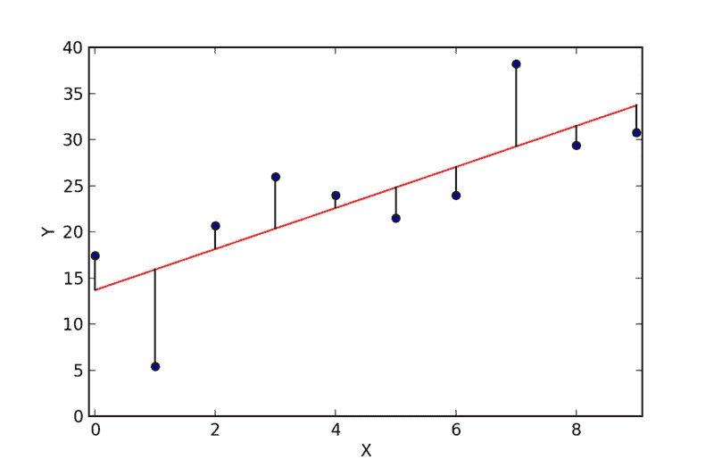
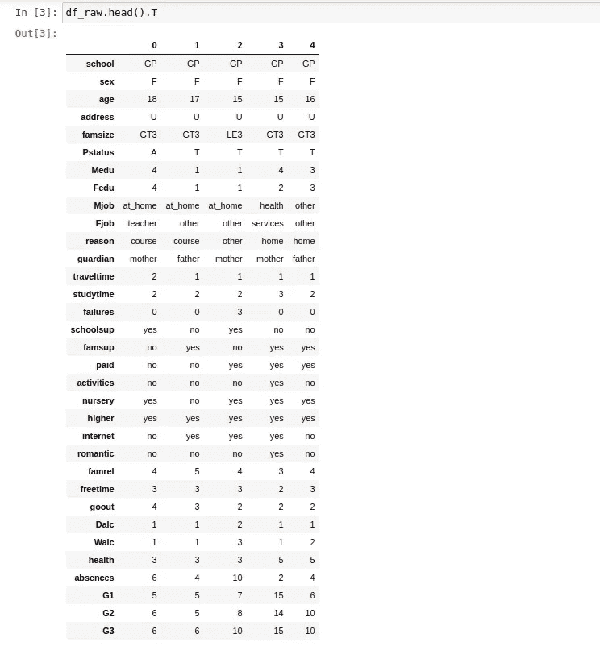
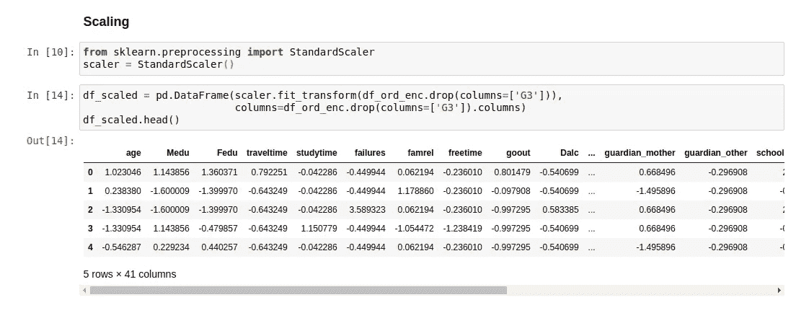
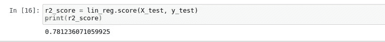

# 线性回归深潜

> 原文：<https://medium.com/analytics-vidhya/linear-regression-deep-dive-f266480da10d?source=collection_archive---------14----------------------->

线性回归是回归建模中最简单且广泛使用的模型之一。它通过将线性方程拟合到观察到的数据来模拟连续的因变量 Y 和自变量 X 之间的关系。

**简单线性回归**模型确定独立特征和从属目标变量之间的关系。这种关系可以表示为直线*的方程式，即* ***y = b1。x+B0*。**多元线性回归**确定目标变量与一个以上独立特征的关系。参数 *b0，b1，…，bn* 可以通过使用**普通最小二乘(OLS)** 方法最小化*残差平方和来识别。***

*最小二乘法使预测值与实际值的垂直偏差最小。这些误差项被称为**残差。**平方误差确保正负偏差不会抵消。*

**

*从预测值到最佳拟合线的垂直线是**残差** *(来源:维基百科)**

***Python 实现***

*我们将使用来自 [**UCI-ML 知识库**](https://archive.ics.uci.edu/ml/datasets/Student+Performance) 的**学生成绩数据**来探索 Python 中的线性回归。该数据集包含关于两所葡萄牙学校的中等教育学生成绩的信息。数据属性包括学生成绩、人口统计、社会和学校相关特征。有关详细的数据字典，请访问链接。这是数据集前几行的样子。*

**

*由于数据集包含分类列，如父母的教育水平、学生的性别等，我们将 [**一次性编码**](http://scikit-learn.org/stable/modules/generated/sklearn.preprocessing.OneHotEncoder.html) 这些。这将自动对包含文本数据的所有列进行一次性编码，并创建(n-1)个新要素，其中 n 是要素的级数。*

```
*df_transformed = pd.get_dummies(df_raw, drop_first=True)*
```

*学生的健康、旅行时间等一些要素是顺序要素，尽管它们显示为数字。所以我们 [**序数编码**](http://scikit-learn.org/stable/modules/generated/sklearn.preprocessing.OrdinalEncoder.html) 那些特性使用 scikit-learn 的序数编码器类。*

```
*ordinal_features = ['Medu', 'Fedu', 'traveltime', 'studytime', 'famrel', 'freetime', 'goout', 'Dalc', 'Walc', 'health']from sklearn.preprocessing import OrdinalEncoderord_enc = OrdinalEncoder()df_ord_enc = df_transformed.copy()
df_ord_enc[ordinal_features] = ord_enc.fit_transform(df_transformed[ordinal_features])*
```

*在拟合模型之前，我们**缩放数据集**,以便所有的特征都在相同的范围内。由于它是一个线性模型，缩放模型可以提高预测准确性和可解释性。使用 scikit-learn 中的**标准缩放器**，我们缩放数据集并创建一个新的数据帧。*

**

*将数据集分成测试样本和训练样本，以**期末成绩 G3** 为目标特征，得到线性回归模型的最终训练集。*

```
*from sklearn.model_selection import train_test_splitX_train, X_test, y_train, y_test = train_test_split(df_ord_enc.drop(columns=[‘G3’]), df_ord_enc.G3, test_size=0.1)*
```

*使用 scikit-learn 的线性模型中的 [**LinearRegression**](http://scikit-learn.org/stable/modules/generated/sklearn.linear_model.LinearRegression.html) 类，我们在训练集上拟合模型。*

```
*from sklearn.linear_model import LinearRegressionlin_reg = LinearRegression()
lin_reg.fit(X_train, y_train)*
```

*然后我们可以对测试集进行预测。*

```
*y_pred = lin_reg.predict(X_test)*
```

*LinearRegression 类也有使用 [**R 平方**](https://en.wikipedia.org/wiki/Coefficient_of_determination) 度量来检查模型性能的方法。简单地说，R 平方度量解释了目标变量中有多少方差是由独立特征解释的。对于完美预测目标值的模型，该值为 1，对于总是预测常数值的模型，该值为 0。对于我们的模型，这个度量是 **~0.78** ，这是一个合适的值。*

**

***假设***

*虽然这是最广泛使用的算法之一，但只有当数据不违反线性回归的假设时，这些关系才有效。这些假设包括:*

1.  *独立特征和因变量之间的关系是**线性**。*
2.  *数据中没有 [**自相关**](https://en.wikipedia.org/wiki/Autocorrelation) 即误差项之间没有相关性。时间序列数据通常是自相关的。 [**杜宾-沃森检验**](https://en.wikipedia.org/wiki/Durbin%E2%80%93Watson_statistic) 可以给我们一个数据中自共线性的估计。*
3.  *独立特征不应该是相关的。**数据中的多重共线性**会扭曲某些特征的贡献。**特征的相关性分析**可以识别高度相关的特征。*
4.  *误差项应该具有恒定的方差，即数据应该是[](https://en.wikipedia.org/wiki/Homoscedasticity)**。这通常是由于数据中存在异常值。残差与拟合值的关系图可用于检测数据集中的异方差。***
5.  ***误差项应该是正态分布的。这是因为存在不寻常的数据点。这可以用 [**QQ 图**](https://en.wikipedia.org/wiki/Q%E2%80%93Q_plot) 来识别。***

*****验证指标*****

***有一些标准指标可以帮助评估模型预测新数据点的能力。这些指标中的大多数都可以在 scikit-learn 的指标包中找到。我们将讨论其中的一些。***

1.  *****平均绝对误差** —预测值与观测值之间的平均绝对差值。这给出了预测值与实际值的平均偏差。这很容易解释，因为它与目标变量的单位相同。***
2.  *****均方误差** —它是预测误差的平方的平均值。由于误差项是平方的，它不像 MAE 那样容易解释。***
3.  *****均方根误差**—MSE 的平方根。当较大的误差不太理想时，它是优选的，因为它给予较大的误差较大的权重。***
4.  *****R 平方** —它测量模型的拟合优度。R-squared 衡量目标变量中多大比例的方差可以由独立特征来解释。最大值可以是 1，也可以是负值。***
5.  *****调整后的 R 平方**-随着数据中要素数量的增加，R 平方将不断增加。因此，即使附加特征是噪声，R 平方也会增加。校正的 R 平方值校正模型中使用的独立要素数量的 R 平方值。只有当新特性的添加对模型的改进超过随机机会的预期时，该值才会增加，否则该值会减少。对于完全拟合的模型，这可以是 1，对于拟合不佳的模型，这可以是负的。***

***在下一篇文章中，我们将查看更多的统计数据和图表，帮助我们更好地理解回归模型和使用 Statsmodel 包的数据集。***

***展示这些概念的代码可以在 Github 上找到。***