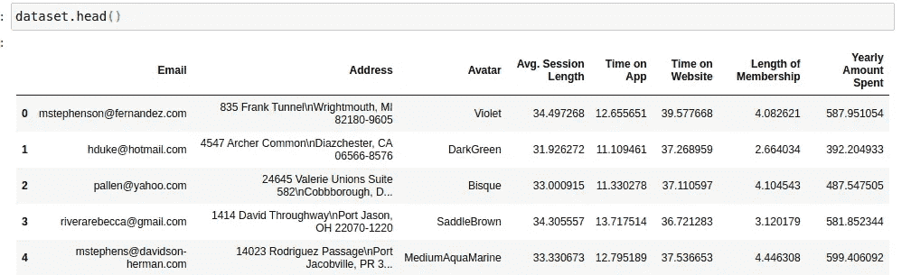
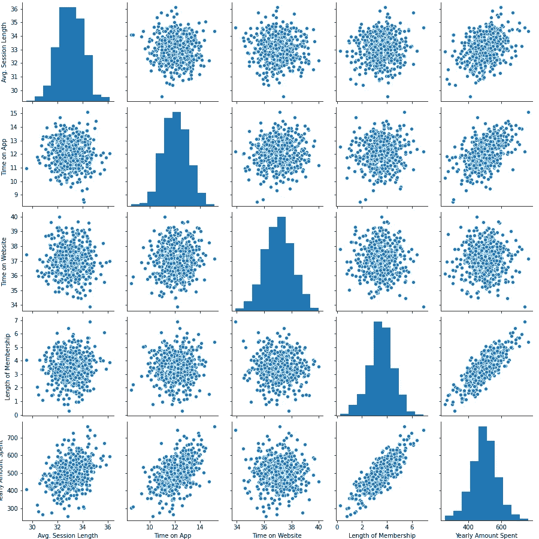
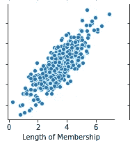
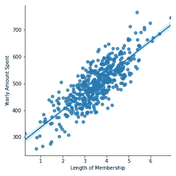
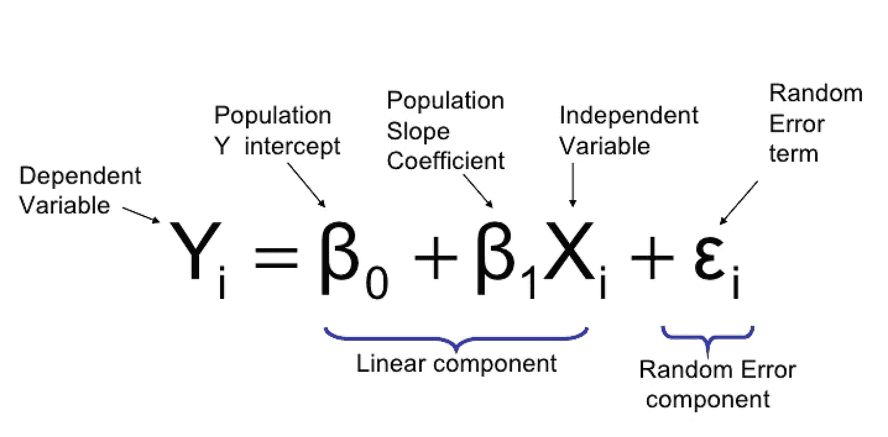
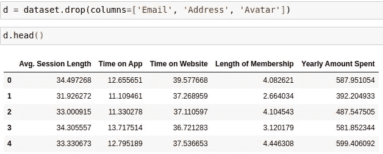
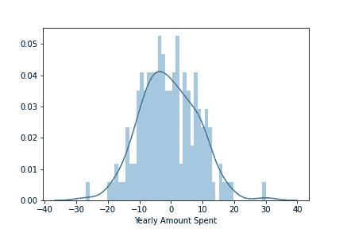
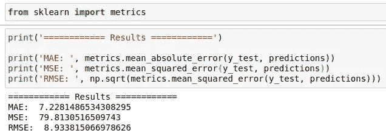
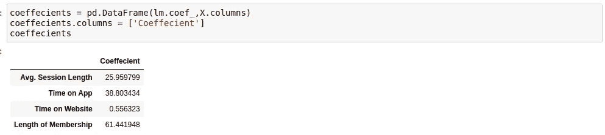

# 去神秘化的线性回归

> 原文：<https://medium.com/analytics-vidhya/linear-regression-demystified-4d285a2a1d00?source=collection_archive---------30----------------------->

在这篇文章中，我们将看到最常见的机器学习技术，以及如何应用简单的方法来解决问题。

GIF 来源[此处](https://towardsdatascience.com/linear-regression-the-easier-way-6f941aa471ea)

假设你被一家大型电子商务公司聘用，帮助他们决定，为了增加你的利润，你是否需要更多地关注你的应用程序或网站。

他们为你提供了一个关于他们消费者信息的数据库，现在，你需要发现如何利用你在**机器学习中的技能来解决他们的问题。**

我们开始吧！

警告:我从[本日课程](https://www.udemy.com/course/python-para-data-science-e-machine-learning/)中获取数据，此数据不真实！

# **查看数据集**

在使用 Pandas 加载我们的数据集之后，我们可以从数据集的头部开始查看。

我们的数据集看起来像这样:

我们的数据集

现在，我们可以看到数据集中存在的数据类型，我们可以探索这一点，以找到解决我们问题的最佳机器学习方法。

# 发现最佳机器学习方法

很容易看出我们是否可以使用线性回归方法，我们只需要绘制我们的数据，并找到 X 和 y 之间的相关性。

请记住，电子商务公司想知道他们是否需要专注于他们的网站或应用程序来增加收入，因此我们的 Y 将是 ***【每年花费的金额】*** 。

现在，我们需要找到 X。在线性回归中，X 代表直接影响 Y 的结果的变量，从而建立 X 和 Y 之间的线性回归。

对于这个问题，我们可以凭经验找到 X。但首先，我们需要收集所有可能帮助我们的信息。

所有标绘信息

现在，我们需要找出某个 X 和 ***“每年花费的金额”之间的关联。***

我们可以在 ***【隶属长度】*** 中看到这种相关性，如下图所示:

X 和 Y 之间的相关性

我们可以绘制一个线性回归图来更好地显示这种相关性:

X 和 Y 之间的线性回归

现在，我们发现了相关性并可以应用 ***进行线性回归！***

# 应用线性回归

基本上，线性回归在下面的公式中恢复:

我会写一个接近线性回归理论的帖子，别急。

现在，你只需要理解背后的概念。记住，对于这个问题，我们想预测什么将增加电子商务公司的收入。

我们发现，*与 ***【每年花费金额】*** 有相关性，这就是我们的 X 和 y。*

*现在，根据这些信息，我们需要预测什么会增加更多的收入，是网站还是应用程序。*

*接下来，让我们应用 ***线性回归！****

*要构建模型并轻松应用线性回归，我们可以使用 scikit-learn。*

**

# ***建造我们的模型***

*在建立我们的模型之前，我们需要选择我们要输入到他的数据。*

*当我们在谈论 ***机器学习模型*** 时，与它们交流的通用语言是我们钟爱的数学！*

*因此，我们可以删除数据集中所有包含字符串的列，例如:*、*、*、*、*、【头像】、*。这对我们的模型来说绝对无关紧要！*

**

*删除不必要的列后的数据集*

*现在，我们需要将数据分成 ***训练和*** 测试，为此，我们也可以使用 scikit-learn。*

*这是一个小数据集，我们只有 5000 个例子！*

*在这种情况下，我使用分裂 90%的训练和 10%的测试，但你可以测试许多方法，并找到最好的方法；)*

*令我惊讶的是，使用 70%的训练，模型表现更好，哈哈！*

*在将我们的数据集分割成训练和测试之后，我们可以拟合我们的模型通过来自训练的 ***X 和 Y*** 。*

# ***可视化结果***

*在训练我们的模型之后，我们可以在我们的测试数据中进行预测，然后绘制预测和实际结果，以比较我们的模型的表现。*

**

*还不错！*

*现在，把我们的错误可视化是一个很好的实践:*

**

*错误*

*请记住，这不是真实的数据，因此我们的模型中输入的示例数量非常少，这将直接影响性能！*

*但是现在，我们需要回答这项工作的主要问题，对吗？*

# *回答主要问题*

*要回答这个主要问题，我们只需要将模型的系数可视化。*

*如下图所示:*

**

*线性回归结果*

*但是找这个数据，我们能解读出关于他的什么呢？*

*这一解释摘自本课程:*

*   *在所有其他变量保持不变的情况下，平均使用时间每增加 1 个单位，总花费就会增加 25.98 美元。*
*   *在所有其他变量保持不变的情况下，申请时间每增加 1 个单位，总花费就会增加 38.59 美元。*
*   *在所有其他变量保持不变的情况下，网站上的时间每增加 1 个单位，美元就增加 0.19 美元。*
*   *在所有其他变量保持不变的情况下，会员时间每增加 1 个单位，美元就增加 61.27 美元。*

*因此，电子商务公司需要专注于他们的应用程序！*

*今天到此为止，关于这个帖子的任何问题或考虑请不要犹豫在下面评论，我会尽一切努力尽快回答你！*

*你可以在[这里](https://github.com/gabrielmayers/linear_regression-application)找到这个项目的完整文件。*

*下次见！*

***T3【我的社交媒体:***

****领英:****[https://www.linkedin.com/in/gabriel-mayer-779b5a162/](https://www.linkedin.com/in/gabriel-mayer-779b5a162/)**

*****GitHub:***https://github.com/gabrielmayers**

*****insta gram:***[https://www.instagram.com/gabrielmayerl/](https://www.instagram.com/gabrielmayerl/)**