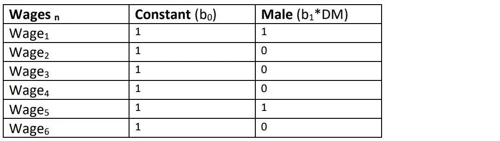

# 线性回归-虚拟变量陷阱

> 原文：<https://medium.com/analytics-vidhya/linear-regression-dummy-variable-trap-8964a83516d9?source=collection_archive---------3----------------------->

# 先决条件

*   [机器学习—数据预处理](/analytics-vidhya/machine-learning-data-prepossessing-661d18f063c3)

# 概观

以下是我们将在博客中涉及的主题:

*   什么是虚拟变量陷阱？
*   说明
*   虚拟变量陷阱试验

# 什么是虚拟变量陷阱？

在线性回归模型中，为了创建可以推断特征(具有分类数据)和结果之间关系的模型，我们使用虚拟变量技术。

“虚拟变量”或“指标变量”是一种人为变量，用于表示具有两个或更多不同类别/级别的属性。

虚拟变量陷阱是在添加虚拟变量后独立变量变得多重共线的情况。

多重共线性是两个或多个变量高度相关的现象。简而言之，这意味着一个变量的值可以从其他变量的值中预测出来。

# 说明

为了更好地理解这个场景，我将用一个例子来解释它。让工资成为性别的函数。

对于线性回归，数学方程将:

假设在我们的数据中，可能的性别值是:

*   男性的
*   女性的

首先，我们将在数据集中添加以下两个虚拟变量(两列):

*   男性的虚拟变量为 DM
*   女性的虚拟变量将是 DF

现在，线性回归方程将是:

为了向您展示虚拟变量陷阱，我将创建一个包含任意值的表。为了简单起见，我认为所有常量的值都等于 1。

在下表中，如果性别为男性，则“男性”列的值将为 1，“女性”列的值将为 0。此外，如果性别为女性，则“男性”列的值将为 0，“女性”列的值将为 1。

让我们通过添加男性和女性列中的值来引入一个列，并使其成为数据集的一部分，以便清楚地看到问题。此后，数据集将变成:

现在，您可以看到“常量”和“计算列”的值完全相同。这打破了线性回归的假设，即观测值应该相互独立，这就是我们所说的虚拟变量陷阱。通过在数据中添加所有虚拟变量，我们已经损害了回归模型的准确性。

为了避免伪变量陷阱，我们应该总是比分类数据中存在的类别总数(n)少添加一个(n-1)伪变量，因为第 n 个伪变量是多余的，因为它没有携带新信息。

让我们从等式中去掉一个虚拟变量，那么新的等式将是:

这里，如果“DM”的值是 1，那么它表示男性，如果它的值是 0，那么它表示女性。

我们不必添加新列，因为我们只有一个虚拟列，我们可以看到它的值不同于常量列。

所以伙计们，我们已经成功避免了虚拟变量陷阱。

# 虚拟变量陷阱试验

为了检查数据集是否存在虚拟变量陷阱，我们将自变量矩阵(X’)的转置与自变量矩阵(X)相乘，然后计算其行列式。如果

*   行列式为 0，那么我们面对的是虚拟变量陷阱场景。

*   行列式不为 0，那么我们就不会面临虚拟变量陷阱的情况。

# 结论

为了避免伪变量陷阱，在添加伪变量时，我们应该总是比分类数据中存在的类别总数(n)少添加一个(n-1)变量。

如果有任何问题或需要澄清，请让我知道。