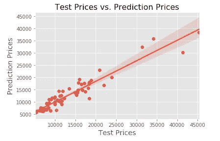
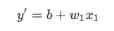
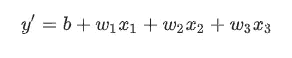
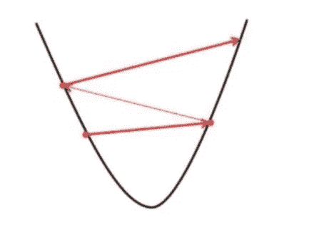
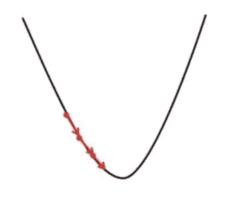
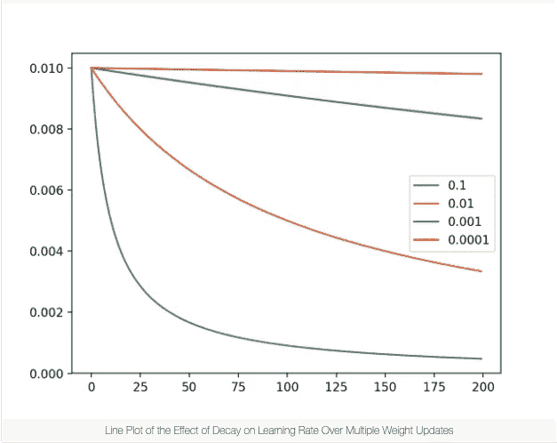
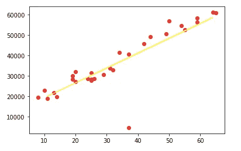

# 线性回归

> 原文：<https://medium.com/analytics-vidhya/linear-regression-e5eecc7f26f1?source=collection_archive---------6----------------------->


杰斯温·托马斯在 [Unsplash](https://unsplash.com?utm_source=medium&utm_medium=referral) 上的照片

O 我们的目标是找到机器学习中变量之间的关系。我们有许多算法可用于各种用例。线性回归是最流行的一种，也是你将学习的第一种。在这篇文章中，我会给你一个关于线性回归的基本介绍。

> 线性回归试图通过将线性方程拟合到观察到的数据来模拟两个变量之间的关系。

其中一个观测数据是独立值，我们称之为‘x’，另一个观测数据是依赖值，我们称之为‘y’。这意味着 y 的值随着 x 的变化而变化。

在我们使用线性回归算法之前，我们应该首先确定我们的数据是否有变量之间的关系。相关性和散点图可以帮助我们发现变量之间的关系。

如果可以用单个变量(x1)进行分析，则称为**简单线性回归**。如果可以用多个变量(x1，x2，x3…)进行分析，则称为**多元线性回归**。

要把它放在最独特的(！)举例，假设你正在买房，对你来说重要的是房子的面积。房子的价格取决于房子的面积。这里，房子的面积是 x，我们的自变量。取决于 x 的是房子的价格，y，x 是我们的第一个特征。如果房子的面积是我们唯一拥有的自变量，那就意味着我们可以用 ***简单线性回归*** 。但是除了房子的面积，位置，房间数量和年龄也影响房子的价格。现在我们有四个影响房价的特征。所以，我们就用 ***多元线性回归*** 。

我们拥有的数据可以有这样一个图表，它的回归线是:



来自我的一个多元线性回归项目

如你所见，我们的线并不穿过每个点。如果会，那就完美了，但是不可能有那种完美的关系。

这条线不是魔法造成的。在引擎盖下有一些数学上的魔法在进行着。这个等式位于回归线之下:



假设函数

> **这个函数叫‘假设函数’。**

*   y '是我们试图预测的价值，房子的价格。
*   b (w0)是 y 轴的截距，或者我们可以称之为“偏差”。是价值观平衡了我们所做的一切。
*   x1 是我们的第一依赖值。如果我们继续简单的线性回归，这个方程属于，房子的面积是 x1。
*   w1 是未来第一的重量。

多元线性回归方程:



x1 是房屋的面积，x2 是房屋的位置，x3 是房屋的房间数等等… w1、w2 和 w3 是要素的权重。

你可以看到数学是机器学习的重要组成部分，而这仅仅是开始。

如果我们的路线错了呢？

我的意思是，我们如何更新我们的 w0 (b)和 w1？我们如何选择哪一个值对可以构成我们数据的最佳直线？

> 带成本函数！

## 什么是“成本函数”？

我们的目标是最小化估计的 y 值和实际的 y 值之间的差异。所以，我们需要将 w0 和 w1 的值更新为 ***，减少*** 的差异。


成本函数(J)

线性回归的成本函数是预测 y 值和实际 y 值之间的均方根误差。

## 什么是梯度下降？

> 在理论层面上，梯度下降是一种最小化函数的算法。给定由一组参数定义的函数，梯度下降从一组初始参数值开始，并迭代地向使函数最小化的一组参数值移动。这种迭代最小化是使用微积分实现的，在函数梯度的负方向上采取步骤。

梯度下降 ***下降*** 成本函数。每一步的大小称为**学习率。我们应该谨慎选择学习速度。**

1.  你不应该选择学习率很大。你可以错过当地的最小值。



[https://www . geeks forgeeks . org/gradient-descent-in-linear-regression/](https://www.geeksforgeeks.org/gradient-descent-in-linear-regression/)

2.如果选择的学习率太小，将需要更多的时间才能达到局部最小值。



[https://www . geeks forgeeks . org/gradient-descent-in-linear-regression/](https://www.geeksforgeeks.org/gradient-descent-in-linear-regression/)



[https://machine learning mastery . com/understand-the-dynamics-of-learning-rate-on-deep-learning-neural-networks/](https://machinelearningmastery.com/understand-the-dynamics-of-learning-rate-on-deep-learning-neural-networks/)

蓝线是一个学习率的好选择。

我们先用 Sklearn 库把现在学到的东西编码一下。

首先，我们需要我们的图书馆来工作。

```
import numpy as np
import matplotlib.pyplot as plt
import pandas pd
```

我们需要我们的数据集(你可以在这里找到[数据](https://bilkav.com/satislar.csv)):

```
# We are using read_csv method of Pandas to read our datadata = pd.read_csv("satislar.csv")
```

我们有两列；“aylar”和“satislar”(月份和销售额)。我们应该把它们分成 x，独立变量' aylar '和 y，因变量' satislar '。

```
X = data.iloc[:, 0:1].values
# ':' means take all the rows, '0:1' means take only first column, 
# and turn it into an array with .valuesy = data.iloc[:, -1:].values
# '-1:' means take only the last column, ’satislar' column
```

我们已经成功地将数据分割为 X 和 y。现在，我们可以再次将它们分割为训练和测试数据。

```
# we'll use Sklearn Libraryfrom sklearn.model_selection import train_test_split
```

导入库之后，我们可以编写一行代码来进行分割:

```
# You always have to follow this order to split the dataX_train, X_test, y_train, y_test = train_test_split(X, y, test_size=.22, random_state=0)
```

*   X 是包含 X_train 和 X_test 值的数据，y 是包含 y_train 和 y_test 值的数据。
*   test_size=.22 表示包含在测试分割中的数据集的比例。默认情况下，该值为 0.33，但我们有一个小数据集。我给的价值较小。
*   random_state = 0 控制在应用分割之前应用于数据的洗牌。

```
from sklearn.linear_model import LinearRegression
lin_reg = LinearRegression()
```

我们创建了一个名为“lin_reg”的对象。我们将拟合我们的模型，然后我们将使我们的模型预测:

```
lin_reg.fit(X_train, y_train)
y_pred = lin_reg.predict(X_test)
```

搞定了。你可以查一下 y_pred 和 y_test，看看你做的怎么样。但是有一个更简单的方法。

```
# you can plot the resultsplt.scatter(X, y, color = 'red')
plt.plot(X_test, y_pred, color = 'yellow')
```



看起来很好！

```
# and you can print r square valuefrom sklearn.metrics import r2_score
r2_score(y_test, y_pred)
>> 0.9774483391303704
```

r 平方得分非常接近 1。这意味着我们的模型工作正常。

[](https://developers.google.com/machine-learning/crash-course/descending-into-ml/linear-regression) [## 下降到 ML:线性回归|机器学习速成班

### " type": "thumb-down "，" id ":" missingtheinformationneed "，" label ":"缺少我需要的信息" }，{ "type"…

developers.google.com](https://developers.google.com/machine-learning/crash-course/descending-into-ml/linear-regression) [](https://scikit-learn.org/stable/modules/generated/sklearn.model_selection.train_test_split.html) [## sk learn . model _ selection . train _ test _ split-sci kit-learn 0 . 23 . 2 文档

### sci kit-learn:Python 中的机器学习

scikit-learn.org](https://scikit-learn.org/stable/modules/generated/sklearn.model_selection.train_test_split.html) [](http://www.stat.yale.edu/Courses/1997-98/101/linreg.htm) [## 线性回归

### 在试图用一个线性模型来拟合观察到的数据之前，建模者应该首先确定是否存在一个线性模型。

www.stat.yale.edu](http://www.stat.yale.edu/Courses/1997-98/101/linreg.htm) [](https://scikit-learn.org/stable/modules/generated/sklearn.linear_model.LinearRegression.html) [## sklearn.linear_model。线性回归-sci kit-学习 0.23.2 文档

### 普通最小二乘线性回归。线性回归拟合系数为 w = (w1，...，wp)到…

scikit-learn.org](https://scikit-learn.org/stable/modules/generated/sklearn.linear_model.LinearRegression.html) [](https://www.geeksforgeeks.org/ml-linear-regression/#:~:text=Cost%20function%28J%29%20of%20Linear,the%20model%20uses%20Gradient%20Descent.) [## ML |线性回归- GeeksforGeeks

### 线性回归是一种基于监督学习的机器学习算法。它执行回归任务…

www.geeksforgeeks.org](https://www.geeksforgeeks.org/ml-linear-regression/#:~:text=Cost%20function%28J%29%20of%20Linear,the%20model%20uses%20Gradient%20Descent.) [](https://www.geeksforgeeks.org/gradient-descent-in-linear-regression/) [## 线性回归中的梯度下降

### 在线性回归中，该模型的目标是获得最佳拟合的回归线，以根据预测值来预测 y 值

www.geeksforgeeks.org](https://www.geeksforgeeks.org/gradient-descent-in-linear-regression/) [](https://spin.atomicobject.com/2014/06/24/gradient-descent-linear-regression/) [## 梯度下降和线性回归导论

### 梯度下降算法是那些“最成功”的算法之一，可以为解决问题提供一个新的视角…

spin.atomicobject.com](https://spin.atomicobject.com/2014/06/24/gradient-descent-linear-regression/)