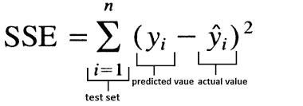

# 线性回归

> 原文：<https://medium.com/analytics-vidhya/linear-regression-e9625a20fad9?source=collection_archive---------18----------------------->

试图确定一个因变量和一个或多个自变量之间关系强度的统计测量称为回归。回归分析广泛用于预测和预报。例如，如果我们想根据房子的位置、面积等来预测房子的价格，那么这就是一个回归问题。在这里，我谈到了因变量和自变量。让我们来看看吧！自变量是输入到系统中的变量，可以自由地取不同的值。它也被称为预测变量或解释变量，用“X”表示。因变量是那些随着系统中其他值的变化而变化的变量。它也被称为目标变量或响应变量，用“y”表示。

# **什么是线性回归？**

线性回归是一种根据自变量“X”的值来预测因变量“y”的值的方法。线性回归有两种类型。它们是:-简单线性回归:只有一个自变量，多元线性回归:有两个或两个以上的自变量。简单线性回归的方程是:

## *y = b + a*X +e*

这里，y =因变量，X =自变量，b =y 截距，a =直线斜率，e=误差变量

线的斜率是 X 增加一个单位时 y 的变化，y 截距是线与垂直轴相交的高度，通过在等式中设置 X=0 获得。

我们的目标是选择使观察值的误差平方和(SSE)最小的值。

图 1:平方和公式

下面是 python 中查看简单线性回归的代码

在这里，我们导入所有的库，numpy 是科学计算工具，pandas 用于读取文本文件和一些数据争论的东西，matplotlib 用于数据可视化，sklearn 用于计算线性回归。在这里，我们看到加载了包含房屋面积和价格的数据集。面积是独立的，价格是因变量。

这里，我们使用 matplotlib 库绘制数据。在 x 轴上，有一个面积，在 y 轴上，有一个价格变量。我们可以从数据中看到，随着房子面积的增加，价格也在增加。因此，这两个变量之间存在某种正相关关系。

现在，我们从 sklearn 加载我们的线性回归模型，并拟合我们的训练数据来训练我们的模型。从训练中，我们看到系数(即来自 y=b+aX+e 的‘a ’)是 1.19303364，y 截距(即来自 y=b+aX+e 的‘b ’)是-3.8957…因此，使用这些参数，我们预测给定区域的房价。

最后，我们预测给定面积(即 20 英镑)的房屋价格。我们绘制了最佳拟合线，如上图所示。

我希望你对线性回归以及我们如何使用 sklearn 库来实现它有一个坚实的理解。